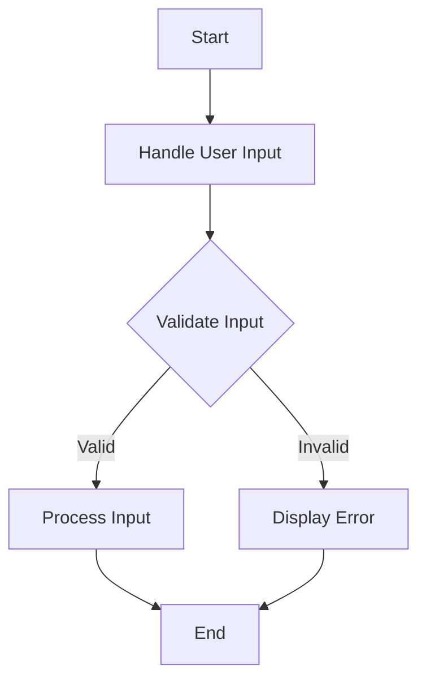

## 23.2 Reusability and Modularity

In the world of software development, writing code that is both reusable and modular is a hallmark of good design. As we delve into the concepts of reusability and modularity, we'll explore how these principles can significantly enhance the efficiency and maintainability of your JavaScript code. Let's embark on this journey to understand how to design functions that can be used across your codebase, making your programming life easier and more productive.

### Understanding the Benefits of Modular Code

Modular code is like building with LEGO blocks. Each block (or module) is a self-contained piece that can be combined with others to create complex structures. Here are some key benefits of modular code:

1. **Maintainability**: Modular code is easier to manage and update. When changes are needed, you can modify individual modules without affecting the entire system.

2. **Reusability**: Modules can be reused across different parts of your application or even in different projects. This reduces the need to write similar code multiple times.

3. **Scalability**: As your application grows, modular code allows you to add new features without disrupting existing functionality.

4. **Collaboration**: In team environments, modular code enables multiple developers to work on different modules simultaneously without conflicts.

5. **Testing**: Smaller, self-contained modules are easier to test, leading to more reliable software.

### Writing Generic Functions for Multiple Contexts

To achieve reusability, it's crucial to write generic functions that can be applied in various contexts. A generic function performs a specific task without relying on specific data or conditions. Let's look at an example:

```javascript
// A generic function to calculate the sum of an array
function calculateSum(arr) {
    return arr.reduce((accumulator, currentValue) => accumulator + currentValue, 0);
}

// Using the function with different arrays
let numbers1 = [1, 2, 3, 4];
let numbers2 = [10, 20, 30, 40];

console.log(calculateSum(numbers1)); // Output: 10
console.log(calculateSum(numbers2)); // Output: 100
```

In this example, `calculateSum` is a generic function that can be used with any array of numbers. It doesn't depend on the specific content of the array, making it highly reusable.

### Breaking Down Complex Tasks into Smaller Functions

Complex tasks can often be overwhelming and difficult to manage. By breaking them down into smaller, more manageable functions, you can simplify your code and make it more modular. Consider the following example:

```javascript
// Function to validate user input
function validateInput(input) {
    return input !== null && input !== undefined && input.trim() !== '';
}

// Function to process user input
function processInput(input) {
    if (validateInput(input)) {
        // Perform processing
        console.log(`Processing: ${input}`);
    } else {
        console.log('Invalid input');
    }
}

// Function to handle user input
function handleUserInput(input) {
    processInput(input);
}

// Example usage
handleUserInput('Hello, World!'); // Output: Processing: Hello, World!
handleUserInput(''); // Output: Invalid input
```

In this example, we have three functions: `validateInput`, `processInput`, and `handleUserInput`. Each function has a specific responsibility, making the code easier to understand and maintain.

### Examples of Reusable Utility Functions

Utility functions are small, reusable functions that perform common tasks. They are often included in utility libraries and can be used throughout your codebase. Here are some examples:

```javascript
// Function to capitalize the first letter of a string
function capitalizeFirstLetter(string) {
    return string.charAt(0).toUpperCase() + string.slice(1);
}

// Function to generate a random number between min and max
function getRandomNumber(min, max) {
    return Math.floor(Math.random() * (max - min + 1)) + min;
}

// Function to check if a number is even
function isEven(number) {
    return number % 2 === 0;
}

// Example usage
console.log(capitalizeFirstLetter('hello')); // Output: Hello
console.log(getRandomNumber(1, 10)); // Output: Random number between 1 and 10
console.log(isEven(4)); // Output: true
```

These utility functions can be used in various parts of your application, reducing code duplication and improving maintainability.

### Emphasizing the DRY Principle

The DRY (Don't Repeat Yourself) principle is a fundamental concept in software development. It encourages developers to avoid code duplication by reusing existing code. Here's how you can apply the DRY principle:

1. **Identify Repetitive Code**: Look for patterns or code blocks that are repeated in your codebase.

2. **Extract into Functions**: Create functions to encapsulate the repetitive code.

3. **Use Parameters**: Make your functions flexible by using parameters to handle different scenarios.

4. **Refactor Regularly**: Continuously refactor your code to eliminate duplication as your application evolves.

Let's see an example of applying the DRY principle:

```javascript
// Repetitive code
function greetUser1(name) {
    console.log(`Hello, ${name}! Welcome to our website.`);
}

function greetUser2(name) {
    console.log(`Hello, ${name}! Welcome to our website.`);
}

// Applying DRY principle
function greetUser(name) {
    console.log(`Hello, ${name}! Welcome to our website.`);
}

// Example usage
greetUser('Alice'); // Output: Hello, Alice! Welcome to our website.
greetUser('Bob'); // Output: Hello, Bob! Welcome to our website.
```

By extracting the repetitive code into a single `greetUser` function, we adhere to the DRY principle and make our code more maintainable.

### Visualizing Modularity with Diagrams

To better understand modularity, let's visualize how modular functions interact within a program using a flowchart. This diagram represents how different functions work together to process user input.



**Diagram Description**: This flowchart illustrates the modular approach to handling user input. The process begins with handling the input, followed by validation. If the input is valid, it proceeds to processing; otherwise, an error is displayed.

### Encouraging Experimentation

Now that we've covered the basics of reusability and modularity, it's time to experiment with these concepts. Here are some suggestions:

- **Try It Yourself**: Modify the `calculateSum` function to handle arrays of different data types, such as strings or objects.

- **Create Your Utility Functions**: Write utility functions for common tasks you encounter in your projects, such as formatting dates or filtering data.

- **Refactor Existing Code**: Look at your existing codebase and identify areas where you can apply the DRY principle by extracting repetitive code into functions.

### References and Further Reading

For more information on reusability and modularity in JavaScript, check out these resources:

- [MDN Web Docs: Functions](https://developer.mozilla.org/en-US/docs/Web/JavaScript/Guide/Functions)
- [W3Schools: JavaScript Functions](https://www.w3schools.com/js/js_functions.asp)
- [JavaScript Design Patterns](https://www.patterns.dev/posts/classic-design-patterns/)

### Knowledge Check

Let's reinforce what we've learned with a few questions:

1. What are the benefits of modular code?
2. How can you make a function generic and reusable?
3. What is the DRY principle, and why is it important?
4. How can you identify repetitive code in your projects?
5. What are some examples of utility functions?

### Embrace the Journey

Remember, mastering reusability and modularity is a journey. As you continue to practice these principles, you'll find your code becoming more efficient and easier to manage. Keep experimenting, stay curious, and enjoy the process of becoming a more proficient JavaScript developer!

## Quiz Time!



### What is one of the main benefits of modular code?

- [x] Easier maintenance and updates
- [ ] Increased code complexity
- [ ] Reduced code readability
- [ ] More difficult testing

> **Explanation:** Modular code is easier to maintain and update because changes can be made to individual modules without affecting the entire system.

### How can you make a function reusable in different contexts?

- [x] By writing it as a generic function
- [ ] By hardcoding specific values
- [ ] By limiting its use to one module
- [ ] By using global variables

> **Explanation:** Writing a function as a generic function allows it to be reused in different contexts by not relying on specific data or conditions.

### What does the DRY principle stand for?

- [x] Don't Repeat Yourself
- [ ] Do Repeat Yourself
- [ ] Don't Reuse Yourself
- [ ] Do Reuse Yourself

> **Explanation:** The DRY principle stands for "Don't Repeat Yourself," encouraging developers to avoid code duplication.

### Which of the following is an example of a utility function?

- [x] A function to capitalize the first letter of a string
- [ ] A function to handle user authentication
- [ ] A function to manage database connections
- [ ] A function to render a user interface

> **Explanation:** A utility function performs a common task, such as capitalizing the first letter of a string, and can be reused throughout the codebase.

### What is a key characteristic of a modular function?

- [x] It performs a specific task independently
- [ ] It relies on global variables
- [ ] It is tightly coupled with other functions
- [ ] It is difficult to test

> **Explanation:** A modular function performs a specific task independently, making it easier to manage and test.

### How can you identify repetitive code in your projects?

- [x] By looking for patterns or code blocks that are repeated
- [ ] By focusing only on unique code
- [ ] By ignoring similar code structures
- [ ] By using only global variables

> **Explanation:** Identifying repetitive code involves looking for patterns or code blocks that are repeated in your codebase.

### What is a benefit of breaking down complex tasks into smaller functions?

- [x] Improved code readability and maintainability
- [ ] Increased code complexity
- [ ] Reduced code efficiency
- [ ] More difficult debugging

> **Explanation:** Breaking down complex tasks into smaller functions improves code readability and maintainability by making the code easier to understand and manage.

### What is the purpose of a flowchart in programming?

- [x] To visually represent how different functions interact
- [ ] To write code directly
- [ ] To increase code complexity
- [ ] To reduce code readability

> **Explanation:** A flowchart visually represents how different functions interact within a program, aiding in understanding and planning.

### Which principle encourages the reuse of existing code?

- [x] DRY (Don't Repeat Yourself)
- [ ] WET (Write Everything Twice)
- [ ] KISS (Keep It Simple, Stupid)
- [ ] YAGNI (You Aren't Gonna Need It)

> **Explanation:** The DRY principle encourages the reuse of existing code to avoid duplication and improve maintainability.

### True or False: Modular code is more difficult to test.

- [ ] True
- [x] False

> **Explanation:** False. Modular code is easier to test because smaller, self-contained modules can be tested independently.


