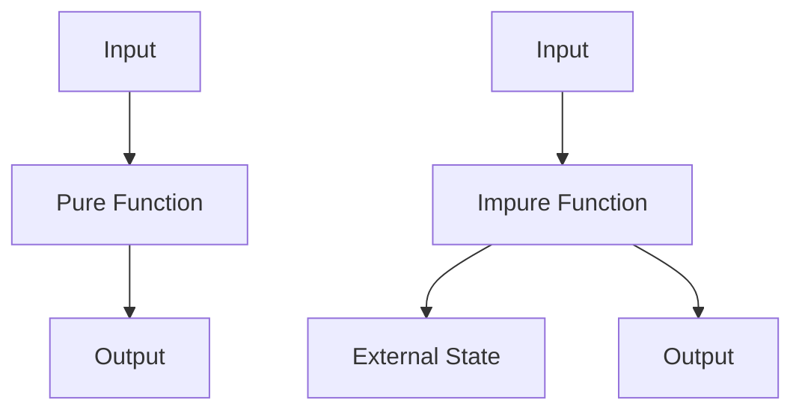

## 23.3 Avoiding Side Effects

In the world of programming, especially in JavaScript, functions are the building blocks of your code. They help you organize, reuse, and manage complexity. However, not all functions are created equal. Some functions can have side effects, which can lead to unpredictable behavior and make your code harder to test and maintain. In this section, we'll explore the concept of side effects, understand what pure functions are, and learn how to minimize side effects in your code.

### Understanding Side Effects

**Side effects** occur when a function interacts with the outside world or modifies some state outside its local environment. This could include changing a global variable, modifying an object passed by reference, or performing I/O operations like logging to the console or writing to a file.

#### Examples of Side Effects

1. **Modifying a Global Variable:**

   ```javascript
   let counter = 0;

   function incrementCounter() {
       counter += 1; // This modifies the global variable 'counter'
   }

   incrementCounter();
   console.log(counter); // Output: 1
   ```

2. **Changing an Object Property:**

   ```javascript
   const user = { name: 'Alice', age: 25 };

   function updateUserAge(userObj, newAge) {
       userObj.age = newAge; // This modifies the 'user' object
   }

   updateUserAge(user, 26);
   console.log(user.age); // Output: 26
   ```

3. **Performing I/O Operations:**

   ```javascript
   function logMessage(message) {
       console.log(message); // This performs an I/O operation
   }

   logMessage('Hello, World!');
   ```

### What are Pure Functions?

A **pure function** is a function that, given the same input, will always return the same output and does not cause any side effects. Pure functions are deterministic and do not rely on any external state.

#### Characteristics of Pure Functions

- **Deterministic:** Always produces the same result for the same input.
- **No Side Effects:** Does not alter any external state or perform I/O operations.
- **Referential Transparency:** Can be replaced with its output value without changing the program's behavior.

#### Example of a Pure Function

```javascript
function add(a, b) {
    return a + b; // This function is pure
}

console.log(add(2, 3)); // Output: 5
console.log(add(2, 3)); // Output: 5 (same input, same output)
```

### Advantages of Pure Functions

#### Predictability

Pure functions are predictable. Since they do not depend on or modify external state, you can easily understand their behavior by looking at their input and output. This predictability makes your code easier to reason about and debug.

#### Testability

Pure functions are inherently easier to test. You don't need to set up any external state or mock dependencies. You simply provide inputs and verify the outputs.

#### Concurrency

Pure functions do not rely on shared state, making them safe to use in concurrent or parallel execution environments. This can lead to performance improvements in your applications.

#### Maintainability

With pure functions, the codebase becomes more modular and easier to maintain. Changes in one part of the code are less likely to affect other parts, reducing the risk of introducing bugs.

### Comparing Pure and Impure Functions

Let's compare a pure function with an impure one to see the difference in practice.

#### Impure Function Example

```javascript
let total = 0;

function addToTotal(value) {
    total += value; // This function modifies the external state 'total'
    return total;
}

console.log(addToTotal(5)); // Output: 5
console.log(addToTotal(5)); // Output: 10 (different output for same input)
```

#### Pure Function Equivalent

```javascript
function add(a, b) {
    return a + b; // This function is pure
}

console.log(add(5, 5)); // Output: 10
console.log(add(5, 5)); // Output: 10 (same output for same input)
```

### When Side Effects Are Necessary

While pure functions are ideal, there are scenarios where side effects are unavoidable. For example, interacting with the DOM, making network requests, or logging are essential tasks that inherently involve side effects.

#### Managing Side Effects

When side effects are necessary, it's crucial to manage them effectively to minimize their impact on your codebase.

1. **Isolate Side Effects:**

   Keep side effects contained within specific functions or modules. This makes it easier to track and manage them.

   ```javascript
   function fetchData(url) {
       return fetch(url) // Network request is a side effect
           .then(response => response.json());
   }
   ```

2. **Use Functional Programming Techniques:**

   Techniques like immutability and higher-order functions can help manage side effects. For example, instead of modifying an array, return a new array with the desired changes.

   ```javascript
   const numbers = [1, 2, 3];

   function addNumber(arr, num) {
       return [...arr, num]; // Returns a new array
   }

   const newNumbers = addNumber(numbers, 4);
   console.log(numbers); // Output: [1, 2, 3]
   console.log(newNumbers); // Output: [1, 2, 3, 4]
   ```

3. **Document Side Effects:**

   Clearly document any functions that have side effects. This helps other developers understand the function's behavior and potential impacts.

   ```javascript
   /**
    * Logs a message to the console.
    * @param {string} message - The message to log.
    * @sideEffect Logs to the console.
    */
   function logMessage(message) {
       console.log(message);
   }
   ```

### Minimizing Side Effects

To minimize side effects, consider the following strategies:

- **Use Local Variables:** Avoid using global variables. Instead, use local variables within functions to maintain state.
- **Return New Values:** Instead of modifying existing data structures, return new ones.
- **Limit I/O Operations:** Perform I/O operations at the boundaries of your application, such as in controllers or services, rather than in core logic functions.

### Visualizing Pure vs. Impure Functions

To better understand the concept of pure and impure functions, let's visualize how they interact with their environment.



**Diagram Explanation:** 
- **Pure Function:** Takes input and produces output without interacting with external state.
- **Impure Function:** Interacts with external state, which can lead to unpredictable outputs.

### Try It Yourself

Experiment with the following code examples to reinforce your understanding of pure and impure functions:

1. **Modify the Impure Function:**

   Try converting the `addToTotal` function into a pure function by removing its dependency on the external `total` variable.

2. **Create a Pure Function:**

   Write a function that takes an array of numbers and returns a new array with each number doubled, without modifying the original array.

### References and Further Reading

- [MDN Web Docs: Functions](https://developer.mozilla.org/en-US/docs/Web/JavaScript/Guide/Functions)
- [W3Schools: JavaScript Functions](https://www.w3schools.com/js/js_functions.asp)
- [Functional Programming in JavaScript](https://www.freecodecamp.org/news/functional-programming-in-javascript/)

### Knowledge Check

- What is a side effect in a function?
- How do pure functions differ from impure functions?
- Why are pure functions preferred in many cases?
- What are some strategies to minimize side effects in your code?

### Embrace the Journey

Remember, mastering functions and understanding side effects is a crucial step in becoming a proficient JavaScript developer. As you continue to learn and experiment, you'll find that writing pure functions not only improves your code quality but also enhances your problem-solving skills. Keep practicing, stay curious, and enjoy the journey!

---

## Quiz Time!



### What is a side effect in a function?

- [x] A change to external state or interaction with the outside world
- [ ] A function that returns a value
- [ ] A function that takes no parameters
- [ ] A function that is called multiple times

> **Explanation:** A side effect occurs when a function modifies some state outside its local environment or interacts with the outside world, such as changing a global variable or performing I/O operations.

### What is a pure function?

- [x] A function that always returns the same output for the same input and has no side effects
- [ ] A function that modifies global variables
- [ ] A function that performs I/O operations
- [ ] A function that takes no parameters

> **Explanation:** A pure function is deterministic and does not cause any side effects, meaning it always produces the same result for the same input and does not alter any external state.

### Why are pure functions preferred?

- [x] They are predictable and easier to test
- [ ] They modify global variables
- [ ] They perform I/O operations
- [ ] They are always faster

> **Explanation:** Pure functions are preferred because they are predictable, easier to test, and do not rely on or modify external state, making them more reliable and maintainable.

### How can you minimize side effects in your code?

- [x] Use local variables and return new values instead of modifying existing ones
- [ ] Use global variables extensively
- [ ] Perform I/O operations within core logic functions
- [ ] Avoid documenting side effects

> **Explanation:** To minimize side effects, use local variables, return new values instead of modifying existing ones, and limit I/O operations to the boundaries of your application.

### What is referential transparency?

- [x] The property of a function where it can be replaced with its output value without changing the program's behavior
- [ ] A function that modifies external state
- [ ] A function that performs I/O operations
- [ ] A function that takes no parameters

> **Explanation:** Referential transparency is a property of pure functions where they can be replaced with their output value without affecting the program's behavior, due to their deterministic nature.

### Which of the following is an example of a side effect?

- [x] Modifying a global variable
- [ ] Returning a value
- [ ] Taking parameters
- [ ] Using local variables

> **Explanation:** Modifying a global variable is an example of a side effect, as it changes the state outside the function's local environment.

### What is the benefit of isolating side effects in your code?

- [x] It makes the code easier to manage and understand
- [ ] It increases the number of side effects
- [ ] It makes the code more complex
- [ ] It eliminates all side effects

> **Explanation:** Isolating side effects makes the code easier to manage and understand, as it confines the impact of side effects to specific areas of the codebase.

### What is the purpose of documenting side effects in functions?

- [x] To help other developers understand the function's behavior and potential impacts
- [ ] To increase the number of side effects
- [ ] To make the function more complex
- [ ] To eliminate all side effects

> **Explanation:** Documenting side effects helps other developers understand the function's behavior and potential impacts, making the codebase easier to maintain and work with.

### How do pure functions contribute to concurrency?

- [x] They do not rely on shared state, making them safe for concurrent execution
- [ ] They modify global variables
- [ ] They perform I/O operations
- [ ] They require complex setup

> **Explanation:** Pure functions do not rely on shared state, making them safe for concurrent execution, which can lead to performance improvements in applications.

### True or False: Pure functions can perform I/O operations.

- [ ] True
- [x] False

> **Explanation:** False. Pure functions do not perform I/O operations as they do not cause side effects or interact with the outside world.


