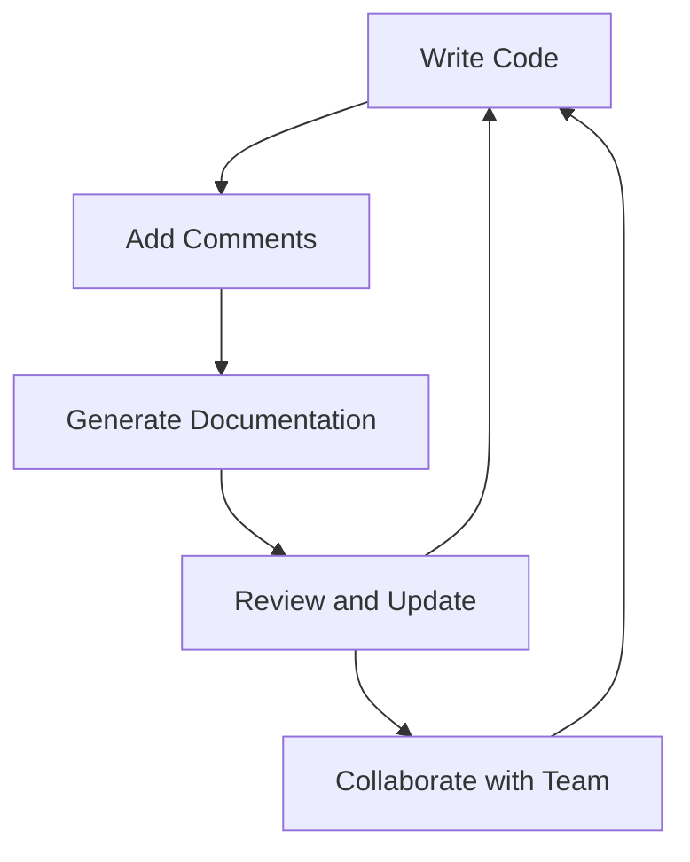

## 23.4 Documentation and Comments

In the world of software development, writing code is only part of the journey. Equally important is ensuring that your code is understandable, maintainable, and easy for others to work with. This is where documentation and comments come into play. In this section, we will explore the significance of documenting your functions, how to write effective comments, and the tools available to help generate documentation from your code. Let's dive in!

### The Importance of Documentation and Comments

Documentation and comments are essential for several reasons:

1. **Improving Readability**: Well-documented code is easier to read and understand, making it accessible to others (and your future self).
2. **Facilitating Collaboration**: Clear documentation helps team members understand the codebase, enabling them to contribute effectively.
3. **Enhancing Maintainability**: As projects evolve, documentation provides a reference point for understanding the original intent and functionality of the code.
4. **Supporting Debugging and Testing**: Comments can help identify the purpose of complex code segments, aiding in debugging and testing efforts.

### Writing Effective Comments

Comments are annotations in the code that provide explanations or context. They are not executed by the JavaScript engine but serve as a guide for developers. Here are some best practices for writing effective comments:

#### 1. Use Comments to Explain Why, Not What

While it's tempting to comment on what the code is doing, it's often more helpful to explain why it's doing it. The code itself should be clear enough to convey what it does.

```javascript
// BAD: Increment the counter by one
counter++;

// GOOD: Increment the counter to track the number of user actions
counter++;
```

#### 2. Keep Comments Concise and Relevant

Avoid overly verbose comments. Aim for clarity and brevity, focusing on the most important information.

```javascript
// Calculate the user's age based on the provided birth year
let age = currentYear - birthYear;
```

#### 3. Update Comments with Code Changes

As code evolves, ensure that comments remain accurate and relevant. Outdated comments can be misleading.

```javascript
// Originally calculated age, now calculates years of experience
let yearsOfExperience = currentYear - startYear;
```

#### 4. Use Comments to Clarify Complex Logic

For complex algorithms or logic, use comments to break down the steps and clarify the thought process.

```javascript
// Check if the user is eligible for a discount
// 1. User must be a member
// 2. User must have made a purchase in the last year
if (isMember && lastPurchaseWithinYear) {
    applyDiscount();
}
```

### Writing Docstrings

Docstrings are a form of documentation that describes the purpose and usage of a function. They are typically placed at the beginning of a function and provide detailed information about its parameters, return values, and behavior.

#### Example of a Docstring

```javascript
/**
 * Calculates the factorial of a number.
 *
 * @param {number} n - The number to calculate the factorial for.
 * @returns {number} - The factorial of the number.
 * @throws {Error} - If the input is not a positive integer.
 */
function factorial(n) {
    if (n < 0) {
        throw new Error('Input must be a positive integer');
    }
    return n === 0 ? 1 : n * factorial(n - 1);
}
```

### Tools for Generating Documentation

There are several tools available that can generate documentation from code comments, making it easier to maintain comprehensive documentation. One popular tool is JSDoc.

#### JSDoc

JSDoc is a tool that parses comments in your JavaScript code to generate HTML documentation. It supports various tags to describe functions, parameters, return values, and more.

##### Basic JSDoc Syntax

```javascript
/**
 * Adds two numbers together.
 *
 * @param {number} a - The first number.
 * @param {number} b - The second number.
 * @returns {number} - The sum of the two numbers.
 */
function add(a, b) {
    return a + b;
}
```

##### Generating Documentation with JSDoc

To generate documentation using JSDoc, follow these steps:

1. **Install JSDoc**: You can install JSDoc globally using npm:
   ```bash
   npm install -g jsdoc
   ```

2. **Run JSDoc**: Use the command line to generate documentation:
   ```bash
   jsdoc yourfile.js
   ```

3. **View the Documentation**: JSDoc will create an HTML file that you can open in a web browser to view the generated documentation.

### Guidelines for What to Document

When documenting your code, consider the following guidelines:

1. **Function Purpose**: Clearly state what the function does.
2. **Parameters**: Describe each parameter, including its type and purpose.
3. **Return Values**: Explain what the function returns and under what conditions.
4. **Exceptions**: Note any exceptions the function might throw.
5. **Usage Examples**: Provide examples of how to use the function, if applicable.

### Keeping Comments Up to Date

As your codebase evolves, it's crucial to keep comments and documentation up to date. Here are some tips:

1. **Review Comments Regularly**: Make it a habit to review and update comments during code reviews or refactoring sessions.
2. **Automate Documentation Generation**: Use tools like JSDoc to automate the generation of documentation, ensuring consistency and accuracy.
3. **Encourage Team Collaboration**: Foster a culture where team members are encouraged to update comments and documentation as they work on the code.

### Try It Yourself

To practice writing comments and documentation, try the following exercises:

1. **Exercise 1**: Write a function that calculates the area of a rectangle. Include comments and a docstring that describe the function's purpose, parameters, and return value.

2. **Exercise 2**: Choose a complex piece of code you've written in the past and add comments to explain the logic. Use JSDoc to generate documentation for the code.

3. **Exercise 3**: Review a piece of code written by a peer and suggest improvements to the comments and documentation.

### Visualizing Documentation Flow

To better understand how documentation and comments fit into the development process, let's visualize the flow of creating and maintaining documentation.



**Diagram Description**: This flowchart illustrates the iterative process of writing code, adding comments, generating documentation, reviewing and updating, and collaborating with the team.

### References and Links

For more information on documentation and comments, consider exploring the following resources:

- [MDN Web Docs: Writing JavaScript Documentation](https://developer.mozilla.org/en-US/docs/Web/JavaScript/Guide/Writing_JavaScript_documentation)
- [JSDoc Official Website](https://jsdoc.app/)
- [W3Schools: JavaScript Comments](https://www.w3schools.com/js/js_comments.asp)

### Knowledge Check

Let's reinforce what we've learned with a few questions and exercises:

1. **Question**: Why is it important to document your code?
2. **Exercise**: Write a function with a docstring that calculates the circumference of a circle.
3. **Question**: What is the purpose of using JSDoc?

### Embrace the Journey

Remember, documentation and comments are your allies in creating maintainable and collaborative code. As you continue your journey in mastering JavaScript functions, keep experimenting with different documentation techniques, stay curious, and enjoy the process of making your code more accessible to others.

## Quiz Time!



### Why is documentation important in code?

- [x] It improves readability and maintainability.
- [ ] It makes code run faster.
- [ ] It is only necessary for large projects.
- [ ] It is a requirement for all programming languages.

> **Explanation:** Documentation improves readability and maintainability by providing context and explanations for the code, making it easier for others to understand and work with.

### What should comments focus on?

- [x] Explaining why the code does something.
- [ ] Describing every single line of code.
- [ ] Providing a detailed history of code changes.
- [ ] Adding humor to the code.

> **Explanation:** Comments should focus on explaining why the code does something, rather than describing every single line, to provide meaningful context.

### What is a docstring?

- [x] A comment that describes the purpose and usage of a function.
- [ ] A string variable used for debugging.
- [ ] A tool for measuring code performance.
- [ ] A type of error message.

> **Explanation:** A docstring is a comment that describes the purpose and usage of a function, including its parameters and return values.

### Which tool is commonly used to generate documentation from JavaScript code?

- [x] JSDoc
- [ ] Node.js
- [ ] GitHub
- [ ] CSS

> **Explanation:** JSDoc is a tool commonly used to generate documentation from JavaScript code comments.

### What should be included in a function's documentation?

- [x] Function purpose, parameters, return values, and exceptions.
- [ ] Only the function's name and parameters.
- [ ] A detailed history of code changes.
- [ ] The author's personal notes.

> **Explanation:** A function's documentation should include its purpose, parameters, return values, and any exceptions it might throw.

### How often should comments be updated?

- [x] Regularly, especially when code changes.
- [ ] Only when the code is finalized.
- [ ] Once a year.
- [ ] Never, comments are static.

> **Explanation:** Comments should be updated regularly, especially when code changes, to ensure they remain accurate and relevant.

### What is the main benefit of using JSDoc?

- [x] It generates HTML documentation from code comments.
- [ ] It makes code execution faster.
- [ ] It automatically fixes code errors.
- [ ] It translates code into different languages.

> **Explanation:** JSDoc generates HTML documentation from code comments, making it easier to maintain comprehensive documentation.

### What is a common mistake when writing comments?

- [x] Writing comments that are too verbose or irrelevant.
- [ ] Using comments to explain complex logic.
- [ ] Keeping comments concise and relevant.
- [ ] Updating comments with code changes.

> **Explanation:** A common mistake is writing comments that are too verbose or irrelevant, which can clutter the code and reduce readability.

### True or False: Comments are executed by the JavaScript engine.

- [ ] True
- [x] False

> **Explanation:** False. Comments are not executed by the JavaScript engine; they are meant for developers to provide context and explanations.

### What is the purpose of the flowchart in this section?

- [x] To illustrate the process of creating and maintaining documentation.
- [ ] To show how code is executed in JavaScript.
- [ ] To demonstrate the use of JSDoc.
- [ ] To explain the history of JavaScript.

> **Explanation:** The flowchart illustrates the process of creating and maintaining documentation, highlighting the iterative nature of writing code, adding comments, and collaborating with the team.


