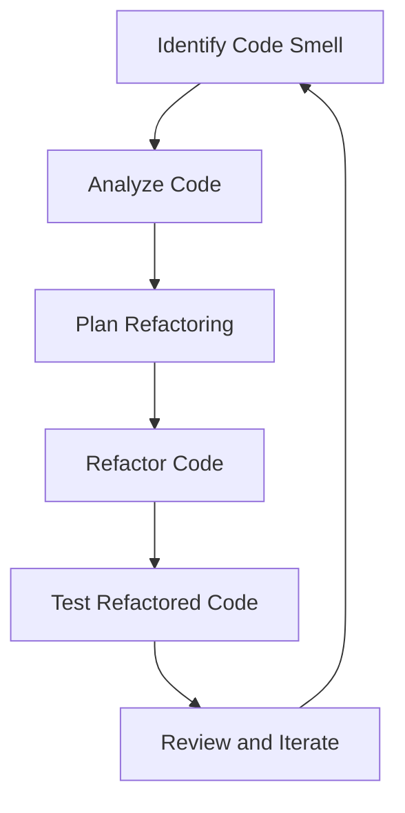

## 23.5 Code Reviews and Refactoring

As we delve deeper into the world of JavaScript functions and scope, it's crucial to understand the role of code reviews and refactoring in maintaining high-quality code. These practices are not just about finding bugs or cleaning up code; they are about fostering a culture of continuous improvement, collaboration, and learning within development teams. Let's explore how code reviews and refactoring can elevate your JavaScript skills and contribute to better software development.

### The Role of Code Reviews in Development Teams

Code reviews are an integral part of the software development process. They serve multiple purposes, from ensuring code quality to facilitating knowledge sharing among team members. Here’s why code reviews are vital:

1. **Quality Assurance**: Code reviews help catch bugs and errors that automated tests might miss. They ensure that the code adheres to the project's coding standards and best practices.

2. **Knowledge Sharing**: By reviewing each other's code, team members learn new techniques and approaches. This process helps junior developers learn from more experienced colleagues and vice versa.

3. **Consistency**: Code reviews ensure that the codebase remains consistent in style and structure, making it easier for anyone on the team to understand and work on different parts of the project.

4. **Collaboration**: They foster a collaborative environment where team members can discuss and debate different solutions, leading to better decision-making.

5. **Mentorship**: Senior developers can mentor juniors through code reviews, providing guidance and feedback that helps them grow.

### Best Practices for Giving and Receiving Feedback

Effective code reviews depend on constructive feedback. Here are some best practices for both giving and receiving feedback during code reviews:

#### Giving Feedback

- **Be Respectful and Constructive**: Always frame your feedback in a positive and respectful manner. Focus on the code, not the person.

- **Be Specific**: Point out specific lines of code or patterns that need improvement, and explain why. Vague feedback is not helpful.

- **Suggest Improvements**: Instead of just pointing out what’s wrong, suggest possible improvements or alternatives.

- **Balance Criticism with Praise**: Acknowledge what was done well in addition to what needs improvement. This balance encourages developers and boosts morale.

- **Focus on the Code’s Purpose**: Keep the project’s goals and requirements in mind when reviewing code. Ensure that the code aligns with these objectives.

#### Receiving Feedback

- **Be Open-Minded**: Approach feedback with an open mind and a willingness to learn. Remember, the goal is to improve the code, not to criticize you personally.

- **Ask Questions**: If something is unclear, ask for clarification. This is an opportunity to learn and understand different perspectives.

- **Avoid Defensiveness**: It’s natural to feel defensive about your work, but try to focus on the feedback itself rather than taking it personally.

- **Implement Feedback Thoughtfully**: Consider the feedback carefully and decide how best to implement it. Not all feedback will be applicable, but it’s important to consider it seriously.

### The Importance of Refactoring for Code Maintenance

Refactoring is the process of restructuring existing code without changing its external behavior. It’s a critical practice for maintaining and improving code quality over time. Here’s why refactoring is important:

1. **Improves Readability**: Clean, well-organized code is easier to read and understand, which reduces the likelihood of errors.

2. **Enhances Maintainability**: Refactored code is easier to maintain and extend, making future development faster and more efficient.

3. **Reduces Complexity**: Simplifying complex code structures makes the codebase more approachable and less prone to bugs.

4. **Optimizes Performance**: Refactoring can lead to performance improvements by eliminating redundant or inefficient code.

5. **Facilitates Testing**: Cleaner code is easier to test, which leads to more robust and reliable software.

### Strategies for Identifying Refactoring Opportunities

Identifying when and where to refactor can be challenging. Here are some strategies to help you spot refactoring opportunities:

- **Code Smells**: Look for "code smells" or patterns that indicate potential problems, such as duplicated code, long methods, or large classes.

- **Complex Logic**: If a function or method is difficult to understand, it may be a candidate for refactoring.

- **Frequent Changes**: Code that requires frequent changes or fixes might benefit from refactoring to improve its design.

- **Performance Issues**: If certain parts of the code are causing performance bottlenecks, consider refactoring to optimize them.

- **Lack of Tests**: Code that is hard to test might need refactoring to make it more modular and testable.

### Encouraging Continuous Improvement Through Peer Collaboration

Continuous improvement is a mindset that encourages developers to constantly seek ways to improve their code and processes. Here’s how peer collaboration can foster this mindset:

- **Regular Code Reviews**: Schedule regular code reviews to ensure that everyone is aligned with the project’s goals and standards.

- **Pair Programming**: Work together with another developer to write code. This practice encourages collaboration and knowledge sharing.

- **Retrospectives**: Hold regular retrospectives to reflect on what went well and what could be improved in the development process.

- **Learning Sessions**: Organize sessions where team members can share new techniques or tools they’ve discovered.

- **Encourage Experimentation**: Allow developers to experiment with new approaches or technologies, fostering innovation and learning.

### Code Example: Refactoring a JavaScript Function

Let's look at a simple example of refactoring a JavaScript function. Suppose we have the following function that calculates the factorial of a number:

```javascript
// Original function to calculate factorial
function factorial(n) {
    if (n < 0) return -1; // Error case
    if (n === 0) return 1; // Base case
    let result = 1;
    for (let i = 1; i <= n; i++) {
        result *= i;
    }
    return result;
}

console.log(factorial(5)); // Output: 120
```

This function works, but we can refactor it to be more concise and use recursion:

```javascript
// Refactored function using recursion
function factorial(n) {
    if (n < 0) return -1; // Error case
    return n === 0 ? 1 : n * factorial(n - 1);
}

console.log(factorial(5)); // Output: 120
```

In the refactored version, we use a recursive approach, which makes the function shorter and easier to read. However, it's important to note that recursion can have performance implications, so use it judiciously.

### Try It Yourself

Experiment with the refactored function by adding error handling for non-integer inputs or optimizing it for large numbers using memoization. This will help you understand the trade-offs involved in different refactoring approaches.

### Visualizing the Refactoring Process

To better understand the refactoring process, let's visualize it using a flowchart:



**Figure 1: The Refactoring Process Flowchart**

This flowchart illustrates the cyclical nature of refactoring, emphasizing continuous improvement and iteration.

### References and Links

For more information on code reviews and refactoring, check out these resources:

- [MDN Web Docs: JavaScript Guide](https://developer.mozilla.org/en-US/docs/Web/JavaScript/Guide)
- [Refactoring Guru: Code Smells](https://refactoring.guru/smells)
- [W3Schools: JavaScript Functions](https://www.w3schools.com/js/js_functions.asp)

### Knowledge Check

Let's reinforce what we've learned with some questions and exercises:

1. What are the main benefits of code reviews?
2. How can you give constructive feedback during a code review?
3. What are some common "code smells" that indicate a need for refactoring?
4. Why is refactoring important for code maintainability?
5. How can peer collaboration encourage continuous improvement?

### Embrace the Journey

Remember, mastering code reviews and refactoring is a journey. As you practice these skills, you'll become more adept at writing clean, efficient, and maintainable code. Keep experimenting, stay curious, and enjoy the process of continuous learning and improvement!

## Quiz Time!



### What is one of the main purposes of code reviews?

- [x] Ensuring code quality and consistency
- [ ] Increasing the number of lines of code
- [ ] Reducing the number of team members
- [ ] Avoiding the use of functions

> **Explanation:** Code reviews help ensure that the code meets quality standards and is consistent with the project's style and guidelines.

### How should feedback be given during a code review?

- [x] Respectfully and constructively
- [ ] With a focus on personal criticism
- [ ] By ignoring positive aspects
- [ ] Without any specific examples

> **Explanation:** Feedback should be respectful, constructive, and specific, focusing on the code rather than the individual.

### What is refactoring?

- [x] Restructuring existing code without changing its external behavior
- [ ] Adding new features to the code
- [ ] Removing all comments from the code
- [ ] Writing code from scratch

> **Explanation:** Refactoring involves improving the internal structure of the code without altering its external functionality.

### Which of the following is a "code smell"?

- [x] Duplicated code
- [ ] Well-documented code
- [ ] Efficient algorithms
- [ ] Clear variable names

> **Explanation:** Duplicated code is a common "code smell" that indicates a need for refactoring to improve maintainability.

### Why is refactoring important?

- [x] It improves code readability and maintainability
- [ ] It increases the complexity of the code
- [ ] It makes the code harder to test
- [ ] It decreases code performance

> **Explanation:** Refactoring enhances readability and maintainability, making the code easier to understand and modify.

### What is a benefit of peer collaboration in code reviews?

- [x] Knowledge sharing among team members
- [ ] Reducing the number of team members
- [ ] Avoiding the use of automated tests
- [ ] Increasing code duplication

> **Explanation:** Peer collaboration during code reviews facilitates knowledge sharing and learning among team members.

### How can you identify refactoring opportunities?

- [x] Look for code smells and complex logic
- [ ] Count the number of lines of code
- [ ] Focus only on performance metrics
- [ ] Ignore frequently changing code

> **Explanation:** Identifying code smells and complex logic can help spot areas that would benefit from refactoring.

### What is a key aspect of continuous improvement in coding?

- [x] Regular code reviews and retrospectives
- [ ] Avoiding any changes to the code
- [ ] Focusing only on adding new features
- [ ] Ignoring team feedback

> **Explanation:** Continuous improvement involves regular reviews and retrospectives to reflect on and enhance the development process.

### What is one way to encourage experimentation in a development team?

- [x] Allow developers to try new approaches or technologies
- [ ] Restrict the use of new tools
- [ ] Focus only on existing methods
- [ ] Avoid discussing new ideas

> **Explanation:** Encouraging experimentation with new approaches fosters innovation and learning within the team.

### True or False: Refactoring should only be done when there are bugs in the code.

- [ ] True
- [x] False

> **Explanation:** Refactoring is not just for fixing bugs; it's a proactive practice to improve code quality and maintainability.




