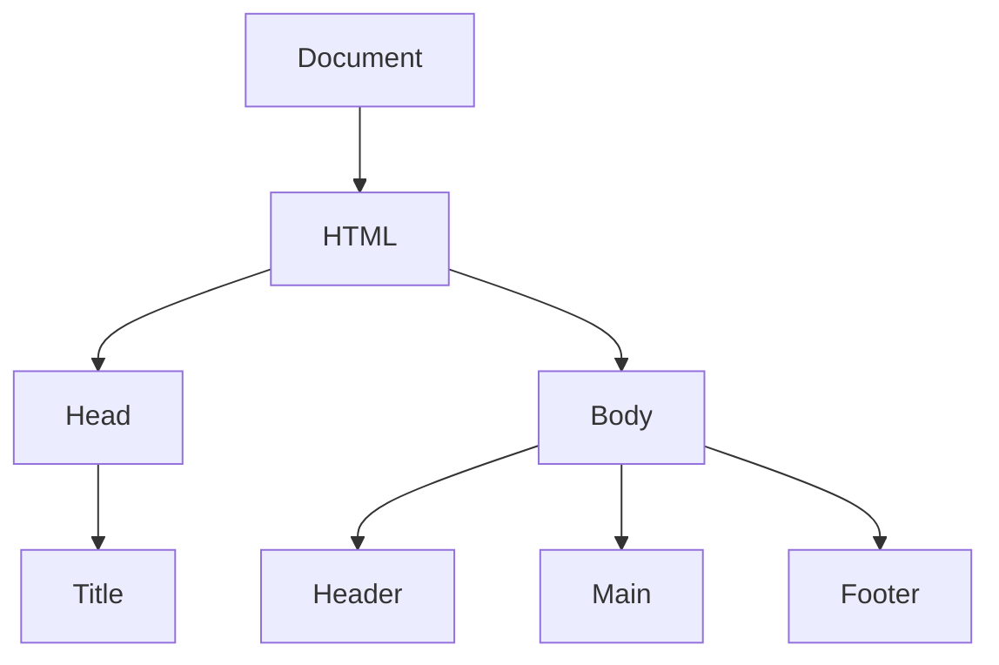
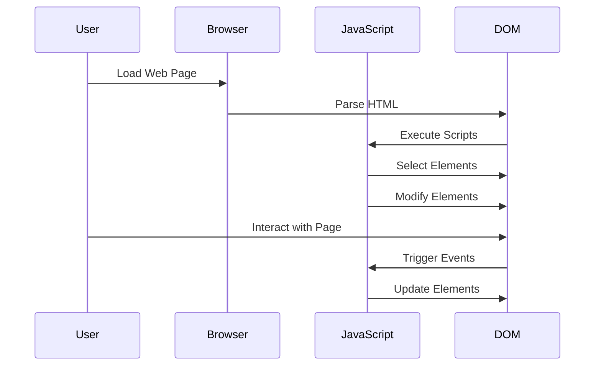

## 24.1 Functions in DOM Manipulation

Welcome to an exciting journey into the world of DOM manipulation using JavaScript functions! In this chapter, we will explore how functions can be used to interact with the Document Object Model (DOM), which is the backbone of any web page's structure. By the end of this section, you'll be equipped with the knowledge to select, modify, and manage DOM elements, handle events, and ensure your code is efficient and maintainable.

### Understanding the DOM

Before diving into functions, let's briefly understand what the DOM is. The Document Object Model is a programming interface for web documents. It represents the page so that programs can change the document structure, style, and content. The DOM represents the document as a tree of nodes, where each node is an object representing a part of the document.



**Figure 1: A simplified representation of a DOM tree.**

### Selecting DOM Elements

To manipulate the DOM, we first need to select the elements we want to work with. JavaScript provides several methods to select elements:

- `document.getElementById()`
- `document.getElementsByClassName()`
- `document.getElementsByTagName()`
- `document.querySelector()`
- `document.querySelectorAll()`

#### Example: Selecting Elements

Let's start by selecting an element using `getElementById`:

```html
<!DOCTYPE html>
<html lang="en">
<head>
    <meta charset="UTF-8">
    <title>DOM Manipulation Example</title>
</head>
<body>
    <h1 id="main-title">Hello, World!</h1>
    <script>
        // Select the element with the id 'main-title'
        var titleElement = document.getElementById('main-title');
        console.log(titleElement.textContent); // Output: Hello, World!
    </script>
</body>
</html>
```

In this example, we use `getElementById` to select the `<h1>` element with the ID `main-title`. We then log its text content to the console.

### Modifying DOM Elements

Once we've selected an element, we can modify its properties, such as text content, attributes, and styles.

#### Example: Modifying Text Content

```html
<script>
    // Change the text content of the selected element
    titleElement.textContent = 'Welcome to JavaScript!';
</script>
```

This script updates the text content of the `titleElement` to "Welcome to JavaScript!".

#### Example: Changing Styles

```html
<script>
    // Change the style of the selected element
    titleElement.style.color = 'blue';
    titleElement.style.fontSize = '2em';
</script>
```

Here, we modify the `color` and `fontSize` properties of the `titleElement` to change its appearance.

### Creating and Removing DOM Elements

JavaScript allows us to create new elements and remove existing ones, enabling dynamic content updates.

#### Example: Creating Elements

```html
<script>
    // Create a new paragraph element
    var newParagraph = document.createElement('p');
    newParagraph.textContent = 'This is a new paragraph.';

    // Append the new paragraph to the body
    document.body.appendChild(newParagraph);
</script>
```

In this example, we create a new `<p>` element, set its text content, and append it to the document body.

#### Example: Removing Elements

```html
<script>
    // Remove the newly created paragraph
    document.body.removeChild(newParagraph);
</script>
```

Here, we remove the `newParagraph` element from the document body.

### Event Handling with Functions

Event handling is a crucial part of DOM manipulation, allowing us to respond to user interactions.

#### Example: Adding Event Listeners

```html
<button id="click-me">Click Me!</button>
<script>
    // Select the button element
    var button = document.getElementById('click-me');

    // Add a click event listener
    button.addEventListener('click', function() {
        alert('Button clicked!');
    });
</script>
```

In this example, we add a click event listener to a button. When the button is clicked, an alert is displayed.

### Clean Separation of Logic and Presentation

It's important to maintain a clean separation between your JavaScript logic and HTML presentation. This practice enhances maintainability and readability.

#### Example: Separating Logic

```html
<!DOCTYPE html>
<html lang="en">
<head>
    <meta charset="UTF-8">
    <title>Separation of Logic</title>
    <style>
        #message {
            color: green;
            font-weight: bold;
        }
    </style>
</head>
<body>
    <div id="message">This is a message.</div>
    <button id="change-message">Change Message</button>
    <script src="script.js"></script>
</body>
</html>
```

```javascript
// script.js
document.getElementById('change-message').addEventListener('click', function() {
    var message = document.getElementById('message');
    message.textContent = 'Message has been changed!';
});
```

In this example, the HTML and CSS are kept separate from the JavaScript logic, which is stored in `script.js`.

### Best Practices for Efficient DOM Manipulation

1. **Minimize Reflows and Repaints**: Changes to the DOM can cause reflows and repaints, which are performance-intensive. Batch DOM updates to minimize these operations.

2. **Use Document Fragments**: When adding multiple elements, use a `DocumentFragment` to reduce reflows.

3. **Cache DOM References**: Store references to frequently accessed DOM elements to avoid repeated queries.

4. **Debounce Event Handlers**: For events that fire frequently, such as `scroll` or `resize`, use debouncing to limit the rate of execution.

#### Example: Using Document Fragments

```javascript
var fragment = document.createDocumentFragment();
for (var i = 0; i < 10; i++) {
    var newDiv = document.createElement('div');
    newDiv.textContent = 'Div ' + i;
    fragment.appendChild(newDiv);
}
document.body.appendChild(fragment);
```

In this example, we create multiple `<div>` elements and append them to a `DocumentFragment`, which is then appended to the document body in a single operation.

### Try It Yourself

Experiment with the examples provided by making the following modifications:

- Change the text content and style of different elements.
- Create a new element and add it to a specific location in the DOM.
- Add event listeners for different events, such as `mouseover` or `keydown`.
- Implement a function that toggles the visibility of an element when a button is clicked.

### Visualizing JavaScript's Interaction with Web Browsers and Web Pages



**Figure 2: Sequence of interactions between the user, browser, JavaScript, and DOM.**

### References and Links

- [MDN Web Docs: Introduction to the DOM](https://developer.mozilla.org/en-US/docs/Web/API/Document_Object_Model/Introduction)
- [W3Schools: JavaScript HTML DOM](https://www.w3schools.com/js/js_htmldom.asp)
- [JavaScript.info: Introduction to the DOM](https://javascript.info/dom-nodes)

### Knowledge Check

- What is the DOM, and how does it relate to web pages?
- How can you select an element with a specific class name?
- What is the purpose of event listeners in DOM manipulation?
- Why is it important to separate JavaScript logic from HTML presentation?
- What are some best practices for efficient DOM manipulation?

### Embrace the Journey

Remember, this is just the beginning. As you progress, you'll build more complex and interactive web pages. Keep experimenting, stay curious, and enjoy the journey!

## Quiz Time!



### What is the DOM in web development?

- [x] A programming interface for web documents
- [ ] A database management system
- [ ] A server-side scripting language
- [ ] A type of web browser

> **Explanation:** The DOM is a programming interface for web documents, allowing scripts to update the content, structure, and style of a document.

### Which method is used to select an element by its ID?

- [x] `document.getElementById()`
- [ ] `document.getElementsByClassName()`
- [ ] `document.querySelectorAll()`
- [ ] `document.createElement()`

> **Explanation:** `document.getElementById()` is used to select an element by its ID.

### How can you change the text content of a DOM element?

- [x] By setting the `textContent` property
- [ ] By using `document.write()`
- [ ] By calling `alert()`
- [ ] By using `console.log()`

> **Explanation:** The `textContent` property is used to change the text content of a DOM element.

### What is the purpose of event listeners?

- [x] To respond to user interactions
- [ ] To style HTML elements
- [ ] To store data in a database
- [ ] To create new HTML elements

> **Explanation:** Event listeners are used to respond to user interactions, such as clicks, key presses, and mouse movements.

### What is a best practice for efficient DOM manipulation?

- [x] Minimize reflows and repaints
- [ ] Use `alert()` for debugging
- [ ] Write all JavaScript inline
- [ ] Avoid using functions

> **Explanation:** Minimizing reflows and repaints is a best practice for efficient DOM manipulation, as it reduces performance overhead.

### How can you create a new DOM element?

- [x] By using `document.createElement()`
- [ ] By calling `alert()`
- [ ] By using `console.log()`
- [ ] By setting `innerHTML`

> **Explanation:** `document.createElement()` is used to create a new DOM element.

### What is the benefit of using `DocumentFragment`?

- [x] It reduces reflows by batching DOM updates
- [ ] It automatically styles elements
- [ ] It stores data in local storage
- [ ] It executes JavaScript faster

> **Explanation:** `DocumentFragment` reduces reflows by allowing multiple DOM updates to be batched together.

### How can you remove a DOM element?

- [x] By using `removeChild()`
- [ ] By setting `innerHTML` to an empty string
- [ ] By calling `alert()`
- [ ] By using `console.log()`

> **Explanation:** `removeChild()` is used to remove a DOM element from its parent.

### Why is it important to separate logic from presentation?

- [x] To enhance maintainability and readability
- [ ] To reduce file size
- [ ] To increase execution speed
- [ ] To prevent security vulnerabilities

> **Explanation:** Separating logic from presentation enhances maintainability and readability by keeping code organized.

### True or False: Event listeners can only be added to buttons.

- [ ] True
- [x] False

> **Explanation:** Event listeners can be added to any DOM element, not just buttons.


