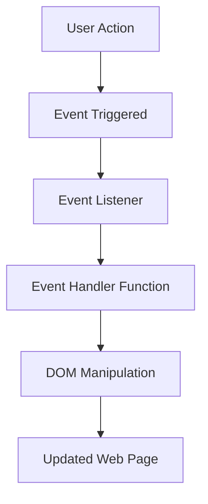

## 24.2 Event Handling Functions

In the world of web development, user interaction is key. Whether it's clicking a button, typing in a text field, or hovering over an image, these interactions are captured and handled using event handling functions in JavaScript. In this section, we'll explore how to write functions that respond to user events, attach event listeners, and manage the event object effectively.

### Understanding Events and Event Listeners

Before we dive into the code, let's clarify what events and event listeners are.

- **Events**: In JavaScript, an event is a signal that something has happened. This could be a user action like a mouse click or a keypress, or it could be something that happens in the browser, like a page loading.

- **Event Listeners**: An event listener is a function that waits for an event to occur. When the event occurs, the listener executes a specified function, known as the event handler.

#### How Event Listeners Work

Event listeners are attached to DOM elements. When an event occurs on that element, the listener is triggered, and the associated function is executed. This mechanism allows us to create interactive web pages.

Here's a basic example of how to attach an event listener to a button click:

```javascript
// Select the button element
const button = document.querySelector('button');

// Define the event handler function
function handleClick() {
  alert('Button was clicked!');
}

// Attach the event listener to the button
button.addEventListener('click', handleClick);
```

In this example, when the button is clicked, the `handleClick` function is executed, displaying an alert message.

### Attaching Functions to Events

JavaScript provides a straightforward way to attach functions to events using the `addEventListener` method. This method can be used to listen for various events, such as `click`, `keydown`, `mouseover`, and many more.

#### Example: Handling Click Events

Let's explore how to handle a click event on a button:

```html
<!DOCTYPE html>
<html lang="en">
<head>
  <meta charset="UTF-8">
  <meta name="viewport" content="width=device-width, initial-scale=1.0">
  <title>Click Event Example</title>
</head>
<body>
  <button id="myButton">Click Me!</button>

  <script>
    // Select the button element
    const button = document.getElementById('myButton');

    // Define the event handler function
    function handleClick() {
      console.log('Button clicked!');
    }

    // Attach the event listener to the button
    button.addEventListener('click', handleClick);
  </script>
</body>
</html>
```

In this example, when the button with the ID `myButton` is clicked, the `handleClick` function logs a message to the console.

#### Example: Handling Keypress Events

Handling keypress events is similar to handling click events. You can attach an event listener to the `document` or a specific input field to capture keypresses:

```html
<!DOCTYPE html>
<html lang="en">
<head>
  <meta charset="UTF-8">
  <meta name="viewport" content="width=device-width, initial-scale=1.0">
  <title>Keypress Event Example</title>
</head>
<body>
  <input type="text" id="textInput" placeholder="Type something...">

  <script>
    // Select the input element
    const input = document.getElementById('textInput');

    // Define the event handler function
    function handleKeypress(event) {
      console.log(`Key pressed: ${event.key}`);
    }

    // Attach the event listener to the input field
    input.addEventListener('keypress', handleKeypress);
  </script>
</body>
</html>
```

Here, the `handleKeypress` function logs the key that was pressed whenever a key is pressed in the input field.

### The Role of the Event Object

When an event occurs, an event object is automatically passed to the event handler function. This object contains information about the event, such as the type of event, the target element, and other properties specific to the event type.

#### Accessing Event Properties

You can access various properties of the event object to get more information about the event. For example, in a click event, you might want to know the coordinates of the mouse click:

```javascript
function handleClick(event) {
  console.log(`Mouse clicked at: X=${event.clientX}, Y=${event.clientY}`);
}
```

In this code, `event.clientX` and `event.clientY` provide the X and Y coordinates of the mouse click relative to the viewport.

#### Preventing Default Actions

Sometimes, you might want to prevent the default action associated with an event. For example, clicking a link typically navigates to a new page. You can prevent this behavior using the `preventDefault` method:

```javascript
document.querySelector('a').addEventListener('click', function(event) {
  event.preventDefault();
  console.log('Link click prevented!');
});
```

In this example, clicking the link will not navigate to a new page, and a message will be logged instead.

### Performance and Memory Considerations

When working with event listeners, it's important to consider performance and memory usage. Here are some tips to keep in mind:

#### Avoiding Memory Leaks

Memory leaks can occur if event listeners are not properly removed. This is especially important when dynamically adding and removing elements from the DOM. Always remove event listeners when they are no longer needed:

```javascript
// Remove the event listener
button.removeEventListener('click', handleClick);
```

#### Delegating Events

Event delegation is a technique that leverages the event bubbling mechanism to improve performance. Instead of attaching an event listener to each child element, you can attach a single listener to a parent element and handle events for all children:

```html
<ul id="myList">
  <li>Item 1</li>
  <li>Item 2</li>
  <li>Item 3</li>
</ul>

<script>
  const list = document.getElementById('myList');

  list.addEventListener('click', function(event) {
    if (event.target.tagName === 'LI') {
      console.log(`List item clicked: ${event.target.textContent}`);
    }
  });
</script>
```

In this example, a single event listener is attached to the `ul` element, and it handles click events for all `li` children.

### Encapsulating Event Logic

Encapsulating event logic within functions is a good practice that promotes code reusability and maintainability. By defining clear and concise event handler functions, you can easily manage and update your code.

#### Example: Encapsulating Click Logic

Let's encapsulate the logic for handling a button click in a separate function:

```javascript
function handleButtonClick(event) {
  console.log('Button clicked!');
  // Additional logic can go here
}

// Attach the event listener
button.addEventListener('click', handleButtonClick);
```

By encapsulating the logic in the `handleButtonClick` function, you can easily update or reuse the logic elsewhere in your code.

### Visualizing JavaScript's Interaction with Web Browsers and Web Pages

To better understand how JavaScript interacts with web browsers and web pages through events, let's visualize the process using a diagram:



**Diagram Description**: This diagram illustrates the flow of events in a web page. A user action triggers an event, which is captured by an event listener. The event listener calls an event handler function, which manipulates the DOM, resulting in an updated web page.

### Try It Yourself

To solidify your understanding, try modifying the examples provided. Here are some suggestions:

- Change the event type in the click event example to `mouseover` and observe the behavior.
- Add a second button to the click event example and attach a different event handler to it.
- Modify the keypress event example to display the key pressed in a paragraph element on the page.

### References and Links

For more information on event handling in JavaScript, check out these resources:

- [MDN Web Docs: Introduction to events](https://developer.mozilla.org/en-US/docs/Learn/JavaScript/Building_blocks/Events)
- [W3Schools: JavaScript Events](https://www.w3schools.com/js/js_events.asp)

### Knowledge Check

- What is an event listener, and how does it work?
- How can you prevent the default action of an event?
- What is event delegation, and why is it useful?
- How can you remove an event listener from an element?

### Embrace the Journey

Remember, this is just the beginning. As you progress, you'll build more complex and interactive web pages. Keep experimenting, stay curious, and enjoy the journey!

## Quiz Time!



### What is an event listener in JavaScript?

- [x] A function that waits for an event to occur and executes a specified function when it does.
- [ ] A method that creates new events.
- [ ] A tool for debugging JavaScript code.
- [ ] A way to style HTML elements.

> **Explanation:** An event listener is a function that waits for an event to occur and executes a specified function when it does.

### How do you attach an event listener to a button click in JavaScript?

- [x] `button.addEventListener('click', handleClick);`
- [ ] `button.onClick(handleClick);`
- [ ] `button.clickListener(handleClick);`
- [ ] `button.addEvent('click', handleClick);`

> **Explanation:** The `addEventListener` method is used to attach an event listener to a button click.

### What does the `preventDefault` method do?

- [x] Prevents the default action associated with an event from occurring.
- [ ] Stops the event listener from executing.
- [ ] Logs the event details to the console.
- [ ] Removes the event listener from the element.

> **Explanation:** The `preventDefault` method prevents the default action associated with an event from occurring.

### What is event delegation?

- [x] A technique that leverages event bubbling to improve performance by attaching a single event listener to a parent element.
- [ ] A method for creating new events.
- [ ] A way to style HTML elements.
- [ ] A tool for debugging JavaScript code.

> **Explanation:** Event delegation is a technique that leverages event bubbling to improve performance by attaching a single event listener to a parent element.

### How can you remove an event listener from an element?

- [x] `element.removeEventListener('click', handleClick);`
- [ ] `element.off('click', handleClick);`
- [ ] `element.detachListener('click', handleClick);`
- [ ] `element.deleteEventListener('click', handleClick);`

> **Explanation:** The `removeEventListener` method is used to remove an event listener from an element.

### What information does the event object provide?

- [x] Information about the event, such as the type of event and the target element.
- [ ] The current time and date.
- [ ] The user's location.
- [ ] The browser version.

> **Explanation:** The event object provides information about the event, such as the type of event and the target element.

### Why is it important to encapsulate event logic within functions?

- [x] To promote code reusability and maintainability.
- [ ] To make the code run faster.
- [ ] To prevent memory leaks.
- [ ] To style HTML elements.

> **Explanation:** Encapsulating event logic within functions promotes code reusability and maintainability.

### What is the purpose of the `addEventListener` method?

- [x] To attach an event listener to a DOM element.
- [ ] To create new events.
- [ ] To remove an event listener from a DOM element.
- [ ] To style HTML elements.

> **Explanation:** The `addEventListener` method is used to attach an event listener to a DOM element.

### How can you handle multiple events on a single element?

- [x] By attaching multiple event listeners to the element.
- [ ] By using a single event listener with multiple functions.
- [ ] By creating a new event type.
- [ ] By using the `preventDefault` method.

> **Explanation:** You can handle multiple events on a single element by attaching multiple event listeners to the element.

### True or False: The event object is automatically passed to the event handler function.

- [x] True
- [ ] False

> **Explanation:** True. The event object is automatically passed to the event handler function when an event occurs.


