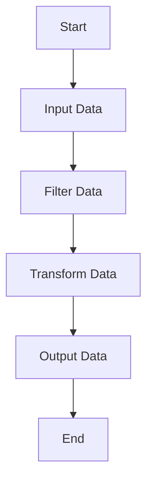

## 24.3 Data Processing with Functions

In the world of programming, data processing is a fundamental task. Whether you're working with arrays, objects, or other data structures, functions in JavaScript provide powerful tools to transform and manipulate data efficiently. In this section, we will explore how to use functions to process data, delve into higher-order functions, and apply functional programming techniques to achieve clean, readable, and efficient code.

### Understanding Data Processing

Data processing involves taking raw data and transforming it into a meaningful format. This can include sorting, filtering, aggregating, and modifying data. JavaScript functions are versatile tools that allow us to perform these operations seamlessly.

### Manipulating Arrays with Functions

Arrays are one of the most common data structures in JavaScript, and functions provide a variety of methods to manipulate them. Let's explore some of these methods.

#### Sorting Arrays

Sorting is a common operation where we arrange elements in a particular order. JavaScript provides the `sort()` method for arrays, which can be customized using a comparison function.

```javascript
// Example: Sorting an array of numbers in ascending order
let numbers = [5, 3, 8, 1, 2];
numbers.sort((a, b) => a - b);
console.log(numbers); // Output: [1, 2, 3, 5, 8]
```

In this example, we use an arrow function `(a, b) => a - b` to sort numbers in ascending order. The `sort()` method modifies the original array.

#### Filtering Arrays

Filtering allows us to create a new array with elements that meet certain criteria. The `filter()` method is perfect for this task.

```javascript
// Example: Filtering even numbers from an array
let numbers = [1, 2, 3, 4, 5, 6];
let evenNumbers = numbers.filter(num => num % 2 === 0);
console.log(evenNumbers); // Output: [2, 4, 6]
```

Here, the `filter()` method creates a new array containing only even numbers.

#### Aggregating Data with `reduce()`

The `reduce()` method is a powerful tool for aggregating data. It processes each element in an array and accumulates a result.

```javascript
// Example: Calculating the sum of an array
let numbers = [1, 2, 3, 4, 5];
let sum = numbers.reduce((accumulator, currentValue) => accumulator + currentValue, 0);
console.log(sum); // Output: 15
```

In this example, `reduce()` iterates through the array, adding each number to the accumulator, which starts at 0.

### Working with Objects

Objects are another fundamental data structure in JavaScript. Functions can help us manipulate and transform object data effectively.

#### Transforming Object Properties

We can use functions to iterate over object properties and transform them as needed.

```javascript
// Example: Converting object values to uppercase
let user = {
  name: 'Alice',
  city: 'Wonderland'
};

let uppercasedUser = Object.fromEntries(
  Object.entries(user).map(([key, value]) => [key, value.toUpperCase()])
);

console.log(uppercasedUser); // Output: { name: 'ALICE', city: 'WONDERLAND' }
```

In this example, we use `Object.entries()` to convert the object into an array of key-value pairs, transform the values, and then convert it back to an object with `Object.fromEntries()`.

#### Merging Objects

Merging objects is a common task, especially when dealing with configurations or combining data from different sources.

```javascript
// Example: Merging two objects
let defaults = { theme: 'light', showNotifications: true };
let userSettings = { theme: 'dark' };

let settings = { ...defaults, ...userSettings };
console.log(settings); // Output: { theme: 'dark', showNotifications: true }
```

Here, the spread syntax `...` is used to merge `defaults` and `userSettings`, with `userSettings` taking precedence.

### Higher-Order Functions for Data Transformation

Higher-order functions are functions that take other functions as arguments or return functions. They are essential for data transformation tasks.

#### Using `map()` for Transformation

The `map()` method creates a new array by applying a function to each element of the original array.

```javascript
// Example: Doubling each number in an array
let numbers = [1, 2, 3, 4, 5];
let doubled = numbers.map(num => num * 2);
console.log(doubled); // Output: [2, 4, 6, 8, 10]
```

In this example, `map()` applies the function `num => num * 2` to each element, creating a new array with doubled values.

#### Combining `filter()` and `map()`

You can chain higher-order functions to perform complex data transformations.

```javascript
// Example: Filtering and transforming data
let numbers = [1, 2, 3, 4, 5, 6];
let processed = numbers
  .filter(num => num % 2 === 0)
  .map(num => num * 10);

console.log(processed); // Output: [20, 40, 60]
```

Here, we first filter for even numbers and then multiply each by 10 using `map()`.

### Functional Programming Techniques

Functional programming emphasizes immutability and pure functions. Let's explore how these principles can enhance data processing.

#### Immutability

Immutability means not modifying the original data. Instead, create new data structures with the desired changes.

```javascript
// Example: Using immutability with arrays
let numbers = [1, 2, 3];
let newNumbers = [...numbers, 4]; // Creates a new array
console.log(numbers); // Output: [1, 2, 3]
console.log(newNumbers); // Output: [1, 2, 3, 4]
```

In this example, the spread syntax creates a new array without altering the original `numbers` array.

#### Pure Functions

Pure functions always produce the same output for the same input and have no side effects.

```javascript
// Example: Pure function for adding two numbers
function add(a, b) {
  return a + b;
}

console.log(add(2, 3)); // Output: 5
```

The `add()` function is pure because it depends only on its inputs and has no side effects.

### Practical Examples of Data Processing

Let's explore some practical examples of data processing using functions.

#### Example 1: Processing User Data

Imagine you have an array of user objects, and you need to extract and transform specific information.

```javascript
// Example: Extracting user names and ages
let users = [
  { name: 'Alice', age: 25 },
  { name: 'Bob', age: 30 },
  { name: 'Charlie', age: 35 }
];

let userNamesAndAges = users.map(user => ({
  name: user.name,
  age: user.age
}));

console.log(userNamesAndAges);
// Output: [{ name: 'Alice', age: 25 }, { name: 'Bob', age: 30 }, { name: 'Charlie', age: 35 }]
```

In this example, `map()` is used to transform each user object into a new object containing only the name and age.

#### Example 2: Calculating Average Age

Let's calculate the average age of users in the array.

```javascript
// Example: Calculating average age
let users = [
  { name: 'Alice', age: 25 },
  { name: 'Bob', age: 30 },
  { name: 'Charlie', age: 35 }
];

let totalAge = users.reduce((total, user) => total + user.age, 0);
let averageAge = totalAge / users.length;

console.log(averageAge); // Output: 30
```

Here, `reduce()` is used to sum the ages, and then we divide by the number of users to find the average.

### Visualizing Data Processing with Functions

Let's visualize how data flows through functions using a flowchart.



**Figure 1: Data Processing Flowchart**  
This flowchart illustrates the typical data processing steps: input, filtering, transformation, and output.

### Writing Efficient and Readable Data Functions

Efficiency and readability are crucial when writing data processing functions. Here are some tips:

- **Use Descriptive Names**: Choose meaningful names for functions and variables to make your code self-explanatory.
- **Avoid Side Effects**: Strive for pure functions that don't modify external state.
- **Leverage Built-in Methods**: Use JavaScript's built-in array and object methods for common tasks.
- **Optimize for Performance**: Consider the complexity of operations, especially with large datasets.

### Try It Yourself

Experiment with the following code example by modifying the data or transformation logic:

```javascript
// Try It Yourself: Modify the data or transformation logic
let products = [
  { name: 'Laptop', price: 1000 },
  { name: 'Phone', price: 500 },
  { name: 'Tablet', price: 300 }
];

// Increase each product's price by 10%
let updatedPrices = products.map(product => ({
  ...product,
  price: product.price * 1.1
}));

console.log(updatedPrices);
```

Try changing the percentage increase or adding new properties to the product objects.

### References and Further Reading

- [MDN Web Docs: Array](https://developer.mozilla.org/en-US/docs/Web/JavaScript/Reference/Global_Objects/Array)
- [MDN Web Docs: Object](https://developer.mozilla.org/en-US/docs/Web/JavaScript/Reference/Global_Objects/Object)
- [JavaScript.info: Functional Programming](https://javascript.info/functional-programming)

### Knowledge Check

- What is the purpose of the `filter()` method in JavaScript?
- How can you ensure a function is pure?
- What is the difference between `map()` and `forEach()`?
- How do you calculate the average of numbers in an array using `reduce()`?

### Embrace the Journey

Remember, this is just the beginning. As you progress, you'll build more complex and interactive web pages. Keep experimenting, stay curious, and enjoy the journey!

## Quiz Time!



### What is the primary purpose of the `map()` function in JavaScript?

- [x] To transform each element of an array and return a new array
- [ ] To filter elements from an array
- [ ] To sort an array
- [ ] To reduce an array to a single value

> **Explanation:** The `map()` function is used to apply a transformation to each element of an array, returning a new array with the transformed elements.

### Which method would you use to combine two objects in JavaScript?

- [ ] `Object.assign()`
- [x] Spread syntax (`...`)
- [ ] `Array.concat()`
- [ ] `Object.merge()`

> **Explanation:** The spread syntax (`...`) is commonly used to merge objects in JavaScript, allowing properties from one object to overwrite those in another.

### What is a pure function?

- [x] A function that always returns the same output for the same input and has no side effects
- [ ] A function that modifies global variables
- [ ] A function that relies on external data
- [ ] A function that uses `this` keyword

> **Explanation:** A pure function is one that consistently produces the same result for the same input and does not cause any side effects outside its scope.

### How can you calculate the sum of an array of numbers using a higher-order function?

- [ ] Use `map()`
- [ ] Use `filter()`
- [x] Use `reduce()`
- [ ] Use `forEach()`

> **Explanation:** The `reduce()` function is used to accumulate values in an array, making it suitable for calculating sums.

### What does the `filter()` function return?

- [x] A new array with elements that meet the specified condition
- [ ] The first element that meets the condition
- [ ] A boolean indicating if any elements meet the condition
- [ ] The index of the first element that meets the condition

> **Explanation:** The `filter()` function returns a new array containing all elements that satisfy the given condition.

### Which of the following is a characteristic of functional programming?

- [x] Immutability
- [ ] Global state modification
- [ ] Dependence on `this` keyword
- [ ] Use of loops

> **Explanation:** Functional programming emphasizes immutability, avoiding changes to data structures, and relying on pure functions.

### What is the result of the following code: `[1, 2, 3].map(x => x * 2)`?

- [x] `[2, 4, 6]`
- [ ] `[1, 2, 3]`
- [ ] `[3, 6, 9]`
- [ ] `[1, 4, 9]`

> **Explanation:** The `map()` function applies the transformation `x => x * 2` to each element, resulting in `[2, 4, 6]`.

### What is the purpose of the `reduce()` function?

- [ ] To transform each element of an array
- [ ] To filter elements from an array
- [x] To reduce an array to a single accumulated value
- [ ] To sort an array

> **Explanation:** The `reduce()` function processes each element of an array to produce a single accumulated result.

### Why is immutability important in functional programming?

- [x] It prevents unintended side effects and makes code easier to reason about
- [ ] It allows functions to modify global variables
- [ ] It makes code execution faster
- [ ] It requires more memory

> **Explanation:** Immutability prevents changes to data structures, reducing side effects and making code more predictable and easier to understand.

### True or False: The `map()` function modifies the original array.

- [ ] True
- [x] False

> **Explanation:** The `map()` function returns a new array with transformed elements and does not modify the original array.




