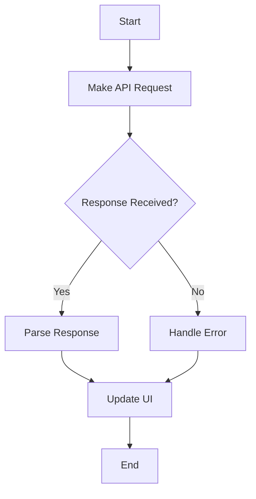

## 24.4 API Interaction Functions

In today's digital age, web applications often rely on external data to provide dynamic and interactive experiences. This is where APIs, or Application Programming Interfaces, come into play. APIs allow different software systems to communicate with each other, enabling developers to access and manipulate data from various sources. In this section, we'll explore how to create functions in JavaScript that interact with web APIs, focusing on making HTTP requests, handling responses, and implementing best practices for secure and efficient API communication.

### Understanding APIs and HTTP Requests

**APIs** are sets of rules and protocols that allow different software applications to communicate. They define the methods and data formats that applications can use to interact with each other. In web development, APIs are commonly used to retrieve data from servers or send data to them.

**HTTP (Hypertext Transfer Protocol)** is the foundation of data communication on the web. It defines how messages are formatted and transmitted, and how web servers and browsers should respond to various commands. The most common HTTP methods are:

- **GET**: Retrieve data from a server.
- **POST**: Send data to a server to create or update a resource.
- **PUT**: Update an existing resource on a server.
- **DELETE**: Remove a resource from a server.

### Making HTTP Requests with JavaScript

JavaScript provides several ways to make HTTP requests. Two popular methods are using the `fetch` API and the `axios` library. Let's explore both.

#### Using the `fetch` API

The `fetch` API is a modern, promise-based approach to making HTTP requests. It is built into most modern browsers and provides a simple interface for fetching resources.

Here's how you can use the `fetch` API to make a GET request:

```javascript
// Function to fetch data from an API
async function fetchData(url) {
  try {
    // Make a GET request to the specified URL
    const response = await fetch(url);

    // Check if the request was successful
    if (!response.ok) {
      throw new Error(`HTTP error! Status: ${response.status}`);
    }

    // Parse the JSON response
    const data = await response.json();
    console.log(data); // Display the data in the console
    return data;
  } catch (error) {
    console.error('Error fetching data:', error);
  }
}

// Example usage
fetchData('https://api.example.com/data');
```

**Key Points:**
- The `fetch` function returns a promise that resolves to the response of the request.
- We use `await` to wait for the promise to resolve, allowing us to handle the response asynchronously.
- The `response.ok` property checks if the request was successful.
- We parse the JSON data using `response.json()`, which also returns a promise.

#### Using the `axios` Library

`axios` is a popular third-party library for making HTTP requests. It provides a more powerful and flexible API than `fetch`, with features like request cancellation and automatic JSON parsing.

To use `axios`, you need to install it first. You can do this using npm or a CDN:

```bash
npm install axios
```

Here's how you can use `axios` to make a GET request:

```javascript
// Import the axios library
const axios = require('axios');

// Function to fetch data from an API
async function fetchData(url) {
  try {
    // Make a GET request to the specified URL
    const response = await axios.get(url);
    console.log(response.data); // Display the data in the console
    return response.data;
  } catch (error) {
    console.error('Error fetching data:', error);
  }
}

// Example usage
fetchData('https://api.example.com/data');
```

**Key Points:**
- `axios.get(url)` returns a promise that resolves to the response object.
- The response data is available in `response.data`, which is already parsed as JSON.

### Making POST Requests

In addition to retrieving data, you may need to send data to a server using a POST request. Let's see how to do this with both `fetch` and `axios`.

#### Using `fetch` for POST Requests

```javascript
// Function to send data to an API
async function postData(url, data) {
  try {
    // Make a POST request with the specified data
    const response = await fetch(url, {
      method: 'POST',
      headers: {
        'Content-Type': 'application/json',
      },
      body: JSON.stringify(data),
    });

    // Check if the request was successful
    if (!response.ok) {
      throw new Error(`HTTP error! Status: ${response.status}`);
    }

    // Parse the JSON response
    const responseData = await response.json();
    console.log(responseData); // Display the response data in the console
    return responseData;
  } catch (error) {
    console.error('Error posting data:', error);
  }
}

// Example usage
postData('https://api.example.com/data', { key: 'value' });
```

**Key Points:**
- We specify the HTTP method as `POST` in the request options.
- The `headers` object includes the `Content-Type` to indicate the format of the data being sent.
- The `body` contains the data to be sent, which we convert to a JSON string using `JSON.stringify()`.

#### Using `axios` for POST Requests

```javascript
// Function to send data to an API
async function postData(url, data) {
  try {
    // Make a POST request with the specified data
    const response = await axios.post(url, data);
    console.log(response.data); // Display the response data in the console
    return response.data;
  } catch (error) {
    console.error('Error posting data:', error);
  }
}

// Example usage
postData('https://api.example.com/data', { key: 'value' });
```

**Key Points:**
- `axios.post(url, data)` automatically sets the `Content-Type` header to `application/json` and converts the data to a JSON string.

### Handling Responses and Errors

When making API requests, it's important to handle responses and errors gracefully. This ensures that your application can respond appropriately to different scenarios, such as network failures or server errors.

#### Handling Responses

After making an API request, you need to process the response data. This typically involves parsing the data and updating your application's state or UI.

Here's an example of handling a successful response:

```javascript
async function fetchData(url) {
  try {
    const response = await fetch(url);
    if (!response.ok) {
      throw new Error(`HTTP error! Status: ${response.status}`);
    }
    const data = await response.json();
    // Update the UI with the fetched data
    updateUI(data);
  } catch (error) {
    console.error('Error fetching data:', error);
  }
}

function updateUI(data) {
  // Code to update the UI with the fetched data
  console.log('Updating UI with data:', data);
}
```

#### Handling Errors

Errors can occur for various reasons, such as network issues or invalid requests. It's important to catch these errors and provide meaningful feedback to the user.

Here's an example of handling errors:

```javascript
async function fetchData(url) {
  try {
    const response = await fetch(url);
    if (!response.ok) {
      throw new Error(`HTTP error! Status: ${response.status}`);
    }
    const data = await response.json();
    updateUI(data);
  } catch (error) {
    console.error('Error fetching data:', error);
    // Display an error message to the user
    displayErrorMessage('Failed to fetch data. Please try again later.');
  }
}

function displayErrorMessage(message) {
  // Code to display an error message to the user
  console.log('Error:', message);
}
```

### The Importance of Asynchronous Functions

API calls are inherently asynchronous because they involve network communication, which can take an unpredictable amount of time. Using asynchronous functions allows your application to remain responsive while waiting for the API response.

#### Asynchronous Functions with `async` and `await`

The `async` and `await` keywords in JavaScript provide a clean and readable way to work with asynchronous code. They allow you to write asynchronous code that looks and behaves like synchronous code.

Here's a quick recap of how `async` and `await` work:

- **`async`**: Declares an asynchronous function. It returns a promise, and you can use `await` inside it.
- **`await`**: Pauses the execution of the function until the promise is resolved, allowing you to work with the resolved value directly.

Using `async` and `await` makes it easier to handle asynchronous operations, such as API calls, without getting into "callback hell."

### Best Practices for API Interaction

When interacting with APIs, it's important to follow best practices to ensure efficient, secure, and maintainable code.

#### Data Parsing

When you receive data from an API, it's often in JSON format. Parsing this data correctly is crucial for using it in your application.

- **Validate the Data**: Ensure that the data you receive matches the expected format and contains the necessary fields.
- **Handle Missing or Invalid Data**: Provide default values or error messages for missing or invalid data to prevent your application from crashing.

Here's an example of validating and handling data:

```javascript
function processData(data) {
  if (!data || typeof data !== 'object') {
    console.error('Invalid data:', data);
    return;
  }

  // Access specific fields in the data
  const { name, age } = data;
  if (!name || !age) {
    console.error('Missing required fields:', data);
    return;
  }

  // Use the data in your application
  console.log(`Name: ${name}, Age: ${age}`);
}
```

#### Security Considerations

Security is a critical aspect of API interaction. Here are some best practices to keep in mind:

- **Use HTTPS**: Always use HTTPS to encrypt data in transit and protect it from interception.
- **Authenticate Requests**: Use authentication mechanisms, such as API keys or OAuth tokens, to ensure that only authorized users can access your API.
- **Validate Inputs**: Validate and sanitize any data sent to the API to prevent injection attacks.
- **Limit API Usage**: Implement rate limiting and quotas to prevent abuse and ensure fair usage.

#### Error Handling and Logging

Implement robust error handling and logging to monitor and troubleshoot issues with your API interactions.

- **Log Errors**: Use logging tools to capture and store error information for analysis.
- **Provide User Feedback**: Display user-friendly error messages to inform users of issues and potential solutions.

### Try It Yourself

Now that we've covered the basics of API interaction functions, it's time to experiment on your own. Here are some ideas to get you started:

- **Modify the Code**: Change the URL or data in the examples to interact with a different API.
- **Add Error Handling**: Enhance the error handling in the examples to cover more scenarios.
- **Create a New Function**: Write a function that makes a PUT or DELETE request to an API.

### Visualizing API Interaction

To better understand how API interaction works, let's visualize the process using a flowchart:



**Diagram Description**: This flowchart illustrates the process of making an API request, handling the response, and updating the UI. It highlights the decision point where the response is checked, leading to either parsing the response or handling an error.

### References and Links

For further reading and deeper dives into the topics covered, check out these resources:

- [MDN Web Docs: Fetch API](https://developer.mozilla.org/en-US/docs/Web/API/Fetch_API)
- [Axios GitHub Repository](https://github.com/axios/axios)
- [MDN Web Docs: HTTP](https://developer.mozilla.org/en-US/docs/Web/HTTP)
- [OWASP: Secure Coding Practices](https://owasp.org/www-project-secure-coding-practices/)

### Knowledge Check

Let's reinforce what we've learned with a few questions and exercises:

1. **What is an API, and why is it important in web development?**
2. **Explain the difference between GET and POST requests.**
3. **How does the `fetch` API differ from `axios`?**
4. **Why is it important to handle errors in API interactions?**
5. **What are some security considerations when making API requests?**

### Embrace the Journey

Remember, mastering API interaction functions is a crucial step in becoming a proficient web developer. As you progress, you'll build more complex and interactive applications that rely on external data sources. Keep experimenting, stay curious, and enjoy the journey!

## Quiz Time!



### What is the primary purpose of an API in web development?

- [x] To allow different software systems to communicate with each other.
- [ ] To create user interfaces for web applications.
- [ ] To store data in a database.
- [ ] To design the layout of web pages.

> **Explanation:** APIs enable different software systems to communicate and exchange data, which is essential for web development.

### Which HTTP method is used to retrieve data from a server?

- [x] GET
- [ ] POST
- [ ] PUT
- [ ] DELETE

> **Explanation:** The GET method is used to request data from a server without modifying it.

### What does the `fetch` function return in JavaScript?

- [x] A promise
- [ ] An object
- [ ] A string
- [ ] An array

> **Explanation:** The `fetch` function returns a promise that resolves to the response of the request.

### In the `fetch` API, what does `response.json()` do?

- [x] Parses the response body as JSON
- [ ] Converts the response to a string
- [ ] Sends a JSON request
- [ ] Logs the response to the console

> **Explanation:** `response.json()` parses the response body as JSON and returns a promise.

### What is a key advantage of using `axios` over `fetch`?

- [x] Automatic JSON parsing
- [ ] Built-in support for CSS
- [ ] Ability to create HTML elements
- [ ] Direct integration with databases

> **Explanation:** `axios` automatically parses JSON responses, making it easier to work with API data.

### Why is it important to handle errors in API interactions?

- [x] To provide meaningful feedback to users and prevent application crashes
- [ ] To increase the size of the codebase
- [ ] To make the application run slower
- [ ] To avoid using asynchronous functions

> **Explanation:** Handling errors ensures that users receive feedback and that the application remains stable.

### What is the purpose of using `async` and `await` in JavaScript?

- [x] To simplify working with asynchronous code
- [ ] To create synchronous functions
- [ ] To define CSS styles
- [ ] To manipulate the DOM

> **Explanation:** `async` and `await` simplify working with promises, making asynchronous code more readable.

### Which of the following is a security consideration when making API requests?

- [x] Use HTTPS to encrypt data in transit
- [ ] Use HTTP to speed up requests
- [ ] Ignore authentication mechanisms
- [ ] Allow unrestricted access to the API

> **Explanation:** Using HTTPS encrypts data in transit, protecting it from interception.

### What should you do if you receive invalid data from an API?

- [x] Validate the data and provide default values or error messages
- [ ] Ignore the data and proceed
- [ ] Automatically save the data to a database
- [ ] Display the raw data to the user

> **Explanation:** Validating data ensures that your application handles it correctly and remains stable.

### True or False: Asynchronous functions are important for API calls because they allow the application to remain responsive.

- [x] True
- [ ] False

> **Explanation:** Asynchronous functions enable the application to continue running while waiting for API responses, maintaining responsiveness.




