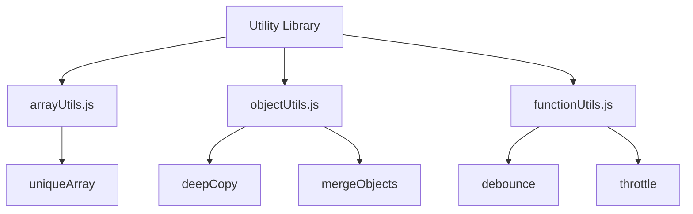

## 24.5 Building a Functional Utility Library

In the world of software development, efficiency and reusability are key. As we delve into building a functional utility library in JavaScript, we'll explore how to create a collection of reusable functions that can simplify your coding tasks and enhance productivity. This guide will walk you through the benefits of a centralized utility library, provide examples of common utility functions, and demonstrate how to organize, export, and test these functions. We'll also emphasize the importance of documentation and version control to maintain a robust library.

### Why Build a Utility Library?

Before we dive into the implementation, let's discuss why creating a utility library is beneficial:

- **Code Reusability**: Utility libraries allow you to write a function once and use it across multiple projects, reducing redundancy and errors.
- **Consistency**: By using a centralized library, you ensure consistent behavior across your applications.
- **Efficiency**: Utility functions can simplify complex tasks, making your code cleaner and easier to maintain.
- **Collaboration**: A well-documented library makes it easier for team members to understand and use the functions.

### Getting Started: Common Utility Functions

Let's start by exploring some common utility functions that are often included in a utility library. These functions address frequent coding needs and can be adapted to suit specific requirements.

#### 1. Deep Copy

A deep copy function creates a complete copy of an object, including nested objects. This is essential when you need to duplicate an object without affecting the original.

```javascript
// Deep copy function using recursion
function deepCopy(obj) {
  if (obj === null || typeof obj !== 'object') {
    return obj;
  }

  if (Array.isArray(obj)) {
    return obj.map(deepCopy);
  }

  const copy = {};
  for (const key in obj) {
    if (obj.hasOwnProperty(key)) {
      copy[key] = deepCopy(obj[key]);
    }
  }
  return copy;
}

// Example usage
const original = { name: 'Alice', details: { age: 25, hobbies: ['reading', 'gaming'] } };
const copied = deepCopy(original);
copied.details.age = 30;

console.log(original.details.age); // 25
console.log(copied.details.age);   // 30
```

#### 2. Debounce

The debounce function limits the rate at which a function can fire. It's particularly useful for optimizing performance in scenarios like window resizing or input events.

```javascript
// Debounce function
function debounce(func, wait) {
  let timeout;
  return function(...args) {
    clearTimeout(timeout);
    timeout = setTimeout(() => func.apply(this, args), wait);
  };
}

// Example usage
const logMessage = debounce(() => console.log('Debounced!'), 2000);
window.addEventListener('resize', logMessage);
```

### Organizing and Exporting Functions

To make your utility library efficient and easy to use, it's important to organize and export your functions properly. This involves structuring your code in a way that makes it easy to import and use in other projects.

#### Module Structure

Organize your utility functions into separate files based on their functionality. For instance, you might have files like `arrayUtils.js`, `objectUtils.js`, and `functionUtils.js`.

```javascript
// arrayUtils.js
export function uniqueArray(arr) {
  return [...new Set(arr)];
}

// objectUtils.js
export function mergeObjects(obj1, obj2) {
  return { ...obj1, ...obj2 };
}

// functionUtils.js
export function throttle(func, limit) {
  let lastFunc;
  let lastRan;
  return function(...args) {
    if (!lastRan) {
      func.apply(this, args);
      lastRan = Date.now();
    } else {
      clearTimeout(lastFunc);
      lastFunc = setTimeout(() => {
        if ((Date.now() - lastRan) >= limit) {
          func.apply(this, args);
          lastRan = Date.now();
        }
      }, limit - (Date.now() - lastRan));
    }
  };
}
```

#### Exporting and Importing

Use ES6 module syntax to export and import functions. This makes your library modular and easy to integrate into different projects.

```javascript
// index.js - Main entry point for the utility library
export * from './arrayUtils';
export * from './objectUtils';
export * from './functionUtils';

// Importing in another file
import { uniqueArray, mergeObjects, throttle } from './utils';
```

### Writing Tests for Utility Functions

Testing is crucial to ensure the reliability and correctness of your utility functions. By writing tests, you can catch errors early and maintain confidence in your code.

#### Setting Up a Testing Framework

Choose a testing framework like Jest or Mocha to write and run your tests. These frameworks provide tools to create test cases and assertions.

```javascript
// Example test using Jest
import { deepCopy } from './objectUtils';

test('deepCopy creates a deep copy of an object', () => {
  const original = { a: 1, b: { c: 2 } };
  const copy = deepCopy(original);
  copy.b.c = 3;
  expect(original.b.c).toBe(2);
  expect(copy.b.c).toBe(3);
});
```

#### Encouraging Test-Driven Development

Adopt a test-driven development (TDD) approach by writing tests before implementing your functions. This ensures that your code meets the specified requirements and behaves as expected.

### The Value of Documentation and Version Control

Documentation and version control are essential practices for maintaining a utility library. They ensure that your library is understandable, usable, and up-to-date.

#### Documenting Your Functions

Provide clear and concise documentation for each function in your library. Include information about the function's purpose, parameters, return values, and examples of usage.

```javascript
/**
 * Creates a deep copy of an object.
 * @param {Object} obj - The object to copy.
 * @returns {Object} - The deep copied object.
 */
function deepCopy(obj) {
  // Implementation
}
```

#### Using Version Control

Use a version control system like Git to track changes to your library. This allows you to manage updates, collaborate with others, and revert to previous versions if necessary.

### Try It Yourself

Now that we've covered the essentials of building a utility library, it's time for you to experiment. Try modifying the `deepCopy` function to handle additional data types, or create a new utility function that addresses a common need in your projects. Remember, practice makes perfect!

### Visualizing the Utility Library Structure

To better understand how your utility library is organized, let's visualize the structure using a diagram.



**Diagram Description**: This diagram illustrates the structure of a utility library, showing how different utility functions are organized into separate files based on their functionality.

### References and Further Reading

For more information on JavaScript functions and utility libraries, consider exploring the following resources:

- [MDN Web Docs: Functions](https://developer.mozilla.org/en-US/docs/Web/JavaScript/Guide/Functions)
- [W3Schools: JavaScript Functions](https://www.w3schools.com/js/js_functions.asp)
- [Jest: JavaScript Testing Framework](https://jestjs.io/)

### Knowledge Check

To reinforce your understanding, here are some questions and challenges:

- What are the benefits of using a utility library in JavaScript?
- How does the `debounce` function improve performance?
- Try writing a utility function that formats dates in a specific way.
- How can you ensure that your utility functions are reliable and error-free?
- What role does documentation play in maintaining a utility library?

### Embrace the Journey

Building a functional utility library is a rewarding endeavor that enhances your coding skills and productivity. Remember, this is just the beginning. As you progress, you'll discover new ways to optimize and expand your library. Keep experimenting, stay curious, and enjoy the journey!

## Quiz Time!



### What is the main benefit of a utility library?

- [x] Code reusability
- [ ] Increased complexity
- [ ] Slower performance
- [ ] Less collaboration

> **Explanation:** A utility library allows you to reuse code across multiple projects, improving efficiency and consistency.

### Which function creates a complete copy of an object, including nested objects?

- [x] deepCopy
- [ ] shallowCopy
- [ ] clone
- [ ] replicate

> **Explanation:** The `deepCopy` function creates a complete copy of an object, including all nested objects.

### What is the purpose of the debounce function?

- [x] To limit the rate at which a function can fire
- [ ] To increase the execution speed of a function
- [ ] To create a deep copy of an object
- [ ] To merge two objects

> **Explanation:** The `debounce` function limits the rate at which a function can fire, optimizing performance in scenarios like window resizing.

### How can you organize utility functions in a library?

- [x] By functionality in separate files
- [ ] By randomly placing them in a single file
- [ ] By their length
- [ ] By their alphabetical order

> **Explanation:** Organizing utility functions by functionality in separate files makes the library modular and easy to maintain.

### What is the benefit of writing tests for utility functions?

- [x] Ensures reliability and correctness
- [ ] Makes the code more complex
- [ ] Increases the file size
- [ ] Slows down the development process

> **Explanation:** Writing tests ensures the reliability and correctness of utility functions, catching errors early.

### What should be included in the documentation of a utility function?

- [x] Purpose, parameters, return values, and examples
- [ ] Only the function's name
- [ ] The author's name
- [ ] The date it was created

> **Explanation:** Documentation should include the function's purpose, parameters, return values, and examples to make it understandable and usable.

### Which version control system is commonly used to track changes in a utility library?

- [x] Git
- [ ] SVN
- [ ] Mercurial
- [ ] CVS

> **Explanation:** Git is a widely used version control system that helps track changes and manage updates in a utility library.

### What is the role of a testing framework like Jest?

- [x] To write and run tests for code
- [ ] To increase the execution speed of code
- [ ] To create a deep copy of objects
- [ ] To merge two objects

> **Explanation:** A testing framework like Jest provides tools to write and run tests, ensuring code reliability.

### How can you import functions from a utility library in another file?

- [x] Using ES6 module syntax
- [ ] By copying and pasting the code
- [ ] By using a global variable
- [ ] By writing the functions again

> **Explanation:** Using ES6 module syntax allows you to import functions from a utility library in another file efficiently.

### True or False: A utility library should be documented and version-controlled.

- [x] True
- [ ] False

> **Explanation:** Documentation and version control are essential for maintaining a utility library, ensuring it is understandable, usable, and up-to-date.


