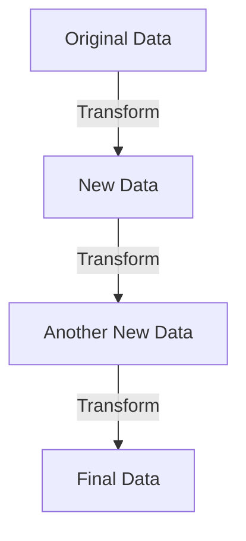

## 25.1 Immutability

In the world of programming, especially in functional programming, immutability is a cornerstone concept. It refers to the idea that once a data structure is created, it cannot be changed. Instead of altering the original data, any transformation results in a new data structure. This approach offers numerous benefits, including preventing unintended side effects and making code more predictable and easier to debug. Let's delve into the concept of immutability, explore its advantages, and learn how to implement it in JavaScript.

### What is Immutability?

Immutability means that once a data structure is created, it cannot be modified. In contrast, mutable data structures can be changed after they are created. For example, arrays and objects in JavaScript are mutable by default, meaning you can change their contents after they are created.

#### Mutable vs. Immutable Data Structures

- **Mutable Data Structures**: These can be changed after creation. For instance, you can add, remove, or modify elements in an array or properties in an object.
- **Immutable Data Structures**: These cannot be changed after creation. Any modification results in a new data structure.

Let's look at a simple example to illustrate the difference:

```javascript
// Mutable example
let mutableArray = [1, 2, 3];
mutableArray.push(4); // The original array is changed
console.log(mutableArray); // Output: [1, 2, 3, 4]

// Immutable example
const immutableArray = Object.freeze([1, 2, 3]);
immutableArray.push(4); // Error: Cannot add property 3, object is not extensible
```

In the mutable example, the `push` method modifies the original array. In the immutable example, using `Object.freeze` prevents changes to the array.

### Advantages of Immutability

Immutability offers several advantages that make it a preferred choice in functional programming:

1. **Predictability**: Since data does not change, functions that operate on immutable data are more predictable. They always produce the same output for the same input.

2. **No Unintended Side Effects**: Immutability prevents functions from accidentally altering shared data, which can lead to bugs that are hard to trace.

3. **Easier Debugging**: With immutable data, you can be confident that data isn't being changed elsewhere in your program, making it easier to track down issues.

4. **Concurrency and Parallelism**: Immutable data structures are inherently thread-safe, making them suitable for concurrent and parallel programming.

5. **Simplified State Management**: In applications, especially those using frameworks like React, immutability simplifies state management by making it easier to track changes over time.

### Implementing Immutability in JavaScript

JavaScript does not enforce immutability by default, but there are several ways to implement it. Let's explore some common techniques.

#### Using `Object.freeze`

`Object.freeze` is a built-in method that makes an object immutable by preventing new properties from being added and existing properties from being changed or deleted.

```javascript
const person = Object.freeze({
  name: 'Alice',
  age: 30
});

// Attempting to change the object
person.age = 31; // This will not change the object
console.log(person.age); // Output: 30
```

While `Object.freeze` is useful, it only provides shallow immutability. Nested objects within a frozen object can still be modified.

#### Using Spread Operator for Arrays and Objects

The spread operator (`...`) can be used to create new arrays or objects with the desired modifications, leaving the original data unchanged.

```javascript
// Immutable array update
const numbers = [1, 2, 3];
const newNumbers = [...numbers, 4]; // Creates a new array
console.log(newNumbers); // Output: [1, 2, 3, 4]

// Immutable object update
const person = { name: 'Alice', age: 30 };
const updatedPerson = { ...person, age: 31 }; // Creates a new object
console.log(updatedPerson); // Output: { name: 'Alice', age: 31 }
```

#### Using Functional Methods

JavaScript arrays have several built-in methods that return new arrays, such as `map`, `filter`, and `reduce`. These methods can be used to work with data immutably.

```javascript
const numbers = [1, 2, 3, 4, 5];

// Using map to create a new array
const doubledNumbers = numbers.map(num => num * 2);
console.log(doubledNumbers); // Output: [2, 4, 6, 8, 10]

// Using filter to create a new array
const evenNumbers = numbers.filter(num => num % 2 === 0);
console.log(evenNumbers); // Output: [2, 4]
```

### Libraries Supporting Immutable Data

Several libraries provide robust support for immutable data structures in JavaScript. Let's explore a few popular ones.

#### Immutable.js

Immutable.js is a library that provides persistent immutable data structures. It offers a rich API for working with immutable collections, such as `List`, `Map`, and `Set`.

```javascript
const { Map } = require('immutable');

const map1 = Map({ a: 1, b: 2, c: 3 });
const map2 = map1.set('b', 50);

console.log(map1.get('b')); // Output: 2
console.log(map2.get('b')); // Output: 50
```

Immutable.js ensures that operations on data structures return new instances, preserving the original data.

#### Immer

Immer is a library that allows you to work with immutable data using a more natural syntax. It uses a concept called "drafts" to apply changes, which are then used to produce a new immutable state.

```javascript
const { produce } = require('immer');

const baseState = [
  { todo: "Learn JavaScript", done: true },
  { todo: "Learn Immutability", done: false }
];

const nextState = produce(baseState, draft => {
  draft.push({ todo: "Learn Immer", done: false });
  draft[1].done = true;
});

console.log(baseState[1].done); // Output: false
console.log(nextState[1].done); // Output: true
```

Immer simplifies working with complex nested data structures by allowing you to "mutate" them in a controlled manner.

### Visualizing Immutability

To better understand immutability, let's visualize how data flows in an immutable system. Consider a simple flowchart representing the transformation of data:



In this diagram, each transformation creates a new data structure, leaving the original data unchanged. This approach ensures that each step in the process is independent and does not affect previous states.

### Try It Yourself

To get a hands-on understanding of immutability, try modifying the following code examples:

1. **Modify the `Object.freeze` Example**: Attempt to change a nested object within a frozen object and observe the behavior.
2. **Experiment with the Spread Operator**: Create a new object or array by combining multiple sources using the spread operator.
3. **Use Array Methods**: Try using `map`, `filter`, and `reduce` to transform an array without altering the original data.

### Knowledge Check

Before we conclude, let's reinforce our understanding of immutability with a few questions:

- What is the difference between mutable and immutable data structures?
- How does immutability help prevent unintended side effects?
- What are some methods or techniques to implement immutability in JavaScript?
- How do libraries like Immutable.js and Immer support immutability?

### Conclusion

Immutability is a powerful concept that enhances the predictability, reliability, and maintainability of your code. By adopting immutable data structures, you can prevent unintended side effects, simplify debugging, and make your applications more robust. As you continue your journey in functional programming, remember that immutability is a key principle that will serve you well in building scalable and efficient software.

## Quiz Time!



### What is immutability in the context of data structures?

- [x] Data structures that cannot be changed after creation
- [ ] Data structures that can be changed after creation
- [ ] Data structures that are always empty
- [ ] Data structures that are only used in databases

> **Explanation:** Immutability refers to data structures that, once created, cannot be changed. Any modification results in a new data structure.

### Which method can be used to make an object immutable in JavaScript?

- [x] Object.freeze
- [ ] Object.seal
- [ ] Object.lock
- [ ] Object.prevent

> **Explanation:** `Object.freeze` is a method that makes an object immutable by preventing changes to its properties.

### What is a key advantage of using immutable data structures?

- [x] They prevent unintended side effects
- [ ] They are faster than mutable data structures
- [ ] They use less memory
- [ ] They are easier to write

> **Explanation:** Immutable data structures prevent unintended side effects because they do not change after creation, making code more predictable.

### Which library provides persistent immutable data structures in JavaScript?

- [x] Immutable.js
- [ ] Lodash
- [ ] jQuery
- [ ] Axios

> **Explanation:** Immutable.js is a library that provides persistent immutable data structures, such as `List`, `Map`, and `Set`.

### How does the spread operator help in achieving immutability?

- [x] By creating new arrays or objects with modifications
- [ ] By modifying the original data structure
- [ ] By deleting properties from objects
- [ ] By sorting arrays

> **Explanation:** The spread operator can be used to create new arrays or objects with desired modifications, leaving the original data unchanged.

### Which JavaScript array method returns a new array without modifying the original?

- [x] map
- [ ] push
- [ ] pop
- [ ] splice

> **Explanation:** The `map` method returns a new array based on the transformation applied to each element, without modifying the original array.

### What is the purpose of the `produce` function in the Immer library?

- [x] To create a new immutable state using drafts
- [ ] To sort arrays
- [ ] To freeze objects
- [ ] To merge objects

> **Explanation:** The `produce` function in Immer allows you to apply changes to drafts, which are then used to produce a new immutable state.

### What is a common use case for immutability in applications?

- [x] Simplifying state management
- [ ] Increasing execution speed
- [ ] Reducing code size
- [ ] Enhancing graphics rendering

> **Explanation:** Immutability simplifies state management by making it easier to track changes over time, especially in frameworks like React.

### True or False: Immutable data structures are inherently thread-safe.

- [x] True
- [ ] False

> **Explanation:** Immutable data structures are inherently thread-safe because they do not change after creation, eliminating race conditions.

### Which of the following is NOT a benefit of immutability?

- [ ] Predictability
- [ ] Easier debugging
- [ ] Concurrency and parallelism
- [x] Increased memory usage

> **Explanation:** While immutability offers predictability, easier debugging, and concurrency benefits, it can sometimes lead to increased memory usage due to the creation of new data structures.



Remember, this is just the beginning. As you progress, you'll build more complex and interactive web pages. Keep experimenting, stay curious, and enjoy the journey!
