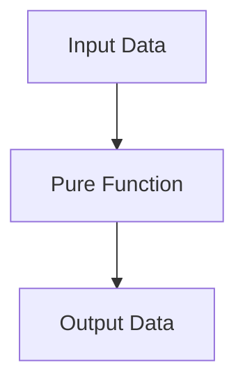

## 25.2 Pure Functions

In the world of programming, especially in functional programming paradigms, the concept of pure functions is fundamental. Pure functions are a cornerstone of writing predictable, testable, and maintainable code. In this section, we will delve into what pure functions are, their characteristics, and why they are essential in JavaScript programming. We will also explore how pure functions differ from impure functions, provide practical examples, and discuss their role in facilitating parallelism.

### What Are Pure Functions?

**Pure functions** are functions that, given the same input, will always return the same output and do not cause any side effects. This definition encapsulates two critical properties:

1. **Deterministic**: A pure function's output is determined solely by its input values, without any hidden state or external dependencies.
2. **Side-Effect-Free**: Pure functions do not alter any state or data outside of their scope. They do not modify global variables, perform I/O operations, or interact with external systems.

These properties make pure functions predictable and reliable, which are highly desirable traits in software development.

### Characteristics of Pure Functions

To better understand pure functions, let's break down their characteristics:

- **No Side Effects**: Pure functions do not change any external state. They do not modify variables outside their scope, perform file operations, or interact with databases or network services.
  
- **Idempotency**: Calling a pure function multiple times with the same arguments will always yield the same result, making them idempotent.

- **Referential Transparency**: Pure functions can be replaced with their output value without changing the program's behavior, a property known as referential transparency.

- **Testability**: Since pure functions depend only on their input parameters, they are easier to test. You can test them in isolation without worrying about the state of the system or other dependencies.

### Why Are Pure Functions Predictable and Easier to Test?

The predictability of pure functions stems from their deterministic nature. Because they always produce the same output for the same input, you can confidently reason about their behavior. This predictability simplifies debugging and testing, as you do not need to account for external state changes or hidden dependencies.

#### Example: Testing a Pure Function

Consider the following pure function that calculates the square of a number:

```javascript
// Pure function: square
function square(x) {
  return x * x;
}

// Testing the pure function
console.log(square(2)); // Output: 4
console.log(square(2)); // Output: 4
console.log(square(3)); // Output: 9
```

In the example above, the `square` function is pure because it always returns the same result for the same input, and it does not modify any external state. Testing this function is straightforward, as you only need to verify its output for given inputs.

### Contrasting Pure and Impure Functions

To appreciate the value of pure functions, it's helpful to contrast them with impure functions. Impure functions may produce different results for the same inputs or cause side effects that alter the program's state or environment.

#### Example: Impure Function

Consider an impure function that modifies a global variable:

```javascript
let counter = 0;

// Impure function: incrementCounter
function incrementCounter() {
  counter++;
  return counter;
}

// Testing the impure function
console.log(incrementCounter()); // Output: 1
console.log(incrementCounter()); // Output: 2
console.log(incrementCounter()); // Output: 3
```

In this example, the `incrementCounter` function is impure because it modifies the global `counter` variable. Each call to the function produces a different result, making it unpredictable and challenging to test in isolation.

### Benefits of Pure Functions

Pure functions offer several advantages that make them a preferred choice in many programming scenarios:

- **Predictability**: As previously mentioned, pure functions are predictable, making them easier to reason about and debug.

- **Testability**: Pure functions are easier to test because they do not depend on external state or cause side effects.

- **Reusability**: Pure functions are self-contained and can be reused in different contexts without concern for unintended interactions with other parts of the program.

- **Parallelism**: Pure functions facilitate parallelism because they do not rely on shared state. This allows for safe concurrent execution, which can improve performance in multi-threaded environments.

### How Pure Functions Facilitate Parallelism

Parallelism involves executing multiple operations simultaneously to improve performance. Pure functions are naturally suited for parallelism because they do not modify shared state or depend on external variables. This independence allows pure functions to be executed concurrently without the risk of race conditions or data corruption.

#### Example: Parallel Execution with Pure Functions

Consider a scenario where you need to apply a pure function to each element of an array. This operation can be parallelized to improve performance:

```javascript
// Pure function: double
function double(x) {
  return x * 2;
}

// Array of numbers
const numbers = [1, 2, 3, 4, 5];

// Parallel execution using map (conceptual example)
const doubledNumbers = numbers.map(double);

console.log(doubledNumbers); // Output: [2, 4, 6, 8, 10]
```

In this example, the `double` function is pure, allowing each element of the `numbers` array to be processed independently and concurrently. While JavaScript's `map` method does not inherently perform parallel execution, the concept illustrates how pure functions can be parallelized.

### Writing Pure Functions

To write pure functions, follow these guidelines:

1. **Avoid External State**: Do not rely on or modify variables outside the function's scope.
2. **Use Parameters and Return Values**: Pass all necessary data as parameters and return results instead of modifying external state.
3. **Avoid Side-Effect Operations**: Refrain from performing I/O operations, modifying global variables, or interacting with external systems within the function.

#### Example: Refactoring an Impure Function to a Pure Function

Let's refactor the impure `incrementCounter` function into a pure function:

```javascript
// Pure function: increment
function increment(value) {
  return value + 1;
}

// Testing the pure function
console.log(increment(0)); // Output: 1
console.log(increment(1)); // Output: 2
console.log(increment(2)); // Output: 3
```

By passing the `value` as a parameter and returning the incremented result, the `increment` function becomes pure. It no longer depends on or modifies external state, making it predictable and testable.

### Encouraging Pure Functions

While it is not always possible or practical to write pure functions exclusively, strive to use them whenever feasible. Pure functions contribute to cleaner, more maintainable code and simplify testing and debugging processes. By adopting a mindset of minimizing side effects and maximizing predictability, you can improve the quality and reliability of your codebase.

### Try It Yourself

To reinforce your understanding of pure functions, try modifying the following impure function to make it pure:

```javascript
let total = 0;

// Impure function: addToTotal
function addToTotal(value) {
  total += value;
  return total;
}

// Modify this function to make it pure
```

**Challenge**: Refactor the `addToTotal` function to be pure by avoiding the use of the `total` variable. Instead, pass the current total as a parameter and return the new total.

### Visualizing Pure Functions

To better understand the concept of pure functions and their interactions, let's visualize the flow of data in a pure function using a flowchart.



**Diagram Description**: This flowchart illustrates the simplicity of pure functions. Input data is passed to the pure function, which processes it and returns the output data. There are no side effects or external state modifications involved.

### References and Further Reading

- [MDN Web Docs: Functions](https://developer.mozilla.org/en-US/docs/Web/JavaScript/Guide/Functions)
- [MDN Web Docs: Pure Functions](https://developer.mozilla.org/en-US/docs/Glossary/Pure_function)
- [W3Schools: JavaScript Functions](https://www.w3schools.com/js/js_functions.asp)

### Knowledge Check

To solidify your understanding of pure functions, consider the following questions:

- What are the two main characteristics of pure functions?
- How do pure functions facilitate parallelism?
- Why are pure functions easier to test compared to impure functions?
- What is referential transparency, and how does it relate to pure functions?

### Embrace the Journey

Remember, mastering pure functions is just one step in your journey to becoming a proficient JavaScript developer. As you continue to explore functional programming concepts, you'll discover new ways to write efficient, maintainable, and reliable code. Keep experimenting, stay curious, and enjoy the process of learning and growing as a developer!

## Quiz Time!



### What is a key characteristic of pure functions?

- [x] They do not cause side effects.
- [ ] They modify global variables.
- [ ] They rely on external state.
- [ ] They perform I/O operations.

> **Explanation:** Pure functions do not cause side effects, meaning they do not modify any external state or variables.

### Why are pure functions easier to test?

- [x] They always produce the same output for the same input.
- [ ] They depend on global variables.
- [ ] They perform network requests.
- [ ] They modify external state.

> **Explanation:** Pure functions are easier to test because they are deterministic, meaning they always produce the same output for the same input.

### How do pure functions facilitate parallelism?

- [x] They do not rely on shared state.
- [ ] They modify global variables.
- [ ] They perform I/O operations.
- [ ] They depend on external systems.

> **Explanation:** Pure functions facilitate parallelism because they do not rely on shared state, allowing them to be executed concurrently without risk of data corruption.

### What is referential transparency?

- [x] The ability to replace a function call with its output value.
- [ ] The ability to modify global variables.
- [ ] The ability to perform I/O operations.
- [ ] The ability to rely on external state.

> **Explanation:** Referential transparency is the property that allows a function call to be replaced with its output value without changing the program's behavior.

### Which of the following is an impure function?

- [ ] A function that returns the square of a number.
- [x] A function that modifies a global counter.
- [ ] A function that adds two numbers.
- [ ] A function that multiplies two numbers.

> **Explanation:** A function that modifies a global counter is impure because it changes external state.

### What is a benefit of using pure functions?

- [x] They are predictable and reliable.
- [ ] They modify global variables.
- [ ] They perform I/O operations.
- [ ] They rely on external state.

> **Explanation:** Pure functions are predictable and reliable because they always produce the same output for the same input.

### How can you refactor an impure function to be pure?

- [x] Avoid using external state and rely on parameters and return values.
- [ ] Modify global variables.
- [ ] Perform I/O operations.
- [ ] Rely on external systems.

> **Explanation:** To refactor an impure function to be pure, avoid using external state and rely on parameters and return values.

### What is idempotency in the context of pure functions?

- [x] The property of producing the same result for the same input.
- [ ] The ability to modify global variables.
- [ ] The ability to perform I/O operations.
- [ ] The ability to rely on external state.

> **Explanation:** Idempotency in the context of pure functions refers to the property of producing the same result for the same input.

### Why should you strive to write pure functions when possible?

- [x] They contribute to cleaner, more maintainable code.
- [ ] They modify global variables.
- [ ] They perform I/O operations.
- [ ] They rely on external state.

> **Explanation:** Writing pure functions contributes to cleaner, more maintainable code by minimizing side effects and maximizing predictability.

### Pure functions can be replaced with their output value without changing the program's behavior. True or False?

- [x] True
- [ ] False

> **Explanation:** Pure functions can be replaced with their output value without changing the program's behavior, a property known as referential transparency.




