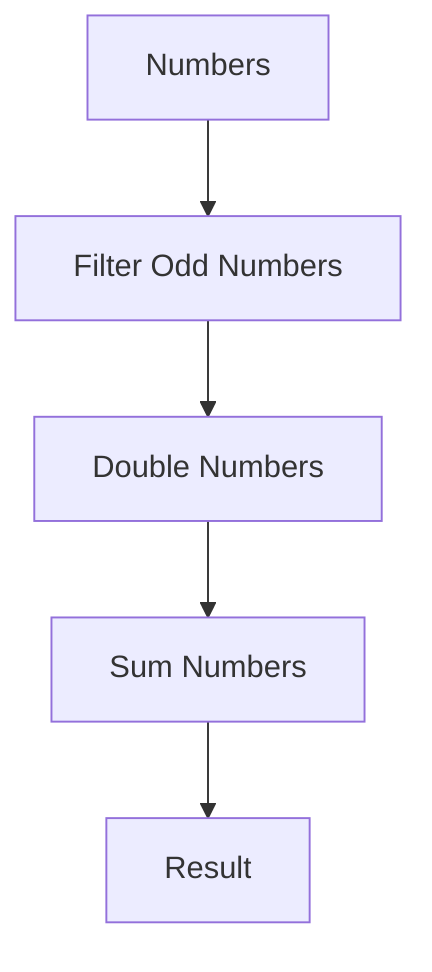

## 25.3 Function Composition in Depth

### Introduction to Function Composition

Function composition is a powerful concept in functional programming that allows us to build complex operations by combining simpler functions. Imagine it as a way to connect small building blocks to create a larger structure. In JavaScript, function composition can lead to more readable, maintainable, and reusable code. Let's embark on a journey to understand how we can leverage function composition to enhance our programming skills.

### The Basics of Function Composition

At its core, function composition is about taking two or more functions and combining them into a single function. The output of one function becomes the input of the next. This is similar to how a factory assembly line works, where each station performs a specific task, and the product moves from one station to the next until it's complete.

#### Simple Example of Function Composition

Let's start with a simple example. Suppose we have two functions: one that doubles a number and another that adds five to a number. We want to create a new function that first doubles a number and then adds five to the result.

```javascript
function double(x) {
  return x * 2;
}

function addFive(x) {
  return x + 5;
}

// Composing functions manually
function doubleThenAddFive(x) {
  return addFive(double(x));
}

console.log(doubleThenAddFive(10)); // Output: 25
```

In this example, we manually composed the `double` and `addFive` functions to create `doubleThenAddFive`. The `double` function is called first, and its result is passed to `addFive`.

### Associativity and Order in Function Composition

When composing functions, the order in which functions are applied is crucial. Function composition is associative, meaning that the grouping of operations does not affect the result, but the order does.

#### Associativity Example

Consider three functions: `f`, `g`, and `h`. The composition of these functions can be represented as:

- `f(g(h(x)))` or
- `(f ∘ g ∘ h)(x)`

The associativity property ensures that `(f ∘ g) ∘ h` is equivalent to `f ∘ (g ∘ h)`. However, the order of application remains from right to left, meaning `h` is applied first, then `g`, and finally `f`.

### Practical Examples Using Function Composition

Function composition is especially useful in scenarios where we need to process data through a series of transformations. Let's explore a practical example involving data pipelines.

#### Data Pipeline Example

Suppose we have an array of numbers, and we want to perform the following operations:

1. Filter out odd numbers.
2. Double the remaining numbers.
3. Sum the doubled numbers.

We can achieve this using function composition:

```javascript
const numbers = [1, 2, 3, 4, 5, 6];

// Function to filter out odd numbers
function filterOddNumbers(arr) {
  return arr.filter(num => num % 2 === 0);
}

// Function to double numbers
function doubleNumbers(arr) {
  return arr.map(num => num * 2);
}

// Function to sum numbers
function sumNumbers(arr) {
  return arr.reduce((acc, num) => acc + num, 0);
}

// Composing the functions
function processNumbers(arr) {
  return sumNumbers(doubleNumbers(filterOddNumbers(arr)));
}

console.log(processNumbers(numbers)); // Output: 24
```

In this example, we composed three functions to create a data pipeline that processes an array of numbers. Each function performs a specific task, and the output of one function is passed to the next.

### Using Compose and Pipe Functions from Libraries

While manual function composition works well for simple cases, it can become cumbersome for more complex operations. Fortunately, there are libraries like [Ramda](https://ramdajs.com/) and [Lodash](https://lodash.com/) that provide utility functions for function composition.

#### Compose Function

The `compose` function allows us to compose functions from right to left. Let's see how we can use it with Ramda:

```javascript
const R = require('ramda');

const processNumbers = R.compose(
  sumNumbers,
  doubleNumbers,
  filterOddNumbers
);

console.log(processNumbers(numbers)); // Output: 24
```

In this example, we used Ramda's `compose` function to create a composed function that processes numbers. The functions are applied from right to left, maintaining the natural order of operations.

#### Pipe Function

The `pipe` function is similar to `compose`, but it applies functions from left to right. This can be more intuitive in some cases:

```javascript
const processNumbers = R.pipe(
  filterOddNumbers,
  doubleNumbers,
  sumNumbers
);

console.log(processNumbers(numbers)); // Output: 24
```

Using `pipe`, we achieve the same result, but the functions are applied in the order they are listed, which can improve code readability.

### Emphasizing Code Readability and Maintainability

Function composition not only makes our code more concise but also enhances readability and maintainability. By breaking down complex operations into smaller, reusable functions, we can better understand and manage our codebase.

#### Benefits of Function Composition

- **Reusability**: Smaller functions can be reused in different parts of the application, reducing code duplication.
- **Readability**: Composed functions provide a clear and concise representation of the overall operation.
- **Maintainability**: Changes to individual functions are easier to manage and test without affecting the entire system.

### Try It Yourself

Now that we've explored function composition, let's try modifying the examples to deepen our understanding:

- **Experiment with Different Functions**: Create additional functions, such as one that squares numbers, and include them in the composition.
- **Change the Order of Functions**: Swap the order of functions in the composition and observe how it affects the result.
- **Use Different Libraries**: Explore other libraries like Lodash and see how they implement function composition.

### Visualizing Function Composition

To help visualize function composition, let's use a flowchart to represent the data pipeline example:



This flowchart illustrates the flow of data through the composed functions, starting with the array of numbers and ending with the final result.

### References and Further Reading

- [MDN Web Docs: Functions](https://developer.mozilla.org/en-US/docs/Web/JavaScript/Guide/Functions)
- [Ramda Documentation](https://ramdajs.com/docs/)
- [Lodash Documentation](https://lodash.com/docs/)

### Knowledge Check

- **What is function composition, and why is it useful?**
- **How does the order of functions affect the result in function composition?**
- **What are the benefits of using libraries like Ramda and Lodash for function composition?**

### Embrace the Journey

Remember, mastering function composition is a journey. As you practice and experiment with different compositions, you'll gain a deeper understanding of how to build complex operations from simple functions. Keep exploring, stay curious, and enjoy the process!

---

## Quiz Time!



### What is function composition?

- [x] Combining smaller functions into a larger one
- [ ] Breaking down a large function into smaller parts
- [ ] Writing functions without parameters
- [ ] Using only built-in functions

> **Explanation:** Function composition involves combining smaller functions to create a larger, more complex function.

### Which library provides the `compose` function?

- [x] Ramda
- [ ] jQuery
- [ ] Angular
- [ ] React

> **Explanation:** Ramda is a library that provides the `compose` function for function composition.

### What does the `pipe` function do?

- [x] Applies functions from left to right
- [ ] Applies functions from right to left
- [ ] Reverses the order of functions
- [ ] Filters out odd numbers

> **Explanation:** The `pipe` function applies functions in the order they are listed, from left to right.

### What is the output of the composed function in the data pipeline example?

- [x] 24
- [ ] 12
- [ ] 30
- [ ] 18

> **Explanation:** The composed function filters out odd numbers, doubles the remaining numbers, and sums them, resulting in 24.

### Why is function composition beneficial?

- [x] Increases code readability
- [x] Enhances code maintainability
- [ ] Decreases code performance
- [ ] Makes code harder to understand

> **Explanation:** Function composition improves readability and maintainability by breaking down complex operations into smaller, manageable functions.

### What is associativity in function composition?

- [x] Grouping of operations does not affect the result
- [ ] Functions must be applied in alphabetical order
- [ ] Functions must be applied in reverse order
- [ ] Functions cannot be nested

> **Explanation:** Associativity means that the way functions are grouped does not affect the outcome, but the order of application does.

### How can function composition improve code reusability?

- [x] By creating smaller, reusable functions
- [ ] By writing longer functions
- [ ] By using only global variables
- [ ] By avoiding function parameters

> **Explanation:** Smaller functions can be reused in different parts of the application, enhancing code reusability.

### What is the main difference between `compose` and `pipe`?

- [x] The order in which functions are applied
- [ ] The number of functions they can compose
- [ ] The type of data they process
- [ ] The programming language they are used in

> **Explanation:** `compose` applies functions from right to left, while `pipe` applies them from left to right.

### What is the purpose of using libraries like Ramda?

- [x] To simplify function composition
- [ ] To increase code complexity
- [ ] To replace built-in JavaScript functions
- [ ] To write code without functions

> **Explanation:** Libraries like Ramda provide utility functions that simplify the process of function composition.

### True or False: Function composition is only useful in functional programming.

- [ ] True
- [x] False

> **Explanation:** While function composition is a key concept in functional programming, it is useful in any programming paradigm that benefits from modular and reusable code.




