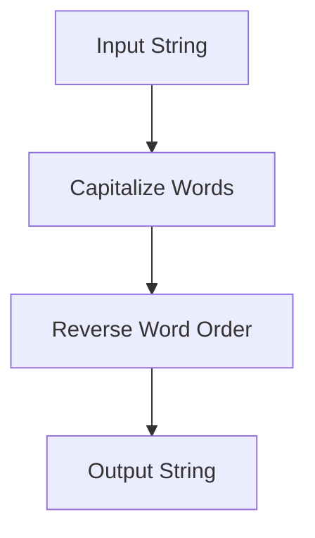

## 25.5 Functional Programming Libraries

Functional programming is a paradigm that treats computation as the evaluation of mathematical functions and avoids changing state or mutable data. In JavaScript, functional programming can be greatly enhanced by using libraries that provide a suite of utilities and functions designed to make functional programming easier and more intuitive. Two of the most popular libraries for this purpose are **Lodash** and **Ramda**. In this section, we will explore these libraries, their key features, and how they can be used to improve your JavaScript code.

### Introduction to Functional Programming Libraries

Functional programming libraries in JavaScript provide a collection of functions that help developers write cleaner, more efficient, and more readable code. These libraries abstract common patterns and operations, allowing developers to focus on the logic of their applications rather than the intricacies of implementation.

#### Key Benefits of Using Functional Programming Libraries

- **Code Reusability**: Libraries offer reusable functions that can be applied across different parts of your application.
- **Improved Readability**: Functional utilities often result in code that is easier to read and understand.
- **Reduced Errors**: By using well-tested library functions, you minimize the risk of introducing bugs.
- **Enhanced Productivity**: Libraries speed up development by providing ready-made solutions to common problems.

### Lodash: A Comprehensive Utility Library

Lodash is a modern JavaScript utility library that delivers modularity, performance, and extras. It is widely used for its extensive collection of functions that simplify working with arrays, numbers, objects, strings, and more.

#### Key Features of Lodash

- **Array Manipulation**: Functions like `_.map`, `_.filter`, and `_.reduce` make it easy to work with arrays.
- **Object Utilities**: Lodash provides functions like `_.merge`, `_.cloneDeep`, and `_.assign` for handling objects.
- **String Operations**: Functions such as `_.camelCase`, `_.capitalize`, and `_.trim` help in string manipulation.
- **Function Utilities**: Lodash includes utilities like `_.debounce`, `_.throttle`, and `_.once` for function control.

#### Example: Using Lodash for Array Manipulation

Let's look at how Lodash can simplify array operations:

```javascript
// Import Lodash
const _ = require('lodash');

// Original array
const numbers = [1, 2, 3, 4, 5];

// Use Lodash to double each number
const doubled = _.map(numbers, (num) => num * 2);

console.log(doubled); // Output: [2, 4, 6, 8, 10]
```

In this example, we use Lodash's `_.map` function to iterate over an array and apply a transformation to each element. This is a more concise and readable way to perform the operation compared to using a traditional `for` loop.

#### Lodash Documentation

To explore Lodash further, visit the [Lodash Documentation](https://lodash.com/docs/). The documentation provides detailed information on each function, including examples and use cases.

### Ramda: A Functional Programming Library

Ramda is another popular JavaScript library that focuses on functional programming. It emphasizes immutability and side-effect-free functions, making it a great choice for developers looking to write pure functional code.

#### Key Features of Ramda

- **Immutability**: Ramda functions do not mutate the data they operate on.
- **Currying**: Most Ramda functions are automatically curried, allowing for partial application of arguments.
- **Composition**: Ramda provides utilities for function composition, such as `R.compose` and `R.pipe`.
- **Data Transformation**: Functions like `R.map`, `R.filter`, and `R.reduce` are available for transforming data.

#### Example: Using Ramda for Function Composition

Let's see how Ramda can be used to compose functions:

```javascript
// Import Ramda
const R = require('ramda');

// Define simple functions
const add = (a, b) => a + b;
const multiply = (a, b) => a * b;

// Compose a new function
const addAndMultiply = R.compose(
  R.curry(multiply)(2), // Multiply by 2
  R.curry(add)(3)       // Add 3
);

console.log(addAndMultiply(5)); // Output: 16
```

In this example, we use Ramda's `R.compose` to create a new function that first adds 3 to its input and then multiplies the result by 2. The use of currying allows us to partially apply arguments to the functions.

#### Ramda Documentation

For more information on Ramda, visit the [Ramda Documentation](https://ramdajs.com/docs/). The documentation provides comprehensive details on the library's functions and their applications.

### Comparing Lodash and Ramda

While both Lodash and Ramda offer powerful utilities for functional programming, they have different philosophies and use cases:

- **Lodash**: Focuses on providing a wide range of utilities for various data types and operations. It is more versatile and can be used in both functional and non-functional programming styles.
- **Ramda**: Emphasizes pure functional programming with a focus on immutability and function composition. It is ideal for developers who want to adhere strictly to functional programming principles.

### Practical Examples

Let's explore some practical examples of using Lodash and Ramda in real-world scenarios.

#### Example 1: Data Transformation with Lodash

Suppose we have an array of user objects, and we want to extract the names of users who are active:

```javascript
// Import Lodash
const _ = require('lodash');

// Array of user objects
const users = [
  { name: 'Alice', active: true },
  { name: 'Bob', active: false },
  { name: 'Charlie', active: true }
];

// Use Lodash to filter and map
const activeUserNames = _(users)
  .filter({ active: true })
  .map('name')
  .value();

console.log(activeUserNames); // Output: ['Alice', 'Charlie']
```

In this example, we use Lodash's `_.filter` and `_.map` functions to filter the array and extract the names of active users. The `_.value()` method is used to execute the chained operations.

#### Example 2: Function Composition with Ramda

Let's create a function that transforms a string by capitalizing it and then reversing the order of words:

```javascript
// Import Ramda
const R = require('ramda');

// Define helper functions
const capitalize = R.compose(R.join(' '), R.map(R.toUpper), R.split(' '));
const reverseWords = R.compose(R.join(' '), R.reverse, R.split(' '));

// Compose the final function
const transformString = R.compose(reverseWords, capitalize);

console.log(transformString('hello world')); // Output: 'WORLD HELLO'
```

In this example, we use Ramda's `R.compose` to create a function that capitalizes a string and then reverses the order of words. The use of composition makes the code modular and easy to understand.

### Encouraging Exploration

Both Lodash and Ramda offer extensive documentation and community support. We encourage you to explore their documentation to discover more functions and utilities that can enhance your JavaScript development:

- [Lodash Documentation](https://lodash.com/docs/)
- [Ramda Documentation](https://ramdajs.com/docs/)

### Try It Yourself

Experiment with the examples provided in this section. Try modifying the code to perform different operations or use other functions from Lodash and Ramda. This hands-on practice will help solidify your understanding of functional programming libraries.

### Visualizing Function Composition

To better understand function composition, let's visualize the process using a flowchart:



**Diagram Description**: This flowchart represents the process of transforming a string by first capitalizing each word and then reversing the order of words. The input string flows through two functions, resulting in the final output.

### Knowledge Check

Before we conclude, let's review some key concepts:

- What are the benefits of using functional programming libraries?
- How do Lodash and Ramda differ in their approach to functional programming?
- What is function composition, and how can it be achieved using Ramda?

### Conclusion

Functional programming libraries like Lodash and Ramda provide powerful tools for writing clean, efficient, and maintainable JavaScript code. By leveraging these libraries, you can focus on solving problems rather than dealing with low-level implementation details. Remember, this is just the beginning of your journey into functional programming. Keep exploring, stay curious, and enjoy the process of mastering JavaScript!

## Quiz Time!



### What is a key benefit of using functional programming libraries?

- [x] Improved code readability
- [ ] Increased code complexity
- [ ] Reduced code reusability
- [ ] Slower development process

> **Explanation:** Functional programming libraries improve code readability by providing well-tested, reusable functions that abstract common operations.

### Which library emphasizes immutability and function composition?

- [ ] Lodash
- [x] Ramda
- [ ] jQuery
- [ ] Axios

> **Explanation:** Ramda emphasizes immutability and function composition, making it ideal for developers who want to adhere strictly to functional programming principles.

### What Lodash function is used to iterate over an array and apply a transformation?

- [ ] _.filter
- [x] _.map
- [ ] _.reduce
- [ ] _.assign

> **Explanation:** The `_.map` function in Lodash is used to iterate over an array and apply a transformation to each element.

### How does Ramda handle function arguments?

- [ ] By mutating them
- [ ] By ignoring them
- [x] By currying them
- [ ] By reversing them

> **Explanation:** Ramda handles function arguments by currying them, allowing for partial application of arguments.

### What is the output of the following Ramda code: `R.compose(R.toUpper, R.reverse)('hello')`?

- [ ] 'OLLEH'
- [ ] 'HELLO'
- [x] 'OLLEH'
- [ ] 'hello'

> **Explanation:** The function `R.compose(R.toUpper, R.reverse)` first reverses the string and then converts it to uppercase, resulting in 'OLLEH'.

### Which Lodash function is used to merge two objects?

- [ ] _.map
- [ ] _.filter
- [x] _.merge
- [ ] _.trim

> **Explanation:** The `_.merge` function in Lodash is used to merge two objects, combining their properties.

### What is the primary focus of Lodash?

- [ ] Pure functional programming
- [x] Providing a wide range of utilities
- [ ] Asynchronous programming
- [ ] DOM manipulation

> **Explanation:** Lodash focuses on providing a wide range of utilities for various data types and operations, making it versatile for different programming styles.

### How can you explore more functions offered by Lodash and Ramda?

- [x] By visiting their documentation
- [ ] By reading unrelated books
- [ ] By using only trial and error
- [ ] By avoiding their use

> **Explanation:** Visiting the documentation of Lodash and Ramda provides comprehensive details on their functions and applications.

### What is a common use case for function composition in Ramda?

- [ ] Modifying global variables
- [x] Creating modular and easy-to-understand code
- [ ] Increasing code complexity
- [ ] Reducing code readability

> **Explanation:** Function composition in Ramda is commonly used to create modular and easy-to-understand code by combining simple functions into more complex ones.

### True or False: Lodash and Ramda can be used together in a single project.

- [x] True
- [ ] False

> **Explanation:** Lodash and Ramda can be used together in a single project, allowing developers to leverage the strengths of both libraries for different tasks.


