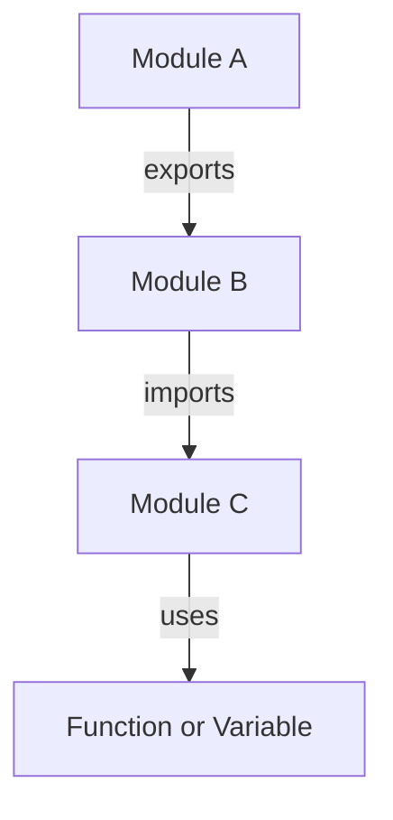

## 26.1 Introduction to Modules

In the world of programming, organizing code efficiently is crucial for maintaining readability, scalability, and ease of debugging. JavaScript, being a versatile and widely-used language, offers various ways to structure code. One of the most effective methods is through the use of modules. In this section, we will explore what modules are, why they are used, and how they help in overcoming the limitations of the global scope. We will also delve into module patterns before the advent of ES6 and highlight the benefits of modular code design.

### What Are Modules?

Modules are self-contained units of code that encapsulate functionality, allowing developers to divide their programs into manageable pieces. Each module can contain variables, functions, classes, or any other JavaScript code. The primary purpose of modules is to organize code in a way that promotes reusability, maintainability, and separation of concerns.

#### Why Use Modules?

Modules are used to:

- **Encapsulate Code**: By encapsulating code within modules, we can prevent variables and functions from polluting the global scope. This reduces the risk of naming conflicts and makes code easier to manage.
- **Promote Reusability**: Modules allow developers to reuse code across different parts of an application or even in different projects.
- **Enhance Maintainability**: With modules, code is organized into logical units, making it easier to understand, modify, and debug.
- **Improve Collaboration**: In a team setting, modules enable developers to work on different parts of a codebase simultaneously without interfering with each other's work.

### The Limitations of the Global Scope

In JavaScript, the global scope is the outermost scope where variables and functions are accessible from anywhere in the code. While this might seem convenient, it can lead to several issues:

- **Naming Conflicts**: When multiple scripts are loaded, they might define variables or functions with the same name, leading to conflicts and unexpected behavior.
- **Difficult Debugging**: With many variables and functions in the global scope, it becomes challenging to track down bugs and understand how different parts of the code interact.
- **Security Risks**: Exposing too much information in the global scope can lead to security vulnerabilities, as malicious scripts can access and manipulate global variables.

Modules address these limitations by providing a way to encapsulate code and control its visibility.

### Module Patterns Before ES6

Before the introduction of ES6 (ECMAScript 2015), JavaScript developers used various patterns to simulate modularity. Let's explore some of these patterns:

#### 1. The Module Pattern

The Module Pattern is a design pattern used to create modules with private and public components. It relies on closures to encapsulate private data and expose public methods.

```javascript
// Module Pattern Example
var myModule = (function() {
    // Private variable
    var privateVar = 'I am private';

    // Private function
    function privateFunc() {
        console.log(privateVar);
    }

    // Public API
    return {
        publicMethod: function() {
            privateFunc();
        }
    };
})();

// Using the module
myModule.publicMethod(); // Output: I am private
```

In this example, `privateVar` and `privateFunc` are not accessible from outside the module, ensuring encapsulation.

#### 2. The Revealing Module Pattern

The Revealing Module Pattern is a variation of the Module Pattern that explicitly defines which variables and functions are exposed to the outside world.

```javascript
// Revealing Module Pattern Example
var myRevealingModule = (function() {
    var privateVar = 'I am private';

    function privateFunc() {
        console.log(privateVar);
    }

    function publicMethod() {
        privateFunc();
    }

    // Reveal public pointers to private functions and variables
    return {
        publicMethod: publicMethod
    };
})();

// Using the module
myRevealingModule.publicMethod(); // Output: I am private
```

This pattern improves readability by clearly indicating which parts of the module are public.

#### 3. CommonJS

CommonJS is a module format used primarily in Node.js. It uses `require` to import modules and `module.exports` to export them.

```javascript
// myModule.js
var myModule = {
    greet: function(name) {
        console.log('Hello, ' + name);
    }
};

module.exports = myModule;

// main.js
var myModule = require('./myModule');
myModule.greet('World'); // Output: Hello, World
```

CommonJS modules are synchronous and work well in server-side environments.

#### 4. AMD (Asynchronous Module Definition)

AMD is a module format designed for asynchronous loading, commonly used in browser environments.

```javascript
// Define a module using AMD
define('myModule', [], function() {
    return {
        greet: function(name) {
            console.log('Hello, ' + name);
        }
    };
});

// Load the module
require(['myModule'], function(myModule) {
    myModule.greet('World'); // Output: Hello, World
});
```

AMD modules are loaded asynchronously, making them suitable for web applications.

### Benefits of Modular Code Design

Modular code design offers several advantages:

- **Scalability**: As applications grow, modular code can be easily extended by adding new modules without affecting existing functionality.
- **Testability**: Modules can be tested independently, making it easier to write unit tests and ensure code quality.
- **Separation of Concerns**: By dividing code into modules, each module can focus on a specific aspect of the application, leading to cleaner and more organized code.
- **Reduced Complexity**: Modules break down complex applications into smaller, more manageable pieces, simplifying development and maintenance.

### Preparing for ES6 Module Syntax

With the introduction of ES6, JavaScript gained native support for modules, providing a standardized way to import and export code. This new syntax offers several improvements over previous patterns:

- **Static Analysis**: ES6 modules can be statically analyzed, allowing tools to optimize code and detect errors at compile time.
- **Improved Performance**: ES6 modules are loaded asynchronously, improving performance in web applications.
- **Better Compatibility**: ES6 modules are supported by modern browsers and can be transpiled for older environments using tools like Babel.

Let's take a look at the basic syntax for ES6 modules:

#### Exporting from a Module

In ES6, you can export variables, functions, or classes from a module using the `export` keyword.

```javascript
// math.js
export const pi = 3.14159;

export function add(a, b) {
    return a + b;
}

export class Circle {
    constructor(radius) {
        this.radius = radius;
    }

    area() {
        return pi * this.radius * this.radius;
    }
}
```

#### Importing into a Module

To use the exported components in another module, you use the `import` keyword.

```javascript
// main.js
import { pi, add, Circle } from './math';

console.log('Value of pi:', pi); // Output: Value of pi: 3.14159
console.log('Sum:', add(2, 3)); // Output: Sum: 5

const circle = new Circle(5);
console.log('Area of circle:', circle.area()); // Output: Area of circle: 78.53975
```

#### Default Exports

ES6 modules also support default exports, which allow you to export a single value or component as the default export.

```javascript
// greet.js
export default function greet(name) {
    console.log('Hello, ' + name);
}

// main.js
import greet from './greet';

greet('World'); // Output: Hello, World
```

Default exports are useful when a module has a single primary functionality.

### Visualizing Module Interaction

To better understand how modules interact with each other, let's visualize the process using a diagram.



**Caption**: This diagram illustrates how modules can export and import functionality, creating a network of interconnected components.

### Try It Yourself

Now that we've covered the basics of modules, try experimenting with the code examples provided. Modify the functions, add new exports, or create your own modules to see how they interact. This hands-on practice will help solidify your understanding of modular code design.

### References and Links

For further reading on JavaScript modules, consider exploring the following resources:

- [MDN Web Docs - Modules](https://developer.mozilla.org/en-US/docs/Web/JavaScript/Guide/Modules)
- [W3Schools - JavaScript Modules](https://www.w3schools.com/js/js_modules.asp)
- [Node.js - Modules](https://nodejs.org/api/modules.html)

### Knowledge Check

As you progress through this section, consider the following questions to test your understanding:

- What are the main benefits of using modules in JavaScript?
- How do modules help address the limitations of the global scope?
- What are some common module patterns used before ES6?
- How do ES6 modules improve code organization and performance?

### Embrace the Journey

Remember, learning about modules is just the beginning of your journey in mastering JavaScript. As you continue to explore more advanced topics, you'll discover new ways to leverage modules for building complex and efficient applications. Keep experimenting, stay curious, and enjoy the journey!

## Quiz Time!



### What is the primary purpose of using modules in JavaScript?

- [x] To organize code into manageable pieces
- [ ] To increase the execution speed of JavaScript
- [ ] To replace functions in JavaScript
- [ ] To eliminate the need for variables

> **Explanation:** Modules help organize code into self-contained units, promoting reusability, maintainability, and separation of concerns.

### Which of the following is a limitation of the global scope that modules address?

- [x] Naming conflicts
- [ ] Faster execution
- [ ] Increased memory usage
- [ ] Simplified syntax

> **Explanation:** The global scope can lead to naming conflicts, which modules help prevent by encapsulating code.

### What is the Module Pattern used for?

- [x] To create modules with private and public components
- [ ] To define asynchronous functions
- [ ] To improve the performance of loops
- [ ] To simplify variable declarations

> **Explanation:** The Module Pattern uses closures to encapsulate private data and expose public methods.

### How do ES6 modules improve performance?

- [x] By loading modules asynchronously
- [ ] By reducing the number of variables
- [ ] By simplifying syntax
- [ ] By increasing the size of the codebase

> **Explanation:** ES6 modules are loaded asynchronously, which can improve performance in web applications.

### What is the difference between CommonJS and AMD?

- [x] CommonJS is synchronous, while AMD is asynchronous
- [ ] CommonJS is asynchronous, while AMD is synchronous
- [ ] Both are synchronous
- [ ] Both are asynchronous

> **Explanation:** CommonJS modules are synchronous, suitable for server-side environments, while AMD modules are asynchronous, designed for browser environments.

### What keyword is used to export a variable or function in ES6 modules?

- [x] export
- [ ] import
- [ ] module
- [ ] require

> **Explanation:** The `export` keyword is used to make variables or functions available for import in other modules.

### What is a default export in ES6 modules?

- [x] A single primary export from a module
- [ ] An export that cannot be imported
- [ ] A secondary export from a module
- [ ] An export that is automatically imported

> **Explanation:** A default export allows a module to export a single primary value or component.

### How can you import a default export in ES6?

- [x] Using the `import` keyword without curly braces
- [ ] Using the `require` keyword
- [ ] Using the `export` keyword
- [ ] Using the `module` keyword

> **Explanation:** Default exports are imported using the `import` keyword without curly braces.

### Which of the following is a benefit of modular code design?

- [x] Scalability
- [ ] Increased complexity
- [ ] Reduced readability
- [ ] Limited reusability

> **Explanation:** Modular code design enhances scalability, allowing applications to grow without affecting existing functionality.

### True or False: ES6 modules can be statically analyzed.

- [x] True
- [ ] False

> **Explanation:** ES6 modules can be statically analyzed, allowing tools to optimize code and detect errors at compile time.




