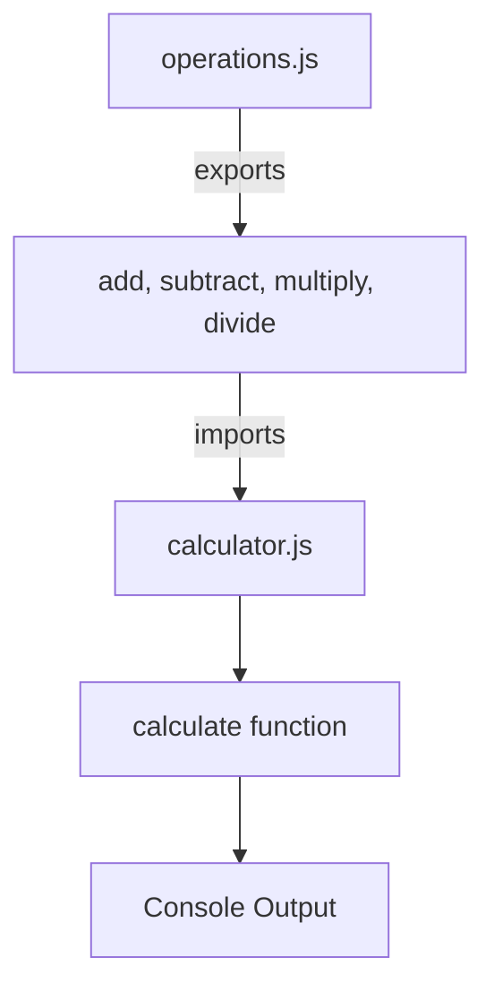

## 26.2 Exporting and Importing Functions

In modern JavaScript development, organizing code into modules is essential for maintaining clean, manageable, and scalable applications. Modules allow us to break down complex programs into smaller, reusable pieces. In this section, we will explore how to export and import functions using ES6 module syntax, which is now a standard part of JavaScript.

### Understanding JavaScript Modules

Modules are self-contained units of code that can be reused across different parts of an application. They help in encapsulating functionality, making code more maintainable and easier to understand. In JavaScript, modules can export certain values, functions, or objects, which can then be imported and used in other modules.

#### Why Use Modules?

- **Encapsulation**: Modules encapsulate code, reducing the risk of name conflicts.
- **Reusability**: Functions and variables can be reused across different parts of an application.
- **Maintainability**: Code is easier to maintain when it's organized into logical units.
- **Scalability**: Modules allow applications to scale by adding new features without affecting existing code.

### Exporting Functions

Exporting functions from a module allows them to be used in other modules. There are two primary ways to export functions in JavaScript: named exports and default exports.

#### Named Exports

Named exports allow you to export multiple functions, variables, or objects from a module. Each exported entity must be explicitly named.

**Syntax**:
```javascript
// myModule.js

// Named export of a function
export function greet(name) {
  return `Hello, ${name}!`;
}

// Named export of a variable
export const PI = 3.14159;
```

In the example above, we have a module `myModule.js` that exports a function `greet` and a constant `PI`. These can be imported individually by their names.

#### Default Exports

A default export allows a module to export a single value or function. This is useful when a module is designed to export one primary thing.

**Syntax**:
```javascript
// mathOperations.js

// Default export of a function
export default function add(a, b) {
  return a + b;
}
```

Here, `mathOperations.js` exports a default function `add`. A module can have only one default export.

### Importing Functions

Once functions are exported from a module, they can be imported into other modules using the `import` statement.

#### Importing Named Exports

To import named exports, you must use the exact names of the exported entities.

**Syntax**:
```javascript
// main.js

// Importing named exports
import { greet, PI } from './myModule.js';

console.log(greet('Alice')); // Output: Hello, Alice!
console.log(PI); // Output: 3.14159
```

In this example, we import the `greet` function and `PI` constant from `myModule.js` into `main.js`.

#### Importing Default Exports

Default exports can be imported with any name, as they are the primary export of the module.

**Syntax**:
```javascript
// app.js

// Importing a default export
import add from './mathOperations.js';

console.log(add(5, 3)); // Output: 8
```

Here, the `add` function is imported from `mathOperations.js` and can be used directly.

### Combining Named and Default Exports

A module can have both named and default exports. You can import them together as needed.

**Example**:
```javascript
// utilities.js

// Named export
export function subtract(a, b) {
  return a - b;
}

// Default export
export default function multiply(a, b) {
  return a * b;
}

// app.js

// Importing both named and default exports
import multiply, { subtract } from './utilities.js';

console.log(multiply(4, 2)); // Output: 8
console.log(subtract(10, 5)); // Output: 5
```

### Module Scope and Encapsulation

Modules in JavaScript have their own scope. Variables and functions declared within a module are not accessible outside unless they are exported. This encapsulation helps prevent naming conflicts and keeps the global namespace clean.

#### Example of Module Scope

```javascript
// scopedModule.js

// This variable is private to the module
const privateVariable = 'I am private';

// This function is also private
function privateFunction() {
  console.log('This is a private function');
}

// Exported function
export function publicFunction() {
  console.log('This is a public function');
}
```

In `scopedModule.js`, `privateVariable` and `privateFunction` are not accessible outside the module, while `publicFunction` is exported and can be used in other modules.

### Practical Example: Building a Simple Calculator

Let's build a simple calculator using modules to demonstrate exporting and importing functions.

**Step 1: Create a Module for Basic Operations**

```javascript
// operations.js

// Named exports for basic operations
export function add(a, b) {
  return a + b;
}

export function subtract(a, b) {
  return a - b;
}

export function multiply(a, b) {
  return a * b;
}

export function divide(a, b) {
  if (b === 0) {
    throw new Error('Cannot divide by zero');
  }
  return a / b;
}
```

**Step 2: Create a Main Module to Use the Operations**

```javascript
// calculator.js

// Importing named exports from operations.js
import { add, subtract, multiply, divide } from './operations.js';

function calculate() {
  console.log('Addition:', add(10, 5)); // Output: 15
  console.log('Subtraction:', subtract(10, 5)); // Output: 5
  console.log('Multiplication:', multiply(10, 5)); // Output: 50
  console.log('Division:', divide(10, 5)); // Output: 2
}

calculate();
```

### Considerations for Module Scope and Encapsulation

When working with modules, it's important to consider how functions and variables are scoped and encapsulated. Here are some key points to keep in mind:

- **Private Members**: Use module scope to keep certain functions or variables private to the module.
- **Public API**: Only export functions and variables that are intended to be used by other modules.
- **Avoid Global Variables**: Modules help avoid polluting the global namespace, reducing the risk of conflicts.
- **Consistent Naming**: Use consistent naming conventions for exports to improve readability and maintainability.

### Try It Yourself

Experiment with exporting and importing functions by creating your own modules. Try the following:

1. **Create a Module**: Write a module that exports a few utility functions, such as `capitalize` and `reverseString`.
2. **Import and Use**: Create another module that imports these functions and uses them to process strings.
3. **Modify and Extend**: Add more functions to your utility module and see how easily they can be integrated into your main module.

### Visualizing Module Interaction

To better understand how modules interact, let's visualize the flow of exporting and importing functions using a diagram.



**Diagram Description**: This diagram shows the `operations.js` module exporting functions, which are then imported into `calculator.js`. The `calculate` function in `calculator.js` uses these imported functions to produce console output.

### References and Links

For further reading and deeper understanding, consider exploring the following resources:

- [MDN Web Docs on Modules](https://developer.mozilla.org/en-US/docs/Web/JavaScript/Guide/Modules)
- [JavaScript.info on Modules](https://javascript.info/modules)
- [W3Schools JavaScript Modules](https://www.w3schools.com/js/js_modules.asp)

### Knowledge Check

Before we wrap up, let's test your understanding of exporting and importing functions with a few questions:

1. **What is the primary purpose of using modules in JavaScript?**
2. **How do named exports differ from default exports?**
3. **Can a module have both named and default exports?**
4. **What is the benefit of module scope?**

### Embrace the Journey

Remember, mastering modules and understanding how to export and import functions is a crucial step in becoming proficient in JavaScript. As you continue to explore and experiment, you'll find that modules greatly enhance the structure and maintainability of your code. Keep practicing, stay curious, and enjoy the journey of learning JavaScript!

## Quiz Time!



### What is the primary purpose of using modules in JavaScript?

- [x] To encapsulate code and avoid naming conflicts
- [ ] To increase the execution speed of JavaScript
- [ ] To make JavaScript code compatible with other programming languages
- [ ] To automatically optimize code for production

> **Explanation:** Modules encapsulate code, reducing the risk of naming conflicts and improving maintainability.

### How do named exports differ from default exports?

- [x] Named exports allow multiple exports per module, while default exports allow only one
- [ ] Named exports are faster to execute than default exports
- [ ] Default exports can only export functions, not variables
- [ ] Named exports require a specific import syntax, while default exports do not

> **Explanation:** Named exports allow multiple exports per module, while default exports are limited to one per module.

### Can a module have both named and default exports?

- [x] Yes
- [ ] No

> **Explanation:** A module can have both named and default exports, allowing flexibility in how functions and variables are exported.

### What is the benefit of module scope?

- [x] It prevents global namespace pollution
- [ ] It increases the speed of JavaScript execution
- [ ] It allows JavaScript to run on the server
- [ ] It automatically minifies code

> **Explanation:** Module scope prevents global namespace pollution, reducing the risk of conflicts and improving code organization.

### Which statement correctly imports a default export?

- [x] `import myFunction from './module.js';`
- [ ] `import { myFunction } from './module.js';`
- [ ] `import * as myFunction from './module.js';`
- [ ] `import default myFunction from './module.js';`

> **Explanation:** The correct syntax for importing a default export is `import myFunction from './module.js';`.

### What happens if you try to import a named export that doesn't exist in the module?

- [x] An error is thrown
- [ ] The import statement is ignored
- [ ] A warning is logged to the console
- [ ] The import is treated as a default export

> **Explanation:** Importing a named export that doesn't exist results in an error.

### Which keyword is used to export functions from a module?

- [x] export
- [ ] import
- [ ] module
- [ ] function

> **Explanation:** The `export` keyword is used to export functions, variables, or objects from a module.

### How can you import all named exports from a module?

- [x] `import * as moduleName from './module.js';`
- [ ] `import all from './module.js';`
- [ ] `import { all } from './module.js';`
- [ ] `import moduleName from './module.js';`

> **Explanation:** `import * as moduleName from './module.js';` imports all named exports from a module.

### What is the purpose of encapsulation in modules?

- [x] To hide implementation details and expose only necessary parts
- [ ] To increase the speed of code execution
- [ ] To allow JavaScript to interact with databases
- [ ] To automatically generate documentation

> **Explanation:** Encapsulation hides implementation details and exposes only the necessary parts, improving maintainability and reducing conflicts.

### True or False: A module can export both functions and variables.

- [x] True
- [ ] False

> **Explanation:** A module can export both functions and variables, allowing for flexible code organization.


