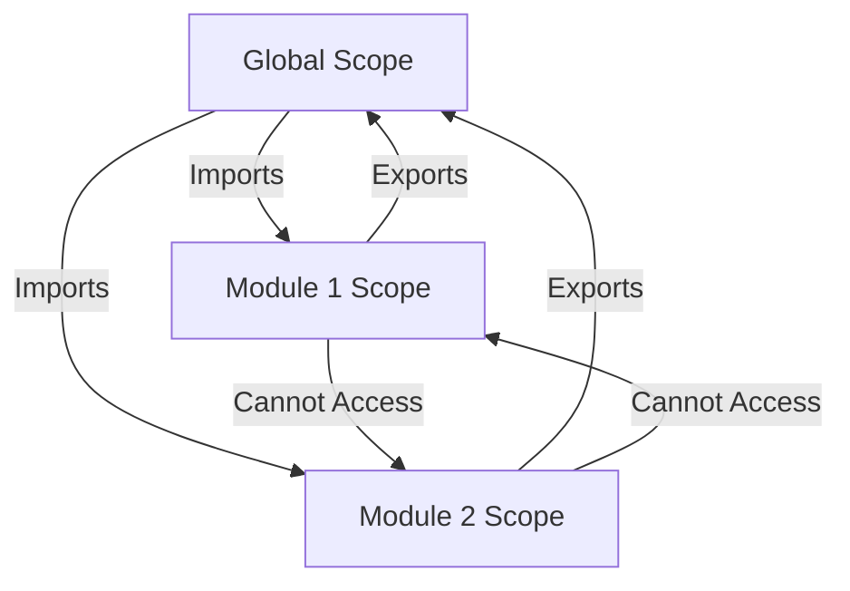

## 26.3 Module Scope

In the world of JavaScript, managing scope is crucial for writing clean, efficient, and bug-free code. As applications grow, so does the complexity of managing variables and functions. This is where modules come into play, providing a way to encapsulate code and manage scope effectively. In this section, we will explore how JavaScript modules create their own scope, the benefits of this encapsulation, and how it helps in preventing global namespace pollution.

### What is Module Scope?

Module scope refers to the encapsulation of variables and functions within a module. In JavaScript, a module is a file containing code that is executed in its own scope, not in the global scope. This means that variables and functions declared in a module are not accessible from other modules unless explicitly exported. This encapsulation helps prevent naming collisions and keeps the global namespace clean.

#### Key Concepts of Module Scope:

- **Encapsulation**: Variables and functions are contained within the module.
- **Isolation**: Each module has its own scope, separate from the global scope.
- **Exporting and Importing**: Modules can expose certain parts of their code to other modules.

### Why Use Module Scope?

Using module scope offers several advantages:

1. **Avoiding Global Namespace Pollution**: By encapsulating code within modules, you prevent the global namespace from becoming cluttered with variables and functions. This reduces the risk of naming collisions and makes your code more maintainable.

2. **Improved Code Organization**: Modules allow you to organize your code into logical units. This makes it easier to understand, maintain, and scale your application.

3. **Reusability**: Modules can be reused across different parts of your application or even in different projects. By exporting specific functions or variables, you can create libraries of reusable code.

4. **Enhanced Security**: Encapsulation within modules can prevent accidental or malicious interference with your code.

### Demonstrating Module-Level Scope

Let's explore how module scope works with some examples. We'll start by creating a simple module and then demonstrate how to export and import functions and variables.

#### Example: Creating a Module

Consider a module that handles basic arithmetic operations. We'll create a file named `math.js`:

```javascript
// math.js

// Private variables and functions
const pi = 3.14159;

function add(a, b) {
    return a + b;
}

function subtract(a, b) {
    return a - b;
}

// Exported functions
export function multiply(a, b) {
    return a * b;
}

export function divide(a, b) {
    if (b === 0) {
        throw new Error("Division by zero is not allowed.");
    }
    return a / b;
}
```

In this example, `pi`, `add`, and `subtract` are private to the module and cannot be accessed from outside. Only `multiply` and `divide` are exported and can be used by other modules.

#### Example: Importing a Module

Now, let's see how to import and use the `math.js` module in another file:

```javascript
// app.js

import { multiply, divide } from './math.js';

console.log(multiply(2, 3)); // Output: 6
console.log(divide(10, 2));  // Output: 5
```

Here, we import only the `multiply` and `divide` functions from `math.js`. The private variables and functions remain inaccessible, demonstrating the encapsulation provided by module scope.

### Visualizing Module Scope

To better understand how module scope works, let's visualize the concept using a diagram. This diagram illustrates the separation of scopes between different modules and the global scope.



**Diagram Explanation**: 
- The global scope can import from Module 1 and Module 2.
- Module 1 and Module 2 cannot directly access each other's scope.
- Each module has its own isolated scope, preventing interference.

### Implications for Variable Naming and Collisions

One of the significant benefits of module scope is the reduction of naming collisions. In a large application, it's common to have many variables and functions. Without modules, there's a risk of accidentally overwriting variables or functions, leading to bugs.

#### Example: Avoiding Naming Collisions

Consider two modules, `user.js` and `admin.js`, both containing a function named `getUserName`.

```javascript
// user.js
export function getUserName() {
    return "User Name";
}

// admin.js
export function getUserName() {
    return "Admin Name";
}
```

If these functions were in the global scope, they would collide. However, because they are encapsulated within their respective modules, they can coexist without issues.

### Modules Prevent Global Namespace Pollution

Global namespace pollution occurs when too many variables and functions are declared in the global scope, leading to potential conflicts and making the codebase difficult to manage. Modules help prevent this by encapsulating code within their own scope.

#### Example: Global Namespace Pollution

Without modules, you might have code like this:

```javascript
// Without modules
var userName = "John Doe";
var userAge = 30;

function getUserInfo() {
    return `${userName}, Age: ${userAge}`;
}
```

As your application grows, the global namespace becomes cluttered, increasing the risk of conflicts. By using modules, you can encapsulate this code:

```javascript
// user.js
const userName = "John Doe";
const userAge = 30;

export function getUserInfo() {
    return `${userName}, Age: ${userAge}`;
}
```

Now, `userName` and `userAge` are contained within the `user.js` module, preventing them from polluting the global namespace.

### Encouraging Code Organization with Modules

Organizing code into modules not only prevents global namespace pollution but also improves the readability and maintainability of your code. By grouping related functionality into modules, you create a more logical structure for your application.

#### Example: Organizing Code with Modules

Let's consider a simple application that manages a list of tasks. We can organize the code into modules as follows:

- `task.js`: Handles task-related operations.
- `ui.js`: Manages user interface interactions.
- `app.js`: The main application logic.

```javascript
// task.js
const tasks = [];

export function addTask(task) {
    tasks.push(task);
}

export function getTasks() {
    return tasks;
}

// ui.js
import { addTask, getTasks } from './task.js';

export function renderTasks() {
    const taskList = getTasks();
    taskList.forEach(task => {
        console.log(task);
    });
}

// app.js
import { addTask } from './task.js';
import { renderTasks } from './ui.js';

addTask("Learn JavaScript Modules");
renderTasks();
```

In this example, each module has a specific responsibility, making the code easier to understand and maintain.

### Try It Yourself

Now that we've explored the concept of module scope, try creating your own modules. Start with a simple project, such as a calculator or a to-do list, and break it down into modules. Experiment with exporting and importing functions and variables. Notice how modules help you organize your code and prevent global namespace pollution.

### Further Reading

To deepen your understanding of JavaScript modules and scope, consider exploring the following resources:

- [MDN Web Docs: JavaScript Modules](https://developer.mozilla.org/en-US/docs/Web/JavaScript/Guide/Modules)
- [W3Schools: JavaScript Modules](https://www.w3schools.com/js/js_modules.asp)

### Knowledge Check

Before we wrap up, let's reinforce what we've learned with a few questions:

1. What is module scope, and how does it differ from global scope?
2. How do modules help prevent global namespace pollution?
3. What are the benefits of organizing code into modules?
4. How can you export and import functions in JavaScript modules?
5. Why is encapsulation important in module scope?

### Embrace the Journey

Remember, this is just the beginning. As you progress, you'll discover more ways to leverage modules to create efficient and maintainable code. Keep experimenting, stay curious, and enjoy the journey!

## Quiz Time!



### What is module scope in JavaScript?

- [x] A way to encapsulate variables and functions within a module
- [ ] A method to declare global variables
- [ ] A technique to increase execution speed
- [ ] A feature to enhance CSS styling

> **Explanation:** Module scope refers to the encapsulation of variables and functions within a module, preventing them from being accessed globally.

### How do modules prevent global namespace pollution?

- [x] By encapsulating code within their own scope
- [ ] By increasing the number of global variables
- [ ] By removing all variables from the global scope
- [ ] By using inline styles

> **Explanation:** Modules encapsulate code within their own scope, preventing variables and functions from polluting the global namespace.

### What is the benefit of using modules in JavaScript?

- [x] Improved code organization and reusability
- [ ] Faster execution of code
- [ ] Better CSS styling
- [ ] Increased number of global variables

> **Explanation:** Modules improve code organization and reusability by encapsulating related functionality.

### How can you export a function from a module?

- [x] Using the `export` keyword
- [ ] Using the `import` keyword
- [ ] By declaring it as a global function
- [ ] By using inline styles

> **Explanation:** The `export` keyword is used to make functions or variables accessible from other modules.

### How do you import a function from another module?

- [x] Using the `import` keyword
- [ ] By declaring it as a global function
- [ ] By using inline styles
- [ ] By using the `export` keyword

> **Explanation:** The `import` keyword is used to bring functions or variables from another module into the current scope.

### What happens if two modules have a function with the same name?

- [x] They can coexist without conflict
- [ ] They will cause a naming collision
- [ ] One will overwrite the other
- [ ] They will both be removed

> **Explanation:** Because modules have their own scope, functions with the same name in different modules can coexist without conflict.

### Why is encapsulation important in module scope?

- [x] It prevents accidental interference with code
- [ ] It increases the number of global variables
- [ ] It enhances CSS styling
- [ ] It makes code execution faster

> **Explanation:** Encapsulation prevents accidental or malicious interference with code by keeping variables and functions contained within a module.

### What is a common use case for modules?

- [x] Organizing code into logical units
- [ ] Increasing the number of global variables
- [ ] Enhancing CSS styling
- [ ] Speeding up code execution

> **Explanation:** Modules are commonly used to organize code into logical units, improving maintainability and readability.

### How does module scope enhance security?

- [x] By preventing unauthorized access to variables and functions
- [ ] By increasing the number of global variables
- [ ] By enhancing CSS styling
- [ ] By speeding up code execution

> **Explanation:** Module scope enhances security by encapsulating variables and functions, preventing unauthorized access.

### Modules can be reused across different projects.

- [x] True
- [ ] False

> **Explanation:** Modules can be reused across different projects by exporting and importing their functions and variables.


