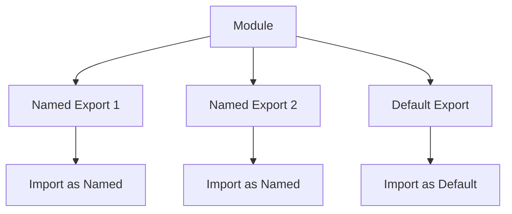

## 26.4 Named vs. Default Exports

In the world of JavaScript, modules are a powerful way to organize and encapsulate code. They allow developers to split their code into manageable parts, making it easier to maintain and understand. A key feature of modules is the ability to export and import functionalities, such as functions, objects, or primitive values, from one module to another. In this section, we will delve into the differences between named exports and default exports, explore their syntax, discuss when to use each type, and provide practical examples to solidify your understanding.

### Understanding JavaScript Modules

Before we dive into exports, let's briefly understand what modules are. Modules are reusable pieces of code that can be imported into other JavaScript files. They help in maintaining a clean codebase by separating concerns and promoting reusability. JavaScript modules can be created using the `export` and `import` statements, which are part of the ECMAScript 2015 (ES6) specification.

### Named Exports

Named exports allow you to export multiple values from a module. These values can be functions, objects, or variables, and they are exported using their declared names. This type of export is useful when you want to export several items from a module.

#### Syntax for Named Exports

To create a named export, you use the `export` keyword followed by the declaration of the variable, function, or object. Here's an example:

```javascript
// mathUtils.js
export const pi = 3.14159;

export function add(a, b) {
    return a + b;
}

export const multiply = (a, b) => a * b;
```

In this example, we are exporting a constant `pi`, a function `add`, and an arrow function `multiply`. Each of these exports is named, meaning they must be imported using their exact names.

#### Importing Named Exports

To import named exports, you use the `import` statement followed by curly braces containing the names of the exports you want to import. Here's how you can import the exports from the `mathUtils.js` module:

```javascript
// main.js
import { pi, add, multiply } from './mathUtils.js';

console.log(`Pi is approximately ${pi}`);
console.log(`2 + 3 = ${add(2, 3)}`);
console.log(`4 * 5 = ${multiply(4, 5)}`);
```

When importing named exports, it's crucial to match the names exactly as they were exported. This ensures that the correct values are imported into your module.

### Default Exports

Default exports are used when a module needs to export a single value or when you want to provide a fallback export. Unlike named exports, default exports do not require a specific name when being imported, offering more flexibility.

#### Syntax for Default Exports

To create a default export, you use the `export default` statement followed by the value you want to export. Here's an example:

```javascript
// circleUtils.js
const calculateArea = (radius) => Math.PI * radius * radius;

export default calculateArea;
```

In this example, the function `calculateArea` is exported as the default export of the module. This means it can be imported without specifying its name.

#### Importing Default Exports

When importing a default export, you can choose any name for the import, which adds a layer of flexibility. Here's how you can import the default export from the `circleUtils.js` module:

```javascript
// main.js
import calculateCircleArea from './circleUtils.js';

console.log(`Area of a circle with radius 3: ${calculateCircleArea(3)}`);
```

Notice that we imported `calculateArea` as `calculateCircleArea`. This flexibility allows you to choose meaningful names for imports that fit the context of your code.

### Combining Named and Default Exports

You can combine named and default exports in a single module. This is useful when you want to provide a default export along with other named exports. Here's an example:

```javascript
// geometryUtils.js
export const rectangleArea = (width, height) => width * height;

const circleCircumference = (radius) => 2 * Math.PI * radius;

export default circleCircumference;
```

In this module, `rectangleArea` is a named export, while `circleCircumference` is the default export. You can import them as follows:

```javascript
// main.js
import circleCircumference, { rectangleArea } from './geometryUtils.js';

console.log(`Circumference of a circle with radius 4: ${circleCircumference(4)}`);
console.log(`Area of a rectangle with width 5 and height 6: ${rectangleArea(5, 6)}`);
```

### When to Use Named vs. Default Exports

Choosing between named and default exports depends on the use case and the design of your module. Here are some guidelines to help you decide:

- **Use Named Exports** when you have multiple values to export from a module. This approach is explicit and makes it clear which values are available for import. It also allows for selective importing, which can be beneficial for tree-shaking in build processes.

- **Use Default Exports** when your module is designed to export a single primary value or function. Default exports are ideal for modules that encapsulate a single responsibility or functionality.

### Potential Pitfalls and Best Practices

While using exports, there are some potential pitfalls to be aware of, along with best practices to follow:

- **Avoid Mixing Export Types Excessively**: While it's possible to mix named and default exports, doing so excessively can lead to confusion. Keep your module exports organized and consistent.

- **Be Mindful of Import Names**: When importing named exports, ensure that the names match exactly. For default exports, choose meaningful names that reflect their usage in your code.

- **Consider Module Design**: Think about the design of your module and how it will be used. If a module is likely to grow in functionality, named exports might be more suitable.

- **Leverage Tree Shaking**: Named exports can be more efficient in build processes that support tree shaking, as they allow unused exports to be excluded from the final bundle.

### Visualizing Named and Default Exports

To help visualize the differences between named and default exports, let's use a diagram:



**Diagram Description**: This diagram illustrates a module with two named exports and one default export. The named exports are imported using their specific names, while the default export can be imported with any chosen name.

### Try It Yourself

Now that we've covered the basics, let's encourage you to try it yourself. Modify the examples above by adding more named exports to the modules or changing the names of the default imports. Experiment with importing only specific named exports and observe how it affects your code.

### References and Further Reading

For more information on JavaScript modules and exports, consider exploring the following resources:

- [MDN Web Docs: Import](https://developer.mozilla.org/en-US/docs/Web/JavaScript/Reference/Statements/import)
- [MDN Web Docs: Export](https://developer.mozilla.org/en-US/docs/Web/JavaScript/Reference/Statements/export)
- [JavaScript.info: Modules](https://javascript.info/modules)

### Knowledge Check

Let's reinforce what we've learned with a few questions:

1. What is the main difference between named and default exports?
2. How do you import a named export from a module?
3. Can a module have both named and default exports? Provide an example.
4. Why might you choose a default export over named exports?
5. What is a potential pitfall when using named exports?

### Embrace the Journey

Remember, mastering JavaScript modules and exports is a journey. As you continue to build more complex applications, you'll find these concepts invaluable for organizing and maintaining your codebase. Keep experimenting, stay curious, and enjoy the process of learning and growing as a developer!

---

## Quiz Time!



### What is a named export in JavaScript modules?

- [x] A way to export multiple values using their declared names
- [ ] A way to export a single value without a specific name
- [ ] A method to import values from other modules
- [ ] A way to declare variables within a module

> **Explanation:** Named exports allow you to export multiple values from a module using their declared names.

### How do you import a default export from a module?

- [x] Using any name you choose
- [ ] Using the exact name it was exported with
- [ ] Using curly braces around the name
- [ ] Using the `import * as` syntax

> **Explanation:** Default exports can be imported using any name you choose, providing flexibility in naming.

### Can a module have both named and default exports?

- [x] Yes
- [ ] No
- [ ] Only if using ES6 syntax
- [ ] Only in Node.js environments

> **Explanation:** A module can have both named and default exports, allowing for a combination of export types.

### Why might you choose a default export?

- [x] When the module is designed to export a single primary value or function
- [ ] When you have multiple values to export
- [ ] To make the module compatible with older JavaScript versions
- [ ] To avoid using the `export` keyword

> **Explanation:** Default exports are ideal for modules that encapsulate a single responsibility or functionality.

### What is a potential pitfall of using named exports?

- [x] Import names must match exactly
- [ ] They cannot be used with ES6 syntax
- [ ] They do not support tree shaking
- [ ] They are not compatible with default exports

> **Explanation:** When importing named exports, the names must match exactly as they were exported.

### What is a benefit of named exports?

- [x] They allow for selective importing
- [ ] They require less code to write
- [ ] They are the only way to export functions
- [ ] They automatically import all values

> **Explanation:** Named exports allow for selective importing, which can be beneficial for tree-shaking in build processes.

### How do you import multiple named exports from a module?

- [x] Using curly braces around the names
- [ ] Using the `import * as` syntax
- [ ] Using any name you choose
- [ ] Using the `import default` syntax

> **Explanation:** Multiple named exports are imported using curly braces around the names.

### What is a best practice when using default exports?

- [x] Choose meaningful names for imports
- [ ] Always use the same name as the export
- [ ] Avoid using default exports altogether
- [ ] Use default exports only for functions

> **Explanation:** When importing default exports, choose meaningful names that reflect their usage in your code.

### What is a potential benefit of default exports?

- [x] They provide flexibility in naming imports
- [ ] They require less code to write
- [ ] They are the only way to export objects
- [ ] They automatically import all values

> **Explanation:** Default exports provide flexibility in naming imports, allowing you to choose names that fit the context of your code.

### True or False: Named exports can only export functions.

- [ ] True
- [x] False

> **Explanation:** Named exports can export functions, objects, variables, and more, not just functions.


