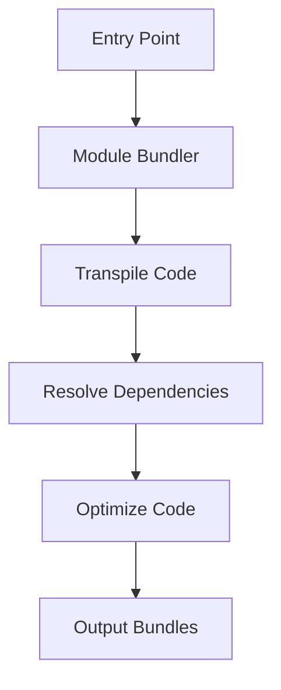

## 26.5 Bundling Modules

In modern web development, the use of JavaScript modules has become a standard practice. Modules allow us to break down our code into manageable, reusable pieces. However, when it comes to deploying our applications, we face a challenge: browsers do not natively support module systems like CommonJS or AMD, and while ES6 modules are supported, they are not always the most efficient way to deliver code to users. This is where module bundlers come into play.

### Understanding Module Bundlers

A module bundler is a tool that takes your JavaScript modules with all their dependencies and compiles them into one or more bundles, which are then included in your web application. This process is crucial for several reasons:

- **Browser Compatibility**: Not all browsers support the latest JavaScript features, including ES6 modules. Bundlers can transpile your code into a format that is compatible with older browsers.
- **Performance Optimization**: Bundlers can optimize your code by removing unused code (tree shaking), minifying the output, and splitting the code into smaller chunks for lazy loading.
- **Simplified Development**: By automating the process of managing dependencies and optimizing code, bundlers simplify the development workflow.

### Popular Module Bundlers

Let's explore some of the most popular module bundlers available today:

#### Webpack

Webpack is one of the most widely used module bundlers. It is highly configurable and supports a wide range of plugins and loaders to handle different types of assets, such as stylesheets, images, and fonts.

- **Key Features**:
  - **Code Splitting**: Webpack can split your code into smaller chunks that can be loaded on demand.
  - **Hot Module Replacement**: This feature allows you to update modules in a running application without a full reload.
  - **Tree Shaking**: Webpack can remove unused code from your bundles, reducing the final size.

#### Parcel

Parcel is a zero-configuration bundler that is designed to be easy to use. It automatically detects the type of assets you are using and applies the necessary transformations.

- **Key Features**:
  - **Zero Configuration**: Parcel requires little to no configuration to get started.
  - **Fast Bundling**: Parcel uses worker processes to parallelize bundling, making it faster than many other bundlers.
  - **Built-in Support for Many Asset Types**: Parcel can handle JavaScript, CSS, HTML, images, and more out of the box.

#### Rollup

Rollup is a module bundler specifically designed for JavaScript libraries. It focuses on creating smaller, more efficient bundles by leveraging ES6 modules.

- **Key Features**:
  - **Tree Shaking**: Rollup excels at removing unused code from your bundles.
  - **ES6 Module Support**: Rollup uses ES6 modules as its input format, making it ideal for libraries that want to take advantage of modern JavaScript features.
  - **Plugins**: Rollup has a rich ecosystem of plugins that extend its capabilities.

### Setting Up a Simple Bundling Configuration

Let's walk through setting up a simple bundling configuration using Webpack. This will give you a foundational understanding of how to bundle your JavaScript modules.

#### Step 1: Install Webpack

First, you'll need to install Webpack and Webpack CLI as development dependencies in your project. You can do this using npm:

```bash
npm install --save-dev webpack webpack-cli
```

#### Step 2: Create a Webpack Configuration File

Create a file named `webpack.config.js` in the root of your project. This file will contain the configuration for Webpack.

```javascript
// webpack.config.js
const path = require('path');

module.exports = {
  entry: './src/index.js', // Entry point of your application
  output: {
    filename: 'bundle.js', // Output bundle file
    path: path.resolve(__dirname, 'dist') // Output directory
  },
  module: {
    rules: [
      {
        test: /\.js$/, // Apply this rule to JavaScript files
        exclude: /node_modules/, // Exclude node_modules directory
        use: {
          loader: 'babel-loader', // Use Babel to transpile JavaScript
          options: {
            presets: ['@babel/preset-env'] // Preset for ES6+ features
          }
        }
      }
    ]
  }
};
```

#### Step 3: Add Scripts to `package.json`

Add the following scripts to your `package.json` file to run Webpack:

```json
"scripts": {
  "build": "webpack --mode production",
  "start": "webpack --mode development --watch"
}
```

#### Step 4: Run Webpack

Now, you can build your project by running the following command:

```bash
npm run build
```

This will create a `dist` directory containing the bundled JavaScript file `bundle.js`.

### Code Splitting and Lazy Loading

Code splitting is a powerful feature of module bundlers that allows you to split your code into separate bundles that can be loaded on demand. This is particularly useful for improving the performance of your application by reducing the initial load time.

#### Implementing Code Splitting with Webpack

Webpack makes it easy to implement code splitting using dynamic imports. Let's see how you can achieve this:

```javascript
// src/index.js
function loadModule() {
  import('./module.js').then(module => {
    module.default();
  }).catch(err => {
    console.error('Failed to load module:', err);
  });
}

document.getElementById('loadButton').addEventListener('click', loadModule);
```

In this example, the `loadModule` function uses a dynamic import to load `module.js` only when the button is clicked. This reduces the initial bundle size and improves load times.

#### Lazy Loading with Webpack

Lazy loading is a technique that delays the loading of non-essential resources until they are needed. This can be achieved using Webpack's dynamic imports, as shown in the previous example.

### Visualizing the Bundling Process

To better understand how module bundlers work, let's visualize the bundling process using a simple flowchart.



**Figure 1: The Module Bundling Process**

This flowchart illustrates the steps involved in bundling modules:

1. **Entry Point**: The starting point of your application, specified in the bundler configuration.
2. **Module Bundler**: The tool that processes your modules.
3. **Transpile Code**: Convert modern JavaScript into a format compatible with older browsers.
4. **Resolve Dependencies**: Identify and include all dependencies required by your modules.
5. **Optimize Code**: Remove unused code and apply other optimizations.
6. **Output Bundles**: Generate the final bundled files for deployment.

### References and Further Reading

For more information on module bundlers and their features, check out the following resources:

- [Webpack Official Documentation](https://webpack.js.org/)
- [Parcel Official Documentation](https://parceljs.org/)
- [Rollup Official Documentation](https://rollupjs.org/guide/en/)
- [MDN Web Docs on JavaScript Modules](https://developer.mozilla.org/en-US/docs/Web/JavaScript/Guide/Modules)

### Knowledge Check

Before we wrap up, let's reinforce what we've learned with a few questions:

- What is the primary purpose of a module bundler?
- Name three popular module bundlers and one key feature of each.
- How does code splitting improve the performance of a web application?
- What is lazy loading, and how can it be implemented with Webpack?

### Embrace the Journey

Remember, mastering module bundling is an essential skill for modern web development. As you continue to explore and experiment with different bundlers, you'll gain a deeper understanding of how to optimize your applications for performance and compatibility. Keep experimenting, stay curious, and enjoy the journey!

## Quiz Time!



### What is the primary purpose of a module bundler?

- [x] To compile JavaScript modules into a single bundle for browser compatibility
- [ ] To write JavaScript code
- [ ] To create CSS stylesheets
- [ ] To manage server-side code

> **Explanation:** Module bundlers compile JavaScript modules into a single bundle to ensure compatibility with browsers that do not support module systems.

### Which of the following is a popular module bundler?

- [x] Webpack
- [ ] Node.js
- [ ] Express
- [ ] MongoDB

> **Explanation:** Webpack is a widely used module bundler in JavaScript development.

### What feature allows Webpack to load code on demand?

- [x] Code Splitting
- [ ] Hot Module Replacement
- [ ] Tree Shaking
- [ ] Minification

> **Explanation:** Code splitting allows Webpack to load code on demand, improving application performance.

### What is lazy loading?

- [x] Delaying the loading of non-essential resources until they are needed
- [ ] Loading all resources at once
- [ ] Loading resources in alphabetical order
- [ ] Loading resources based on file size

> **Explanation:** Lazy loading delays the loading of non-essential resources until they are needed, reducing initial load times.

### Which tool is known for zero configuration setup?

- [x] Parcel
- [ ] Webpack
- [ ] Rollup
- [ ] Babel

> **Explanation:** Parcel is known for its zero configuration setup, making it easy to use.

### What does tree shaking do?

- [x] Removes unused code from bundles
- [ ] Adds new code to bundles
- [ ] Reorganizes code files
- [ ] Changes code syntax

> **Explanation:** Tree shaking removes unused code from bundles, reducing the final size.

### How can you implement code splitting in Webpack?

- [x] Using dynamic imports
- [ ] Using static imports
- [ ] Using synchronous imports
- [ ] Using asynchronous exports

> **Explanation:** Dynamic imports in Webpack allow for code splitting by loading modules on demand.

### What is the output of a module bundler?

- [x] Bundled JavaScript files
- [ ] HTML files
- [ ] CSS files
- [ ] Server logs

> **Explanation:** The output of a module bundler is bundled JavaScript files ready for deployment.

### Which of the following is not a module bundler?

- [x] Babel
- [ ] Webpack
- [ ] Parcel
- [ ] Rollup

> **Explanation:** Babel is a JavaScript transpiler, not a module bundler.

### True or False: Rollup is specifically designed for JavaScript libraries.

- [x] True
- [ ] False

> **Explanation:** Rollup is designed for JavaScript libraries, focusing on creating efficient bundles using ES6 modules.


