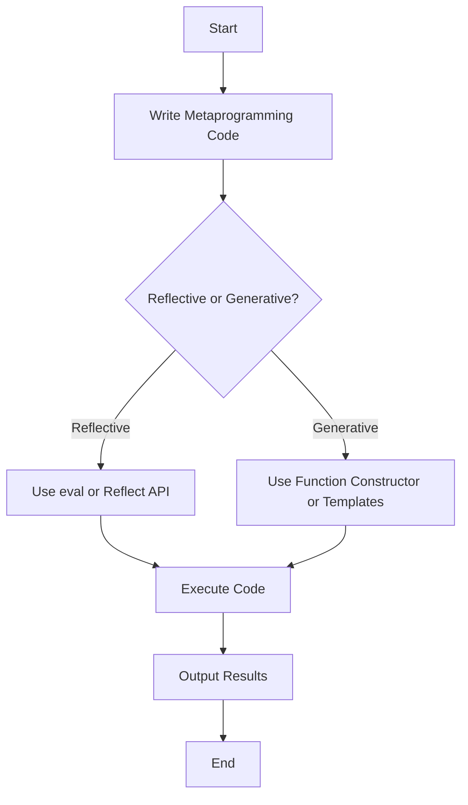

## 27.1 Understanding Metaprogramming

Welcome to the fascinating world of metaprogramming in JavaScript! In this section, we'll explore how metaprogramming allows us to write code that can manipulate other code. This concept might sound complex, but don't worry—we'll break it down into simple, digestible pieces. By the end of this chapter, you'll have a solid understanding of what metaprogramming is, how it applies to JavaScript, and how you can use it effectively.

### What is Metaprogramming?

Metaprogramming is a programming technique where programs have the ability to treat other programs as their data. This means that a program can be designed to read, generate, analyze, or transform other programs, and even modify itself while running. In simpler terms, metaprogramming is about writing code that writes code.

In JavaScript, metaprogramming can be used to create more flexible and dynamic applications. It allows developers to build powerful abstractions and automate repetitive tasks by manipulating the code itself.

### How Metaprogramming Applies to JavaScript

JavaScript, being a highly dynamic language, provides several features that make metaprogramming possible. These include:

- **Dynamic Typing**: JavaScript variables can hold any type of data, and their types can change at runtime.
- **First-Class Functions**: Functions in JavaScript are first-class citizens, meaning they can be assigned to variables, passed as arguments, and returned from other functions.
- **Reflection**: JavaScript provides reflective capabilities, allowing programs to inspect and modify their own structure and behavior.
- **Prototypes**: JavaScript's prototype-based inheritance allows for dynamic modification of object behavior.

Let's dive deeper into how code can manipulate other code in JavaScript.

### Reflective Programming

Reflective programming is a type of metaprogramming where a program can observe and modify its own structure and behavior. In JavaScript, reflection is often achieved using the following techniques:

#### The `eval` Function

The `eval` function in JavaScript evaluates a string as JavaScript code. While powerful, it should be used with caution due to security risks and performance issues.

```javascript
// Using eval to execute a string as code
const code = "console.log('Hello, World!')";
eval(code); // Outputs: Hello, World!
```

**Caution**: Avoid using `eval` unless absolutely necessary, as it can open up your code to injection attacks.

#### The `Function` Constructor

The `Function` constructor creates a new function from a string of code. It behaves similarly to `eval`, but is slightly safer as it creates a new function scope.

```javascript
// Creating a function using the Function constructor
const add = new Function('a', 'b', 'return a + b');
console.log(add(2, 3)); // Outputs: 5
```

#### The `Reflect` API

The `Reflect` API provides methods for intercepting JavaScript operations. It can be used to perform operations on objects in a more predictable way.

```javascript
// Using Reflect to define a property
const obj = {};
Reflect.defineProperty(obj, 'name', { value: 'Alice' });
console.log(obj.name); // Outputs: Alice
```

### Generative Programming

Generative programming is another form of metaprogramming where code generates other code. This can be useful for creating code templates or boilerplate code dynamically.

#### Code Generation with Templates

JavaScript can generate code using template literals, which are strings that allow embedded expressions.

```javascript
// Generating code with template literals
const generateFunction = (name) => `
  function ${name}() {
    console.log('This is the ${name} function');
  }
`;

const code = generateFunction('greet');
console.log(code);

// Outputs:
// function greet() {
//   console.log('This is the greet function');
// }
```

#### Dynamic Module Loading

JavaScript's `import()` function allows for dynamic module loading, which can be used to load code at runtime based on certain conditions.

```javascript
// Dynamically importing a module
async function loadModule(moduleName) {
  const module = await import(`./modules/${moduleName}.js`);
  module.default();
}

loadModule('greet'); // Loads and executes the greet module
```

### Use Cases of Metaprogramming

Metaprogramming is widely used in libraries and frameworks to provide powerful abstractions and automate repetitive tasks. Here are some common use cases:

#### Libraries and Frameworks

- **React**: Uses metaprogramming to manage component lifecycles and state updates.
- **Vue.js**: Utilizes metaprogramming for reactive data binding and component rendering.
- **Angular**: Employs metaprogramming for dependency injection and dynamic component loading.

#### Code Generation Tools

- **Babel**: A JavaScript compiler that uses metaprogramming to transform modern JavaScript code into a format compatible with older browsers.
- **Webpack**: A module bundler that dynamically generates optimized bundles for deployment.

#### Testing and Mocking

- **Jest**: A testing framework that uses metaprogramming to mock functions and modules for testing purposes.
- **Sinon**: A library for creating spies, stubs, and mocks in JavaScript tests.

### Encouraging Careful Use of Metaprogramming

While metaprogramming is a powerful tool, it should be used judiciously. Here are some guidelines to keep in mind:

- **Security**: Avoid using `eval` and similar techniques that can introduce security vulnerabilities.
- **Readability**: Metaprogramming can make code harder to read and understand. Use it only when necessary and document your code thoroughly.
- **Performance**: Reflective operations can be slower than regular code execution. Consider the performance impact before using metaprogramming techniques.

### Try It Yourself

Now that we've covered the basics of metaprogramming, let's try a simple exercise. Modify the following code to create a function that logs a personalized greeting message.

```javascript
// Original function
const greet = new Function('name', 'console.log(`Hello, ${name}!`)');

// Modify the function to include a time of day
const greetWithTime = new Function('name', 'timeOfDay', 'console.log(`Good ${timeOfDay}, ${name}!`)');

greetWithTime('Alice', 'morning'); // Outputs: Good morning, Alice!
```

### Visualizing Metaprogramming

To help you understand how metaprogramming interacts with JavaScript's execution, let's visualize the process using a flowchart.



**Diagram Explanation**: This flowchart illustrates the process of writing metaprogramming code, choosing between reflective and generative techniques, executing the code, and outputting the results.

### References and Links

For further reading on metaprogramming in JavaScript, check out these resources:

- [MDN Web Docs on Metaprogramming](https://developer.mozilla.org/en-US/docs/Web/JavaScript/Guide/Meta_programming)
- [JavaScript.info on Metaprogramming](https://javascript.info/metaprogramming)
- [Reflect API on MDN](https://developer.mozilla.org/en-US/docs/Web/JavaScript/Reference/Global_Objects/Reflect)

### Knowledge Check

Before we wrap up, let's reinforce what we've learned with a few questions:

1. What is metaprogramming, and how does it apply to JavaScript?
2. How can JavaScript code manipulate other code?
3. What are some examples of reflective programming in JavaScript?
4. How does generative programming differ from reflective programming?
5. What are some common use cases for metaprogramming in libraries and frameworks?

### Embrace the Journey

Remember, metaprogramming is just one of the many powerful tools at your disposal as a JavaScript developer. As you continue your journey, keep experimenting and exploring new techniques. Stay curious, and enjoy the process of learning and mastering JavaScript!

## Quiz Time!



### What is metaprogramming in JavaScript?

- [x] Writing code that can manipulate other code
- [ ] Writing code that only executes once
- [ ] Writing code that is only used for testing
- [ ] Writing code that cannot be changed

> **Explanation:** Metaprogramming involves writing code that can manipulate other code, allowing for dynamic and flexible programming.

### Which JavaScript feature allows functions to be treated as first-class citizens?

- [x] First-Class Functions
- [ ] Dynamic Typing
- [ ] Prototypes
- [ ] Reflection

> **Explanation:** First-class functions in JavaScript can be assigned to variables, passed as arguments, and returned from other functions.

### What is a potential risk of using the `eval` function?

- [x] Security vulnerabilities
- [ ] Improved performance
- [ ] Increased readability
- [ ] Enhanced security

> **Explanation:** The `eval` function can introduce security vulnerabilities by executing arbitrary code.

### Which API provides methods for intercepting JavaScript operations?

- [x] Reflect API
- [ ] Function API
- [ ] Eval API
- [ ] Prototype API

> **Explanation:** The Reflect API provides methods for intercepting and performing operations on objects.

### What is the difference between reflective and generative programming?

- [x] Reflective programming observes and modifies code, while generative programming generates new code
- [ ] Reflective programming generates new code, while generative programming observes and modifies code
- [ ] Both are the same
- [ ] Neither involves code manipulation

> **Explanation:** Reflective programming observes and modifies existing code, while generative programming creates new code.

### Which of the following is a use case for metaprogramming?

- [x] Libraries and frameworks
- [ ] Simple arithmetic operations
- [ ] Static HTML pages
- [ ] Basic CSS styling

> **Explanation:** Metaprogramming is commonly used in libraries and frameworks to provide powerful abstractions.

### What should be considered when using metaprogramming techniques?

- [x] Security, readability, and performance
- [ ] Only performance
- [ ] Only security
- [ ] Only readability

> **Explanation:** When using metaprogramming, consider security, readability, and performance to avoid potential issues.

### What is an example of generative programming in JavaScript?

- [x] Using template literals to generate code
- [ ] Using the `eval` function
- [ ] Using the Reflect API
- [ ] Using static variables

> **Explanation:** Generative programming can involve using template literals to dynamically generate code.

### What is a common use of the `Reflect` API?

- [x] Defining properties on objects
- [ ] Executing strings as code
- [ ] Creating new functions
- [ ] Generating HTML content

> **Explanation:** The Reflect API can be used to define properties on objects in a predictable way.

### True or False: Metaprogramming should be used without caution.

- [ ] True
- [x] False

> **Explanation:** Metaprogramming should be used with caution due to potential security, readability, and performance concerns.


