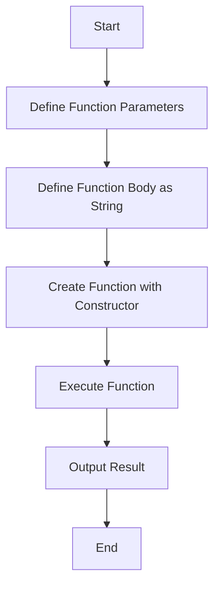

## 27.2 The Function Constructor

In JavaScript, functions are first-class citizens, meaning they can be treated like any other data type. This flexibility allows us to create, manipulate, and pass functions around just like numbers or strings. One of the more advanced techniques for creating functions is using the `Function` constructor. This method allows us to define functions dynamically, which can be particularly useful in scenarios where the function's logic is determined at runtime.

### Understanding the Function Constructor

The `Function` constructor is a global object that allows us to create new functions from strings. Unlike regular function declarations or expressions, which are defined at compile time, the `Function` constructor evaluates the function body at runtime. This means you can generate and execute code on the fly, which can be both powerful and risky.

#### Syntax of the Function Constructor

The basic syntax of the `Function` constructor is as follows:

```javascript
new Function([arg1, arg2, ..., argN], functionBody)
```

- **arg1, arg2, ..., argN**: These are the names of the arguments the function will accept. They are optional and can be omitted if the function does not require parameters.
- **functionBody**: This is a string representing the code to be executed when the function is called.

Here's a simple example:

```javascript
const add = new Function('a', 'b', 'return a + b;');
console.log(add(2, 3)); // Output: 5
```

In this example, we create a function `add` that takes two parameters, `a` and `b`, and returns their sum.

### Creating Functions from Strings

The ability to create functions from strings allows for dynamic function creation, which can be particularly useful in applications that require flexible logic. Let's explore this with a more complex example:

```javascript
const operation = 'multiply';
const dynamicFunction = new Function('x', 'y', `
  if (operation === 'add') {
    return x + y;
  } else if (operation === 'multiply') {
    return x * y;
  } else {
    return null;
  }
`);

console.log(dynamicFunction(5, 10)); // Output: 50
```

In this example, the function `dynamicFunction` is created with a body that checks the value of `operation` and performs the corresponding arithmetic operation. This showcases the power of the `Function` constructor to adapt function logic based on runtime conditions.

### Security Risks of Dynamic Code Execution

While the `Function` constructor offers flexibility, it also introduces significant security risks. Executing code from strings can lead to vulnerabilities, such as code injection attacks. This is because any input that is not properly sanitized could potentially execute malicious code.

#### Example of a Security Risk

Consider a scenario where user input is directly used to construct a function:

```javascript
const userInput = 'console.log("Hacked!");';
const insecureFunction = new Function(userInput);
insecureFunction(); // Output: Hacked!
```

In this case, if `userInput` comes from an untrusted source, it could execute harmful code. Therefore, it's crucial to avoid using the `Function` constructor with untrusted inputs.

### Differences from `eval`

The `Function` constructor is often compared to `eval`, another JavaScript feature that executes strings as code. However, there are important differences between the two:

- **Scope**: Functions created with the `Function` constructor do not have access to the local scope in which they were defined. They only have access to the global scope and their own local scope. In contrast, `eval` can access the local scope.
  
  ```javascript
  const localVar = 'I am local';
  const func = new Function('return typeof localVar;');
  console.log(func()); // Output: undefined

  eval('console.log(typeof localVar);'); // Output: string
  ```

- **Performance**: The `Function` constructor is generally faster than `eval` because it creates a new function object, whereas `eval` needs to re-evaluate the entire script context.

- **Use Cases**: The `Function` constructor is more suitable for creating functions dynamically, whereas `eval` is often used for evaluating expressions or executing code snippets.

### Performance Implications

Using the `Function` constructor can have performance implications. Creating functions dynamically is generally slower than using function declarations or expressions because the function body needs to be parsed and compiled at runtime. This can lead to performance bottlenecks, especially if the constructor is used frequently in performance-critical applications.

#### Performance Considerations

- **Avoid in Loops**: Repeatedly creating functions inside loops can degrade performance. Instead, consider defining functions outside of loops and reusing them.
  
  ```javascript
  // Inefficient
  for (let i = 0; i < 1000; i++) {
    const func = new Function('return i;');
  }

  // More efficient
  const func = new Function('i', 'return i;');
  for (let i = 0; i < 1000; i++) {
    func(i);
  }
  ```

- **Caching**: If the same function logic is needed multiple times, consider caching the function to avoid repeated construction.

### Try It Yourself

To better understand the `Function` constructor, try modifying the examples above. For instance, change the operation in the dynamic function example from `multiply` to `add` and observe the output. Experiment with different parameter names and function bodies to see how they affect the function's behavior.

### Visualizing Function Creation

To help visualize how the `Function` constructor works, consider the following flowchart that illustrates the process of creating and executing a function dynamically:



This flowchart provides a high-level overview of the steps involved in using the `Function` constructor, from defining parameters and the function body to executing the function and obtaining the result.

### References and Further Reading

- [MDN Web Docs: Function](https://developer.mozilla.org/en-US/docs/Web/JavaScript/Reference/Global_Objects/Function)
- [W3Schools: JavaScript Function Constructor](https://www.w3schools.com/js/js_function_constructor.asp)

### Knowledge Check

Before we wrap up, let's reinforce what we've learned with a few questions:

- What is the primary purpose of the `Function` constructor?
- How does the scope of a function created with the `Function` constructor differ from one created with `eval`?
- What are some security risks associated with using the `Function` constructor?
- How can performance be improved when using the `Function` constructor?

### Embrace the Journey

Remember, mastering JavaScript functions, including advanced techniques like the `Function` constructor, is a journey. As you continue to explore and experiment, you'll gain a deeper understanding of how to leverage these tools effectively. Keep practicing, stay curious, and enjoy the process of learning and growing as a developer!

## Quiz Time!



### What is the primary purpose of the `Function` constructor?

- [x] To create functions dynamically from strings
- [ ] To execute existing functions
- [ ] To optimize function performance
- [ ] To provide a shortcut for function expressions

> **Explanation:** The `Function` constructor allows for the creation of functions dynamically from strings, enabling runtime function definition.

### How does the scope of a function created with the `Function` constructor differ from one created with `eval`?

- [x] It only has access to the global scope
- [ ] It has access to both local and global scopes
- [ ] It has no scope
- [ ] It can access the local scope where it was defined

> **Explanation:** Functions created with the `Function` constructor have access only to the global scope and their own local scope, unlike `eval`, which can access the local scope.

### What are some security risks associated with using the `Function` constructor?

- [x] Code injection attacks
- [ ] Memory leaks
- [ ] Syntax errors
- [ ] Type mismatches

> **Explanation:** The `Function` constructor can execute code from strings, making it susceptible to code injection attacks if inputs are not properly sanitized.

### How can performance be improved when using the `Function` constructor?

- [x] Avoid creating functions inside loops
- [ ] Use it for all function definitions
- [ ] Minimize the number of parameters
- [ ] Avoid using return statements

> **Explanation:** Creating functions inside loops can degrade performance, so it's better to define functions outside loops and reuse them.

### Which of the following is a difference between the `Function` constructor and `eval`?

- [x] The `Function` constructor does not access the local scope
- [ ] `eval` is faster than the `Function` constructor
- [ ] The `Function` constructor is used for variable declarations
- [ ] `eval` creates new function objects

> **Explanation:** The `Function` constructor does not have access to the local scope, whereas `eval` can access it.

### What is a potential downside of using the `Function` constructor frequently?

- [x] Performance bottlenecks
- [ ] Increased readability
- [ ] Enhanced security
- [ ] Simplified syntax

> **Explanation:** Frequent use of the `Function` constructor can lead to performance bottlenecks due to runtime parsing and compilation.

### Why should the `Function` constructor be avoided with untrusted inputs?

- [x] It can execute malicious code
- [ ] It can create infinite loops
- [ ] It can cause syntax errors
- [ ] It can lead to memory leaks

> **Explanation:** Using the `Function` constructor with untrusted inputs can execute malicious code, posing a security risk.

### What is a recommended practice when using the `Function` constructor?

- [x] Cache functions for reuse
- [ ] Use it for all function definitions
- [ ] Avoid using parameters
- [ ] Always use it inside loops

> **Explanation:** Caching functions for reuse can improve performance by avoiding repeated construction.

### What is the output of the following code?
```javascript
const func = new Function('x', 'return x * 2;');
console.log(func(5));
```

- [x] 10
- [ ] 5
- [ ] 25
- [ ] 0

> **Explanation:** The function multiplies the input `x` by 2, so `func(5)` returns 10.

### True or False: The `Function` constructor can access variables in the local scope where it was defined.

- [ ] True
- [x] False

> **Explanation:** The `Function` constructor cannot access variables in the local scope where it was defined; it only has access to the global scope and its own local scope.




