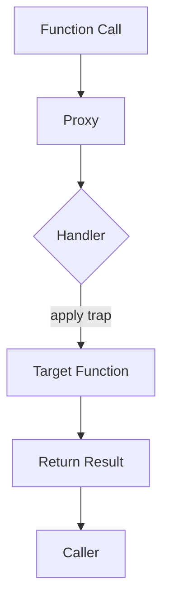

## 27.3 Using Proxies for Function Control

In the world of JavaScript, functions are the building blocks of any application. They encapsulate logic, perform computations, and interact with other parts of the code. But what if we could intercept function calls to modify their behavior dynamically? This is where JavaScript's `Proxy` object comes into play, offering a powerful tool for metaprogramming.

### Introduction to the Proxy Object

The `Proxy` object in JavaScript allows us to create a proxy for another object, which can intercept and redefine fundamental operations for that object. This includes operations such as property lookup, assignment, enumeration, function invocation, and more. Proxies can be used to add custom behavior to objects and functions, making them a versatile tool in a developer's toolkit.

#### Basic Syntax of a Proxy

A `Proxy` is created using the `new Proxy(target, handler)` syntax, where:

- **`target`**: The original object or function that you want to proxy.
- **`handler`**: An object that contains traps, which are methods that intercept operations on the target.

Here's a simple example of creating a proxy for an object:

```javascript
const targetObject = {
  message: "Hello, World!"
};

const handler = {
  get: function(target, property) {
    console.log(`Getting property: ${property}`);
    return target[property];
  }
};

const proxyObject = new Proxy(targetObject, handler);

console.log(proxyObject.message); // Logs: Getting property: message
                                  // Returns: Hello, World!
```

In this example, the `get` trap intercepts attempts to access properties on the `targetObject`, allowing us to log a message before returning the property value.

### Wrapping Functions with Proxies

While proxies are often used with objects, they can also be applied to functions. This allows us to intercept function calls and modify their behavior. Let's explore how to wrap functions with proxies.

#### Creating a Proxy for a Function

To create a proxy for a function, we use the same `Proxy` constructor. The handler object can include traps specific to function behavior, such as `apply`, which intercepts function calls.

Here's a basic example of using a proxy to wrap a function:

```javascript
function greet(name) {
  return `Hello, ${name}!`;
}

const handler = {
  apply: function(target, thisArg, argumentsList) {
    console.log(`Calling function with arguments: ${argumentsList}`);
    return target.apply(thisArg, argumentsList);
  }
};

const proxyGreet = new Proxy(greet, handler);

console.log(proxyGreet("Alice")); // Logs: Calling function with arguments: Alice
                                  // Returns: Hello, Alice!
```

In this example, the `apply` trap logs the arguments passed to the `greet` function before invoking it.

### Practical Applications of Function Proxies

Proxies offer a wide range of practical applications, from logging and input validation to enforcing access control and more. Let's explore some common use cases.

#### Logging Function Calls

One of the simplest applications of function proxies is logging. By intercepting function calls, we can log information about the function's execution, such as its arguments and return value.

```javascript
function add(a, b) {
  return a + b;
}

const loggingHandler = {
  apply: function(target, thisArg, argumentsList) {
    console.log(`Function called with arguments: ${argumentsList}`);
    const result = target.apply(thisArg, argumentsList);
    console.log(`Function returned: ${result}`);
    return result;
  }
};

const proxyAdd = new Proxy(add, loggingHandler);

proxyAdd(2, 3); // Logs: Function called with arguments: 2,3
                // Logs: Function returned: 5
```

#### Input Validation

Proxies can also be used to enforce input validation, ensuring that functions receive valid arguments. This can help prevent errors and improve code robustness.

```javascript
function divide(a, b) {
  return a / b;
}

const validationHandler = {
  apply: function(target, thisArg, argumentsList) {
    if (argumentsList[1] === 0) {
      throw new Error("Division by zero is not allowed.");
    }
    return target.apply(thisArg, argumentsList);
  }
};

const proxyDivide = new Proxy(divide, validationHandler);

try {
  console.log(proxyDivide(10, 2)); // Returns: 5
  console.log(proxyDivide(10, 0)); // Throws an error
} catch (error) {
  console.error(error.message); // Logs: Division by zero is not allowed.
}
```

#### Access Control

Another powerful use of function proxies is to implement access control, restricting who can call certain functions based on specific conditions.

```javascript
function secretFunction() {
  return "This is a secret!";
}

const accessControlHandler = {
  apply: function(target, thisArg, argumentsList) {
    if (!argumentsList[0].isAdmin) {
      throw new Error("Access denied.");
    }
    return target.apply(thisArg, argumentsList);
  }
};

const proxySecretFunction = new Proxy(secretFunction, accessControlHandler);

const user = { isAdmin: false };
const admin = { isAdmin: true };

try {
  console.log(proxySecretFunction(user)); // Throws an error
} catch (error) {
  console.error(error.message); // Logs: Access denied.
}

console.log(proxySecretFunction(admin)); // Returns: This is a secret!
```

### Traps and Handler Methods for Functions

When working with function proxies, the most relevant trap is `apply`. However, there are other traps that can be used depending on the context and requirements.

#### The `apply` Trap

The `apply` trap is used to intercept calls to a function. It receives three arguments:

- **`target`**: The original function being called.
- **`thisArg`**: The value of `this` provided for the call.
- **`argumentsList`**: An array-like object representing the arguments passed to the function.

The `apply` trap allows us to modify the behavior of the function call, such as logging, validation, or altering the arguments.

#### The `construct` Trap

The `construct` trap is used to intercept calls to a function when it is used as a constructor with the `new` keyword. It receives the following arguments:

- **`target`**: The original constructor function.
- **`argumentsList`**: An array-like object representing the arguments passed to the constructor.
- **`newTarget`**: The constructor function that was originally called.

This trap can be used to modify the behavior of object creation.

```javascript
function Person(name) {
  this.name = name;
}

const constructHandler = {
  construct: function(target, argumentsList, newTarget) {
    console.log(`Creating a new instance with arguments: ${argumentsList}`);
    return new target(...argumentsList);
  }
};

const ProxyPerson = new Proxy(Person, constructHandler);

const person = new ProxyPerson("Alice"); // Logs: Creating a new instance with arguments: Alice
console.log(person.name); // Returns: Alice
```

### Limitations and Considerations

While proxies provide powerful capabilities, they also come with limitations and considerations:

- **Performance Overhead**: Proxies introduce additional overhead, which can impact performance, especially in performance-critical applications.
- **Complexity**: Using proxies can add complexity to the codebase, making it harder to understand and maintain.
- **Compatibility**: Not all JavaScript environments fully support proxies, so it's important to ensure compatibility with the target environment.

### Try It Yourself

Experiment with the examples provided by modifying the handlers and observing the changes in behavior. Here are some ideas to get you started:

- **Modify the `apply` trap** to change the arguments before passing them to the target function.
- **Add a `construct` trap** to log the creation of objects and modify their properties.
- **Implement a caching mechanism** using proxies to store and retrieve function results.

### Visualizing Proxies in JavaScript

To better understand how proxies work, let's visualize the interaction between a proxy, its target, and the handler using a flowchart.



**Caption**: This flowchart illustrates how a function call is intercepted by a proxy, processed by the handler's `apply` trap, and then passed to the target function.

### References and Further Reading

- [MDN Web Docs: Proxy](https://developer.mozilla.org/en-US/docs/Web/JavaScript/Reference/Global_Objects/Proxy)
- [JavaScript.info: Proxies](https://javascript.info/proxy)
- [W3Schools: JavaScript Proxy](https://www.w3schools.com/js/js_object_proxies.asp)

### Knowledge Check

- What is the purpose of the `apply` trap in a function proxy?
- How can proxies be used for input validation?
- What are some limitations of using proxies in JavaScript?

### Embrace the Journey

Remember, mastering proxies and function control in JavaScript is a journey. As you experiment and apply these concepts, you'll gain a deeper understanding of how to enhance your code's flexibility and maintainability. Keep exploring, stay curious, and enjoy the process of becoming a more proficient JavaScript developer!

## Quiz Time!



### What is the primary purpose of the `Proxy` object in JavaScript?

- [x] To intercept and redefine operations on objects or functions
- [ ] To create new data types
- [ ] To enhance performance
- [ ] To simplify syntax

> **Explanation:** The `Proxy` object is used to intercept and redefine operations on objects or functions, allowing for custom behavior.

### Which trap is used to intercept function calls in a proxy?

- [ ] get
- [ ] set
- [x] apply
- [ ] construct

> **Explanation:** The `apply` trap is used to intercept function calls in a proxy.

### How can proxies be used for input validation?

- [x] By intercepting function calls and checking arguments
- [ ] By modifying the return value of a function
- [ ] By changing the function's context
- [ ] By logging function calls

> **Explanation:** Proxies can intercept function calls and validate the arguments before allowing the function to execute.

### What is a potential limitation of using proxies?

- [ ] They simplify code
- [ ] They enhance performance
- [x] They introduce performance overhead
- [ ] They are compatible with all environments

> **Explanation:** Proxies introduce additional overhead, which can impact performance, especially in performance-critical applications.

### Which trap is used to intercept object creation with the `new` keyword?

- [ ] apply
- [x] construct
- [ ] get
- [ ] set

> **Explanation:** The `construct` trap is used to intercept calls to a function when it is used as a constructor with the `new` keyword.

### What is a practical application of function proxies?

- [x] Logging function calls
- [ ] Simplifying syntax
- [ ] Enhancing performance
- [ ] Creating new data types

> **Explanation:** Function proxies can be used to log function calls, among other applications.

### How can proxies help with access control?

- [x] By restricting who can call certain functions
- [ ] By modifying the function's return value
- [ ] By changing the function's context
- [ ] By logging function calls

> **Explanation:** Proxies can implement access control by restricting who can call certain functions based on specific conditions.

### What is the syntax for creating a proxy?

- [x] `new Proxy(target, handler)`
- [ ] `Proxy.create(target, handler)`
- [ ] `Proxy(target, handler)`
- [ ] `createProxy(target, handler)`

> **Explanation:** The syntax for creating a proxy is `new Proxy(target, handler)`.

### True or False: Proxies can only be used with objects, not functions.

- [ ] True
- [x] False

> **Explanation:** Proxies can be used with both objects and functions to intercept and modify behavior.

### What should you consider when using proxies in JavaScript?

- [x] Performance overhead and compatibility
- [ ] Simplified syntax
- [ ] Enhanced performance
- [ ] Automatic error handling

> **Explanation:** When using proxies, it's important to consider performance overhead and compatibility with the target environment.


