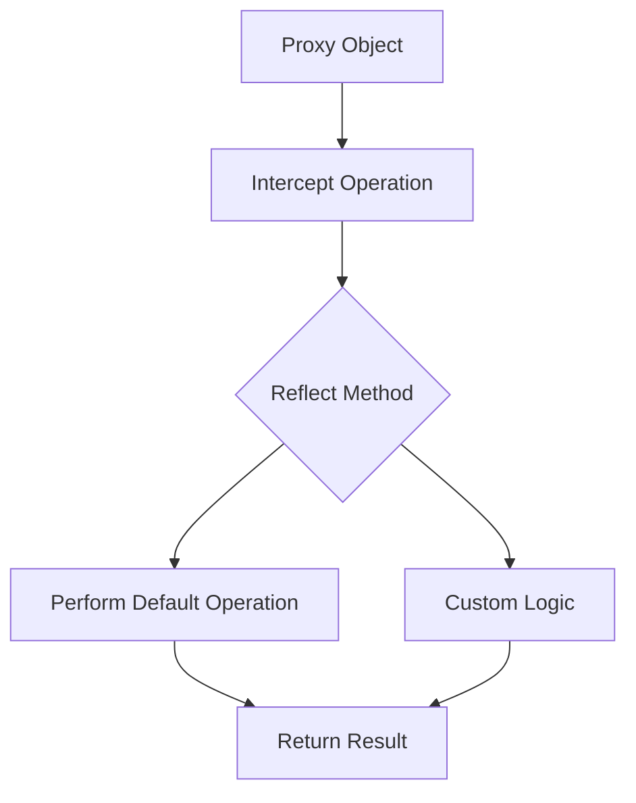

## 27.4 Reflect API

In the world of JavaScript, metaprogramming is a powerful concept that allows us to write code that can manipulate other code. One of the key tools in JavaScript for metaprogramming is the Reflect API. In this section, we'll explore the Reflect API, its purpose, and how it can be used to simplify advanced operations in JavaScript.

### What is the Reflect API?

The Reflect API is a built-in object in JavaScript that provides a set of static methods for intercepting and manipulating JavaScript operations. It was introduced in ECMAScript 2015 (ES6) and is designed to complement the Proxy object, which allows you to define custom behavior for fundamental operations on objects.

#### Purpose of the Reflect Object

The Reflect object serves several purposes:

1. **Standardization**: It standardizes the way certain operations are performed in JavaScript, making the language more consistent and predictable.

2. **Complementing Proxies**: Reflect methods are often used in conjunction with Proxies to perform default operations that would otherwise be intercepted by the Proxy.

3. **Simplification**: It simplifies the syntax for performing certain operations, making the code more readable and maintainable.

4. **Error Handling**: Reflect methods provide a more consistent way to handle errors compared to their traditional counterparts.

### Key Methods of the Reflect API

The Reflect API consists of several methods that mirror the operations you can perform on objects. Let's explore some of the most commonly used methods:

#### Reflect.apply()

The `Reflect.apply()` method is used to call a function with a specified `this` value and arguments. It is similar to `Function.prototype.apply()`, but with a more straightforward syntax.

```javascript
function greet(greeting, name) {
    return `${greeting}, ${name}!`;
}

const result = Reflect.apply(greet, undefined, ['Hello', 'World']);
console.log(result); // Output: Hello, World!
```

In this example, `Reflect.apply()` is used to invoke the `greet` function with the arguments `'Hello'` and `'World'`.

#### Reflect.construct()

The `Reflect.construct()` method is used to create a new instance of a constructor function. It is similar to the `new` operator but provides more flexibility.

```javascript
function Person(name, age) {
    this.name = name;
    this.age = age;
}

const person = Reflect.construct(Person, ['Alice', 30]);
console.log(person); // Output: Person { name: 'Alice', age: 30 }
```

Here, `Reflect.construct()` is used to create a new `Person` object with the name `'Alice'` and age `30`.

#### Reflect.get()

The `Reflect.get()` method is used to retrieve the value of a property from an object. It is similar to the dot notation or bracket notation but allows for more control.

```javascript
const user = {
    name: 'Bob',
    age: 25
};

const name = Reflect.get(user, 'name');
console.log(name); // Output: Bob
```

In this example, `Reflect.get()` retrieves the `name` property from the `user` object.

#### Reflect.set()

The `Reflect.set()` method is used to set the value of a property on an object. It returns a boolean indicating whether the operation was successful.

```javascript
const user = {
    name: 'Bob',
    age: 25
};

const success = Reflect.set(user, 'age', 26);
console.log(success); // Output: true
console.log(user.age); // Output: 26
```

Here, `Reflect.set()` updates the `age` property of the `user` object to `26`.

#### Reflect.has()

The `Reflect.has()` method is used to check if an object has a specific property. It is similar to the `in` operator.

```javascript
const user = {
    name: 'Bob',
    age: 25
};

const hasName = Reflect.has(user, 'name');
console.log(hasName); // Output: true
```

In this example, `Reflect.has()` checks if the `user` object has a `name` property.

### Using Reflect with Proxies

The Reflect API is often used in conjunction with Proxies to define custom behavior for object operations. Proxies allow you to intercept and redefine fundamental operations for objects, such as property access and assignment.

#### Example: Logging Property Access

Let's create a Proxy that logs every time a property is accessed on an object:

```javascript
const user = {
    name: 'Bob',
    age: 25
};

const handler = {
    get(target, property) {
        console.log(`Getting property: ${property}`);
        return Reflect.get(target, property);
    }
};

const proxyUser = new Proxy(user, handler);

console.log(proxyUser.name); // Output: Getting property: name
                             //         Bob
```

In this example, the `get` trap in the Proxy logs the property being accessed and uses `Reflect.get()` to retrieve the property value.

### Simplifying Metaprogramming with Reflect

The Reflect API simplifies metaprogramming by providing a consistent and intuitive way to perform operations on objects. Here are some benefits of using Reflect:

1. **Consistency**: Reflect methods provide a consistent interface for performing operations, reducing the need for custom logic.

2. **Readability**: The syntax of Reflect methods is often more readable and easier to understand than traditional methods.

3. **Error Handling**: Reflect methods return boolean values to indicate success or failure, making error handling more straightforward.

4. **Integration with Proxies**: Reflect methods complement Proxies by providing default behavior for intercepted operations.

### Best Practices for Using Reflect

When using the Reflect API, consider the following best practices:

- **Use Reflect with Proxies**: Leverage Reflect methods to provide default behavior for Proxy traps, ensuring consistent operation handling.

- **Prefer Reflect over Traditional Methods**: Use Reflect methods for operations like property access and function invocation to improve code readability and maintainability.

- **Handle Errors Gracefully**: Take advantage of the boolean return values of Reflect methods to handle errors gracefully and provide meaningful feedback.

- **Avoid Overuse**: While Reflect is powerful, avoid overusing it in situations where traditional methods suffice. Use Reflect when it provides clear benefits.

### Try It Yourself

Now that we've covered the basics of the Reflect API, let's try modifying some code examples to deepen your understanding.

1. **Modify the `Reflect.apply()` Example**: Change the `greet` function to include a farewell message and use `Reflect.apply()` to call it with different arguments.

2. **Experiment with `Reflect.construct()`**: Create a new constructor function for a `Car` object and use `Reflect.construct()` to create instances with different properties.

3. **Enhance the Proxy Example**: Add a `set` trap to the Proxy that logs when properties are modified, and use `Reflect.set()` to update the properties.

### Visualizing Reflect and Proxy Interaction

To better understand how Reflect and Proxy work together, let's visualize their interaction using a flowchart.



**Diagram Description**: This flowchart illustrates how a Proxy intercepts an operation, uses a Reflect method to perform the default operation or custom logic, and returns the result.

### Further Reading

For more information on the Reflect API and its methods, check out the following resources:

- [MDN Web Docs: Reflect](https://developer.mozilla.org/en-US/docs/Web/JavaScript/Reference/Global_Objects/Reflect)
- [JavaScript.info: Reflect](https://javascript.info/reflect)
- [W3Schools: JavaScript Reflect](https://www.w3schools.com/js/js_reflect.asp)

### Knowledge Check

Before we wrap up, let's reinforce what we've learned with some questions and exercises.

1. **What is the primary purpose of the Reflect API?**

2. **How does `Reflect.apply()` differ from `Function.prototype.apply()`?**

3. **Create a Proxy that logs both property access and modification.**

4. **Why is it beneficial to use Reflect methods with Proxies?**

5. **Experiment with `Reflect.construct()` to create instances of different objects.**

### Embrace the Journey

Remember, mastering JavaScript's Reflect API is just one step in your journey to becoming a proficient developer. Keep experimenting, stay curious, and enjoy the process of learning and growing your skills.

## Quiz Time!



### What is the primary purpose of the Reflect API?

- [x] To provide a set of static methods for intercepting and manipulating JavaScript operations.
- [ ] To replace all traditional JavaScript methods.
- [ ] To create new data types in JavaScript.
- [ ] To simplify CSS styling in JavaScript.

> **Explanation:** The Reflect API provides a set of static methods for intercepting and manipulating JavaScript operations, making the language more consistent and predictable.

### How does `Reflect.apply()` differ from `Function.prototype.apply()`?

- [x] `Reflect.apply()` provides a more straightforward syntax.
- [ ] `Reflect.apply()` can only be used with arrow functions.
- [ ] `Reflect.apply()` is slower than `Function.prototype.apply()`.
- [ ] `Reflect.apply()` cannot be used with Proxies.

> **Explanation:** `Reflect.apply()` provides a more straightforward syntax compared to `Function.prototype.apply()`, making it easier to use.

### Which method is used to create a new instance of a constructor function?

- [x] Reflect.construct()
- [ ] Reflect.apply()
- [ ] Reflect.get()
- [ ] Reflect.set()

> **Explanation:** `Reflect.construct()` is used to create a new instance of a constructor function, similar to the `new` operator.

### What does `Reflect.get()` do?

- [x] Retrieves the value of a property from an object.
- [ ] Sets the value of a property on an object.
- [ ] Checks if an object has a specific property.
- [ ] Deletes a property from an object.

> **Explanation:** `Reflect.get()` retrieves the value of a property from an object, similar to using dot or bracket notation.

### Why is it beneficial to use Reflect methods with Proxies?

- [x] Reflect methods provide default behavior for Proxy traps.
- [ ] Reflect methods make Proxies run faster.
- [ ] Reflect methods are required for Proxies to work.
- [ ] Reflect methods replace the need for Proxy handlers.

> **Explanation:** Reflect methods provide default behavior for Proxy traps, ensuring consistent operation handling.

### What does `Reflect.set()` return?

- [x] A boolean indicating whether the operation was successful.
- [ ] The new value of the property.
- [ ] The old value of the property.
- [ ] A string describing the operation.

> **Explanation:** `Reflect.set()` returns a boolean indicating whether the operation was successful, allowing for straightforward error handling.

### Which Reflect method is similar to the `in` operator?

- [x] Reflect.has()
- [ ] Reflect.get()
- [ ] Reflect.set()
- [ ] Reflect.apply()

> **Explanation:** `Reflect.has()` is similar to the `in` operator, checking if an object has a specific property.

### What is a common use case for `Reflect.construct()`?

- [x] Creating instances of constructor functions with specific properties.
- [ ] Logging property access in objects.
- [ ] Checking if a property exists in an object.
- [ ] Deleting properties from objects.

> **Explanation:** `Reflect.construct()` is commonly used to create instances of constructor functions with specific properties.

### How does the Reflect API improve error handling?

- [x] By providing boolean return values for operations.
- [ ] By automatically logging errors to the console.
- [ ] By preventing errors from occurring.
- [ ] By replacing all error messages with warnings.

> **Explanation:** The Reflect API improves error handling by providing boolean return values for operations, making it easier to determine success or failure.

### True or False: Reflect methods can only be used with Proxies.

- [ ] True
- [x] False

> **Explanation:** False. Reflect methods can be used independently of Proxies, although they are often used together to complement Proxy operations.




