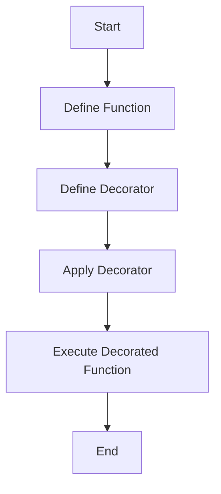

## 27.5 Decorators (Experimental)

In the world of programming, decorators are a powerful tool that allow developers to modify the behavior of functions or classes without altering their actual code. While decorators are widely used in languages like Python, they are still an experimental feature in JavaScript. In this section, we'll explore what decorators are, how they work, and their potential use cases. We'll also discuss the current status of decorators in JavaScript and encourage you to stay updated on their progress.

### What are Decorators?

Decorators are a design pattern that allows you to add new functionality to existing code in a clean and readable way. They are often used to modify or extend the behavior of functions or classes. In essence, a decorator is a higher-order function that takes another function or class as an argument and returns a new function or class with added behavior.

#### Key Concepts of Decorators

- **Function Modification**: Decorators can modify the input, output, or behavior of a function.
- **Reusability**: Decorators promote code reuse by allowing you to apply the same modification to multiple functions or classes.
- **Separation of Concerns**: By using decorators, you can separate the core functionality of a function from its additional behavior, such as logging or validation.

### The Experimental Status of Decorators in JavaScript

As of now, decorators are an experimental feature in JavaScript. They are part of a proposal for ECMAScript, the standard that governs JavaScript, and are currently at Stage 2 in the TC39 process. This means they are still under discussion and may undergo changes before becoming a standard feature.

To use decorators in JavaScript today, you typically need to use a transpiler like Babel, which allows you to write code using future JavaScript features and compile it into code that can run in current JavaScript environments.

### Using Decorators in Other Languages

Before we dive into JavaScript decorators, let's look at how decorators are used in other programming languages, such as Python. This will help us understand the concept and its potential applications.

#### Python Decorators Example

In Python, decorators are used extensively to modify functions or methods. Here's a simple example of a decorator that logs the execution time of a function:

```python
import time

def timing_decorator(func):
    def wrapper(*args, **kwargs):
        start_time = time.time()
        result = func(*args, **kwargs)
        end_time = time.time()
        print(f"Function {func.__name__} took {end_time - start_time:.4f} seconds")
        return result
    return wrapper

@timing_decorator
def slow_function():
    time.sleep(2)
    return "Finished"

print(slow_function())
```

In this example, the `timing_decorator` function is a decorator that wraps the `slow_function` and logs its execution time.

### Implementing Decorators in JavaScript with Babel

While decorators are not yet a standard feature in JavaScript, you can experiment with them using Babel. Here's how you can implement a similar timing decorator in JavaScript:

```javascript
// Install Babel and the decorators plugin
// npm install --save-dev @babel/core @babel/cli @babel/preset-env @babel/plugin-proposal-decorators

// .babelrc configuration
{
  "presets": ["@babel/preset-env"],
  "plugins": [["@babel/plugin-proposal-decorators", { "legacy": true }]]
}

// JavaScript code with decorators
function timingDecorator(target, name, descriptor) {
    const originalMethod = descriptor.value;
    descriptor.value = function(...args) {
        const startTime = performance.now();
        const result = originalMethod.apply(this, args);
        const endTime = performance.now();
        console.log(`Function ${name} took ${endTime - startTime} milliseconds`);
        return result;
    };
    return descriptor;
}

class Example {
    @timingDecorator
    slowFunction() {
        for (let i = 0; i < 1e6; i++) {} // Simulate a slow operation
        return "Finished";
    }
}

const example = new Example();
console.log(example.slowFunction());
```

In this example, the `timingDecorator` is applied to the `slowFunction` method of the `Example` class, logging its execution time.

### Potential Use Cases for Decorators

Decorators can be used in a variety of scenarios to enhance the functionality of your code. Here are some common use cases:

#### 1. Logging

Decorators can be used to log the execution of functions or methods, as shown in the examples above. This is useful for debugging and monitoring the performance of your code.

#### 2. Access Control

You can use decorators to enforce access control, ensuring that only authorized users can execute certain functions or methods. For example, you might create a decorator that checks if a user is authenticated before allowing them to access a resource.

#### 3. Caching

Decorators can be used to cache the results of expensive function calls, improving the performance of your application. By storing the results of previous calls, you can avoid redundant computations.

#### 4. Validation

You can use decorators to validate the inputs of a function, ensuring that they meet certain criteria before the function is executed. This can help prevent errors and improve the robustness of your code.

### Visualizing Decorator Usage

To better understand how decorators work, let's visualize the process of applying a decorator to a function using a flowchart.



In this flowchart, we start by defining a function and a decorator. We then apply the decorator to the function, resulting in a decorated function that can be executed with the added behavior.

### Staying Updated on JavaScript Decorators

Since decorators are still an experimental feature in JavaScript, it's important to stay informed about their progress. You can follow the TC39 process and check for updates on the ECMAScript proposals page. Additionally, keep an eye on Babel and other tools that support experimental JavaScript features.

### Try It Yourself

Now that you have a basic understanding of decorators, try implementing your own decorators in JavaScript using Babel. Experiment with different use cases, such as logging, access control, or validation. Modify the examples provided to suit your needs and see how decorators can enhance your code.

### Knowledge Check

- What are decorators, and how do they modify functions?
- How can decorators promote code reuse and separation of concerns?
- What is the current status of decorators in JavaScript?
- How can you use Babel to experiment with decorators in JavaScript?
- What are some potential use cases for decorators?

### Summary

Decorators are a powerful tool for modifying the behavior of functions and classes. While they are still an experimental feature in JavaScript, they offer a clean and reusable way to add new functionality to your code. By understanding how decorators work and experimenting with them using Babel, you can prepare for their eventual inclusion in the JavaScript standard. Remember to stay updated on the progress of decorators and continue exploring their potential applications in your projects.

## Quiz Time!



### What are decorators in programming?

- [x] A design pattern that allows adding new functionality to existing code
- [ ] A method for removing functions from a codebase
- [ ] A tool for compiling JavaScript code
- [ ] A feature exclusive to Python

> **Explanation:** Decorators are a design pattern used to add new functionality to existing code, often used to modify or extend the behavior of functions or classes.

### What is the current status of decorators in JavaScript?

- [ ] They are a standard feature
- [ ] They are deprecated
- [x] They are an experimental feature
- [ ] They are not part of JavaScript

> **Explanation:** Decorators are currently an experimental feature in JavaScript, part of a proposal for ECMAScript.

### Which tool can you use to experiment with decorators in JavaScript?

- [ ] Node.js
- [x] Babel
- [ ] TypeScript
- [ ] Webpack

> **Explanation:** Babel is a transpiler that allows you to use future JavaScript features, including decorators, by compiling them into code that can run in current environments.

### What is a common use case for decorators?

- [x] Logging
- [ ] Compiling code
- [ ] Removing functions
- [ ] Creating databases

> **Explanation:** Logging is a common use case for decorators, as they can be used to log the execution of functions or methods.

### How do decorators promote code reuse?

- [x] By allowing the same modification to be applied to multiple functions or classes
- [ ] By removing the need for functions
- [ ] By compiling code into a single file
- [ ] By creating new programming languages

> **Explanation:** Decorators promote code reuse by allowing the same modification to be applied to multiple functions or classes, enhancing their functionality without altering their core code.

### What is a decorator in Python?

- [x] A function that wraps another function to modify its behavior
- [ ] A method for deleting functions
- [ ] A tool for compiling Python code
- [ ] A feature exclusive to JavaScript

> **Explanation:** In Python, a decorator is a function that wraps another function to modify its behavior, often used for logging, validation, or access control.

### How can decorators be used for access control?

- [x] By enforcing checks to ensure only authorized users can execute certain functions
- [ ] By removing unauthorized functions from the codebase
- [ ] By compiling code into secure files
- [ ] By creating new programming languages

> **Explanation:** Decorators can enforce access control by performing checks to ensure that only authorized users can execute certain functions or methods.

### What is a potential benefit of using decorators for caching?

- [x] Improved performance by avoiding redundant computations
- [ ] Decreased code readability
- [ ] Increased complexity
- [ ] Reduced functionality

> **Explanation:** Decorators can improve performance by caching the results of expensive function calls, avoiding redundant computations.

### How can decorators help with validation?

- [x] By ensuring inputs meet certain criteria before a function is executed
- [ ] By removing invalid functions from the codebase
- [ ] By compiling code into valid files
- [ ] By creating new programming languages

> **Explanation:** Decorators can help with validation by ensuring that inputs meet certain criteria before a function is executed, preventing errors and improving robustness.

### True or False: Decorators are a standard feature in JavaScript.

- [ ] True
- [x] False

> **Explanation:** False. Decorators are not yet a standard feature in JavaScript; they are currently an experimental feature.



Remember, this is just the beginning. As you progress, you'll build more complex and interactive web pages. Keep experimenting, stay curious, and enjoy the journey!
