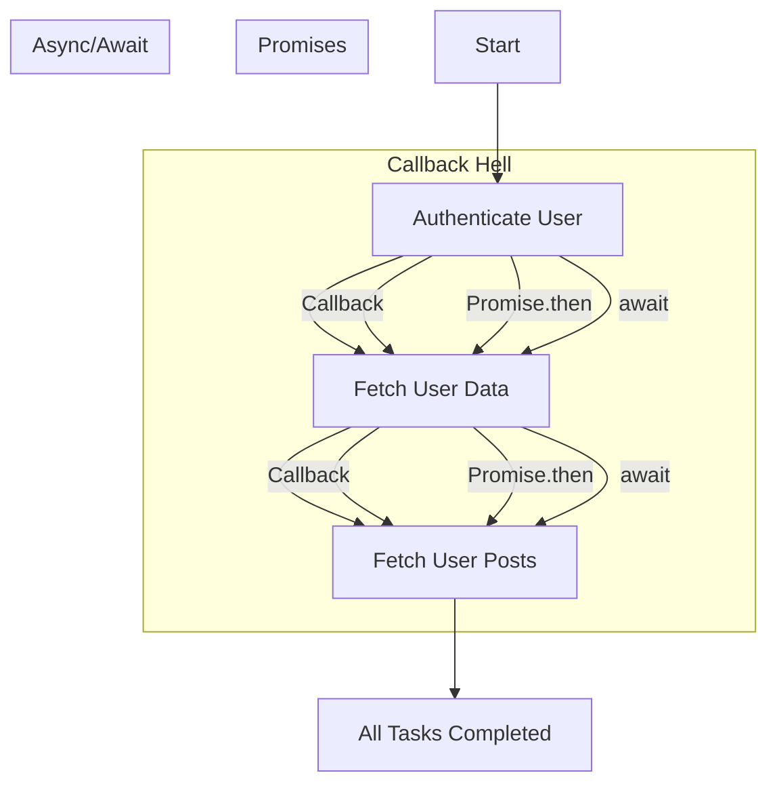

## 28.1 Callback Hell and Solutions

As we delve into the world of asynchronous programming in JavaScript, one of the first challenges we encounter is the infamous "callback hell," also known as the "pyramid of doom." This section will guide you through understanding what callback hell is, why it poses a problem, and how we can overcome it using modern JavaScript features like promises and `async/await`.

### Understanding Callback Hell

Callback hell occurs when we have multiple nested callback functions, leading to code that is difficult to read and maintain. This often happens when dealing with asynchronous operations that depend on each other, such as making a series of API calls where each call depends on the result of the previous one.

#### What is a Callback?

Before diving into callback hell, let's briefly revisit what a callback is. A callback is a function passed into another function as an argument, which is then invoked inside the outer function to complete some kind of routine or action.

Here's a simple example of a callback function:

```javascript
function fetchData(callback) {
    setTimeout(() => {
        const data = { name: 'John Doe', age: 30 };
        callback(data);
    }, 1000);
}

function displayData(data) {
    console.log(`Name: ${data.name}, Age: ${data.age}`);
}

fetchData(displayData);
```

In this example, `fetchData` is an asynchronous function that simulates fetching data from a server. Once the data is fetched, it calls the `displayData` function, passing the data as an argument.

#### The Pyramid of Doom

Now, let's consider a scenario where we need to perform several asynchronous operations in sequence. This is where callback hell rears its ugly head. Here's an example:

```javascript
function authenticateUser(username, password, callback) {
    setTimeout(() => {
        console.log('User authenticated');
        callback();
    }, 1000);
}

function fetchUserData(callback) {
    setTimeout(() => {
        console.log('User data fetched');
        callback();
    }, 1000);
}

function fetchUserPosts(callback) {
    setTimeout(() => {
        console.log('User posts fetched');
        callback();
    }, 1000);
}

authenticateUser('user', 'pass', () => {
    fetchUserData(() => {
        fetchUserPosts(() => {
            console.log('All tasks completed');
        });
    });
});
```

In this example, each function depends on the completion of the previous one, resulting in deeply nested callbacks. This structure resembles a pyramid, hence the term "pyramid of doom."

### Problems with Callback Hell

Callback hell introduces several issues:

1. **Readability**: The code becomes difficult to read and understand due to the nested structure.
2. **Maintainability**: Making changes or debugging such code is challenging, as you need to trace through multiple levels of nested functions.
3. **Error Handling**: Managing errors becomes cumbersome, as each callback needs its own error handling logic.

### Solutions to Callback Hell

Fortunately, JavaScript provides modern solutions to tackle callback hell, making asynchronous code more manageable and readable. Let's explore these solutions:

#### Promises

A promise is an object representing the eventual completion or failure of an asynchronous operation. Promises provide a cleaner way to handle asynchronous operations, avoiding the need for deeply nested callbacks.

Here's how we can rewrite the previous example using promises:

```javascript
function authenticateUser(username, password) {
    return new Promise((resolve, reject) => {
        setTimeout(() => {
            console.log('User authenticated');
            resolve();
        }, 1000);
    });
}

function fetchUserData() {
    return new Promise((resolve, reject) => {
        setTimeout(() => {
            console.log('User data fetched');
            resolve();
        }, 1000);
    });
}

function fetchUserPosts() {
    return new Promise((resolve, reject) => {
        setTimeout(() => {
            console.log('User posts fetched');
            resolve();
        }, 1000);
    });
}

authenticateUser('user', 'pass')
    .then(fetchUserData)
    .then(fetchUserPosts)
    .then(() => {
        console.log('All tasks completed');
    })
    .catch(error => {
        console.error('An error occurred:', error);
    });
```

In this example, each function returns a promise, and we use the `then` method to chain the asynchronous operations. This approach significantly improves readability and makes error handling more straightforward with the `catch` method.

#### `async` and `await`

The `async` and `await` keywords, introduced in ECMAScript 2017, provide an even more intuitive way to work with promises. They allow us to write asynchronous code that looks and behaves like synchronous code.

Here's the same example using `async` and `await`:

```javascript
async function performTasks() {
    try {
        await authenticateUser('user', 'pass');
        await fetchUserData();
        await fetchUserPosts();
        console.log('All tasks completed');
    } catch (error) {
        console.error('An error occurred:', error);
    }
}

performTasks();
```

With `async` and `await`, we can write asynchronous code in a linear fashion, making it easier to read and maintain. The `async` keyword is used to declare a function that returns a promise, and the `await` keyword is used to pause the execution of the function until the promise is resolved.

### Visualizing Callback Hell and Solutions

To better understand the transition from callback hell to promises and `async/await`, let's visualize the process:



**Caption**: This diagram illustrates the flow of asynchronous operations using callbacks, promises, and `async/await`. The transition from callback hell to promises and `async/await` simplifies the code structure and improves readability.

### Try It Yourself

Experiment with the code examples provided above. Try modifying the delay times or adding additional asynchronous functions to see how the code structure changes. Practice converting callback-based code to use promises and `async/await` to solidify your understanding.

### References and Further Reading

- [MDN Web Docs: Promises](https://developer.mozilla.org/en-US/docs/Web/JavaScript/Guide/Using_promises)
- [MDN Web Docs: async function](https://developer.mozilla.org/en-US/docs/Web/JavaScript/Reference/Statements/async_function)
- [JavaScript.info: Promises, async/await](https://javascript.info/async)

### Knowledge Check

Let's reinforce what we've learned with a few questions and exercises:

1. What is callback hell, and why is it problematic?
2. Rewrite a simple callback-based function using promises.
3. Convert a promise-based function to use `async` and `await`.
4. Discuss the benefits of using `async/await` over promises.
5. How does error handling differ between callbacks, promises, and `async/await`?

### Embrace the Journey

Remember, mastering asynchronous programming in JavaScript is a journey. As you continue to explore and practice, you'll become more comfortable with these concepts and patterns. Keep experimenting, stay curious, and enjoy the process of learning and growing as a JavaScript developer!

### Summary

In this section, we've explored the challenges of callback hell and how modern JavaScript features like promises and `async/await` provide elegant solutions. By adopting these patterns, we can write cleaner, more maintainable asynchronous code. As you continue your journey, remember to embrace these tools and techniques to enhance your JavaScript programming skills.

## Quiz Time!



### What is callback hell?

- [x] A situation where callbacks are nested within each other, leading to difficult-to-read code.
- [ ] A type of error that occurs when a callback function is not defined.
- [ ] A method for handling asynchronous operations in JavaScript.
- [ ] A debugging tool for identifying callback functions.

> **Explanation:** Callback hell refers to the situation where multiple nested callbacks lead to code that is difficult to read and maintain.

### Which of the following is a disadvantage of callback hell?

- [x] Reduced readability and maintainability.
- [ ] Improved error handling.
- [ ] Simplified code structure.
- [ ] Enhanced performance.

> **Explanation:** Callback hell reduces readability and maintainability due to deeply nested callbacks.

### How can promises help avoid callback hell?

- [x] By allowing chaining of asynchronous operations using `.then()`.
- [ ] By eliminating the need for asynchronous operations.
- [ ] By providing synchronous execution of functions.
- [ ] By automatically handling errors in callbacks.

> **Explanation:** Promises allow chaining of asynchronous operations using `.then()`, which helps avoid deeply nested callbacks.

### What does the `async` keyword do in JavaScript?

- [x] Declares a function that returns a promise.
- [ ] Pauses the execution of a function until a promise is resolved.
- [ ] Converts a synchronous function into an asynchronous one.
- [ ] Automatically handles errors in asynchronous code.

> **Explanation:** The `async` keyword declares a function that returns a promise, allowing the use of `await` within the function.

### What is the purpose of the `await` keyword?

- [x] To pause the execution of an `async` function until a promise is resolved.
- [ ] To declare a function as asynchronous.
- [ ] To handle errors in asynchronous functions.
- [ ] To convert a callback function into a promise.

> **Explanation:** The `await` keyword pauses the execution of an `async` function until a promise is resolved.

### Which of the following is a benefit of using `async/await`?

- [x] Improved readability of asynchronous code.
- [ ] Automatic error handling.
- [ ] Faster execution of asynchronous operations.
- [ ] Elimination of the need for promises.

> **Explanation:** `async/await` improves the readability of asynchronous code by allowing it to be written in a linear fashion.

### How does error handling differ between promises and `async/await`?

- [x] Promises use `.catch()`, while `async/await` uses `try...catch`.
- [ ] Both use `.catch()` for error handling.
- [ ] Promises automatically handle errors, while `async/await` does not.
- [ ] `async/await` requires a separate error handling function.

> **Explanation:** Promises use `.catch()` for error handling, while `async/await` uses `try...catch` blocks.

### What is a common use case for promises?

- [x] Handling asynchronous operations like API calls.
- [ ] Converting synchronous code to asynchronous.
- [ ] Debugging callback functions.
- [ ] Automatically resolving errors in code.

> **Explanation:** Promises are commonly used to handle asynchronous operations like API calls, providing a cleaner way to manage asynchronous code.

### What is the main advantage of using `async/await` over promises?

- [x] Easier to read and write asynchronous code.
- [ ] Faster execution of asynchronous operations.
- [ ] Automatic error handling.
- [ ] Elimination of the need for callbacks.

> **Explanation:** `async/await` makes asynchronous code easier to read and write by allowing it to be structured like synchronous code.

### True or False: Callback hell is an issue that only occurs in JavaScript.

- [ ] True
- [x] False

> **Explanation:** Callback hell can occur in any programming language that uses callbacks for asynchronous operations, not just JavaScript.


