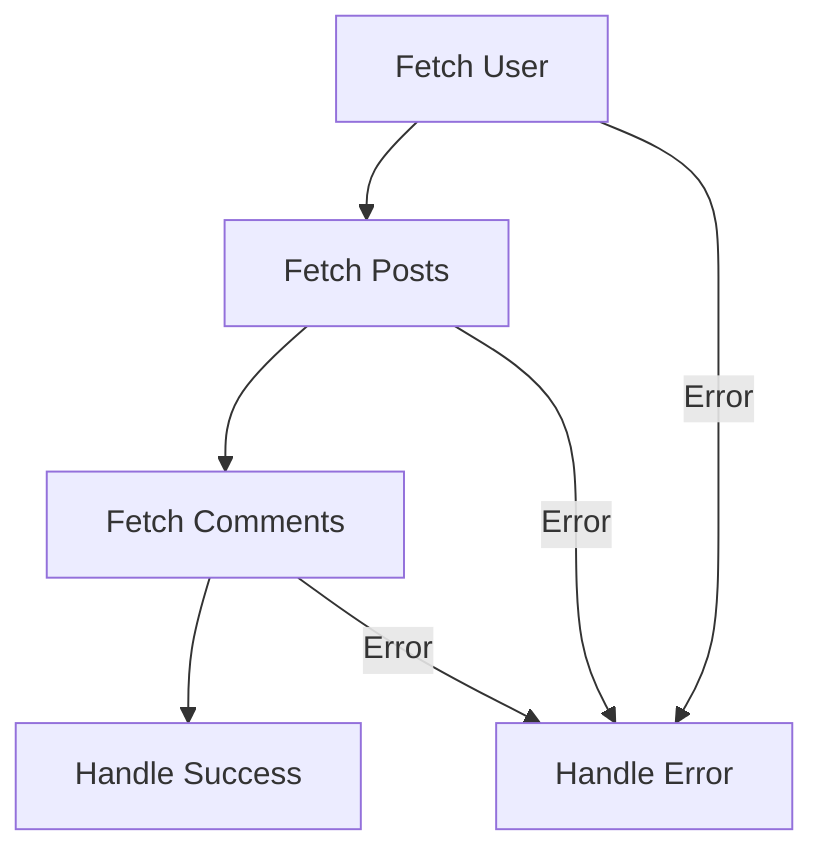

## 28.2 Promises Chaining

In the world of JavaScript, handling asynchronous operations is a common task. Whether you're fetching data from a server, reading files, or performing time-consuming calculations, asynchronous operations are essential for creating responsive applications. Promises provide a powerful way to manage these operations, and promise chaining is a technique that can greatly enhance the readability and maintainability of your code. In this section, we'll explore how promise chaining works, provide examples of sequential asynchronous operations, discuss error propagation, and highlight best practices for keeping your promise chains clean and efficient.

### Understanding Promises Chaining

Promise chaining is a technique that allows you to perform a series of asynchronous operations in sequence. Each operation returns a promise, and the next operation in the chain waits for the previous promise to resolve before executing. This creates a clean, linear flow of asynchronous tasks, making your code easier to read and maintain.

#### How Promise Chaining Works

When you call `.then()` on a promise, it returns a new promise. This new promise can be chained with additional `.then()` calls, allowing you to sequence multiple asynchronous operations. Here's a simple example to illustrate the concept:

```javascript
// Example of promise chaining
function fetchData(url) {
  return new Promise((resolve, reject) => {
    setTimeout(() => {
      if (url) {
        resolve(`Data from ${url}`);
      } else {
        reject('No URL provided');
      }
    }, 1000);
  });
}

fetchData('https://api.example.com/data')
  .then((data) => {
    console.log(data); // Logs: Data from https://api.example.com/data
    return fetchData('https://api.example.com/more-data');
  })
  .then((moreData) => {
    console.log(moreData); // Logs: Data from https://api.example.com/more-data
  })
  .catch((error) => {
    console.error('Error:', error);
  });
```

In this example, `fetchData` is a function that returns a promise. We call it twice, chaining the calls with `.then()`. If any promise in the chain is rejected, the `.catch()` block handles the error.

### Sequential Asynchronous Operations

Promise chaining is particularly useful when you need to perform a series of asynchronous operations that depend on each other. Let's consider a practical example where we need to fetch user data, then fetch the user's posts, and finally fetch comments for each post.

```javascript
function fetchUser(userId) {
  return new Promise((resolve) => {
    setTimeout(() => {
      resolve({ id: userId, name: 'John Doe' });
    }, 1000);
  });
}

function fetchPosts(userId) {
  return new Promise((resolve) => {
    setTimeout(() => {
      resolve([{ id: 1, title: 'Post 1' }, { id: 2, title: 'Post 2' }]);
    }, 1000);
  });
}

function fetchComments(postId) {
  return new Promise((resolve) => {
    setTimeout(() => {
      resolve(['Comment 1', 'Comment 2']);
    }, 1000);
  });
}

fetchUser(1)
  .then((user) => {
    console.log('User:', user);
    return fetchPosts(user.id);
  })
  .then((posts) => {
    console.log('Posts:', posts);
    return fetchComments(posts[0].id);
  })
  .then((comments) => {
    console.log('Comments:', comments);
  })
  .catch((error) => {
    console.error('Error:', error);
  });
```

In this example, each function returns a promise that resolves after a delay. We chain the promises to ensure that each operation completes before the next one begins.

### Error Propagation in Promise Chains

One of the significant advantages of promise chaining is the ability to handle errors in a centralized manner. If any promise in the chain is rejected, the error is propagated down the chain until it is caught by a `.catch()` block. This makes error handling much more straightforward compared to nested callbacks.

#### Example of Error Propagation

Let's modify our previous example to simulate an error in one of the asynchronous operations:

```javascript
function fetchUser(userId) {
  return new Promise((resolve, reject) => {
    setTimeout(() => {
      if (userId === 1) {
        resolve({ id: userId, name: 'John Doe' });
      } else {
        reject('User not found');
      }
    }, 1000);
  });
}

fetchUser(2)
  .then((user) => {
    console.log('User:', user);
    return fetchPosts(user.id);
  })
  .then((posts) => {
    console.log('Posts:', posts);
    return fetchComments(posts[0].id);
  })
  .then((comments) => {
    console.log('Comments:', comments);
  })
  .catch((error) => {
    console.error('Error:', error); // Logs: Error: User not found
  });
```

In this case, the `fetchUser` function rejects the promise if the user ID is not 1. The error is caught by the `.catch()` block at the end of the chain.

### Best Practices for Promise Chaining

To make the most of promise chaining, it's essential to follow some best practices that will help you keep your code clean and efficient.

#### Keep Chains Linear

Avoid nesting `.then()` calls within each other. Instead, return promises from within `.then()` callbacks to keep the chain linear. This improves readability and makes error handling more straightforward.

#### Use Descriptive Function Names

When chaining promises, use descriptive function names to make the flow of operations clear. This will help others (and yourself) understand the purpose of each step in the chain.

#### Handle Errors Gracefully

Always include a `.catch()` block at the end of your promise chains to handle any errors that may occur. This ensures that your application can gracefully recover from unexpected issues.

#### Avoid Long Chains

While chaining promises is a powerful technique, avoid creating excessively long chains. If a chain becomes too long, consider breaking it into smaller, more manageable functions.

#### Use Async/Await for Simplicity

In modern JavaScript, the `async` and `await` keywords provide a more straightforward way to work with promises. They allow you to write asynchronous code that looks synchronous, making it easier to read and maintain. However, understanding promise chaining is still valuable, as it forms the foundation of asynchronous programming in JavaScript.

### Improvements Over Nested Callbacks

Before promises, handling asynchronous operations often involved using nested callbacks, commonly known as "callback hell." This approach made code difficult to read and maintain, as each nested callback increased the complexity of the code.

Promise chaining offers several improvements over nested callbacks:

- **Improved Readability**: Promise chains create a linear flow of operations, making the code easier to follow.
- **Centralized Error Handling**: Errors are propagated down the chain and can be handled in a single `.catch()` block, simplifying error management.
- **Separation of Concerns**: Each step in a promise chain can be encapsulated in its own function, promoting modular and reusable code.

### Visualizing Promise Chaining

To help you visualize how promise chaining works, let's use a flowchart to represent the sequence of operations in our earlier example.



In this flowchart, each node represents an asynchronous operation. The arrows indicate the flow of execution, with errors being directed to a centralized error handling node.

### Try It Yourself

To reinforce your understanding of promise chaining, try modifying the code examples provided in this section. Here are a few suggestions:

- **Experiment with Error Handling**: Introduce errors at different points in the chain and observe how they propagate.
- **Add More Steps**: Extend the chain by adding additional asynchronous operations, such as fetching additional data or performing calculations.
- **Use Async/Await**: Rewrite the promise chains using `async` and `await` to see how it simplifies the code.

### References and Links

For more information on promises and asynchronous programming in JavaScript, check out the following resources:

- [MDN Web Docs: Promises](https://developer.mozilla.org/en-US/docs/Web/JavaScript/Guide/Using_promises)
- [JavaScript.info: Promises](https://javascript.info/promise-basics)
- [W3Schools: JavaScript Promises](https://www.w3schools.com/js/js_promise.asp)

### Knowledge Check

Before we wrap up, let's review some key takeaways from this section:

- Promise chaining allows you to perform asynchronous operations in sequence, improving code readability and maintainability.
- Errors in a promise chain are propagated down the chain and can be handled in a single `.catch()` block.
- Best practices for promise chaining include keeping chains linear, using descriptive function names, and handling errors gracefully.
- Promise chaining offers significant improvements over nested callbacks, including improved readability and centralized error handling.

### Embrace the Journey

Remember, mastering promises and asynchronous programming is a journey. As you continue to practice and experiment with these concepts, you'll become more comfortable and confident in handling asynchronous operations in JavaScript. Keep exploring, stay curious, and enjoy the process!

## Quiz Time!



### What is promise chaining?

- [x] A technique to perform asynchronous operations in sequence using promises.
- [ ] A method to execute synchronous code in parallel.
- [ ] A way to handle errors in synchronous code.
- [ ] A technique to nest callbacks within promises.

> **Explanation:** Promise chaining allows you to perform a series of asynchronous operations in sequence, each returning a promise.

### How does error propagation work in a promise chain?

- [x] Errors are propagated down the chain until caught by a `.catch()` block.
- [ ] Errors stop the execution of the entire chain immediately.
- [ ] Errors are ignored if not handled in each `.then()` block.
- [ ] Errors are handled automatically without the need for a `.catch()` block.

> **Explanation:** Errors in a promise chain are propagated down the chain and can be caught by a `.catch()` block.

### What is a key advantage of promise chaining over nested callbacks?

- [x] Improved readability and centralized error handling.
- [ ] Faster execution of asynchronous operations.
- [ ] Ability to handle synchronous code.
- [ ] Automatic error correction.

> **Explanation:** Promise chaining offers improved readability and centralized error handling compared to nested callbacks.

### Which of the following is a best practice for promise chaining?

- [x] Keep chains linear and avoid nesting `.then()` calls.
- [ ] Use long chains with many `.then()` calls.
- [ ] Ignore errors to simplify the chain.
- [ ] Use nested callbacks within promises.

> **Explanation:** Keeping chains linear and avoiding nesting `.then()` calls improves readability and error handling.

### What does the `.then()` method return?

- [x] A new promise.
- [ ] The original promise.
- [ ] A resolved value.
- [ ] An error object.

> **Explanation:** The `.then()` method returns a new promise, allowing for chaining.

### How can you handle errors in a promise chain?

- [x] Use a `.catch()` block at the end of the chain.
- [ ] Use a `.then()` block to catch errors.
- [ ] Ignore errors to keep the chain simple.
- [ ] Use nested callbacks to handle errors.

> **Explanation:** A `.catch()` block at the end of the chain is used to handle errors.

### What is the purpose of using descriptive function names in promise chains?

- [x] To make the flow of operations clear and understandable.
- [ ] To increase the length of the code.
- [ ] To confuse other developers.
- [ ] To make the code run faster.

> **Explanation:** Descriptive function names help make the flow of operations clear and understandable.

### What is a common issue with nested callbacks?

- [x] Callback hell, making code difficult to read and maintain.
- [ ] Faster execution of asynchronous operations.
- [ ] Automatic error handling.
- [ ] Improved code readability.

> **Explanation:** Nested callbacks can lead to callback hell, making code difficult to read and maintain.

### How can you simplify promise chains in modern JavaScript?

- [x] Use `async` and `await` keywords.
- [ ] Use more `.then()` calls.
- [ ] Use nested callbacks.
- [ ] Ignore errors.

> **Explanation:** The `async` and `await` keywords simplify promise chains by making asynchronous code look synchronous.

### True or False: Promise chaining can only be used with network requests.

- [ ] True
- [x] False

> **Explanation:** False. Promise chaining can be used with any asynchronous operation, not just network requests.


