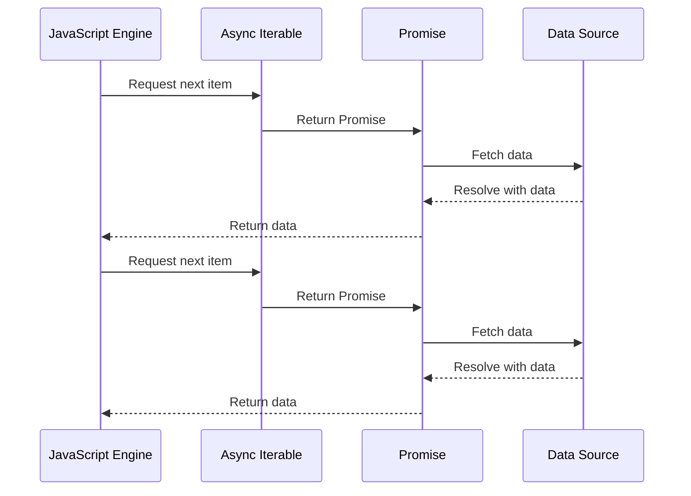

## 28.3 Async Iteration with `for await...of`

In the world of JavaScript, handling asynchronous operations is a crucial skill. As applications become more complex, they often need to process data that arrives over time, such as data from a server or user inputs. To manage such scenarios efficiently, JavaScript provides a powerful construct known as the `for await...of` loop. This loop allows us to iterate over asynchronous data sources seamlessly, making our code cleaner and more intuitive.

### Introducing the `for await...of` Loop

The `for await...of` loop is an extension of the traditional `for...of` loop, designed to work with asynchronous iterables. It allows us to iterate over data that is fetched or computed asynchronously, such as data from a network request or a file read operation. This loop is particularly useful when dealing with streams of data that are not immediately available.

#### How Does It Work?

The `for await...of` loop waits for each promise in the iterable to resolve before proceeding to the next iteration. This means that the loop will pause at each iteration until the promise is resolved, allowing us to handle asynchronous data in a synchronous-like manner.

Here's a simple syntax of the `for await...of` loop:

```javascript
for await (const item of asyncIterable) {
  // Process each item
}
```

- **asyncIterable**: This is an object that implements the asynchronous iteration protocol, meaning it has a `[Symbol.asyncIterator]()` method that returns an object with a `next()` method returning a promise.

### Understanding Asynchronous Iterables

To use the `for await...of` loop, we need to understand asynchronous iterables. An asynchronous iterable is an object that conforms to the asynchronous iteration protocol, which involves implementing the `[Symbol.asyncIterator]()` method. This method should return an object with a `next()` method that returns a promise.

#### Creating an Asynchronous Iterable

Let's create a simple asynchronous iterable to understand how it works:

```javascript
const asyncIterable = {
  [Symbol.asyncIterator]() {
    let i = 0;
    return {
      next() {
        if (i < 3) {
          return Promise.resolve({ value: i++, done: false });
        }
        return Promise.resolve({ done: true });
      }
    };
  }
};

(async () => {
  for await (const num of asyncIterable) {
    console.log(num); // Outputs 0, 1, 2
  }
})();
```

- **[Symbol.asyncIterator]**: This method returns an object with a `next()` method.
- **next()**: This method returns a promise that resolves to an object with `value` and `done` properties.

### Iterating Over Streams and Asynchronous Data

The `for await...of` loop is particularly useful when working with streams or data that arrives over time. For example, when fetching data from an API or reading a file in chunks, we can use this loop to process each piece of data as it arrives.

#### Example: Fetching Data from an API

Consider a scenario where we want to fetch data from an API that returns a stream of data chunks. We can use the `for await...of` loop to process each chunk as it arrives:

```javascript
async function fetchData(url) {
  const response = await fetch(url);
  const reader = response.body.getReader();

  const stream = new ReadableStream({
    async start(controller) {
      while (true) {
        const { done, value } = await reader.read();
        if (done) break;
        controller.enqueue(value);
      }
      controller.close();
    }
  });

  const asyncIterable = stream[Symbol.asyncIterator]();

  for await (const chunk of asyncIterable) {
    console.log(new TextDecoder().decode(chunk)); // Process each chunk
  }
}

fetchData('https://api.example.com/data');
```

- **fetch()**: This function fetches data from the specified URL.
- **ReadableStream**: This object represents a stream of data that can be read.
- **TextDecoder**: This object is used to decode the binary data chunks into text.

### Requirements for Asynchronous Iterables

For an object to be asynchronously iterable, it must implement the asynchronous iteration protocol. This involves:

1. **Implementing the `[Symbol.asyncIterator]()` Method**: This method should return an object with a `next()` method that returns a promise.

2. **Returning a Promise from the `next()` Method**: The `next()` method should return a promise that resolves to an object with `value` and `done` properties.

3. **Handling Asynchronous Operations**: The `next()` method should handle any asynchronous operations required to produce the next value.

### Practical Applications of `for await...of`

The `for await...of` loop is incredibly useful in various practical scenarios, such as:

- **Processing Data Streams**: Use the loop to process data streams from APIs, files, or user inputs.
- **Handling Real-time Data**: Iterate over real-time data sources, such as WebSockets or event streams.
- **Efficient Resource Management**: Manage resources efficiently by processing data as it arrives, rather than waiting for all data to be available.

#### Example: Real-time Data Processing

Imagine an application that receives real-time data updates from a WebSocket. We can use the `for await...of` loop to process each update as it arrives:

```javascript
async function processWebSocketData(socket) {
  const asyncIterable = {
    [Symbol.asyncIterator]() {
      return {
        next() {
          return new Promise((resolve) => {
            socket.onmessage = (event) => {
              resolve({ value: event.data, done: false });
            };
          });
        }
      };
    }
  };

  for await (const message of asyncIterable) {
    console.log('Received message:', message); // Process each message
  }
}

const socket = new WebSocket('wss://example.com/socket');
processWebSocketData(socket);
```

- **WebSocket**: This object represents a connection to a WebSocket server.
- **onmessage**: This event handler is triggered when a message is received from the server.

### Visualizing Asynchronous Iteration

To better understand how the `for await...of` loop processes asynchronous data, let's visualize the flow of data using a Mermaid.js diagram.



**Diagram Description**: This sequence diagram illustrates the interaction between the JavaScript engine, an asynchronous iterable, promises, and a data source. The JavaScript engine requests the next item, the iterable returns a promise, the promise fetches data from the source, and the resolved data is returned to the engine.

### Try It Yourself

Now that we've explored the `for await...of` loop, let's try some hands-on experimentation. Modify the code examples provided to see how they behave with different data sources or conditions. Here are a few suggestions:

- **Change the Data Source**: Use a different API or WebSocket URL to see how the loop handles various data streams.
- **Add Error Handling**: Implement error handling within the loop to manage potential issues with data retrieval.
- **Combine with Other Async Patterns**: Experiment with combining the `for await...of` loop with other asynchronous patterns, such as promises or async functions.

### Knowledge Check

Before we wrap up, let's reinforce what we've learned with a few questions:

- What is the primary purpose of the `for await...of` loop?
- How does the `for await...of` loop differ from the traditional `for...of` loop?
- What are the requirements for an object to be asynchronously iterable?
- How can we use the `for await...of` loop to process real-time data?

### Embrace the Journey

Remember, mastering asynchronous iteration is a journey. As you continue to explore JavaScript, you'll encounter more complex scenarios and data sources. Keep experimenting, stay curious, and enjoy the process of learning and growing as a developer!

### References and Links

For further reading and deeper dives into the topics covered, consider exploring the following resources:

- [MDN Web Docs: for await...of](https://developer.mozilla.org/en-US/docs/Web/JavaScript/Reference/Statements/for-await...of)
- [JavaScript Info: Async Iteration](https://javascript.info/async-iterators-generators)
- [W3Schools: JavaScript Async Iteration](https://www.w3schools.com/js/js_async_iteration.asp)

## Quiz Time!



### What is the primary purpose of the `for await...of` loop?

- [x] To iterate over asynchronous data sources
- [ ] To iterate over synchronous data sources
- [ ] To handle errors in asynchronous code
- [ ] To create promises

> **Explanation:** The `for await...of` loop is specifically designed to iterate over asynchronous data sources, allowing us to handle data that arrives over time.

### How does the `for await...of` loop differ from the traditional `for...of` loop?

- [x] It waits for each promise to resolve before proceeding
- [ ] It processes all data at once
- [ ] It only works with arrays
- [ ] It is used for error handling

> **Explanation:** The `for await...of` loop waits for each promise in the iterable to resolve before proceeding to the next iteration, unlike the traditional `for...of` loop which works with synchronous data.

### What must an object implement to be asynchronously iterable?

- [x] The `[Symbol.asyncIterator]()` method
- [ ] The `[Symbol.iterator]()` method
- [ ] The `next()` method returning a value
- [ ] The `then()` method

> **Explanation:** An object must implement the `[Symbol.asyncIterator]()` method, which returns an object with a `next()` method that returns a promise, to be considered asynchronously iterable.

### In the context of `for await...of`, what does the `next()` method return?

- [x] A promise that resolves to an object with `value` and `done` properties
- [ ] A promise that resolves to a single value
- [ ] An object with `value` and `done` properties
- [ ] A single value

> **Explanation:** The `next()` method in an asynchronous iterable returns a promise that resolves to an object containing `value` and `done` properties.

### Which of the following is a practical application of the `for await...of` loop?

- [x] Processing data streams from APIs
- [ ] Iterating over arrays
- [ ] Handling synchronous events
- [ ] Creating promises

> **Explanation:** The `for await...of` loop is particularly useful for processing data streams from APIs, allowing us to handle data as it arrives.

### Can the `for await...of` loop be used with synchronous iterables?

- [ ] Yes
- [x] No

> **Explanation:** The `for await...of` loop is specifically designed for asynchronous iterables and cannot be used with synchronous iterables.

### What is the role of the `TextDecoder` in the example provided?

- [x] To decode binary data chunks into text
- [ ] To encode text into binary data
- [ ] To handle errors in data processing
- [ ] To create promises

> **Explanation:** The `TextDecoder` object is used to decode binary data chunks into text, allowing us to process the data in a readable format.

### How does the `for await...of` loop handle errors?

- [x] Errors can be caught using a `try...catch` block
- [ ] Errors are ignored
- [ ] Errors are automatically resolved
- [ ] Errors are logged to the console

> **Explanation:** Errors in the `for await...of` loop can be managed using a `try...catch` block, allowing us to handle any issues that arise during iteration.

### What is the benefit of using the `for await...of` loop with real-time data?

- [x] It allows processing of data as it arrives
- [ ] It processes all data at once
- [ ] It handles only synchronous data
- [ ] It creates promises for each data chunk

> **Explanation:** The `for await...of` loop is beneficial for real-time data because it allows us to process each piece of data as it arrives, rather than waiting for all data to be available.

### True or False: The `for await...of` loop can be used in non-async functions.

- [ ] True
- [x] False

> **Explanation:** The `for await...of` loop must be used within an async function, as it relies on asynchronous operations that need to be awaited.


