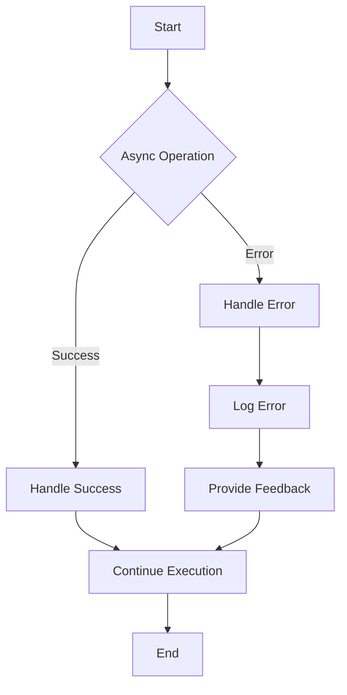

## 28.4 Error Handling in Async Patterns

Asynchronous programming in JavaScript is essential for creating responsive applications that can handle tasks like network requests, file reading, and user interactions without blocking the main thread. However, with the power of asynchronous operations comes the challenge of error handling. This section will guide you through the intricacies of managing errors in asynchronous patterns, including callbacks, promises, and `async/await`.

### Understanding Asynchronous Error Handling

Error handling in asynchronous code differs significantly from synchronous code. In synchronous code, errors can be caught using `try...catch` blocks. However, asynchronous operations require different approaches due to their non-blocking nature. Let's explore how error handling works in various asynchronous patterns.

### Callbacks and Error Handling

#### The Callback Pattern

Callbacks are one of the earliest methods for handling asynchronous operations in JavaScript. A callback is simply a function passed as an argument to another function, which is then executed after the completion of an operation.

#### Error Handling with Callbacks

In the callback pattern, errors are typically handled by passing an error object as the first argument to the callback function. This convention is known as the "error-first" callback pattern.

```javascript
function fetchData(callback) {
    setTimeout(() => {
        const error = false; // Simulate an error condition
        const data = { name: 'John Doe' };

        if (error) {
            callback(new Error('Failed to fetch data'), null);
        } else {
            callback(null, data);
        }
    }, 1000);
}

fetchData((err, data) => {
    if (err) {
        console.error('Error:', err.message);
    } else {
        console.log('Data:', data);
    }
});
```

#### Challenges with Callbacks

- **Callback Hell**: Deeply nested callbacks can lead to complex and hard-to-read code, often referred to as "callback hell."
- **Error Propagation**: Manually passing errors through callbacks can be cumbersome and error-prone.

### Promises and Error Handling

#### The Promise Pattern

Promises provide a more elegant way to handle asynchronous operations. A promise represents a value that may be available now, or in the future, or never. Promises have three states: pending, fulfilled, and rejected.

#### Error Handling with Promises

Promises simplify error handling by using the `.catch()` method to handle errors. This method is called when a promise is rejected.

```javascript
function fetchData() {
    return new Promise((resolve, reject) => {
        setTimeout(() => {
            const error = false; // Simulate an error condition
            const data = { name: 'John Doe' };

            if (error) {
                reject(new Error('Failed to fetch data'));
            } else {
                resolve(data);
            }
        }, 1000);
    });
}

fetchData()
    .then(data => {
        console.log('Data:', data);
    })
    .catch(err => {
        console.error('Error:', err.message);
    });
```

#### Advantages of Promises

- **Chaining**: Promises can be chained, allowing for more readable and maintainable code.
- **Error Propagation**: Errors are automatically propagated through the promise chain, making it easier to handle errors in one place.

### Async/Await and Error Handling

#### The Async/Await Pattern

`async/await` is a syntactic sugar over promises, providing a more synchronous-looking code structure for asynchronous operations. Functions declared with the `async` keyword return a promise, and the `await` keyword is used to wait for a promise to resolve.

#### Error Handling with Async/Await

Error handling with `async/await` is straightforward and uses `try...catch` blocks, similar to synchronous code.

```javascript
async function fetchData() {
    return new Promise((resolve, reject) => {
        setTimeout(() => {
            const error = false; // Simulate an error condition
            const data = { name: 'John Doe' };

            if (error) {
                reject(new Error('Failed to fetch data'));
            } else {
                resolve(data);
            }
        }, 1000);
    });
}

async function getData() {
    try {
        const data = await fetchData();
        console.log('Data:', data);
    } catch (err) {
        console.error('Error:', err.message);
    }
}

getData();
```

#### Benefits of Async/Await

- **Readability**: Code using `async/await` is often easier to read and understand.
- **Error Handling**: Errors can be caught using `try...catch`, providing a familiar syntax for developers.

### Consistent Error Handling

Consistent error handling is crucial for building robust applications. Here are some strategies to ensure consistent error handling across your codebase:

1. **Centralized Error Handling**: Implement a centralized error handling mechanism to log and manage errors consistently.
2. **Error Logging**: Use logging libraries to capture and store error details for debugging and monitoring.
3. **Graceful Degradation**: Ensure your application can handle errors gracefully, providing users with meaningful feedback and maintaining functionality where possible.
4. **Testing**: Rigorous testing of asynchronous code is essential to identify and fix potential errors before they reach production.

### Centralized Error Management

Centralized error management involves creating a unified system for handling errors across your application. This can include:

- **Global Error Handlers**: Set up global error handlers to catch unhandled errors and log them appropriately.
- **Error Reporting Services**: Use third-party services like Sentry or Rollbar to track and report errors in real-time.
- **Custom Error Classes**: Define custom error classes to represent different error types and provide additional context.

### Strategies for Testing Asynchronous Code

Testing asynchronous code can be challenging, but it's crucial for ensuring reliability. Here are some strategies to effectively test asynchronous code:

1. **Use Testing Frameworks**: Leverage testing frameworks like Jest or Mocha that support asynchronous testing.
2. **Mock Asynchronous Operations**: Use mocking libraries to simulate asynchronous operations and control their behavior during tests.
3. **Test Error Scenarios**: Write tests that specifically target error scenarios to ensure your error handling logic is robust.

### Visualizing Error Handling Flow

To better understand the flow of error handling in asynchronous patterns, let's visualize the process using a flowchart.



**Figure 1: Error Handling Flow in Asynchronous Patterns**

This flowchart illustrates the process of handling errors in asynchronous operations. The operation can either succeed, leading to success handling, or fail, leading to error handling, logging, and providing feedback to the user.

### Try It Yourself

To deepen your understanding, try modifying the code examples provided. Here are some suggestions:

- **Change the Error Condition**: Modify the `error` variable to simulate different error scenarios and observe how the error handling logic responds.
- **Add More Promises**: Chain additional promises to explore how errors propagate through promise chains.
- **Experiment with Async/Await**: Create new functions using `async/await` and practice handling errors with `try...catch`.

### Conclusion

Handling errors in asynchronous patterns is a critical skill for any JavaScript developer. By understanding the differences between callbacks, promises, and `async/await`, and implementing consistent error handling strategies, you can build more robust and reliable applications. Remember to test your asynchronous code thoroughly and leverage centralized error management to maintain a clean and maintainable codebase.

## Quiz Time!



### What is the primary challenge with error handling in callback-based asynchronous code?

- [x] Callback hell and manual error propagation
- [ ] Automatic error propagation
- [ ] Lack of error handling mechanisms
- [ ] Synchronous execution

> **Explanation:** Callback-based code often leads to "callback hell" due to deeply nested callbacks, and errors must be manually propagated through the callback chain.

### How do promises simplify error handling compared to callbacks?

- [x] By using the `.catch()` method for automatic error propagation
- [ ] By requiring manual error propagation
- [ ] By eliminating the need for error handling
- [ ] By using synchronous error handling

> **Explanation:** Promises simplify error handling by allowing errors to be caught using the `.catch()` method, which automatically propagates errors through the promise chain.

### What is the advantage of using `async/await` for error handling?

- [x] It allows the use of `try...catch` blocks for synchronous-like error handling
- [ ] It eliminates the need for error handling
- [ ] It requires manual error propagation
- [ ] It only works with synchronous code

> **Explanation:** `async/await` allows developers to use `try...catch` blocks for error handling, providing a more synchronous-like and readable code structure.

### What is a centralized error management strategy?

- [x] A unified system for handling errors across an application
- [ ] A method for eliminating errors
- [ ] A way to avoid error handling altogether
- [ ] A technique for writing error-free code

> **Explanation:** Centralized error management involves creating a unified system for handling errors consistently across an application, often using global error handlers and error reporting services.

### Which testing framework supports asynchronous testing in JavaScript?

- [x] Jest
- [ ] HTML
- [ ] CSS
- [x] Mocha

> **Explanation:** Both Jest and Mocha are popular testing frameworks that support asynchronous testing in JavaScript, allowing developers to test asynchronous code effectively.

### What is the purpose of using custom error classes?

- [x] To represent different error types and provide additional context
- [ ] To eliminate the need for error handling
- [ ] To avoid using `try...catch` blocks
- [ ] To make code execution synchronous

> **Explanation:** Custom error classes are used to represent different error types and provide additional context, making it easier to handle and debug errors.

### How can you simulate asynchronous operations in tests?

- [x] By using mocking libraries
- [ ] By writing synchronous code
- [ ] By eliminating asynchronous code
- [ ] By using only callbacks

> **Explanation:** Mocking libraries can be used to simulate asynchronous operations and control their behavior during tests, making it easier to test asynchronous code.

### What is the benefit of using error reporting services?

- [x] They track and report errors in real-time
- [ ] They eliminate the need for error handling
- [ ] They make code execution synchronous
- [ ] They avoid using `try...catch` blocks

> **Explanation:** Error reporting services like Sentry or Rollbar track and report errors in real-time, providing valuable insights for debugging and monitoring applications.

### What is the role of error logging in error handling?

- [x] To capture and store error details for debugging and monitoring
- [ ] To eliminate errors
- [ ] To avoid using `try...catch` blocks
- [ ] To make code execution synchronous

> **Explanation:** Error logging captures and stores error details, aiding in debugging and monitoring applications to ensure reliability and performance.

### True or False: Async/await can only be used with synchronous code.

- [ ] True
- [x] False

> **Explanation:** False. `async/await` is specifically designed for handling asynchronous operations in a synchronous-looking manner, making it easier to write and read asynchronous code.



Remember, mastering error handling in asynchronous patterns is a journey. Keep experimenting, stay curious, and enjoy the process of building resilient and responsive applications!
