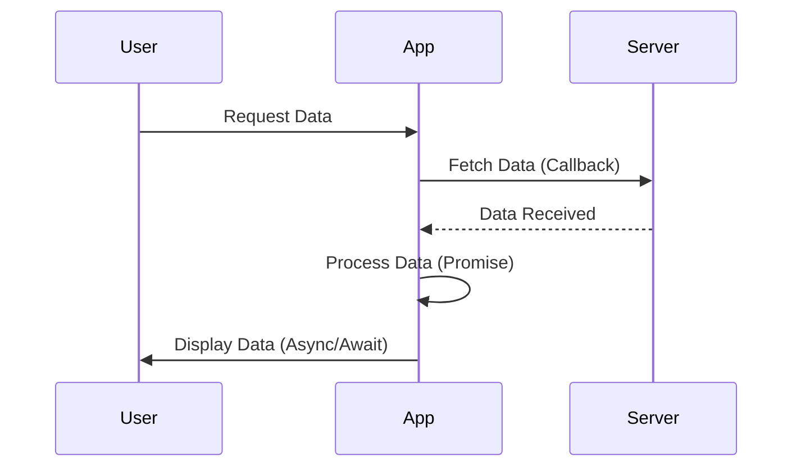

## 28.5 Combining Different Async Patterns

Asynchronous programming is a cornerstone of modern JavaScript development, enabling us to handle tasks like network requests, file reading, and timers without blocking the main thread. In this section, we will explore how to combine different asynchronous patterns—callbacks, promises, and `async/await`—to create efficient and readable code. We'll discuss scenarios where these patterns coexist, how to convert callbacks to promises, and how to integrate third-party libraries using `async/await`. Let's dive in!

### Understanding Asynchronous Patterns

Before we delve into combining these patterns, let's briefly revisit each of them:

1. **Callbacks**: These are functions passed as arguments to other functions and executed after a certain task is completed. While simple, they can lead to "callback hell" when nested deeply.

2. **Promises**: Introduced to address the limitations of callbacks, promises represent a value that may be available now, or in the future, or never. They provide methods like `.then()`, `.catch()`, and `.finally()` to handle asynchronous operations.

3. **Async/Await**: Built on top of promises, `async/await` offers a more synchronous way to write asynchronous code. It makes the code easier to read and maintain by using `async` functions and the `await` keyword.

### Scenarios Where Multiple Patterns Coexist

In real-world applications, you might encounter scenarios where different asynchronous patterns coexist. For instance, you might be working with a legacy codebase that uses callbacks, while newer parts of the application use promises or `async/await`. Let's explore how to handle such situations.

#### Scenario 1: Mixing Callbacks and Promises

Imagine you have a function that uses a callback to fetch data, but you want to use promises in your new code. Here's how you can handle this:

```javascript
// Callback-based function
function fetchDataWithCallback(url, callback) {
    setTimeout(() => {
        const data = { id: 1, name: "John Doe" }; // Simulated data
        callback(null, data);
    }, 1000);
}

// Wrapping the callback in a promise
function fetchDataWithPromise(url) {
    return new Promise((resolve, reject) => {
        fetchDataWithCallback(url, (error, data) => {
            if (error) {
                reject(error);
            } else {
                resolve(data);
            }
        });
    });
}

// Using the promise
fetchDataWithPromise('https://api.example.com/data')
    .then(data => console.log('Data:', data))
    .catch(error => console.error('Error:', error));
```

In this example, we wrapped the callback-based function in a promise, allowing us to use `.then()` and `.catch()` for handling the asynchronous operation.

#### Scenario 2: Integrating Callbacks with Async/Await

When working with third-party libraries that use callbacks, you can integrate them with `async/await` by converting them to promises. Here's how:

```javascript
// Callback-based library function
function getUserData(userId, callback) {
    setTimeout(() => {
        const user = { id: userId, name: "Jane Doe" }; // Simulated user data
        callback(null, user);
    }, 1000);
}

// Promisifying the callback function
function getUserDataAsync(userId) {
    return new Promise((resolve, reject) => {
        getUserData(userId, (error, user) => {
            if (error) {
                reject(error);
            } else {
                resolve(user);
            }
        });
    });
}

// Using async/await
async function displayUserData(userId) {
    try {
        const user = await getUserDataAsync(userId);
        console.log('User:', user);
    } catch (error) {
        console.error('Error:', error);
    }
}

displayUserData(1);
```

By converting the callback-based function to a promise, we can use `async/await` to handle the asynchronous operation in a more readable manner.

### Converting Callbacks to Promises

Converting callback-based functions to promises is a common task when modernizing codebases. This process, known as "promisification," involves wrapping the callback logic in a promise constructor. Let's look at a detailed example:

```javascript
// Original callback-based function
function readFileCallback(filePath, callback) {
    setTimeout(() => {
        const fileContent = "File content"; // Simulated file content
        callback(null, fileContent);
    }, 1000);
}

// Promisified version
function readFilePromise(filePath) {
    return new Promise((resolve, reject) => {
        readFileCallback(filePath, (error, content) => {
            if (error) {
                reject(error);
            } else {
                resolve(content);
            }
        });
    });
}

// Using the promisified function
readFilePromise('/path/to/file')
    .then(content => console.log('File Content:', content))
    .catch(error => console.error('Error:', error));
```

In this example, we wrapped the `readFileCallback` function in a promise, allowing us to handle the file reading operation using `.then()` and `.catch()`.

### Integrating Third-Party Libraries with Async/Await

Many third-party libraries still use callbacks, but you can integrate them with `async/await` by promisifying their functions. Here's an example using a hypothetical library:

```javascript
// Hypothetical library function using callbacks
function fetchDataFromLibrary(params, callback) {
    setTimeout(() => {
        const result = { success: true, data: "Library data" };
        callback(null, result);
    }, 1000);
}

// Promisifying the library function
function fetchDataFromLibraryAsync(params) {
    return new Promise((resolve, reject) => {
        fetchDataFromLibrary(params, (error, result) => {
            if (error) {
                reject(error);
            } else {
                resolve(result);
            }
        });
    });
}

// Using async/await with the library
async function getData() {
    try {
        const result = await fetchDataFromLibraryAsync({ query: 'example' });
        console.log('Library Result:', result);
    } catch (error) {
        console.error('Error:', error);
    }
}

getData();
```

By converting the callback-based library function to a promise, we can seamlessly use `async/await` to handle the asynchronous operation.

### Potential Issues and How to Resolve Them

When combining different asynchronous patterns, you might encounter some common issues. Let's discuss these issues and how to resolve them.

#### Issue 1: Callback Hell

Callback hell occurs when callbacks are nested deeply, making the code difficult to read and maintain. To resolve this, consider converting callbacks to promises or using `async/await` for better readability.

#### Issue 2: Error Handling

Error handling can be tricky when combining different patterns. Ensure that you handle errors appropriately by using `.catch()` with promises or `try/catch` blocks with `async/await`.

#### Issue 3: Mixing Patterns

Mixing patterns can lead to confusion and bugs. Try to standardize your codebase by using one pattern consistently, such as `async/await`, and convert other patterns to match it.

### Evolution Toward Standardized Asynchronous Handling

JavaScript has evolved significantly in handling asynchronous operations. The introduction of promises and `async/await` has made it easier to write clean and maintainable asynchronous code. As you work with different patterns, aim to modernize your codebase by adopting `async/await` where possible.

### Visualizing Asynchronous Patterns

To better understand how these patterns work together, let's visualize the flow of asynchronous operations using a sequence diagram.



**Diagram Description**: This sequence diagram illustrates the flow of asynchronous operations from a user's request to the display of data. The app fetches data from the server using a callback, processes it with a promise, and finally displays it using `async/await`.

### Try It Yourself

Experiment with the code examples provided in this section. Try modifying the callback-based functions to use promises and `async/await`. Observe how the readability and maintainability of your code improve.

### Knowledge Check

- What are the benefits of using promises over callbacks?
- How does `async/await` improve code readability?
- What are some common issues when combining different asynchronous patterns?

### Embrace the Journey

Remember, mastering asynchronous patterns is a journey. As you progress, you'll build more complex and interactive applications. Keep experimenting, stay curious, and enjoy the journey!

### References and Links

- [MDN Web Docs: Promises](https://developer.mozilla.org/en-US/docs/Web/JavaScript/Guide/Using_promises)
- [MDN Web Docs: Async/Await](https://developer.mozilla.org/en-US/docs/Web/JavaScript/Reference/Statements/async_function)
- [W3Schools: JavaScript Callbacks](https://www.w3schools.com/js/js_callback.asp)

## Quiz Time!



### What is the main advantage of using promises over callbacks?

- [x] Promises provide a cleaner and more manageable way to handle asynchronous operations.
- [ ] Promises are faster than callbacks.
- [ ] Promises eliminate all errors in asynchronous code.
- [ ] Promises are easier to debug.

> **Explanation:** Promises provide a cleaner and more manageable way to handle asynchronous operations by avoiding deeply nested callbacks.

### How does `async/await` improve code readability?

- [x] By allowing asynchronous code to be written in a synchronous style.
- [ ] By eliminating the need for error handling.
- [ ] By making code run faster.
- [ ] By using fewer lines of code.

> **Explanation:** `async/await` allows asynchronous code to be written in a synchronous style, making it easier to read and understand.

### What is "callback hell"?

- [x] A situation where callbacks are nested deeply, making the code difficult to read.
- [ ] A scenario where callbacks fail to execute.
- [ ] A type of error that occurs in callbacks.
- [ ] A method to handle asynchronous operations.

> **Explanation:** "Callback hell" refers to a situation where callbacks are nested deeply, making the code difficult to read and maintain.

### How can you convert a callback-based function to a promise?

- [x] By wrapping the callback logic in a promise constructor.
- [ ] By using the `async` keyword.
- [ ] By using the `await` keyword.
- [ ] By chaining `.then()` methods.

> **Explanation:** You can convert a callback-based function to a promise by wrapping the callback logic in a promise constructor.

### Which method is used to handle errors in promises?

- [x] `.catch()`
- [ ] `.then()`
- [ ] `.finally()`
- [ ] `.resolve()`

> **Explanation:** The `.catch()` method is used to handle errors in promises.

### What is the role of the `await` keyword in `async/await`?

- [x] It pauses the execution of an `async` function until the promise is resolved.
- [ ] It converts a function to a promise.
- [ ] It handles errors in asynchronous code.
- [ ] It speeds up the execution of asynchronous code.

> **Explanation:** The `await` keyword pauses the execution of an `async` function until the promise is resolved, allowing for a more synchronous flow.

### Why is it important to handle errors in asynchronous code?

- [x] To prevent the application from crashing and to provide meaningful feedback to users.
- [ ] To make the code run faster.
- [ ] To eliminate all bugs in the code.
- [ ] To reduce the number of lines of code.

> **Explanation:** Handling errors in asynchronous code is important to prevent the application from crashing and to provide meaningful feedback to users.

### What is the purpose of promisifying a callback-based function?

- [x] To convert it into a promise, allowing for better error handling and chaining.
- [ ] To make it run faster.
- [ ] To eliminate all errors.
- [ ] To reduce the number of lines of code.

> **Explanation:** Promisifying a callback-based function converts it into a promise, allowing for better error handling and chaining.

### How can you integrate a third-party library using callbacks with `async/await`?

- [x] By promisifying the callback-based functions.
- [ ] By using the `async` keyword directly.
- [ ] By using the `await` keyword directly.
- [ ] By chaining `.then()` methods.

> **Explanation:** You can integrate a third-party library using callbacks with `async/await` by promisifying the callback-based functions.

### True or False: Mixing different asynchronous patterns can lead to confusion and bugs.

- [x] True
- [ ] False

> **Explanation:** Mixing different asynchronous patterns can lead to confusion and bugs, so it's important to standardize your codebase.


