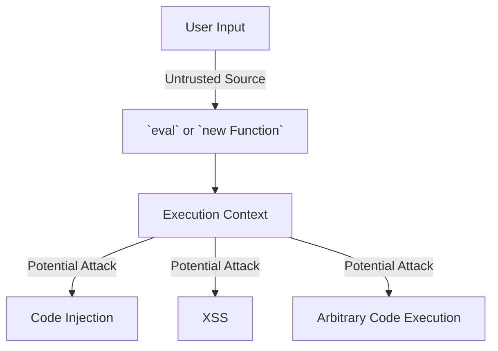

## 29.1 Avoiding `eval` and `new Function`

In this section, we will delve into the potential dangers of using `eval` and `new Function` in JavaScript, understand how they can lead to security vulnerabilities, and explore alternative approaches to achieve dynamic behavior in a safer manner. By the end of this chapter, you'll be equipped with the knowledge to write more secure and robust JavaScript code.

### Understanding `eval` and `new Function`

Before we discuss the risks, let's first understand what `eval` and `new Function` do in JavaScript.

#### What is `eval`?

The `eval` function in JavaScript takes a string as an argument and executes it as JavaScript code. This means that any code passed to `eval` is treated as if it were written directly in the script.

```javascript
// Example of using eval
let x = 10;
let y = 20;
let result = eval('x + y'); // result will be 30
console.log(result);
```

#### What is `new Function`?

The `new Function` constructor allows you to create a new function from a string of code. It takes a string of code as its last argument and any number of parameter names as preceding arguments.

```javascript
// Example of using new Function
let add = new Function('a', 'b', 'return a + b');
console.log(add(10, 20)); // Outputs: 30
```

### Why `eval` and `new Function` Can Be Dangerous

Both `eval` and `new Function` execute strings as code, which can be extremely risky. Here are some reasons why:

#### 1. Code Injection Vulnerabilities

When you use `eval` or `new Function`, you are essentially allowing any string to be executed as code. This opens up the possibility for code injection attacks, where an attacker can inject malicious code into your application.

**Example of Code Injection:**

```javascript
let userInput = "alert('Hacked!')";
eval(userInput); // This will execute the injected code
```

In this example, if `userInput` comes from an untrusted source, an attacker could inject harmful code that gets executed in the context of your application.

#### 2. Security Risks

Using `eval` or `new Function` can expose your application to various security risks:

- **Cross-Site Scripting (XSS):** Attackers can inject malicious scripts into web pages viewed by other users.
- **Access to Global Scope:** `eval` can access and modify variables in the global scope, leading to unintended side effects.
- **Performance Overhead:** Parsing and executing strings as code is slower and can degrade performance.

### Potential Attacks Using `eval` and `new Function`

Let's explore some potential attacks that can occur when using `eval` or `new Function`.

#### Cross-Site Scripting (XSS)

XSS attacks occur when an attacker injects malicious scripts into content from otherwise trusted websites. If your application uses `eval` to process user input, an attacker could inject scripts that steal cookies, session tokens, or other sensitive information.

```javascript
// Example of XSS vulnerability
let userComment = "<script>alert('XSS Attack!');</script>";
eval(userComment); // Executes the injected script
```

#### Arbitrary Code Execution

An attacker could execute arbitrary code on your server or client-side application if they can control the input to `eval` or `new Function`.

```javascript
// Example of arbitrary code execution
let userCode = "console.log('This is safe');";
eval(userCode); // Executes the code
```

If `userCode` is controlled by an attacker, they could execute any JavaScript code they wish.

### Alternatives to `eval` and `new Function`

Fortunately, there are safer alternatives to achieve dynamic behavior in JavaScript without using `eval` or `new Function`.

#### 1. Use JSON for Data Exchange

Instead of using `eval` to parse JSON strings, use the `JSON.parse()` method, which is safer and more efficient.

```javascript
// Safe JSON parsing
let jsonString = '{"name": "John", "age": 30}';
let user = JSON.parse(jsonString);
console.log(user.name); // Outputs: John
```

#### 2. Use Object Literals and Arrays

For dynamic data structures, use object literals and arrays instead of constructing them with `eval`.

```javascript
// Using object literals
let user = {
  name: "John",
  age: 30
};
console.log(user.name); // Outputs: John
```

#### 3. Use Function Expressions

Instead of creating functions dynamically with `new Function`, use function expressions or arrow functions.

```javascript
// Using function expressions
let add = function(a, b) {
  return a + b;
};
console.log(add(10, 20)); // Outputs: 30
```

#### 4. Use Template Literals

For string interpolation and dynamic content, use template literals instead of `eval`.

```javascript
// Using template literals
let name = "John";
let message = `Hello, ${name}!`;
console.log(message); // Outputs: Hello, John!
```

### Best Practices for Securing Your Code

To ensure your JavaScript code is secure, follow these best practices:

#### 1. Avoid `eval` and `new Function`

As a general rule, avoid using `eval` and `new Function` in your code. If you must use them, ensure that the input is sanitized and comes from a trusted source.

#### 2. Validate and Sanitize User Input

Always validate and sanitize user input to prevent injection attacks. Use libraries and frameworks that provide built-in protection against XSS and other vulnerabilities.

#### 3. Use Content Security Policy (CSP)

Implement a Content Security Policy (CSP) to restrict the execution of scripts and reduce the risk of XSS attacks.

#### 4. Keep Dependencies Updated

Regularly update your libraries and frameworks to ensure you have the latest security patches.

#### 5. Conduct Security Audits

Perform regular security audits and code reviews to identify and fix potential vulnerabilities in your codebase.

### Visualizing the Risks of `eval` and `new Function`

To better understand the risks associated with `eval` and `new Function`, let's visualize how they interact with the execution context and potential attack vectors.



**Diagram Description:** This flowchart illustrates how untrusted user input can be passed to `eval` or `new Function`, leading to execution in the context of the application. This can result in code injection, XSS, or arbitrary code execution attacks.

### Try It Yourself

Now that we've covered the risks and alternatives, let's try some exercises to reinforce your understanding.

#### Exercise 1: Refactor `eval` Usage

Given the following code snippet, refactor it to avoid using `eval`:

```javascript
let expression = "2 + 2";
let result = eval(expression);
console.log(result); // Outputs: 4
```

**Solution:**

```javascript
let expression = "2 + 2";
let result = Function(`"use strict"; return (${expression})`)();
console.log(result); // Outputs: 4
```

#### Exercise 2: Secure User Input

Consider a scenario where you need to execute code based on user input. How would you secure the input to prevent injection attacks?

**Solution:**

- Validate the input to ensure it contains only safe characters.
- Use a whitelist approach to allow only specific, known-safe operations.
- Avoid executing user input directly as code.

### Knowledge Check

Let's test your understanding with some questions.

## Quiz Time!



### Why is using `eval` considered dangerous in JavaScript?

- [x] It can lead to code injection vulnerabilities.
- [ ] It is deprecated in modern JavaScript.
- [ ] It is slower than other methods.
- [ ] It cannot execute dynamic code.

> **Explanation:** `eval` is dangerous because it can execute any string as code, leading to code injection vulnerabilities.

### What is a safer alternative to `eval` for parsing JSON strings?

- [ ] `new Function`
- [x] `JSON.parse()`
- [ ] `JSON.stringify()`
- [ ] `JSON.eval()`

> **Explanation:** `JSON.parse()` is a safer and more efficient method for parsing JSON strings compared to `eval`.

### Which of the following is a potential attack vector when using `eval`?

- [ ] SQL Injection
- [x] Cross-Site Scripting (XSS)
- [ ] Denial of Service (DoS)
- [ ] Man-in-the-Middle (MitM)

> **Explanation:** `eval` can be exploited for Cross-Site Scripting (XSS) attacks by executing injected scripts.

### How can you create a function dynamically without using `new Function`?

- [x] Use function expressions
- [ ] Use `eval`
- [ ] Use `Function.create()`
- [ ] Use `Function.prototype`

> **Explanation:** Function expressions or arrow functions can be used to create functions dynamically without using `new Function`.

### What is a best practice to prevent code injection attacks?

- [x] Validate and sanitize user input
- [ ] Use `eval` with caution
- [ ] Avoid using functions
- [ ] Use global variables

> **Explanation:** Validating and sanitizing user input is a best practice to prevent code injection attacks.

### What does CSP stand for in web security?

- [ ] Code Security Policy
- [x] Content Security Policy
- [ ] Cross-Site Protection
- [ ] Client-Side Protection

> **Explanation:** CSP stands for Content Security Policy, which helps prevent XSS attacks by restricting script execution.

### Which method should you use to safely interpolate strings?

- [ ] `eval`
- [x] Template literals
- [ ] `new Function`
- [ ] String concatenation

> **Explanation:** Template literals provide a safe way to interpolate strings without using `eval`.

### What is a common risk of using `new Function`?

- [ ] It is not supported in all browsers.
- [x] It can execute arbitrary code.
- [ ] It is slower than `eval`.
- [ ] It cannot access global variables.

> **Explanation:** `new Function` can execute arbitrary code, which poses a security risk if the input is not controlled.

### How can you restrict script execution to reduce XSS risk?

- [ ] Use `eval` for all scripts
- [ ] Disable JavaScript in the browser
- [x] Implement a Content Security Policy (CSP)
- [ ] Use `new Function` for dynamic scripts

> **Explanation:** Implementing a Content Security Policy (CSP) helps restrict script execution and reduce XSS risk.

### True or False: `eval` can access and modify variables in the global scope.

- [x] True
- [ ] False

> **Explanation:** `eval` can access and modify variables in the global scope, which can lead to unintended side effects.



### Embrace the Journey

Remember, avoiding `eval` and `new Function` is just one step towards writing secure JavaScript code. As you continue your journey, keep exploring safer and more efficient ways to achieve dynamic behavior in your applications. Stay curious, keep learning, and enjoy the process of becoming a more skilled and security-conscious developer!
