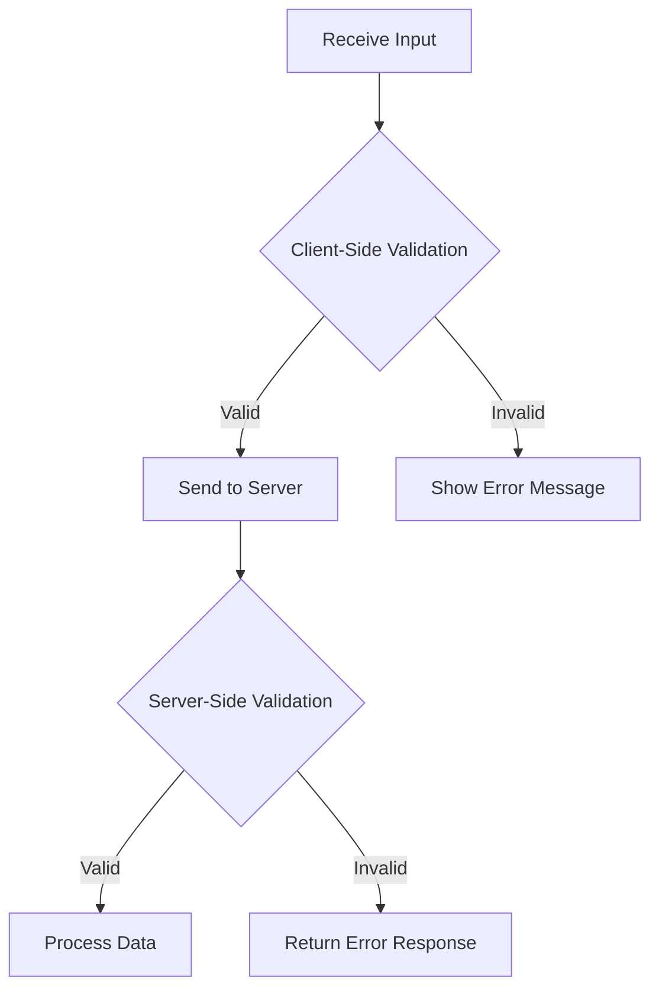

## 29.2 Input Validation

In the world of web development, input validation is a critical practice that ensures the security and integrity of your applications. By validating inputs, we can prevent malicious attacks such as Cross-Site Scripting (XSS) and SQL Injection, which can compromise the security of our applications and data. In this section, we'll explore the importance of input validation, strategies for sanitizing and validating data, and how functions play a crucial role in enforcing these validations.

### Why is Input Validation Important?

Input validation is the process of ensuring that the data received from users or external sources is both correct and safe. Without proper validation, applications become vulnerable to various types of attacks. Let's delve into some reasons why input validation is essential:

1. **Preventing Injection Attacks**: Malicious users can exploit vulnerabilities in your application to inject harmful code. By validating inputs, we can mitigate the risk of such attacks.
2. **Ensuring Data Integrity**: Validating inputs helps ensure that the data stored and processed by your application is accurate and consistent.
3. **Enhancing User Experience**: By providing immediate feedback on incorrect inputs, we can improve the user experience and guide users to provide the correct data.
4. **Compliance with Standards**: Many industries have regulations that require input validation to protect sensitive data.

### Common Vulnerabilities

Before we dive into strategies for input validation, let's explore some common vulnerabilities that arise from improper validation:

- **Cross-Site Scripting (XSS)**: This occurs when an attacker injects malicious scripts into web pages viewed by other users. XSS can lead to data theft, session hijacking, and more.
- **SQL Injection**: This vulnerability allows attackers to execute arbitrary SQL code on your database, potentially leading to data breaches and data loss.
- **Command Injection**: Similar to SQL injection, this involves executing arbitrary commands on the server, which can compromise the server's security.

### Strategies for Input Validation

To effectively validate inputs, we need to adopt a multi-layered approach. Here are some strategies to consider:

#### 1. Client-Side Validation

Client-side validation occurs in the user's browser before the data is sent to the server. While it enhances user experience by providing immediate feedback, it should not be relied upon as the sole method of validation due to its vulnerability to bypassing. Here's how you can implement client-side validation:

```javascript
// Example of client-side validation using JavaScript
function validateEmail(email) {
    const emailPattern = /^[^\s@]+@[^\s@]+\.[^\s@]+$/;
    return emailPattern.test(email);
}

const emailInput = document.getElementById('email');
emailInput.addEventListener('input', function() {
    if (validateEmail(emailInput.value)) {
        emailInput.setCustomValidity('');
    } else {
        emailInput.setCustomValidity('Please enter a valid email address.');
    }
});
```

#### 2. Server-Side Validation

Server-side validation is crucial as it provides a secure layer of validation that cannot be bypassed by the user. It involves checking the data after it has been submitted to the server. Here's an example using Node.js:

```javascript
// Example of server-side validation using Node.js
const express = require('express');
const app = express();

app.use(express.json());

app.post('/submit', (req, res) => {
    const { email } = req.body;
    if (!validateEmail(email)) {
        return res.status(400).send('Invalid email address.');
    }
    // Proceed with processing the valid email
    res.send('Email is valid.');
});

function validateEmail(email) {
    const emailPattern = /^[^\s@]+@[^\s@]+\.[^\s@]+$/;
    return emailPattern.test(email);
}

app.listen(3000, () => {
    console.log('Server is running on port 3000');
});
```

#### 3. Input Sanitization

Sanitization involves cleaning the input data to remove any potentially harmful elements. This is especially important for data that will be rendered on web pages or used in database queries. Here's an example of sanitizing input using a library:

```javascript
// Example of input sanitization using the 'sanitize-html' library
const sanitizeHtml = require('sanitize-html');

function sanitizeInput(input) {
    return sanitizeHtml(input, {
        allowedTags: [],
        allowedAttributes: {}
    });
}

const userInput = '<script>alert("XSS Attack!");</script>';
const sanitizedInput = sanitizeInput(userInput);
console.log(sanitizedInput); // Output: ''
```

#### 4. Using Validation Libraries

Leveraging well-tested validation libraries can simplify the process of input validation and ensure robustness. Libraries like Joi (for Node.js) and Validator.js provide comprehensive validation capabilities:

```javascript
// Example of using Joi for input validation
const Joi = require('joi');

const schema = Joi.object({
    email: Joi.string().email().required(),
    password: Joi.string().min(8).required()
});

const { error, value } = schema.validate({ email: 'user@example.com', password: 'password123' });

if (error) {
    console.error('Validation error:', error.details);
} else {
    console.log('Validated data:', value);
}
```

### The Role of Functions in Input Validation

Functions are the building blocks of input validation. They encapsulate the logic for checking, sanitizing, and processing inputs. By using functions, we can create reusable and maintainable validation logic. Let's explore how functions can be used effectively in input validation:

#### 1. Encapsulating Validation Logic

By encapsulating validation logic within functions, we can easily reuse and test the logic across different parts of our application. Here's an example:

```javascript
// Encapsulating validation logic in a function
function isValidUsername(username) {
    const usernamePattern = /^[a-zA-Z0-9_]{3,20}$/;
    return usernamePattern.test(username);
}

console.log(isValidUsername('user_123')); // Output: true
console.log(isValidUsername('invalid username!')); // Output: false
```

#### 2. Modularizing Validation Functions

Modularizing validation functions allows us to separate concerns and maintain a clean codebase. We can create a module for all validation-related functions:

```javascript
// validation.js module
function validateEmail(email) {
    const emailPattern = /^[^\s@]+@[^\s@]+\.[^\s@]+$/;
    return emailPattern.test(email);
}

function validatePassword(password) {
    return password.length >= 8;
}

module.exports = {
    validateEmail,
    validatePassword
};

// Using the validation module
const validation = require('./validation');

console.log(validation.validateEmail('user@example.com')); // Output: true
console.log(validation.validatePassword('pass1234')); // Output: true
```

#### 3. Using Higher-Order Functions

Higher-order functions can be used to create flexible and reusable validation logic. For example, we can create a function that accepts a validation function as an argument:

```javascript
// Higher-order function for validation
function validateInput(input, validationFn) {
    return validationFn(input);
}

const isEmailValid = validateInput('user@example.com', validateEmail);
console.log(isEmailValid); // Output: true
```

### Visualizing Input Validation Flow

To better understand the flow of input validation, let's visualize the process using a flowchart:



**Figure 1**: This flowchart illustrates the process of input validation, starting from client-side validation, followed by server-side validation, and finally processing the data or returning an error response.

### Encouraging Best Practices

To ensure robust input validation, consider the following best practices:

- **Validate All Inputs**: Always validate inputs from all sources, including user input, API requests, and third-party integrations.
- **Use Whitelisting**: Prefer whitelisting over blacklisting. Define what is allowed rather than what is disallowed.
- **Keep Validation Logic Consistent**: Ensure that validation logic is consistent across client-side and server-side validations.
- **Regularly Update Libraries**: Keep validation libraries up to date to benefit from security patches and improvements.
- **Test Validation Logic**: Write unit tests to cover various input scenarios and edge cases.

### Try It Yourself

To reinforce your understanding of input validation, try modifying the code examples provided in this section. Experiment with different validation patterns, create your own validation functions, and test them with various inputs. Remember, practice is key to mastering input validation!

### References and Further Reading

- [MDN Web Docs: Input Validation](https://developer.mozilla.org/en-US/docs/Learn/Forms/Form_validation)
- [OWASP: Input Validation Cheat Sheet](https://cheatsheetseries.owasp.org/cheatsheets/Input_Validation_Cheat_Sheet.html)
- [Joi Validation Library](https://joi.dev/)
- [Validator.js](https://github.com/validatorjs/validator.js)

### Knowledge Check

Let's summarize the key takeaways from this section:

- Input validation is crucial for preventing security vulnerabilities such as XSS and SQL injection.
- Client-side validation enhances user experience but should be complemented by server-side validation.
- Functions play a vital role in encapsulating and modularizing validation logic.
- Using well-tested validation libraries can simplify the validation process and enhance security.

## Quiz Time!



### What is the primary purpose of input validation?

- [x] To ensure data integrity and prevent security vulnerabilities
- [ ] To improve the performance of the application
- [ ] To enhance the visual appearance of the application
- [ ] To increase the speed of data processing

> **Explanation:** Input validation ensures that the data received is correct and safe, preventing security vulnerabilities and maintaining data integrity.

### Which of the following is a common vulnerability that input validation helps prevent?

- [x] Cross-Site Scripting (XSS)
- [ ] Memory leaks
- [ ] Slow loading times
- [ ] User interface glitches

> **Explanation:** Input validation helps prevent vulnerabilities like Cross-Site Scripting (XSS) by ensuring that inputs are safe and sanitized.

### What is the role of server-side validation?

- [x] To provide a secure layer of validation that cannot be bypassed
- [ ] To enhance the visual appearance of the application
- [ ] To improve the speed of data processing
- [ ] To reduce the size of the application

> **Explanation:** Server-side validation provides a secure layer of validation that cannot be bypassed by the user, ensuring data integrity and security.

### Which of the following is a strategy for input validation?

- [x] Using well-tested validation libraries
- [ ] Ignoring user inputs
- [ ] Only validating inputs on the client side
- [ ] Allowing all inputs without checks

> **Explanation:** Using well-tested validation libraries is a strategy for input validation, ensuring robustness and security.

### What is the benefit of encapsulating validation logic in functions?

- [x] Reusability and maintainability of validation logic
- [ ] Increasing the complexity of the code
- [ ] Reducing the speed of data processing
- [ ] Enhancing the visual appearance of the application

> **Explanation:** Encapsulating validation logic in functions allows for reusability and maintainability, making the code easier to manage and test.

### What is the purpose of input sanitization?

- [x] To clean input data and remove potentially harmful elements
- [ ] To enhance the visual appearance of the application
- [ ] To improve the speed of data processing
- [ ] To increase the size of the application

> **Explanation:** Input sanitization involves cleaning input data to remove potentially harmful elements, ensuring safety and security.

### Which of the following is a best practice for input validation?

- [x] Validate inputs from all sources
- [ ] Only validate inputs on the client side
- [ ] Allow all inputs without checks
- [ ] Ignore user inputs

> **Explanation:** Validating inputs from all sources is a best practice, ensuring that all data entering the application is safe and correct.

### What is the advantage of using higher-order functions in validation?

- [x] Creating flexible and reusable validation logic
- [ ] Increasing the complexity of the code
- [ ] Reducing the speed of data processing
- [ ] Enhancing the visual appearance of the application

> **Explanation:** Higher-order functions allow for flexible and reusable validation logic, making the code more adaptable and efficient.

### Why is it important to keep validation libraries up to date?

- [x] To benefit from security patches and improvements
- [ ] To increase the size of the application
- [ ] To enhance the visual appearance of the application
- [ ] To reduce the speed of data processing

> **Explanation:** Keeping validation libraries up to date ensures that you benefit from security patches and improvements, maintaining the security of your application.

### True or False: Client-side validation alone is sufficient for securing an application.

- [ ] True
- [x] False

> **Explanation:** False. Client-side validation alone is not sufficient for securing an application, as it can be bypassed. Server-side validation is also necessary to ensure security.



Remember, input validation is a critical aspect of building secure applications. By implementing robust validation strategies and using functions effectively, you can protect your applications from vulnerabilities and ensure a safe experience for your users. Keep experimenting, stay curious, and enjoy the journey of mastering JavaScript!
