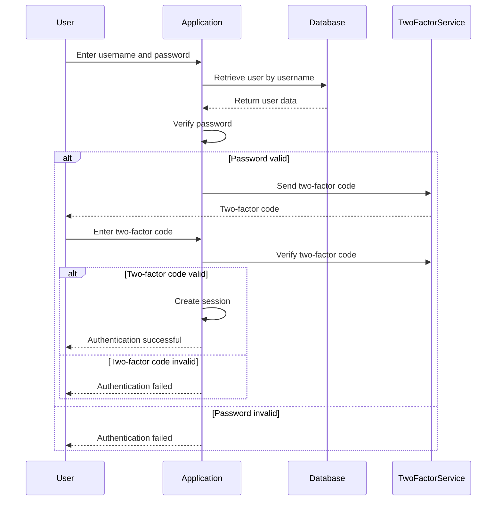

## 29.3 Secure Coding Practices

In today's interconnected world, ensuring the security of your JavaScript code is more important than ever. As we build applications that handle sensitive data, interact with users, and connect to various services, we must adopt secure coding practices to protect against vulnerabilities and threats. In this section, we will explore key principles of secure coding, provide examples of secure functions, and discuss the importance of code reviews and staying informed about security threats.

### Key Secure Coding Principles

To write secure JavaScript code, we must adhere to several fundamental principles. These principles form the foundation of secure coding practices and help us build robust and resilient applications.

#### Least Privilege

The principle of least privilege dictates that a function or component should have only the permissions necessary to perform its tasks. By minimizing the access rights, we reduce the potential impact of a security breach.

**Example:**

```javascript
// Function to read user data with least privilege
function getUserData(userId) {
  // Only access the necessary fields
  const user = database.getUserById(userId);
  return {
    id: user.id,
    name: user.name,
    email: user.email
  };
}
```

In this example, the `getUserData` function retrieves only the necessary user information, minimizing exposure to sensitive data.

#### Secure Defaults

Secure defaults involve configuring systems and applications to be secure out of the box. This means that any default settings should prioritize security, requiring users to explicitly enable less secure options.

**Example:**

```javascript
// Function to create a new user with secure defaults
function createUser(username, password) {
  const user = {
    username: username,
    passwordHash: hashPassword(password), // Store hashed password
    role: 'user', // Default role with limited privileges
    isActive: false // Default to inactive until verified
  };
  database.saveUser(user);
}
```

Here, the `createUser` function uses secure defaults by hashing passwords and setting new users to inactive until verified.

#### Defense in Depth

Defense in depth is a layered security approach that involves implementing multiple security measures to protect against threats. If one layer fails, others still provide protection.

**Example:**

```javascript
// Function to authenticate a user with defense in depth
function authenticateUser(username, password) {
  const user = database.getUserByUsername(username);
  if (!user) {
    throw new Error('User not found');
  }

  // Layer 1: Password verification
  if (!verifyPassword(password, user.passwordHash)) {
    throw new Error('Invalid password');
  }

  // Layer 2: Two-factor authentication
  if (!verifyTwoFactorCode(user.id)) {
    throw new Error('Invalid two-factor code');
  }

  // Layer 3: Session management
  createSession(user.id);
}
```

The `authenticateUser` function employs multiple layers of security, including password verification, two-factor authentication, and session management.

### Secure Coding Practices in Functions

Let's delve deeper into specific secure coding practices that you can implement in your JavaScript functions to enhance security.

#### Input Validation and Sanitization

Always validate and sanitize inputs to prevent injection attacks and other vulnerabilities. Ensure that inputs conform to expected formats and reject any suspicious data.

**Example:**

```javascript
// Function to process user input safely
function processInput(input) {
  const sanitizedInput = sanitizeInput(input);
  if (!isValidInput(sanitizedInput)) {
    throw new Error('Invalid input');
  }
  // Proceed with safe input
  return sanitizedInput;
}

function sanitizeInput(input) {
  // Remove potentially harmful characters
  return input.replace(/[<>]/g, '');
}

function isValidInput(input) {
  // Check if input meets expected criteria
  return /^[a-zA-Z0-9]+$/.test(input);
}
```

This example demonstrates input validation and sanitization to prevent harmful data from being processed.

#### Error Handling and Logging

Implement robust error handling to prevent sensitive information from being exposed in error messages. Log errors securely to aid in debugging and monitoring.

**Example:**

```javascript
// Function with secure error handling
function performOperation(data) {
  try {
    // Perform operation
    const result = complexOperation(data);
    return result;
  } catch (error) {
    // Log error without exposing sensitive details
    console.error('Operation failed:', error.message);
    throw new Error('An error occurred while processing your request');
  }
}
```

In this example, errors are logged with minimal information, and a generic error message is returned to the user.

#### Secure Data Storage

Store sensitive data securely using encryption and hashing techniques. Avoid storing plain text passwords or sensitive information.

**Example:**

```javascript
// Function to store sensitive data securely
function storeSensitiveData(data) {
  const encryptedData = encryptData(data);
  database.saveEncryptedData(encryptedData);
}

function encryptData(data) {
  // Use a secure encryption algorithm
  return crypto.encrypt(data, 'encryptionKey');
}
```

This example shows how to encrypt data before storing it in a database, ensuring that sensitive information is protected.

### Encouraging Code Reviews with a Focus on Security

Code reviews are an essential part of the development process, providing an opportunity to identify and address security vulnerabilities. Encourage team members to review each other's code with a focus on security, looking for potential issues and suggesting improvements.

#### Conducting Security-Focused Code Reviews

1. **Check for Input Validation:** Ensure that all inputs are validated and sanitized to prevent injection attacks.
2. **Review Error Handling:** Verify that errors are handled securely without exposing sensitive information.
3. **Assess Data Storage Practices:** Confirm that sensitive data is stored securely using encryption and hashing.
4. **Evaluate Access Controls:** Ensure that functions adhere to the principle of least privilege and that access controls are properly implemented.
5. **Examine Third-Party Dependencies:** Review the security of third-party libraries and dependencies to identify potential vulnerabilities.

### Staying Informed About Security Threats

The security landscape is constantly evolving, with new threats and vulnerabilities emerging regularly. Staying informed about security threats is crucial for maintaining secure applications.

#### Resources for Staying Informed

1. **OWASP (Open Web Application Security Project):** A nonprofit organization focused on improving software security. [OWASP Website](https://owasp.org/)
2. **CVE (Common Vulnerabilities and Exposures):** A list of publicly disclosed cybersecurity vulnerabilities. [CVE Website](https://cve.mitre.org/)
3. **Security Blogs and Newsletters:** Subscribe to reputable security blogs and newsletters to receive updates on the latest threats and best practices.
4. **Developer Communities and Forums:** Engage with developer communities and forums to discuss security challenges and solutions.

### Visualizing Secure Coding Practices

To better understand secure coding practices, let's visualize the flow of a secure authentication process using a sequence diagram.



**Diagram Description:** This sequence diagram illustrates a secure authentication process with password verification, two-factor authentication, and session management.

### Try It Yourself

Experiment with the code examples provided in this section. Try modifying the input validation function to handle different types of inputs, or enhance the error handling function to log errors to an external monitoring service.

### Knowledge Check

Before we conclude, let's reinforce what we've learned with a few questions:

1. What is the principle of least privilege, and why is it important?
2. How can you ensure that your functions use secure defaults?
3. What is defense in depth, and how can it be applied in JavaScript functions?
4. Why is input validation crucial for secure coding?
5. How can code reviews help improve the security of your code?

### Embrace the Journey

Remember, secure coding is an ongoing process. As you continue to develop your skills, keep security at the forefront of your mind. Stay curious, keep learning, and strive to build applications that are not only functional but also secure.

## Quiz Time!



### What is the principle of least privilege?

- [x] Granting only the necessary permissions to perform a task
- [ ] Allowing maximum permissions for convenience
- [ ] Disabling all permissions by default
- [ ] Granting permissions based on user preference

> **Explanation:** The principle of least privilege involves granting only the permissions necessary to perform a task, minimizing the potential impact of a security breach.

### What is a secure default?

- [x] A configuration that prioritizes security out of the box
- [ ] A setting that requires user intervention to be secure
- [ ] A default setting that allows all access
- [ ] A configuration that disables security features

> **Explanation:** Secure defaults involve configuring systems and applications to be secure out of the box, requiring users to explicitly enable less secure options.

### What is defense in depth?

- [x] Implementing multiple layers of security to protect against threats
- [ ] Relying on a single security measure for protection
- [ ] Disabling security features for performance
- [ ] Using only encryption for data protection

> **Explanation:** Defense in depth is a layered security approach that involves implementing multiple security measures to protect against threats.

### Why is input validation important?

- [x] To prevent injection attacks and ensure data integrity
- [ ] To allow all types of data to be processed
- [ ] To make the application faster
- [ ] To reduce the amount of code needed

> **Explanation:** Input validation is crucial for preventing injection attacks and ensuring that data conforms to expected formats, maintaining data integrity.

### What should be the focus of a security-focused code review?

- [x] Input validation, error handling, data storage, access controls, and dependencies
- [ ] Code formatting and style
- [ ] Performance optimization
- [ ] User interface design

> **Explanation:** A security-focused code review should concentrate on input validation, error handling, data storage, access controls, and dependencies to identify and address potential vulnerabilities.

### How can you securely store sensitive data?

- [x] By using encryption and hashing techniques
- [ ] By storing it in plain text
- [ ] By saving it in a public database
- [ ] By using a simple encoding method

> **Explanation:** Sensitive data should be stored securely using encryption and hashing techniques to protect it from unauthorized access.

### What is the role of code reviews in secure coding?

- [x] To identify and address security vulnerabilities in the code
- [ ] To increase the number of lines of code
- [ ] To make the code more complex
- [ ] To reduce the need for testing

> **Explanation:** Code reviews play a crucial role in identifying and addressing security vulnerabilities, ensuring that the code is robust and secure.

### What is the benefit of staying informed about security threats?

- [x] To maintain secure applications by adapting to new threats
- [ ] To ignore potential vulnerabilities
- [ ] To focus solely on performance improvements
- [ ] To reduce the amount of code written

> **Explanation:** Staying informed about security threats allows developers to adapt to new vulnerabilities and maintain secure applications.

### What is the purpose of error handling in secure coding?

- [x] To prevent sensitive information from being exposed in error messages
- [ ] To make the application slower
- [ ] To allow all errors to be visible to users
- [ ] To reduce the need for logging

> **Explanation:** Error handling in secure coding prevents sensitive information from being exposed in error messages, protecting the application from potential threats.

### True or False: Secure coding is a one-time process.

- [ ] True
- [x] False

> **Explanation:** Secure coding is an ongoing process that requires continuous attention and adaptation to new threats and vulnerabilities.



By adopting secure coding practices, we can build applications that are not only functional but also resilient against security threats. Keep experimenting, stay informed, and embrace the journey of secure coding in JavaScript!
