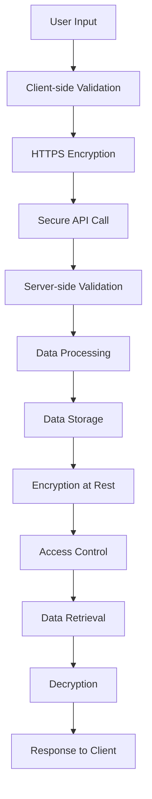

## 29.4 Handling Sensitive Data

In today's digital age, handling sensitive data securely is paramount. Whether it's user credentials, tokens, or personal information, protecting this data is crucial to maintaining trust and compliance with legal standards. In this section, we will explore the risks associated with handling sensitive data, guidelines for secure storage and transmission, and the importance of encryption and hashing. We will also discuss secure APIs, environments, and compliance with data protection regulations.

### Understanding the Risks

Sensitive data includes any information that, if exposed, could lead to identity theft, financial loss, or other forms of harm. This includes passwords, credit card numbers, personal identification numbers (PINs), and more. The risks associated with handling such data are significant:

- **Data Breaches**: Unauthorized access to sensitive data can lead to data breaches, resulting in financial and reputational damage.
- **Identity Theft**: Exposed personal information can be used for identity theft, causing significant harm to individuals.
- **Regulatory Fines**: Non-compliance with data protection regulations can result in hefty fines and legal consequences.

### Guidelines for Storing Sensitive Data

When storing sensitive data, it's essential to follow best practices to ensure its security:

1. **Minimize Data Storage**: Only store sensitive data if absolutely necessary. If you don't need it, don't store it.

2. **Use Strong Encryption**: Encrypt sensitive data both at rest and in transit. Encryption transforms data into a secure format that can only be read by someone with the decryption key.

3. **Hash Passwords**: Instead of storing passwords directly, store their hashed values. Hashing is a one-way function that converts data into a fixed-size string of characters, which is irreversible.

4. **Implement Access Controls**: Restrict access to sensitive data to only those who need it. Use role-based access controls to enforce this.

5. **Regularly Update Security Protocols**: Keep your security protocols up to date to protect against new vulnerabilities.

### Code Example: Hashing Passwords

Let's look at a simple example of hashing passwords using the `bcrypt` library in JavaScript:

```javascript
const bcrypt = require('bcrypt');

// Function to hash a password
async function hashPassword(password) {
  const saltRounds = 10;
  try {
    const hashedPassword = await bcrypt.hash(password, saltRounds);
    console.log('Hashed Password:', hashedPassword);
    return hashedPassword;
  } catch (error) {
    console.error('Error hashing password:', error);
  }
}

// Example usage
hashPassword('mySecurePassword123');
```

> **Note**: The `bcrypt` library is a popular choice for hashing passwords due to its adaptive nature, which allows the algorithm to remain resistant to brute-force attacks even as computing power increases.

### Guidelines for Transmitting Sensitive Data

When transmitting sensitive data, it's crucial to ensure its security during transit:

1. **Use HTTPS**: Always use HTTPS to encrypt data in transit. HTTPS uses SSL/TLS protocols to secure the connection between the client and server.

2. **Avoid Sending Sensitive Data in URLs**: URLs can be logged in various places, such as browser history and server logs. Avoid sending sensitive data in URLs.

3. **Implement Secure APIs**: Use secure APIs to transmit sensitive data. Ensure that APIs require authentication and use encryption.

4. **Validate Input**: Always validate input to prevent injection attacks, such as SQL injection and cross-site scripting (XSS).

### Code Example: Secure API Call

Here's an example of making a secure API call using the `axios` library in JavaScript:

```javascript
const axios = require('axios');

// Function to make a secure API call
async function fetchData(apiUrl, token) {
  try {
    const response = await axios.get(apiUrl, {
      headers: {
        'Authorization': `Bearer ${token}`,
        'Content-Type': 'application/json'
      },
      httpsAgent: new https.Agent({  
        rejectUnauthorized: true
      })
    });
    console.log('Data:', response.data);
  } catch (error) {
    console.error('Error fetching data:', error);
  }
}

// Example usage
fetchData('https://secureapi.example.com/data', 'yourAccessToken');
```

> **Note**: In this example, we use HTTPS and include an authorization token in the request headers to authenticate the API call.

### Encryption and Hashing

Encryption and hashing are fundamental techniques for securing sensitive data:

- **Encryption**: Converts data into a format that can only be read by someone with the decryption key. It's used for both data at rest and data in transit.

- **Hashing**: Converts data into a fixed-size string of characters. It's a one-way function, meaning the original data cannot be retrieved from the hash. Hashing is commonly used for storing passwords.

### Importance of Secure APIs and Environments

Secure APIs and environments are critical for protecting sensitive data:

- **Secure APIs**: Ensure that APIs require authentication, use encryption, and validate input to prevent attacks.

- **Secure Environments**: Use secure environments for development, testing, and production. This includes using firewalls, intrusion detection systems, and regular security audits.

### Compliance with Data Protection Regulations

Compliance with data protection regulations is essential for handling sensitive data:

- **GDPR**: The General Data Protection Regulation (GDPR) is a comprehensive data protection law in the European Union. It requires organizations to protect personal data and uphold individuals' privacy rights.

- **HIPAA**: The Health Insurance Portability and Accountability Act (HIPAA) is a U.S. law that sets standards for protecting sensitive patient information.

- **PCI DSS**: The Payment Card Industry Data Security Standard (PCI DSS) is a set of security standards designed to protect credit card information.

### Visualizing Data Flow and Security

To better understand how sensitive data flows through a system and how security measures are applied, let's visualize this process using a flowchart:



> **Diagram Description**: This flowchart illustrates the flow of sensitive data from user input to data storage and retrieval. Key security measures, such as encryption and validation, are highlighted at each step.

### Knowledge Check

Before we conclude, let's reinforce what we've learned with a few questions:

- What are the risks associated with handling sensitive data?
- How can you securely store sensitive data?
- What is the difference between encryption and hashing?
- Why is it important to use HTTPS for transmitting sensitive data?
- What are some common data protection regulations?

### Try It Yourself

Experiment with the code examples provided in this section. Try modifying the hashing function to use a different algorithm or change the API call to use a different authentication method. This hands-on practice will help solidify your understanding of handling sensitive data securely.

### Conclusion

Handling sensitive data securely is a critical aspect of modern web development. By understanding the risks, following best practices for storage and transmission, and complying with data protection regulations, you can protect sensitive information and maintain user trust. Remember, this is just the beginning. As you progress, continue to explore more advanced security techniques and stay informed about the latest developments in data protection.

## Quiz Time!



### What is a primary risk associated with handling sensitive data?

- [x] Data breaches
- [ ] Increased server load
- [ ] Faster application performance
- [ ] Easier debugging

> **Explanation:** Data breaches are a significant risk when handling sensitive data, leading to potential financial and reputational damage.

### Which of the following is a best practice for storing passwords?

- [x] Hashing passwords
- [ ] Storing passwords in plain text
- [ ] Encrypting passwords with a reversible algorithm
- [ ] Using passwords as API keys

> **Explanation:** Hashing passwords is a best practice because it is a one-way function, making it difficult to retrieve the original password.

### What protocol should be used to encrypt data in transit?

- [x] HTTPS
- [ ] HTTP
- [ ] FTP
- [ ] SMTP

> **Explanation:** HTTPS is used to encrypt data in transit, ensuring secure communication between the client and server.

### What is the purpose of using the `bcrypt` library in JavaScript?

- [x] To hash passwords securely
- [ ] To encrypt API calls
- [ ] To validate input data
- [ ] To format JSON responses

> **Explanation:** The `bcrypt` library is used to hash passwords securely, making them resistant to brute-force attacks.

### Why should sensitive data not be sent in URLs?

- [x] URLs can be logged and expose data
- [ ] URLs are too long
- [ ] URLs are not encrypted
- [ ] URLs are difficult to read

> **Explanation:** Sensitive data should not be sent in URLs because they can be logged in browser history and server logs, potentially exposing the data.

### What is the difference between encryption and hashing?

- [x] Encryption is reversible, hashing is not
- [ ] Hashing is reversible, encryption is not
- [ ] Both are reversible
- [ ] Neither is reversible

> **Explanation:** Encryption is reversible, allowing data to be decrypted with a key, while hashing is a one-way function that cannot be reversed.

### What is a key component of secure APIs?

- [x] Authentication
- [ ] Long URLs
- [ ] Multiple endpoints
- [ ] High server load

> **Explanation:** Authentication is a key component of secure APIs, ensuring that only authorized users can access the data.

### Which regulation focuses on protecting patient information in the U.S.?

- [x] HIPAA
- [ ] GDPR
- [ ] PCI DSS
- [ ] CCPA

> **Explanation:** HIPAA is a U.S. law that sets standards for protecting sensitive patient information.

### What is the purpose of the flowchart in this section?

- [x] To visualize the flow of sensitive data and security measures
- [ ] To show the structure of a JavaScript program
- [ ] To illustrate a user interface design
- [ ] To map out a database schema

> **Explanation:** The flowchart visualizes the flow of sensitive data through a system and highlights key security measures at each step.

### True or False: Regularly updating security protocols is unnecessary if encryption is used.

- [ ] True
- [x] False

> **Explanation:** Regularly updating security protocols is essential, even if encryption is used, to protect against new vulnerabilities.


