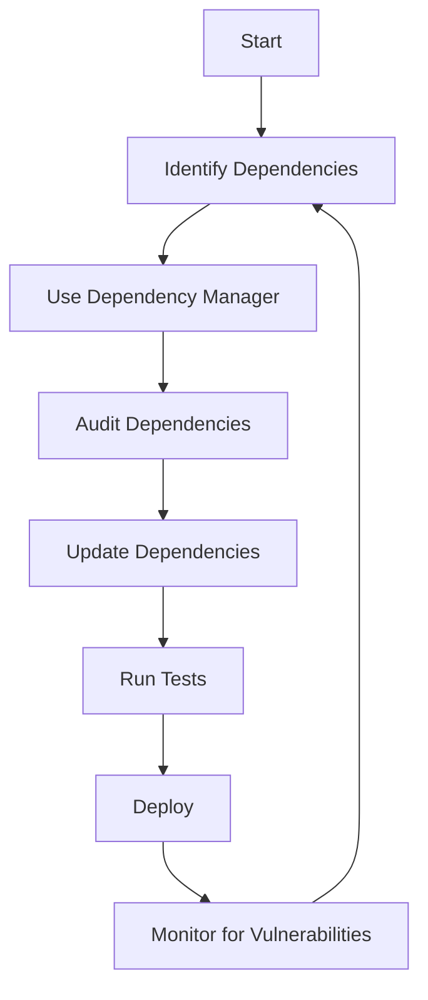

## 29.5 Regular Updates and Dependencies

In the world of software development, especially in JavaScript, managing updates and dependencies is crucial for maintaining a secure and efficient codebase. As we delve into this topic, we'll explore the importance of keeping third-party libraries up-to-date, strategies for managing dependencies, tools for vulnerability scanning, and the role of functions in interacting securely with external code.

### The Importance of Updating Third-Party Libraries

Third-party libraries are a staple in modern JavaScript development. They provide pre-built functionalities that save time and effort. However, these libraries can also introduce vulnerabilities if not properly maintained. Let's discuss why regular updates are essential:

1. **Security Patches**: Developers of third-party libraries regularly release updates to patch security vulnerabilities. By keeping libraries up-to-date, you protect your application from known security threats.

2. **Bug Fixes**: Updates often include fixes for bugs that could affect the functionality of your application. Regular updates ensure that you benefit from these improvements.

3. **Performance Enhancements**: New versions of libraries can include performance optimizations that make your application faster and more efficient.

4. **Compatibility**: As JavaScript evolves, libraries are updated to remain compatible with the latest standards and technologies. Regular updates prevent compatibility issues that could break your application.

### Strategies for Tracking and Managing Dependencies

Managing dependencies effectively is crucial for maintaining a healthy codebase. Here are some strategies to consider:

#### 1. Use a Dependency Manager

Tools like npm (Node Package Manager) and Yarn are essential for managing JavaScript dependencies. They help you install, update, and remove packages with ease.

```bash
npm install package-name

npm update package-name
```

#### 2. Regularly Audit Dependencies

Regularly auditing your dependencies helps identify outdated or vulnerable packages. Use tools like `npm audit` to scan for vulnerabilities.

```bash
npm audit
```

#### 3. Lock File Management

Lock files (`package-lock.json` or `yarn.lock`) ensure that your application uses the exact versions of dependencies that you have tested. Regularly update these files to reflect the latest secure versions.

#### 4. Monitor Dependency Updates

Use services like Dependabot or Snyk to automatically monitor and update your dependencies. These tools can create pull requests for updates, making it easier to integrate them into your codebase.

### Tools for Vulnerability Scanning

Vulnerability scanning tools are essential for identifying and mitigating security risks in your dependencies. Here are some popular tools:

#### 1. Snyk

Snyk is a powerful tool for finding and fixing vulnerabilities in open-source dependencies. It integrates with your development workflow to provide real-time alerts and fixes.

#### 2. npm Audit

`npm audit` is a built-in tool that scans your project for vulnerabilities. It provides a detailed report of issues and suggests fixes.

#### 3. OWASP Dependency-Check

OWASP Dependency-Check is an open-source tool that identifies vulnerable components in your project. It supports multiple languages, including JavaScript.

### Proactive Maintenance of Codebases

Proactive maintenance is key to ensuring the long-term health of your codebase. Here are some best practices:

#### 1. Regular Code Reviews

Conduct regular code reviews to identify potential issues and ensure that your code follows best practices. This helps catch vulnerabilities early.

#### 2. Automated Testing

Implement automated testing to ensure that updates to dependencies do not break your application. Use tools like Jest or Mocha for testing JavaScript code.

#### 3. Continuous Integration

Set up continuous integration (CI) pipelines to automate the testing and deployment of your application. This ensures that updates are thoroughly tested before going live.

### The Role of Functions in Secure Interactions with External Code

Functions play a crucial role in how your application interacts with external code. Here are some considerations for using functions securely:

#### 1. Input Validation

Always validate inputs to functions that interact with external code. This prevents injection attacks and other vulnerabilities.

```javascript
function processData(input) {
    if (typeof input !== 'string') {
        throw new Error('Invalid input type');
    }
    // Process the input safely
}
```

#### 2. Error Handling

Implement robust error handling in functions to gracefully handle unexpected situations. This prevents your application from crashing due to unhandled errors.

```javascript
try {
    riskyFunction();
} catch (error) {
    console.error('An error occurred:', error);
}
```

#### 3. Least Privilege Principle

Apply the principle of least privilege by limiting the permissions and access levels of functions. This reduces the potential impact of a security breach.

### Visualizing Dependency Management

To better understand the flow of managing dependencies, let's visualize the process using a flowchart.



**Figure 1: Dependency Management Process**

### Try It Yourself

Experiment with managing dependencies in a sample project. Create a new Node.js project and try the following:

1. Install a package using npm.
2. Run `npm audit` to check for vulnerabilities.
3. Update the package to the latest version.
4. Implement a simple function that validates input and handles errors.

### References and Links

- [MDN Web Docs: JavaScript](https://developer.mozilla.org/en-US/docs/Web/JavaScript)
- [npm Documentation](https://docs.npmjs.com/)
- [Snyk: Vulnerability Scanner](https://snyk.io/)
- [OWASP Dependency-Check](https://owasp.org/www-project-dependency-check/)

### Knowledge Check

1. Why is it important to keep third-party libraries up-to-date?
2. What tools can you use to manage JavaScript dependencies?
3. How can you ensure that updates to dependencies do not break your application?
4. What is the principle of least privilege, and how does it apply to functions?

### Embrace the Journey

Remember, maintaining a secure and efficient codebase is an ongoing process. By regularly updating dependencies and proactively managing your code, you ensure that your applications remain robust and secure. Keep experimenting, stay curious, and enjoy the journey of mastering JavaScript functions and scope!

## Quiz Time!



### Why is it important to keep third-party libraries up-to-date?

- [x] To patch security vulnerabilities
- [ ] To increase the size of the codebase
- [ ] To make the application slower
- [ ] To remove features

> **Explanation:** Keeping third-party libraries up-to-date is crucial for patching security vulnerabilities, ensuring that your application remains secure against known threats.

### What tool can you use to scan for vulnerabilities in your dependencies?

- [x] npm audit
- [ ] npm install
- [ ] npm init
- [ ] npm start

> **Explanation:** `npm audit` is a built-in tool that scans your project for vulnerabilities and provides a detailed report.

### Which principle involves limiting permissions and access levels of functions?

- [x] Least Privilege Principle
- [ ] Most Privilege Principle
- [ ] Maximum Access Principle
- [ ] Open Access Principle

> **Explanation:** The Least Privilege Principle involves limiting permissions and access levels to reduce the potential impact of a security breach.

### What is a lock file used for in dependency management?

- [x] To ensure exact versions of dependencies are used
- [ ] To lock the codebase from changes
- [ ] To encrypt the dependencies
- [ ] To delete unused dependencies

> **Explanation:** A lock file ensures that your application uses the exact versions of dependencies that you have tested, preventing unexpected issues.

### How can you automate the testing and deployment of your application?

- [x] By setting up continuous integration pipelines
- [ ] By manually testing each update
- [ ] By ignoring updates
- [ ] By using outdated libraries

> **Explanation:** Continuous integration pipelines automate the testing and deployment process, ensuring that updates are thoroughly tested before going live.

### Which tool is used for managing JavaScript dependencies?

- [x] npm
- [ ] Git
- [ ] Docker
- [ ] Jenkins

> **Explanation:** npm (Node Package Manager) is a tool used for managing JavaScript dependencies, allowing you to install, update, and remove packages.

### What should you do if a function interacts with external code?

- [x] Validate inputs to prevent injection attacks
- [ ] Ignore input validation
- [ ] Allow all inputs without checks
- [ ] Disable error handling

> **Explanation:** Always validate inputs to functions that interact with external code to prevent injection attacks and other vulnerabilities.

### What is the purpose of automated testing?

- [x] To ensure updates do not break the application
- [ ] To slow down the development process
- [ ] To increase the number of bugs
- [ ] To make the code unreadable

> **Explanation:** Automated testing ensures that updates to dependencies do not break your application, maintaining its functionality and reliability.

### What does Snyk help you with?

- [x] Finding and fixing vulnerabilities in open-source dependencies
- [ ] Writing new JavaScript code
- [ ] Designing user interfaces
- [ ] Creating databases

> **Explanation:** Snyk is a tool that helps find and fix vulnerabilities in open-source dependencies, integrating with your development workflow for real-time alerts and fixes.

### True or False: Regular code reviews are unnecessary for maintaining a secure codebase.

- [ ] True
- [x] False

> **Explanation:** Regular code reviews are essential for identifying potential issues and ensuring that your code follows best practices, contributing to a secure codebase.


