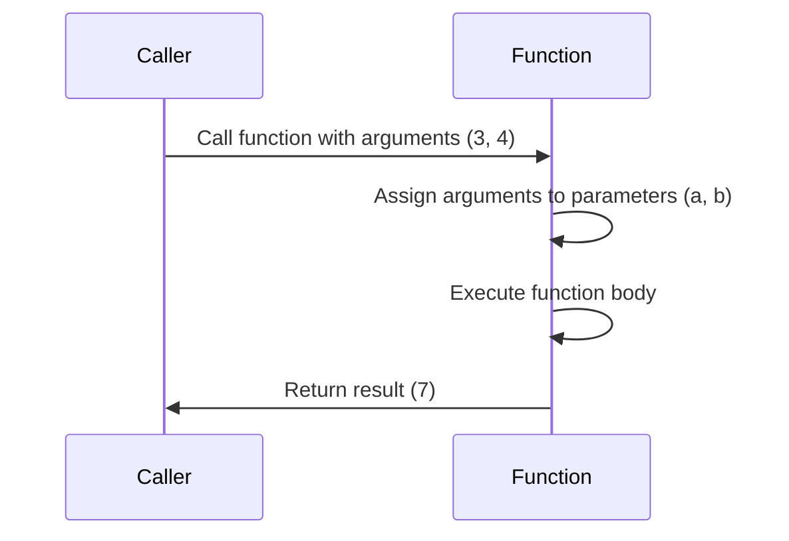

## 3.1 Defining Parameters

In the world of programming, functions are the building blocks that allow us to encapsulate code into reusable and organized units. One of the key aspects of functions is their ability to accept inputs, process them, and potentially return outputs. These inputs are known as **parameters**. In this section, we will explore the concept of parameters in JavaScript functions, how to define them, and their role in making functions versatile and powerful.

### Understanding the Role of Parameters

Parameters are essentially placeholders for the values that a function needs to operate. When you define a function, you specify parameters in the function's declaration. These parameters act as variables within the function, allowing you to work with the data passed to the function when it is called. 

Think of parameters as the function's way of asking, "What do I need to know to do my job?" For example, if you have a function that calculates the area of a rectangle, it needs to know the rectangle's width and height. These dimensions are the parameters.

### Including Parameters in Function Declarations

To include parameters in a function declaration, you place them inside the parentheses following the function name. Each parameter is separated by a comma. Here's a basic example:

```javascript
function greet(name) {
    console.log("Hello, " + name + "!");
}
```

In this example, `name` is a parameter of the `greet` function. When you call the function, you provide an argument that replaces the parameter:

```javascript
greet("Alice"); // Output: Hello, Alice!
```

### Parameter Naming Conventions

Choosing meaningful names for parameters is crucial for code readability and maintainability. Here are some best practices for naming parameters:

- **Descriptive Names**: Use names that clearly indicate the purpose of the parameter. For example, use `width` and `height` for a function that calculates area.
- **Camel Case**: Follow the camelCase convention, which is common in JavaScript. Start with a lowercase letter and capitalize subsequent words (e.g., `userName`, `productPrice`).
- **Avoid Single Letters**: Unless in specific contexts like mathematical functions, avoid using single-letter parameter names, as they can be ambiguous.

### Examples with Multiple Parameters

Functions can have multiple parameters, allowing them to perform more complex operations. Here's an example of a function that calculates the area of a rectangle using two parameters:

```javascript
function calculateArea(width, height) {
    return width * height;
}

let area = calculateArea(5, 10);
console.log("The area of the rectangle is: " + area); // Output: The area of the rectangle is: 50
```

In this example, `width` and `height` are parameters. When the function is called with arguments `5` and `10`, these values are used within the function to compute the area.

### Distinction Between Parameters and Arguments

It's important to distinguish between parameters and arguments, as they are often confused:

- **Parameters** are the variables listed in the function's declaration. They define what inputs the function expects.
- **Arguments** are the actual values you pass to the function when you call it. They replace the parameters within the function body.

Here's a simple illustration:

```javascript
function add(a, b) { // a and b are parameters
    return a + b;
}

let sum = add(3, 4); // 3 and 4 are arguments
console.log("The sum is: " + sum); // Output: The sum is: 7
```

### Try It Yourself

To solidify your understanding, try modifying the examples above. For instance, add more parameters to the `calculateArea` function to handle different shapes, or create a new function that takes multiple parameters to perform a different task. Experimenting with code is a great way to learn!

### Visualizing Parameters and Arguments

To better understand the flow of parameters and arguments, let's visualize how they interact within a function call.



In this diagram, the caller provides arguments to the function, which are then assigned to the parameters. The function executes using these parameters and returns the result to the caller.

### References and Links

For more information on JavaScript functions and parameters, check out these resources:
- [MDN Web Docs: Functions](https://developer.mozilla.org/en-US/docs/Web/JavaScript/Guide/Functions)
- [W3Schools: JavaScript Functions](https://www.w3schools.com/js/js_functions.asp)

### Knowledge Check

Let's test your understanding with a few questions:

1. What is the difference between a parameter and an argument?
2. How would you define a function with three parameters?
3. Why is it important to use descriptive names for parameters?

### Summary

In this section, we've explored the concept of parameters in JavaScript functions. We've learned how to define parameters, the importance of naming conventions, and the distinction between parameters and arguments. Remember, parameters are the function's way of accepting inputs, and mastering their use is a crucial step in becoming proficient in JavaScript.

Keep experimenting, stay curious, and enjoy the journey of learning JavaScript functions!

## Quiz Time!



### What is a parameter in a JavaScript function?

- [x] A placeholder for input values within a function
- [ ] The actual value passed to the function
- [ ] A function's return value
- [ ] A type of variable declaration

> **Explanation:** A parameter is a placeholder for input values that a function expects to receive when it is called.

### How do you define a parameter in a function declaration?

- [x] By listing it inside the parentheses following the function name
- [ ] By declaring it with the `var` keyword
- [ ] By assigning it a value within the function body
- [ ] By using it in a `return` statement

> **Explanation:** Parameters are defined inside the parentheses following the function name in the function declaration.

### What is the difference between parameters and arguments?

- [x] Parameters are placeholders in the function declaration; arguments are the actual values passed
- [ ] Parameters are the actual values passed; arguments are placeholders in the function declaration
- [ ] Parameters and arguments are the same
- [ ] Parameters are only used in arrow functions

> **Explanation:** Parameters are the placeholders in the function declaration, while arguments are the actual values passed when the function is called.

### Which naming convention is commonly used for parameters in JavaScript?

- [x] camelCase
- [ ] snake_case
- [ ] PascalCase
- [ ] UPPERCASE

> **Explanation:** camelCase is the common naming convention used for parameters in JavaScript.

### Can a function have multiple parameters?

- [x] Yes
- [ ] No

> **Explanation:** A function can have multiple parameters, allowing it to accept multiple inputs.

### What should you consider when naming parameters?

- [x] Use descriptive names
- [ ] Use single letters for simplicity
- [ ] Use numbers as names
- [ ] Use the same name for all parameters

> **Explanation:** Descriptive names help in understanding the purpose of the parameters and improve code readability.

### How are parameters used within a function?

- [x] As variables that hold the values passed as arguments
- [ ] As constants that cannot be changed
- [ ] As global variables
- [ ] As function return values

> **Explanation:** Parameters act as variables within the function, holding the values passed as arguments.

### What happens if you call a function without providing an argument for a parameter?

- [x] The parameter is `undefined`
- [ ] The function throws an error
- [ ] The parameter takes a default value
- [ ] The function does not execute

> **Explanation:** If no argument is provided, the parameter is `undefined`.

### Can you change the value of a parameter inside a function?

- [x] Yes
- [ ] No

> **Explanation:** Parameters are variables within the function, so their values can be changed.

### True or False: Arguments and parameters are interchangeable terms.

- [ ] True
- [x] False

> **Explanation:** Arguments and parameters are not interchangeable; parameters are placeholders, while arguments are the actual values passed.



Remember, this is just the beginning. As you progress, you'll build more complex and interactive web pages. Keep experimenting, stay curious, and enjoy the journey!
