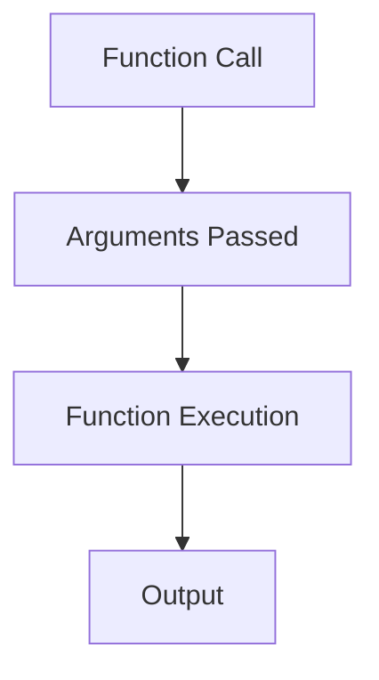

## 3.2 Passing Arguments

In the world of programming, functions are the building blocks that allow us to encapsulate code into reusable chunks. To make these functions versatile and adaptable to different situations, we need a way to pass data into them. This is where **arguments** come into play. In this section, we'll explore what arguments are, how to pass them to functions, and how to handle different scenarios involving arguments.

### What are Arguments?

**Arguments** are the values you provide to a function when you call it. They are the actual data that the function will use to perform its task. Think of arguments as the ingredients you give to a recipe. The recipe (function) needs these ingredients (arguments) to create the final dish (output).

### Passing Arguments to Functions

When you define a function, you specify **parameters** in the function's declaration. These parameters act as placeholders for the arguments that will be passed when the function is called. Let's look at a simple example:

```javascript
// Function definition with parameters
function greet(name, message) {
    console.log(message + ', ' + name + '!');
}

// Function call with arguments
greet('Alice', 'Hello');
```

In this example, `name` and `message` are parameters, while `'Alice'` and `'Hello'` are the arguments passed to the function `greet`. When the function is called, the arguments replace the parameters, and the function executes using these values.

### Order of Arguments and Parameters

The order in which you pass arguments to a function is crucial. The first argument corresponds to the first parameter, the second argument to the second parameter, and so on. If you mix up the order, the function might not work as intended. Consider this example:

```javascript
function calculateArea(length, width) {
    return length * width;
}

// Correct order of arguments
let area = calculateArea(5, 10);
console.log('Area:', area); // Output: Area: 50

// Incorrect order of arguments
area = calculateArea(10, 5);
console.log('Area:', area); // Output: Area: 50
```

In this case, swapping the order of arguments doesn't affect the result because multiplication is commutative. However, in functions where the order matters, such as subtraction or division, incorrect ordering can lead to unexpected results.

### Handling Too Many or Too Few Arguments

JavaScript is flexible when it comes to the number of arguments you pass to a function. You can pass more or fewer arguments than the function expects, but this can lead to unintended behavior.

#### Too Few Arguments

If you pass fewer arguments than the function parameters, the missing parameters will be `undefined`. Let's see an example:

```javascript
function introduce(firstName, lastName) {
    console.log('Hello, my name is ' + firstName + ' ' + lastName);
}

// Missing lastName argument
introduce('John'); // Output: Hello, my name is John undefined
```

In this example, `lastName` is `undefined` because no argument was provided for it.

#### Too Many Arguments

If you pass more arguments than the function parameters, the extra arguments are simply ignored:

```javascript
function add(a, b) {
    return a + b;
}

// Extra argument is ignored
let sum = add(5, 10, 15);
console.log('Sum:', sum); // Output: Sum: 15
```

The function `add` only uses the first two arguments, ignoring the third one.

### The `arguments` Object

In JavaScript, every function has a built-in `arguments` object. This object contains all the arguments passed to the function, regardless of the number of parameters. It acts like an array, allowing you to access each argument by its index:

```javascript
function showArguments() {
    for (let i = 0; i < arguments.length; i++) {
        console.log('Argument ' + i + ':', arguments[i]);
    }
}

// Calling with different numbers of arguments
showArguments('Hello', 'World', 42);
```

This will output:

```
Argument 0: Hello
Argument 1: World
Argument 2: 42
```

The `arguments` object is particularly useful when you want to handle a variable number of arguments.

### Practical Example: Calculating Average

Let's apply what we've learned to create a function that calculates the average of any number of arguments:

```javascript
function calculateAverage() {
    let sum = 0;
    for (let i = 0; i < arguments.length; i++) {
        sum += arguments[i];
    }
    return sum / arguments.length;
}

console.log('Average:', calculateAverage(10, 20, 30, 40)); // Output: Average: 25
```

In this example, `calculateAverage` uses the `arguments` object to iterate over all the arguments, summing them up and dividing by the total number to find the average.

### Visualizing Argument Passing

To better understand how arguments are passed to functions, let's visualize the process using a simple diagram:



**Diagram Description**: This flowchart illustrates the process of passing arguments to a function. The function call initiates the passing of arguments, which are then used during the function's execution to produce an output.

### Try It Yourself

Now that we've covered the basics of passing arguments, it's time to experiment! Try modifying the examples above:

- Change the order of arguments in the `greet` function and observe the output.
- Add more arguments to the `calculateAverage` function call and see how the result changes.
- Create a new function that takes three parameters and returns a string combining them.

### Further Reading

For more in-depth information on functions and arguments in JavaScript, consider exploring the following resources:

- [MDN Web Docs: Functions](https://developer.mozilla.org/en-US/docs/Web/JavaScript/Guide/Functions)
- [W3Schools: JavaScript Functions](https://www.w3schools.com/js/js_functions.asp)

### Knowledge Check

Before we wrap up, let's reinforce what we've learned with a few questions:

1. What happens if you pass fewer arguments than a function's parameters?
2. How does the `arguments` object help in handling a variable number of arguments?
3. Why is the order of arguments important when calling a function?

### Summary

In this section, we've explored the concept of passing arguments to functions in JavaScript. We've learned about the importance of argument order, how to handle too many or too few arguments, and how to use the `arguments` object for flexibility. Remember, mastering the art of passing arguments is a crucial step in writing effective and reusable functions. As you continue your journey in JavaScript, keep experimenting with different ways to pass and handle arguments in your functions. Happy coding!

## Quiz Time!



### What are arguments in the context of functions?

- [x] Values provided to a function when it is called
- [ ] Placeholders in a function definition
- [ ] The output of a function
- [ ] Variables declared inside a function

> **Explanation:** Arguments are the actual values you provide to a function when you call it. They replace the parameters defined in the function.

### What happens if you pass more arguments than a function's parameters?

- [x] Extra arguments are ignored
- [ ] An error is thrown
- [ ] The function uses all arguments
- [ ] The function returns `undefined`

> **Explanation:** In JavaScript, if you pass more arguments than a function's parameters, the extra arguments are ignored.

### How can you access all arguments passed to a function?

- [x] Using the `arguments` object
- [ ] Using an array
- [ ] Using a loop
- [ ] Using a global variable

> **Explanation:** The `arguments` object is a built-in object in JavaScript functions that contains all the arguments passed to the function.

### What is the result of passing fewer arguments than a function's parameters?

- [x] Missing parameters are `undefined`
- [ ] An error is thrown
- [ ] The function does not execute
- [ ] The function returns `null`

> **Explanation:** If you pass fewer arguments than a function's parameters, the missing parameters are assigned the value `undefined`.

### Why is the order of arguments important?

- [x] It determines which parameter each argument corresponds to
- [ ] It affects the function's execution speed
- [ ] It changes the function's return type
- [ ] It alters the function's scope

> **Explanation:** The order of arguments is important because it determines which parameter each argument corresponds to, affecting the function's behavior.

### Can you use the `arguments` object in arrow functions?

- [ ] Yes, it works the same as in regular functions
- [x] No, arrow functions do not have their own `arguments` object
- [ ] Yes, but only in ES6
- [ ] No, it is deprecated

> **Explanation:** Arrow functions do not have their own `arguments` object. They inherit `arguments` from the enclosing scope.

### How do you handle a variable number of arguments in a function?

- [x] Use the `arguments` object
- [ ] Use a global variable
- [ ] Use a fixed number of parameters
- [ ] Use an array

> **Explanation:** The `arguments` object allows you to handle a variable number of arguments in a function.

### What is a practical use of the `arguments` object?

- [x] Calculating the average of any number of numbers
- [ ] Declaring variables
- [ ] Defining functions
- [ ] Creating objects

> **Explanation:** The `arguments` object can be used to iterate over any number of arguments, such as calculating the average of numbers.

### True or False: The `arguments` object is an array.

- [ ] True
- [x] False

> **Explanation:** The `arguments` object is not an array, but it is array-like, meaning it has a length property and can be accessed using indices.

### What is the output of the following code?
```javascript
function test(a, b) {
    console.log(arguments[2]);
}
test(1, 2, 3);
```

- [x] 3
- [ ] 2
- [ ] 1
- [ ] `undefined`

> **Explanation:** The `arguments` object contains all the arguments passed to the function, so `arguments[2]` accesses the third argument, which is 3.



Remember, this is just the beginning. As you progress, you'll build more complex and interactive web pages. Keep experimenting, stay curious, and enjoy the journey!
