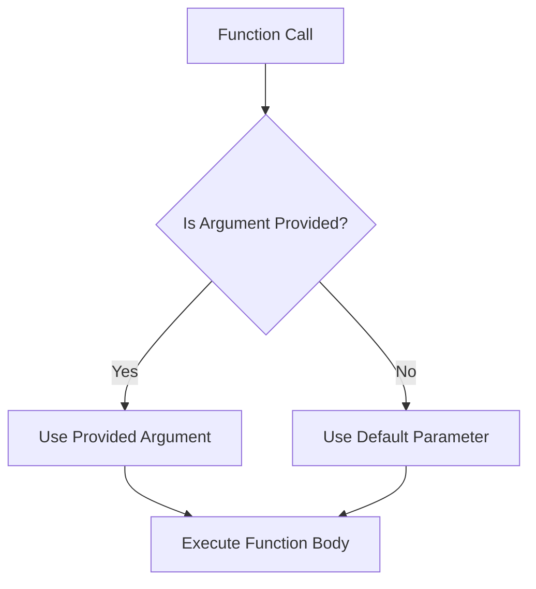

## 3.3 Default Parameters

In this section, we will delve into the concept of default parameters in JavaScript, a feature introduced in ECMAScript 6 (ES6). Default parameters allow you to specify default values for function parameters, simplifying your code and making it more robust. Let's explore how they work, their syntax, practical use cases, and considerations for browser compatibility.

### Introduction to Default Parameters

Default parameters are a way to define a fallback value for a function parameter if no argument is provided or if the argument is `undefined`. Before ES6, developers had to manually check for `undefined` values and assign defaults within the function body. With default parameters, this process becomes more straightforward and concise.

### Syntax for Default Parameters

The syntax for default parameters is simple and intuitive. You assign a default value to a parameter by using the assignment operator (`=`) directly in the function definition. Here's the basic syntax:

```javascript
function functionName(parameter1 = defaultValue1, parameter2 = defaultValue2) {
  // Function body
}
```

Let's look at a concrete example to illustrate this:

```javascript
function greet(name = 'Guest') {
  console.log(`Hello, ${name}!`);
}

greet(); // Output: Hello, Guest!
greet('Alice'); // Output: Hello, Alice!
```

In this example, the `greet` function has a parameter `name` with a default value of `'Guest'`. If no argument is passed to `greet`, it uses the default value.

### How Default Parameters Work

Default parameters come into play when a function is called without providing an argument for a parameter or when the argument is explicitly `undefined`. It's important to note that default parameters do not apply when the argument is `null` or any other falsy value except `undefined`.

#### Example: Handling Undefined Arguments

```javascript
function multiply(a, b = 1) {
  return a * b;
}

console.log(multiply(5)); // Output: 5
console.log(multiply(5, 2)); // Output: 10
console.log(multiply(5, undefined)); // Output: 5
console.log(multiply(5, null)); // Output: 0
```

In the `multiply` function, the parameter `b` has a default value of `1`. If `b` is `undefined`, the default value is used. However, if `b` is `null`, the multiplication is performed with `null`, resulting in `0`.

### Practical Use Cases for Default Parameters

Default parameters can be extremely useful in various scenarios, especially when you want to ensure that your functions behave predictably even when some arguments are missing. Here are a few practical use cases:

#### 1. Simplifying Function Calls

Default parameters can reduce the need for conditional logic inside your functions, making them cleaner and easier to read.

```javascript
function createUser(name, role = 'User') {
  return { name, role };
}

console.log(createUser('Alice')); // Output: { name: 'Alice', role: 'User' }
console.log(createUser('Bob', 'Admin')); // Output: { name: 'Bob', role: 'Admin' }
```

In this example, the `createUser` function assigns a default role of `'User'` if no role is provided.

#### 2. Providing Optional Configuration

When designing functions that accept configuration objects, default parameters can provide sensible defaults for optional properties.

```javascript
function setupServer({ port = 3000, host = 'localhost' } = {}) {
  console.log(`Server running at http://${host}:${port}`);
}

setupServer(); // Output: Server running at http://localhost:3000
setupServer({ port: 8080 }); // Output: Server running at http://localhost:8080
```

Here, the `setupServer` function uses default parameters to set default values for `port` and `host`.

#### 3. Enhancing Function Flexibility

Default parameters can make functions more flexible and adaptable to different contexts without requiring multiple overloaded versions.

```javascript
function calculateArea(width, height = width) {
  return width * height;
}

console.log(calculateArea(5)); // Output: 25 (square)
console.log(calculateArea(5, 10)); // Output: 50 (rectangle)
```

In this example, the `calculateArea` function can calculate the area of both squares and rectangles by using a single parameter for squares.

### Browser Compatibility Considerations

Default parameters are widely supported in modern browsers, but it's always a good practice to check compatibility if you're targeting older environments. As of now, most major browsers, including Chrome, Firefox, Safari, and Edge, support default parameters. However, if you need to support Internet Explorer, you may need to use a transpiler like Babel to convert ES6 code to ES5.

### Try It Yourself

Now that we've covered the basics of default parameters, it's time to experiment with them. Try modifying the examples above or create your own functions with default parameters. Here are a few ideas to get you started:

- Create a function that calculates the total price of an order with a default tax rate.
- Write a function that formats a date string with default formatting options.
- Implement a function that generates a greeting message with default language settings.

### Visualizing Default Parameters

Let's visualize how default parameters work in a function call using a flowchart. This will help you understand the decision-making process when a function is invoked with or without arguments.



**Figure 1: Flowchart of Default Parameter Decision Process**

In this flowchart, we see that the function first checks if an argument is provided. If yes, it uses the provided argument; otherwise, it falls back to the default parameter.

### Knowledge Check

Before we move on, let's reinforce what we've learned with a few questions:

1. What is the purpose of default parameters in JavaScript functions?
2. How do default parameters simplify function definitions?
3. What happens when a function is called with an `undefined` argument for a parameter with a default value?
4. Can default parameters be used with destructured objects? How?
5. What are some practical use cases for default parameters?

### Summary

In this section, we've explored the concept of default parameters in JavaScript functions. We've learned how they simplify function definitions, make code more readable, and provide flexibility in handling missing arguments. Default parameters are a powerful feature that can enhance the robustness and maintainability of your code.

Remember, this is just the beginning. As you progress, you'll build more complex and interactive web pages. Keep experimenting, stay curious, and enjoy the journey!

## Quiz Time!



### What is the primary purpose of default parameters in JavaScript functions?

- [x] To provide fallback values for function parameters when arguments are missing or undefined.
- [ ] To enforce strict typing of function parameters.
- [ ] To automatically convert data types of parameters.
- [ ] To prevent functions from being called without arguments.

> **Explanation:** Default parameters allow functions to have fallback values, ensuring they work even when some arguments are not provided.

### How do you define a default parameter in a function?

- [x] By assigning a value to the parameter in the function definition.
- [ ] By using a special keyword before the parameter name.
- [ ] By declaring the parameter as a constant.
- [ ] By using a separate function to set defaults.

> **Explanation:** Default parameters are defined by assigning a value directly in the function definition, using the assignment operator (`=`).

### What happens if a function is called with an `undefined` argument for a parameter with a default value?

- [x] The default value is used.
- [ ] The function throws an error.
- [ ] The argument is ignored.
- [ ] The function returns `undefined`.

> **Explanation:** When a parameter is `undefined`, the default value is used, ensuring the function operates as intended.

### Can default parameters be used with destructured objects?

- [x] Yes, default values can be assigned to destructured properties.
- [ ] No, default parameters only work with primitive types.
- [ ] Only if the object is passed by reference.
- [ ] Only with arrays, not objects.

> **Explanation:** Default values can be assigned to destructured properties, providing flexibility in handling object parameters.

### Which of the following is a practical use case for default parameters?

- [x] Simplifying function calls by reducing conditional logic.
- [ ] Enforcing strict data validation.
- [ ] Automatically logging function calls.
- [ ] Encrypting function parameters.

> **Explanation:** Default parameters simplify function calls by reducing the need for conditional logic to handle missing arguments.

### Are default parameters supported in all modern browsers?

- [x] Yes, they are supported in most modern browsers.
- [ ] No, they are only supported in Chrome.
- [ ] Only in browsers that support ES5.
- [ ] Only in mobile browsers.

> **Explanation:** Default parameters are supported in most modern browsers, including Chrome, Firefox, Safari, and Edge.

### What is the result of calling `multiply(5, null)` if `multiply` is defined as `function multiply(a, b = 1) { return a * b; }`?

- [x] 0
- [ ] 5
- [ ] 1
- [ ] `undefined`

> **Explanation:** When `null` is passed as an argument, it is used in the multiplication, resulting in `0`.

### How can default parameters enhance function flexibility?

- [x] By allowing functions to adapt to different contexts without multiple versions.
- [ ] By enforcing strict parameter types.
- [ ] By automatically logging function calls.
- [ ] By encrypting function parameters.

> **Explanation:** Default parameters allow functions to adapt to different contexts, reducing the need for multiple overloaded versions.

### What is the output of `greet('Alice')` if `greet` is defined as `function greet(name = 'Guest') { console.log(\`Hello, ${name}!\`); }`?

- [x] Hello, Alice!
- [ ] Hello, Guest!
- [ ] Hello, undefined!
- [ ] Hello, null!

> **Explanation:** The function uses the provided argument `'Alice'`, resulting in the output "Hello, Alice!".

### True or False: Default parameters can be used to provide default values for both primitive and complex data types.

- [x] True
- [ ] False

> **Explanation:** Default parameters can be used for both primitive types (like numbers and strings) and complex types (like objects and arrays).


