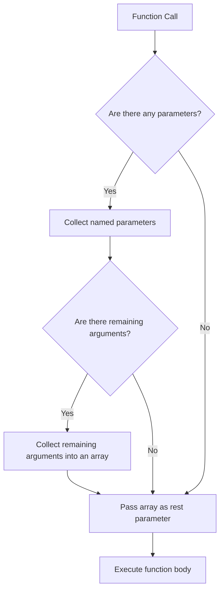

## 3.4 Rest Parameters

In the world of programming, flexibility is key. Imagine a scenario where you want to create a function that can accept any number of arguments. This is where rest parameters come into play. In this section, we will explore the concept of rest parameters in JavaScript, understand their syntax, and learn how to use them effectively in our code.

### Understanding Rest Parameters

Rest parameters allow a function to accept an indefinite number of arguments as an array. This feature was introduced in ECMAScript 6 (ES6) and provides a more intuitive way to handle multiple arguments compared to the traditional `arguments` object.

#### Syntax of Rest Parameters

The syntax for rest parameters is simple and elegant. You use the `...` (three dots) operator followed by a parameter name. This parameter will collect all remaining arguments passed to the function into an array.

```javascript
function exampleFunction(...args) {
  console.log(args);
}

exampleFunction(1, 2, 3, 4, 5); // Output: [1, 2, 3, 4, 5]
```

In the example above, `args` is a rest parameter that gathers all arguments into an array.

### How Rest Parameters Work

Rest parameters must be the last parameter in a function's parameter list. This is because they collect all remaining arguments into a single array, and having parameters after a rest parameter would be ambiguous.

```javascript
function sum(...numbers) {
  return numbers.reduce((total, num) => total + num, 0);
}

console.log(sum(1, 2, 3)); // Output: 6
console.log(sum(10, 20, 30, 40)); // Output: 100
```

In this example, the `sum` function uses a rest parameter `numbers` to gather all arguments into an array. The `reduce` method then calculates the sum of these numbers.

### Rest Parameters vs. `arguments` Object

Before the introduction of rest parameters, JavaScript developers used the `arguments` object to handle multiple arguments. However, there are key differences between rest parameters and the `arguments` object:

1. **Array vs. Object**: Rest parameters are actual arrays, which means you can use array methods like `map`, `filter`, and `reduce` directly. The `arguments` object is not a real array but an array-like object.

2. **Named Parameters**: Rest parameters have a defined name, making the code more readable and maintainable. The `arguments` object does not provide named parameters.

3. **Arrow Functions**: Rest parameters can be used in arrow functions, while the `arguments` object is not available in arrow functions.

```javascript
// Using rest parameters
const multiply = (...numbers) => numbers.reduce((product, num) => product * num, 1);

console.log(multiply(2, 3, 4)); // Output: 24

// Using arguments object (not available in arrow functions)
function multiplyOldStyle() {
  return Array.from(arguments).reduce((product, num) => product * num, 1);
}

console.log(multiplyOldStyle(2, 3, 4)); // Output: 24
```

### Practical Examples of Rest Parameters

Let's explore some practical examples where rest parameters can be particularly useful.

#### Example 1: Creating a Flexible Logging Function

Suppose you want to create a logging function that can accept any number of messages and log them to the console.

```javascript
function logMessages(...messages) {
  messages.forEach((message, index) => {
    console.log(`Message ${index + 1}: ${message}`);
  });
}

logMessages("Hello", "World", "This is a test");
// Output:
// Message 1: Hello
// Message 2: World
// Message 3: This is a test
```

#### Example 2: Combining Arrays

Rest parameters can also be used to combine multiple arrays into one.

```javascript
function combineArrays(...arrays) {
  return arrays.reduce((combined, array) => combined.concat(array), []);
}

const array1 = [1, 2, 3];
const array2 = [4, 5, 6];
const array3 = [7, 8, 9];

console.log(combineArrays(array1, array2, array3));
// Output: [1, 2, 3, 4, 5, 6, 7, 8, 9]
```

### Limitations and Best Practices

While rest parameters are powerful, there are some limitations and best practices to keep in mind:

1. **Position**: Rest parameters must be the last parameter in the function's parameter list.

2. **Performance**: Using rest parameters can have a performance impact if the function is called with a large number of arguments. Be mindful of this in performance-critical applications.

3. **Readability**: Use rest parameters judiciously. While they provide flexibility, they can also make functions less predictable if overused.

4. **Destructuring**: You can combine rest parameters with destructuring to extract specific elements from the array.

```javascript
function processNumbers(first, second, ...rest) {
  console.log(`First: ${first}, Second: ${second}, Rest: ${rest}`);
}

processNumbers(10, 20, 30, 40, 50);
// Output: First: 10, Second: 20, Rest: [30, 40, 50]
```

### Visualizing Rest Parameters

To better understand how rest parameters work, let's visualize the process using a flowchart.



**Figure 1: Flowchart of Function Execution with Rest Parameters**

### Try It Yourself

Now it's your turn to experiment with rest parameters. Try modifying the examples above to see how they behave with different numbers of arguments. Here are some ideas to get you started:

- Modify the `sum` function to return the average of the numbers instead of the sum.
- Create a function that accepts a mix of named parameters and a rest parameter, and prints them in a formatted string.
- Write a function that uses rest parameters to accept multiple strings and returns a single string with all the strings concatenated together.

### References and Further Reading

For more information on rest parameters and their usage, check out these resources:

- [MDN Web Docs - Rest Parameters](https://developer.mozilla.org/en-US/docs/Web/JavaScript/Reference/Functions/rest_parameters)
- [W3Schools - JavaScript Rest Parameters](https://www.w3schools.com/js/js_function_rest.asp)

### Knowledge Check

Before we wrap up, let's do a quick knowledge check to reinforce what we've learned.

- What is the main purpose of rest parameters in JavaScript?
- How do rest parameters differ from the `arguments` object?
- Can rest parameters be used in arrow functions?
- What are some best practices when using rest parameters?

### Embrace the Journey

Remember, mastering JavaScript functions and their parameters is a journey. As you continue to explore and experiment, you'll become more comfortable with these concepts. Keep practicing, stay curious, and enjoy the process of learning!

---

## Quiz Time!



### What is the primary use of rest parameters in JavaScript?

- [x] To handle an indefinite number of arguments as an array
- [ ] To define default values for function parameters
- [ ] To restrict the number of arguments a function can take
- [ ] To convert a string into an array

> **Explanation:** Rest parameters are used to gather all remaining arguments into an array, allowing a function to handle an indefinite number of arguments.

### Which of the following is a key difference between rest parameters and the `arguments` object?

- [x] Rest parameters are actual arrays, while `arguments` is an array-like object
- [ ] Rest parameters can only be used in arrow functions
- [ ] The `arguments` object can be used with rest parameters
- [ ] Rest parameters must be the first parameter in a function

> **Explanation:** Rest parameters are true arrays, allowing the use of array methods, whereas the `arguments` object is not a real array.

### Can rest parameters be used in arrow functions?

- [x] Yes
- [ ] No

> **Explanation:** Rest parameters can be used in arrow functions, providing flexibility in handling multiple arguments.

### What is a limitation of rest parameters?

- [x] They must be the last parameter in the function's parameter list
- [ ] They cannot be used with named parameters
- [ ] They are not supported in modern JavaScript
- [ ] They cannot collect more than three arguments

> **Explanation:** Rest parameters must be the last parameter because they collect all remaining arguments into an array.

### Which method can be used directly on rest parameters since they are arrays?

- [x] `map`
- [x] `reduce`
- [ ] `toString`
- [ ] `parseInt`

> **Explanation:** Rest parameters are arrays, so array methods like `map` and `reduce` can be used directly on them.

### How can rest parameters improve code readability?

- [x] By providing named parameters for collected arguments
- [ ] By reducing the number of lines in a function
- [ ] By eliminating the need for comments
- [ ] By replacing all other parameter types

> **Explanation:** Rest parameters allow for named parameters, making the code more readable and maintainable.

### What is a best practice when using rest parameters?

- [x] Use them judiciously to avoid making functions less predictable
- [ ] Always use them in every function
- [ ] Avoid using them with arrow functions
- [ ] Use them to replace all named parameters

> **Explanation:** While rest parameters are flexible, overusing them can make functions less predictable. It's best to use them judiciously.

### Which of the following is NOT a benefit of using rest parameters?

- [ ] They allow functions to accept any number of arguments
- [x] They automatically validate input types
- [ ] They can be used in conjunction with named parameters
- [ ] They simplify the handling of multiple arguments

> **Explanation:** Rest parameters do not automatically validate input types; they simply collect arguments into an array.

### What happens if you place a parameter after a rest parameter?

- [ ] The function will execute normally
- [x] It will result in a syntax error
- [ ] The rest parameter will ignore the additional parameter
- [ ] The additional parameter will be included in the rest parameter array

> **Explanation:** Placing a parameter after a rest parameter results in a syntax error because rest parameters must be the last in the parameter list.

### True or False: Rest parameters and the `arguments` object can be used interchangeably.

- [ ] True
- [x] False

> **Explanation:** Rest parameters and the `arguments` object are not interchangeable. Rest parameters are arrays, while `arguments` is an array-like object with different properties.



---
