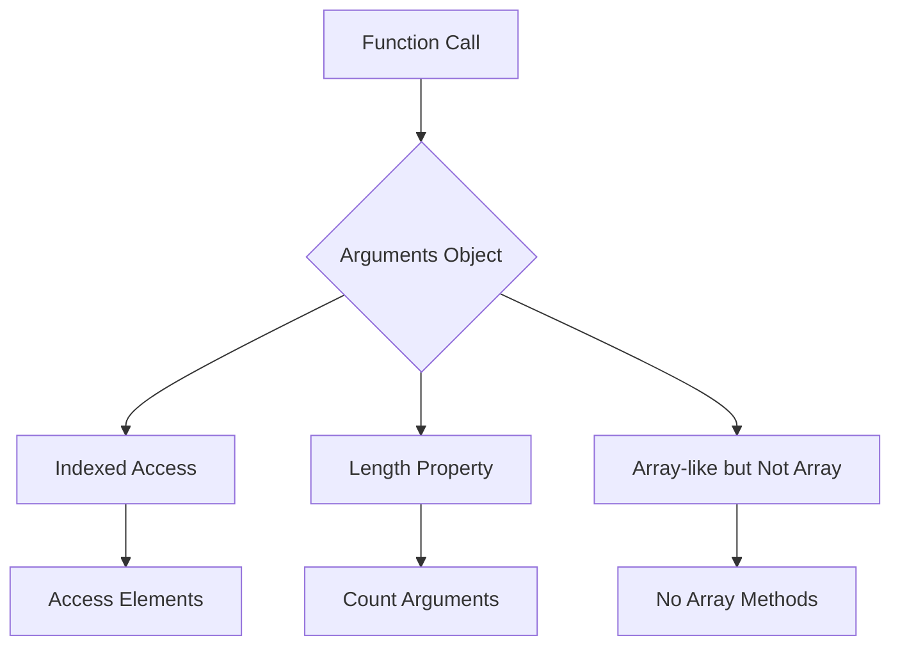

## 3.5 The `arguments` Object

Welcome to another exciting step in your JavaScript journey! In this section, we will delve into the `arguments` object, a fascinating feature of JavaScript functions. Understanding the `arguments` object will empower you to handle function inputs more flexibly and effectively. Let's embark on this exploration together!

### What is the `arguments` Object?

The `arguments` object is a built-in feature available within all non-arrow functions in JavaScript. It provides a way to access all the arguments passed to a function, regardless of how many were defined in the function's parameter list. This is particularly useful when dealing with functions that can accept a variable number of arguments.

#### Key Characteristics of the `arguments` Object:

- **Array-like**: The `arguments` object is similar to an array, but it is not a true array. It has a `length` property and allows access to its elements using indices.
- **Dynamic**: It automatically contains all the arguments passed to the function, even if they exceed the number of defined parameters.
- **Non-Array Methods**: Since it's not a real array, it doesn't have array methods like `push`, `pop`, or `forEach`.

### Accessing Arguments via the `arguments` Object

Let's see how we can access function arguments using the `arguments` object. Consider the following example:

```javascript
function showArguments() {
  for (let i = 0; i < arguments.length; i++) {
    console.log(arguments[i]);
  }
}

showArguments('Hello', 42, true, { name: 'JavaScript' });
```

**Explanation:**

- We define a function `showArguments` without any parameters.
- Inside the function, we use a `for` loop to iterate over the `arguments` object.
- We log each argument to the console.

**Output:**

```
Hello
42
true
{ name: 'JavaScript' }
```

This example demonstrates how the `arguments` object captures all the arguments passed to the function, allowing us to access them using indices.

### Array-Like but Not an Array

While the `arguments` object behaves like an array, it lacks the full capabilities of a true array. Let's explore this distinction further.

#### Array-Like Properties:

- **Indexed Access**: You can access elements using indices, just like an array.
- **Length Property**: It has a `length` property that indicates the number of arguments passed.

#### Limitations:

- **No Array Methods**: Methods like `map`, `filter`, and `reduce` are not available.
- **Not an Instance of Array**: The `arguments` object is not an instance of the `Array` class.

To convert the `arguments` object into a true array, you can use the `Array.from()` method or the spread operator. Here's how:

```javascript
function convertArgumentsToArray() {
  const argsArray = Array.from(arguments);
  console.log(argsArray);
}

convertArgumentsToArray('apple', 'banana', 'cherry');
```

**Output:**

```
['apple', 'banana', 'cherry']
```

### Comparing `arguments` Object with Rest Parameters

With the introduction of ES6, JavaScript introduced rest parameters, which provide a more modern and flexible way to handle function arguments. Let's compare the `arguments` object with rest parameters.

#### Rest Parameters:

- **Syntax**: Defined using the `...` syntax in the function parameter list.
- **True Array**: Rest parameters are true arrays, allowing the use of array methods.
- **Named**: Rest parameters have a specific name, making the code more readable.

#### Example of Rest Parameters:

```javascript
function showRestParameters(...args) {
  args.forEach(arg => console.log(arg));
}

showRestParameters('red', 'green', 'blue');
```

**Output:**

```
red
green
blue
```

#### Key Differences:

- **Readability**: Rest parameters provide a clear and explicit way to handle multiple arguments.
- **Array Methods**: Rest parameters support all array methods, unlike the `arguments` object.
- **Arrow Functions**: The `arguments` object is not available in arrow functions, whereas rest parameters can be used in any function type.

### Practical Examples and Potential Pitfalls

Let's explore some practical examples and potential pitfalls when using the `arguments` object.

#### Example: Summing Numbers

Suppose we want to create a function that sums all the numbers passed to it:

```javascript
function sumNumbers() {
  let total = 0;
  for (let i = 0; i < arguments.length; i++) {
    total += arguments[i];
  }
  return total;
}

console.log(sumNumbers(1, 2, 3, 4, 5)); // Output: 15
```

**Pitfall: Using `arguments` in Arrow Functions**

Arrow functions do not have their own `arguments` object. If you try to use `arguments` within an arrow function, it will refer to the `arguments` object of the enclosing function, if any.

```javascript
const arrowFunction = () => {
  console.log(arguments); // ReferenceError: arguments is not defined
};

arrowFunction(1, 2, 3);
```

**Solution**: Use rest parameters instead:

```javascript
const arrowFunctionWithRest = (...args) => {
  console.log(args);
};

arrowFunctionWithRest(1, 2, 3); // Output: [1, 2, 3]
```

### Visualizing the `arguments` Object

To better understand how the `arguments` object works, let's visualize it with a diagram.



**Description**: This diagram illustrates the flow of a function call and how the `arguments` object provides indexed access and a length property, while lacking array methods.

### Try It Yourself

Now it's your turn! Try modifying the code examples to deepen your understanding:

- **Experiment**: Change the number and types of arguments passed to the functions.
- **Convert**: Use `Array.from()` or the spread operator to convert the `arguments` object into a true array.
- **Compare**: Rewrite examples using rest parameters and observe the differences.

### References and Further Reading

- [MDN Web Docs: `arguments`](https://developer.mozilla.org/en-US/docs/Web/JavaScript/Reference/Functions/arguments)
- [W3Schools: JavaScript Function Parameters](https://www.w3schools.com/js/js_function_parameters.asp)

### Knowledge Check

Before we wrap up, let's reinforce what we've learned:

- What is the `arguments` object, and how does it differ from rest parameters?
- How can you convert the `arguments` object into a true array?
- Why is the `arguments` object not available in arrow functions?

### Embrace the Journey

Remember, understanding the `arguments` object is just one step in mastering JavaScript functions. Keep experimenting, stay curious, and enjoy the journey!

## Quiz Time!



### What is the `arguments` object in JavaScript?

- [x] A built-in object that contains all arguments passed to a function
- [ ] An array that holds all the parameters of a function
- [ ] A method to define default parameters
- [ ] A way to return multiple values from a function

> **Explanation:** The `arguments` object is a built-in object available within all non-arrow functions that contains all the arguments passed to the function.

### How can you access elements in the `arguments` object?

- [x] Using indices like an array
- [ ] Using object keys
- [ ] Using array methods like `push`
- [ ] Using the `length` property

> **Explanation:** You can access elements in the `arguments` object using indices, similar to how you access elements in an array.

### What is a key difference between the `arguments` object and rest parameters?

- [x] Rest parameters are true arrays, while `arguments` is array-like
- [ ] `arguments` can be used in arrow functions, rest parameters cannot
- [ ] Rest parameters do not support array methods
- [ ] `arguments` is available only in arrow functions

> **Explanation:** Rest parameters are true arrays, allowing the use of array methods, while the `arguments` object is array-like and does not support array methods.

### How can you convert the `arguments` object into a true array?

- [x] Using `Array.from(arguments)`
- [ ] Using `arguments.toArray()`
- [ ] Using `arguments.map()`
- [ ] Using `arguments.push()`

> **Explanation:** You can convert the `arguments` object into a true array using `Array.from(arguments)`.

### Why is the `arguments` object not available in arrow functions?

- [x] Arrow functions do not have their own `arguments` object
- [ ] Arrow functions do not accept parameters
- [ ] Arrow functions automatically convert `arguments` to an array
- [ ] Arrow functions do not support more than one argument

> **Explanation:** Arrow functions do not have their own `arguments` object; they inherit it from the enclosing function, if any.

### What will happen if you try to use `arguments` in an arrow function?

- [x] It will cause a ReferenceError
- [ ] It will return an empty object
- [ ] It will behave like rest parameters
- [ ] It will log undefined

> **Explanation:** Using `arguments` in an arrow function will cause a ReferenceError because arrow functions do not have their own `arguments` object.

### Which method can be used to iterate over the `arguments` object?

- [x] A `for` loop
- [ ] `arguments.forEach()`
- [ ] `arguments.map()`
- [ ] `arguments.reduce()`

> **Explanation:** You can use a `for` loop to iterate over the `arguments` object since it does not have array methods like `forEach`.

### What is a potential pitfall of using the `arguments` object?

- [x] It lacks array methods like `map` and `filter`
- [ ] It cannot be used in regular functions
- [ ] It automatically converts arguments to strings
- [ ] It does not support more than three arguments

> **Explanation:** The `arguments` object lacks array methods like `map` and `filter`, which can be a limitation when processing arguments.

### How does the `arguments` object determine its length?

- [x] It counts the number of arguments passed to the function
- [ ] It counts the number of parameters defined in the function
- [ ] It uses the length of the longest argument
- [ ] It is always zero

> **Explanation:** The `arguments` object determines its length by counting the number of arguments passed to the function.

### True or False: The `arguments` object can be used to modify the values of arguments passed to a function.

- [x] True
- [ ] False

> **Explanation:** True. The `arguments` object can be used to modify the values of arguments passed to a function, as it provides a reference to the actual arguments.


