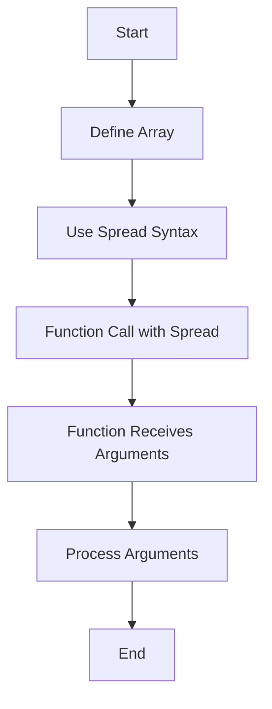

## 3.6 Spread Syntax in Function Calls

In this section, we will delve into the spread syntax, a powerful feature introduced in ECMAScript 6 (ES6) that allows you to expand elements of an iterable, such as an array, into individual elements. This feature greatly enhances the flexibility and readability of your code, especially when dealing with functions that require multiple arguments. Let's explore how to use the spread syntax effectively in function calls.

### Understanding the Spread Operator (`...`)

The spread operator, represented by three consecutive dots (`...`), is used to expand an iterable (like an array or a string) into individual elements. This operator can be particularly useful when you need to pass elements of an array as separate arguments to a function.

#### Basic Example of Spread Syntax

Let's start with a simple example to illustrate how the spread operator works:

```javascript
const numbers = [1, 2, 3];
console.log(...numbers); // Output: 1 2 3
```

In this example, the `console.log` function receives the elements of the `numbers` array as separate arguments, thanks to the spread operator.

### Passing Array Elements as Separate Arguments

One of the most common use cases for the spread syntax is passing elements of an array as separate arguments to a function. This is particularly useful when working with functions that do not accept arrays directly but require individual arguments.

#### Example: Using Spread Syntax with `Math.max()`

The `Math.max()` function returns the largest of zero or more numbers. However, it does not accept an array as an argument. Instead, you can use the spread operator to pass array elements as separate arguments:

```javascript
const values = [5, 10, 15, 20];
const maxValue = Math.max(...values);
console.log(maxValue); // Output: 20
```

Here, the spread operator expands the `values` array into individual arguments for the `Math.max()` function, allowing it to determine the maximum value.

### Difference Between Rest Parameters and Spread Syntax

While the spread syntax and rest parameters both use the `...` notation, they serve different purposes and are used in different contexts.

- **Spread Syntax**: Used in function calls to expand an array or iterable into individual elements.
- **Rest Parameters**: Used in function definitions to collect multiple arguments into a single array.

#### Example: Rest Parameters vs. Spread Syntax

```javascript
// Using rest parameters in a function definition
function sum(...numbers) {
  return numbers.reduce((total, num) => total + num, 0);
}

console.log(sum(1, 2, 3)); // Output: 6

// Using spread syntax in a function call
const nums = [1, 2, 3];
console.log(sum(...nums)); // Output: 6
```

In the first example, the rest parameter `...numbers` collects all arguments into an array. In the second example, the spread syntax `...nums` expands the array into separate arguments for the `sum` function.

### Use Cases for Spread Syntax

The spread syntax can be applied in various scenarios to simplify code and improve readability. Here are some common use cases:

#### 1. Merging Arrays

You can use the spread syntax to easily merge two or more arrays:

```javascript
const array1 = [1, 2, 3];
const array2 = [4, 5, 6];
const mergedArray = [...array1, ...array2];
console.log(mergedArray); // Output: [1, 2, 3, 4, 5, 6]
```

#### 2. Copying Arrays

Creating a shallow copy of an array is straightforward with the spread syntax:

```javascript
const originalArray = [1, 2, 3];
const copiedArray = [...originalArray];
console.log(copiedArray); // Output: [1, 2, 3]
```

#### 3. Concatenating Arrays

You can concatenate arrays without using the `concat` method:

```javascript
const arrayA = ['a', 'b', 'c'];
const arrayB = ['d', 'e', 'f'];
const concatenatedArray = [...arrayA, ...arrayB];
console.log(concatenatedArray); // Output: ['a', 'b', 'c', 'd', 'e', 'f']
```

#### 4. Spreading Elements into a Function

As demonstrated earlier, the spread syntax is useful for passing array elements as arguments to functions like `Math.max()`.

### Compatibility and Performance Considerations

The spread syntax is widely supported in modern JavaScript environments, including all major browsers and Node.js. However, it's always good practice to verify compatibility if you're working in an environment with older JavaScript engines.

#### Performance Considerations

While the spread syntax is convenient, it's essential to be mindful of performance, especially when dealing with large arrays. Expanding a large array into individual arguments can lead to increased memory usage and slower execution. In such cases, consider alternative approaches, such as using array methods that operate directly on arrays.

### Visualizing Spread Syntax in Function Calls

To better understand how the spread syntax works in function calls, let's visualize the process using a flowchart.



**Figure 1**: The flowchart illustrates the process of using spread syntax to pass array elements as separate arguments to a function.

### Try It Yourself

Now that we've covered the basics of spread syntax in function calls, it's time to experiment with the examples provided. Try modifying the code to see how the spread operator behaves in different scenarios. For instance, you can:

- Create a function that accepts multiple arguments and use the spread syntax to pass an array to it.
- Merge multiple arrays using the spread syntax and observe the outcome.
- Explore how the spread syntax interacts with other JavaScript features, such as destructuring.

### References and Further Reading

For more information on the spread syntax and its applications, consider exploring the following resources:

- [MDN Web Docs: Spread Syntax](https://developer.mozilla.org/en-US/docs/Web/JavaScript/Reference/Operators/Spread_syntax)
- [W3Schools: JavaScript Spread Operator](https://www.w3schools.com/js/js_es6.asp#spread)

### Knowledge Check

Let's reinforce what we've learned with a few questions:

1. What is the primary purpose of the spread syntax in JavaScript?
2. How does the spread syntax differ from rest parameters?
3. Can the spread syntax be used with objects? If so, how?
4. What are some common use cases for the spread syntax?
5. How does the spread syntax affect performance when dealing with large arrays?

### Embrace the Journey

Remember, mastering JavaScript is a journey, and understanding the spread syntax is just one step along the way. As you continue to learn and experiment, you'll discover even more powerful features and techniques that will enhance your coding skills. Keep exploring, stay curious, and enjoy the process!

## Quiz Time!



### What does the spread syntax (`...`) do in JavaScript?

- [x] Expands an iterable into individual elements
- [ ] Combines multiple elements into an array
- [ ] Declares a variable
- [ ] Defines a function

> **Explanation:** The spread syntax is used to expand an iterable, such as an array, into individual elements.

### How is the spread syntax different from rest parameters?

- [x] Spread syntax is used in function calls, while rest parameters are used in function definitions
- [ ] Spread syntax collects arguments into an array, while rest parameters expand arrays
- [ ] Both are used interchangeably
- [ ] Spread syntax is only used with objects

> **Explanation:** Spread syntax expands elements in function calls, whereas rest parameters collect multiple arguments into an array in function definitions.

### Which of the following is a use case for the spread syntax?

- [x] Merging arrays
- [ ] Declaring variables
- [ ] Creating functions
- [ ] Looping through arrays

> **Explanation:** The spread syntax is commonly used for merging arrays, among other use cases.

### What is the result of `Math.max(...[5, 10, 15])`?

- [x] 15
- [ ] 5
- [ ] 10
- [ ] NaN

> **Explanation:** The spread syntax expands the array into individual arguments for `Math.max()`, which returns the largest value, 15.

### Can the spread syntax be used with objects?

- [x] Yes
- [ ] No

> **Explanation:** The spread syntax can be used with objects to create shallow copies or merge objects.

### What is a potential performance consideration when using the spread syntax?

- [x] Increased memory usage with large arrays
- [ ] Slower variable declaration
- [ ] Reduced readability
- [ ] Limited browser support

> **Explanation:** Expanding large arrays into individual arguments can lead to increased memory usage and slower execution.

### What does `const newArray = [...array1, ...array2]` do?

- [x] Merges `array1` and `array2` into `newArray`
- [ ] Copies `array1` into `newArray`
- [ ] Copies `array2` into `newArray`
- [ ] Creates a nested array

> **Explanation:** The spread syntax merges `array1` and `array2` into a new array, `newArray`.

### How does the spread syntax enhance code readability?

- [x] By simplifying the process of expanding arrays into individual elements
- [ ] By reducing the number of lines of code
- [ ] By eliminating the need for comments
- [ ] By using complex syntax

> **Explanation:** The spread syntax simplifies the process of expanding arrays, making the code more readable and concise.

### What is the output of `console.log(...[1, 2, 3])`?

- [x] 1 2 3
- [ ] [1, 2, 3]
- [ ] 123
- [ ] undefined

> **Explanation:** The spread syntax expands the array into individual elements, which are logged separately.

### True or False: The spread syntax can only be used with arrays.

- [ ] True
- [x] False

> **Explanation:** The spread syntax can be used with any iterable, including strings and objects.


