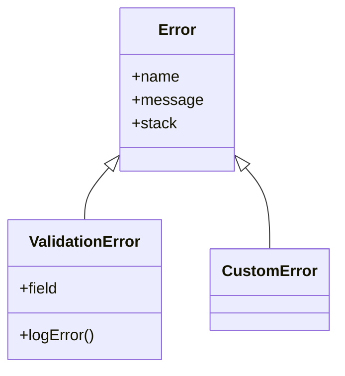

## 30.1 Creating Custom Error Classes

In the world of software development, handling errors gracefully is crucial for creating robust applications. JavaScript provides a built-in `Error` class that allows us to throw and catch errors. However, as applications grow in complexity, the need for more specific error handling becomes apparent. This is where custom error classes come into play. By creating custom error classes, we can provide more context and differentiation in our error handling, making our code easier to debug and maintain.

### Understanding the `Error` Class

Before diving into custom error classes, let's briefly review the built-in `Error` class in JavaScript. The `Error` class is a built-in object that provides a standard way to create error objects. These objects can be thrown using the `throw` statement and caught using `try...catch` blocks.

Here's a simple example of using the `Error` class:

```javascript
try {
  throw new Error("Something went wrong!");
} catch (error) {
  console.log(error.name); // "Error"
  console.log(error.message); // "Something went wrong!"
  console.log(error.stack); // Stack trace
}
```

In this example, we create a new `Error` object with a message and throw it. The `catch` block captures the error, allowing us to access its `name`, `message`, and `stack` properties.

### Why Create Custom Error Classes?

Creating custom error classes allows us to:

1. **Differentiate Errors**: By defining specific error types, we can distinguish between different error conditions.
2. **Add Context**: Custom errors can include additional properties and methods that provide more context about the error.
3. **Improve Readability**: Custom error names make it easier to understand the nature of the error at a glance.
4. **Enhance Debugging**: More specific error types can help pinpoint the source of an issue more quickly.

### Inheriting from the `Error` Class

To create a custom error class, we need to inherit from the built-in `Error` class. This is done using the `extends` keyword in JavaScript. Let's look at the syntax for creating a custom error class:

```javascript
class CustomError extends Error {
  constructor(message) {
    super(message); // Call the parent class constructor
    this.name = this.constructor.name; // Set the error name to the class name
  }
}
```

In this example, `CustomError` is a new class that extends the `Error` class. The `constructor` method calls `super(message)`, which invokes the parent class's constructor with the provided message. We also set the `name` property to the class name, which is a common practice for custom errors.

### Adding Properties and Methods

Custom error classes can include additional properties and methods to provide more context about the error. Let's enhance our `CustomError` class with additional information:

```javascript
class ValidationError extends Error {
  constructor(message, field) {
    super(message);
    this.name = this.constructor.name;
    this.field = field; // Additional property
  }

  logError() {
    console.error(`${this.name}: ${this.message} in field ${this.field}`);
  }
}
```

In this `ValidationError` class, we add a `field` property to indicate which field caused the validation error. We also include a `logError` method to log a formatted error message to the console.

### Using Custom Error Classes

Let's see how we can use our `ValidationError` class in a real-world scenario:

```javascript
function validateUserInput(input) {
  if (input.username.length < 5) {
    throw new ValidationError("Username must be at least 5 characters long", "username");
  }
  if (!input.email.includes("@")) {
    throw new ValidationError("Invalid email address", "email");
  }
  // Additional validation logic...
}

try {
  validateUserInput({ username: "abc", email: "invalidEmail" });
} catch (error) {
  if (error instanceof ValidationError) {
    error.logError();
    // Handle validation error
  } else {
    console.error("An unexpected error occurred:", error);
  }
}
```

In this example, the `validateUserInput` function throws a `ValidationError` if the username is too short or the email is invalid. The `try...catch` block checks if the error is an instance of `ValidationError` and calls the `logError` method to log the error details.

### Benefits of Error Differentiation

Differentiating errors using custom error classes provides several benefits:

- **Targeted Error Handling**: We can handle specific error types differently, allowing for more precise error recovery strategies.
- **Improved Code Clarity**: Custom error names make it clear what kind of error occurred, improving code readability.
- **Enhanced Debugging**: With more specific error types, debugging becomes easier as we can quickly identify the source of the problem.

### Visualizing Error Inheritance

Let's visualize the inheritance hierarchy of custom error classes using a Mermaid.js diagram:



This diagram shows that both `ValidationError` and `CustomError` inherit from the `Error` class, gaining access to its properties and methods.

### Try It Yourself

Now that we've covered the basics of creating custom error classes, try modifying the `ValidationError` class to include additional properties or methods. For example, you could add a `code` property to represent an error code or a `timestamp` property to record when the error occurred.

### Knowledge Check

Before we wrap up, let's review some key concepts:

- **What is the purpose of custom error classes?**
- **How do you inherit from the `Error` class in JavaScript?**
- **What are the benefits of adding properties and methods to custom errors?**

### References and Further Reading

For more information on error handling in JavaScript, check out the following resources:

- [MDN Web Docs: Error](https://developer.mozilla.org/en-US/docs/Web/JavaScript/Reference/Global_Objects/Error)
- [W3Schools: JavaScript Errors](https://www.w3schools.com/js/js_errors.asp)

### Quiz Time!



### What is the primary benefit of creating custom error classes?

- [x] To differentiate between different types of errors
- [ ] To make the code run faster
- [ ] To reduce the number of lines of code
- [ ] To make the code more complex

> **Explanation:** Custom error classes allow us to differentiate between different types of errors, providing more context and improving error handling.

### How do you inherit from the `Error` class in JavaScript?

- [x] Using the `extends` keyword
- [ ] Using the `inherit` keyword
- [ ] Using the `super` keyword
- [ ] Using the `prototype` keyword

> **Explanation:** In JavaScript, the `extends` keyword is used to create a class that inherits from another class, such as the `Error` class.

### What method is commonly used to log error details in a custom error class?

- [x] A custom method like `logError()`
- [ ] The `console.log()` method
- [ ] The `alert()` method
- [ ] The `document.write()` method

> **Explanation:** A custom method like `logError()` is often used to log error details in a custom error class.

### What property is typically set to the class name in a custom error class?

- [x] `name`
- [ ] `message`
- [ ] `stack`
- [ ] `type`

> **Explanation:** The `name` property is typically set to the class name in a custom error class to identify the type of error.

### What additional property was added to the `ValidationError` class?

- [x] `field`
- [ ] `code`
- [ ] `timestamp`
- [ ] `severity`

> **Explanation:** The `field` property was added to the `ValidationError` class to indicate which field caused the validation error.

### Which of the following is NOT a benefit of custom error classes?

- [ ] Improved code clarity
- [ ] Enhanced debugging
- [ ] Targeted error handling
- [x] Increased execution speed

> **Explanation:** Custom error classes do not increase execution speed; their benefits are primarily related to code clarity, debugging, and error handling.

### What is the purpose of the `super` keyword in a custom error class constructor?

- [x] To call the parent class constructor
- [ ] To define a new method
- [ ] To create a new instance
- [ ] To override a method

> **Explanation:** The `super` keyword is used to call the parent class constructor in a custom error class.

### What is a common practice for setting the `name` property in a custom error class?

- [x] Setting it to the class name
- [ ] Setting it to "Error"
- [ ] Setting it to "CustomError"
- [ ] Setting it to "Exception"

> **Explanation:** A common practice is to set the `name` property to the class name in a custom error class.

### True or False: Custom error classes can include additional methods.

- [x] True
- [ ] False

> **Explanation:** Custom error classes can include additional methods to provide more context and functionality.

### What keyword is used to create a new class in JavaScript?

- [x] `class`
- [ ] `function`
- [ ] `object`
- [ ] `new`

> **Explanation:** The `class` keyword is used to create a new class in JavaScript.



Remember, this is just the beginning. As you progress, you'll build more complex and interactive web pages. Keep experimenting, stay curious, and enjoy the journey!
