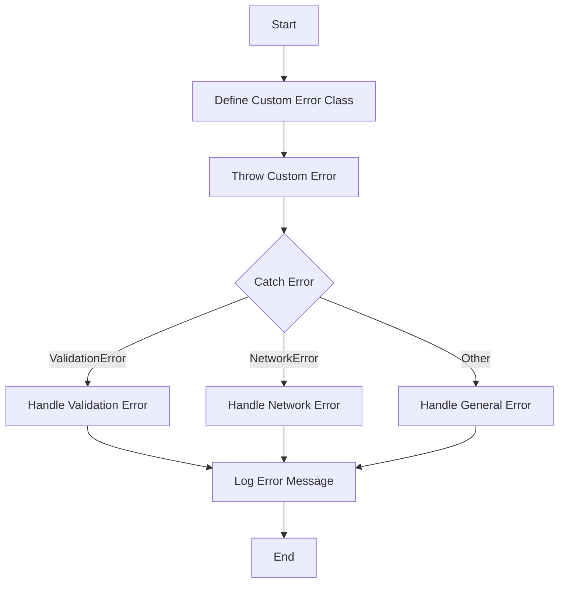

## 30.2 Throwing Custom Errors

In the realm of programming, errors are inevitable. They can arise from user input, unexpected conditions, or even bugs in the code. As developers, our goal is not only to handle these errors gracefully but also to make them as informative as possible. This is where custom errors come into play. By creating and throwing custom errors, we can provide more context and clarity, making debugging and maintenance easier.

### Understanding Errors in JavaScript

Before diving into custom errors, let's revisit how JavaScript handles errors. JavaScript has a built-in `Error` object that provides basic error-handling capabilities. When an error occurs, it can be thrown using the `throw` statement and caught using a `try...catch` block.

Here's a simple example:

```javascript
try {
    throw new Error("Something went wrong!");
} catch (error) {
    console.error(error.name + ': ' + error.message);
}
```

In this example, we create a new `Error` object with a message and throw it. The `catch` block then catches the error and logs its name and message.

### Creating Custom Errors

Custom errors extend the built-in `Error` object in JavaScript. By creating custom error types, we can provide more specific error messages and handle different error conditions more effectively.

#### Defining a Custom Error Class

To create a custom error, we define a new class that extends the `Error` class. Here's a basic example:

```javascript
class ValidationError extends Error {
    constructor(message) {
        super(message);
        this.name = "ValidationError";
    }
}
```

In this example, we define a `ValidationError` class that extends `Error`. The constructor takes a message as an argument, passes it to the `super` class, and sets the error's name to "ValidationError".

#### Throwing Custom Errors

Once we have defined a custom error class, we can instantiate and throw it just like a regular error:

```javascript
function validateUserInput(input) {
    if (input === "") {
        throw new ValidationError("Input cannot be empty.");
    }
    // Additional validation logic...
}

try {
    validateUserInput("");
} catch (error) {
    if (error instanceof ValidationError) {
        console.error("Validation Error: " + error.message);
    } else {
        console.error("Unknown Error: " + error.message);
    }
}
```

In this example, we define a `validateUserInput` function that throws a `ValidationError` if the input is empty. In the `try...catch` block, we catch the error and check if it's an instance of `ValidationError` to handle it appropriately.

### Catching Specific Error Types

One of the main advantages of custom errors is the ability to catch specific error types. This allows us to handle different errors in different ways, providing more granular control over error handling.

#### Using `instanceof` to Identify Error Types

The `instanceof` operator is used to check whether an object is an instance of a specific class. This is particularly useful when catching errors, as it allows us to differentiate between different error types:

```javascript
try {
    // Code that may throw different types of errors
} catch (error) {
    if (error instanceof ValidationError) {
        console.error("Validation Error: " + error.message);
    } else if (error instanceof TypeError) {
        console.error("Type Error: " + error.message);
    } else {
        console.error("General Error: " + error.message);
    }
}
```

In this example, we catch different types of errors and handle each one accordingly. This approach enhances the clarity and maintainability of our error-handling code.

### The Importance of Error Names and Messages

When creating custom errors, it's crucial to provide meaningful names and messages. The error name should reflect the type of error, while the message should provide a clear and concise description of the error condition.

#### Consistent Error Messaging

Consistency in error messaging is key to effective error handling. By following a consistent naming and messaging convention, we make it easier for developers to understand and debug errors.

Here are some tips for consistent error messaging:

- **Use descriptive names**: Choose names that clearly describe the error type (e.g., `ValidationError`, `DatabaseError`).
- **Provide clear messages**: Write messages that explain the error condition and suggest possible solutions.
- **Avoid technical jargon**: Use simple language that can be understood by developers of all levels.

### Benefits of Custom Errors

Custom errors offer several benefits that enhance the overall quality of our code:

- **Improved clarity**: Custom errors provide more specific and informative error messages, making it easier to understand and debug errors.
- **Granular control**: By catching specific error types, we can handle different errors in different ways, providing more control over error handling.
- **Consistency**: Custom errors promote consistency in error messaging, making it easier to maintain and update code.

### Try It Yourself

Now that we've covered the basics of custom errors, let's put our knowledge into practice. Try modifying the following code example to create and throw a custom error for a different scenario:

```javascript
class NetworkError extends Error {
    constructor(message) {
        super(message);
        this.name = "NetworkError";
    }
}

function fetchData(url) {
    if (!url.startsWith("http")) {
        throw new NetworkError("Invalid URL format.");
    }
    // Simulate network request...
}

try {
    fetchData("ftp://example.com");
} catch (error) {
    if (error instanceof NetworkError) {
        console.error("Network Error: " + error.message);
    } else {
        console.error("Unknown Error: " + error.message);
    }
}
```

### Visualizing Error Handling

To better understand how custom errors work, let's visualize the process using a flowchart:



This flowchart illustrates the process of defining, throwing, and catching custom errors. It highlights the decision-making involved in handling different error types.

### References and Further Reading

For more information on error handling in JavaScript, check out the following resources:

- [MDN Web Docs: Error](https://developer.mozilla.org/en-US/docs/Web/JavaScript/Reference/Global_Objects/Error)
- [MDN Web Docs: try...catch](https://developer.mozilla.org/en-US/docs/Web/JavaScript/Reference/Statements/try...catch)
- [JavaScript.info: Error handling](https://javascript.info/error-handling)

### Knowledge Check

Let's reinforce what we've learned with a few questions:

1. What is the purpose of creating custom errors in JavaScript?
2. How do you define a custom error class?
3. What is the advantage of using `instanceof` when catching errors?
4. Why is consistency in error messaging important?
5. How can custom errors improve code clarity?

### Embrace the Journey

Remember, this is just the beginning. As you progress, you'll build more complex and interactive web applications. Keep experimenting, stay curious, and enjoy the journey!

## Quiz Time!



### What is the primary benefit of creating custom errors in JavaScript?

- [x] To provide more specific and informative error messages
- [ ] To make the code run faster
- [ ] To avoid using the `try...catch` block
- [ ] To eliminate all errors from the code

> **Explanation:** Custom errors allow developers to provide more specific and informative error messages, which makes debugging and maintenance easier.

### How do you define a custom error class in JavaScript?

- [x] By extending the built-in `Error` class
- [ ] By using the `throw` keyword
- [ ] By creating a new object with `Error.prototype`
- [ ] By using the `catch` keyword

> **Explanation:** A custom error class is defined by extending the built-in `Error` class, allowing you to create specific error types.

### What operator is used to check if an error is a specific type?

- [x] `instanceof`
- [ ] `typeof`
- [ ] `is`
- [ ] `==`

> **Explanation:** The `instanceof` operator is used to check if an error is an instance of a specific class, which helps in handling different error types.

### Why is consistency in error messaging important?

- [x] It makes it easier to understand and debug errors
- [ ] It makes the code run faster
- [ ] It reduces the number of errors
- [ ] It eliminates the need for error handling

> **Explanation:** Consistent error messaging makes it easier to understand and debug errors, improving the maintainability of the code.

### What should you include in a custom error message?

- [x] A clear description of the error condition
- [ ] Technical jargon
- [ ] The line number of the error
- [ ] The name of the developer

> **Explanation:** A custom error message should include a clear description of the error condition to help developers understand the issue.

### Which of the following is a benefit of using custom errors?

- [x] Improved clarity in error handling
- [ ] Faster execution of code
- [ ] Elimination of all errors
- [ ] Avoidance of the `try...catch` block

> **Explanation:** Custom errors improve clarity in error handling by providing more specific and informative error messages.

### How can you catch a specific custom error type?

- [x] By using the `instanceof` operator in a `catch` block
- [ ] By using the `typeof` operator
- [ ] By using a `finally` block
- [ ] By using the `throw` keyword

> **Explanation:** You can catch a specific custom error type by using the `instanceof` operator in a `catch` block to differentiate between error types.

### What is the purpose of the `name` property in a custom error?

- [x] To identify the type of error
- [ ] To store the error message
- [ ] To indicate the error severity
- [ ] To log the error to the console

> **Explanation:** The `name` property in a custom error is used to identify the type of error, which helps in handling it appropriately.

### Which of the following is NOT a benefit of custom errors?

- [ ] Improved clarity in error handling
- [x] Faster execution of code
- [ ] Granular control over error handling
- [ ] Consistency in error messaging

> **Explanation:** Custom errors do not make the code run faster; their benefits lie in improved clarity, granular control, and consistency in error handling.

### True or False: Custom errors can only be used in JavaScript.

- [ ] True
- [x] False

> **Explanation:** Custom errors can be used in many programming languages, not just JavaScript, to provide more specific and informative error handling.




