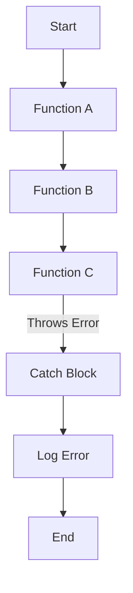

## 30.3 Enhancing Error Information

As we delve deeper into the world of JavaScript programming, understanding how to effectively handle and enhance error information becomes crucial. Errors are an inevitable part of software development, and how we manage them can significantly impact the maintainability and reliability of our applications. In this section, we will explore how to add context to errors, enrich them with metadata, and balance the need for information with security considerations. We will also discuss the importance of stack traces and encourage thorough error reporting.

### Understanding Error Objects

In JavaScript, errors are represented by the `Error` object, which provides basic information about what went wrong. The `Error` object has two main properties:

- **`name`**: The type of error (e.g., "TypeError", "ReferenceError").
- **`message`**: A human-readable description of the error.

Here's a simple example of creating an error object:

```javascript
try {
  throw new Error("Something went wrong!");
} catch (error) {
  console.log(error.name);    // "Error"
  console.log(error.message); // "Something went wrong!"
}
```

While this provides a basic understanding of the error, we often need more information to diagnose and fix issues effectively.

### Adding Context to Errors

To enhance error information, we can include additional data that provides context about the error. This can be achieved by extending the `Error` object and adding custom properties.

#### Creating Custom Error Classes

Let's create a custom error class that includes additional context:

```javascript
class CustomError extends Error {
  constructor(message, context) {
    super(message);
    this.name = "CustomError";
    this.context = context; // Additional context
  }
}

try {
  throw new CustomError("An error occurred", { userId: 123, operation: "update" });
} catch (error) {
  console.log(error.name);    // "CustomError"
  console.log(error.message); // "An error occurred"
  console.log(error.context); // { userId: 123, operation: "update" }
}
```

In this example, we extend the `Error` class to create a `CustomError` that includes a `context` property. This property can hold any additional information that might help in debugging, such as user IDs, operation types, or timestamps.

### Enriching Errors with Metadata

Metadata can be incredibly useful when diagnosing issues. It provides a snapshot of the application's state at the time of the error. Here are some common types of metadata you might include:

- **Timestamp**: When the error occurred.
- **User Information**: Details about the user experiencing the error.
- **Environment**: Information about the environment (e.g., browser, operating system).
- **Operation**: The specific operation being performed.

#### Example: Enriching Errors with Metadata

```javascript
class MetadataError extends Error {
  constructor(message, metadata) {
    super(message);
    this.name = "MetadataError";
    this.metadata = metadata;
  }
}

try {
  const metadata = {
    timestamp: new Date().toISOString(),
    user: { id: 123, name: "Alice" },
    environment: { browser: "Chrome", os: "Windows" },
    operation: "fetchData"
  };
  throw new MetadataError("Failed to fetch data", metadata);
} catch (error) {
  console.log(error.name);       // "MetadataError"
  console.log(error.message);    // "Failed to fetch data"
  console.log(error.metadata);   // { timestamp: ..., user: ..., environment: ..., operation: ... }
}
```

### Balancing Information and Security

While adding context and metadata to errors is beneficial, it's essential to balance this with security considerations. Exposing too much information can lead to security vulnerabilities, especially if error messages are displayed to end-users or logged in publicly accessible locations.

#### Best Practices for Secure Error Information

- **Avoid Sensitive Data**: Do not include sensitive information such as passwords or personal identification numbers in error messages.
- **Use Environment-Specific Logging**: In production environments, limit the amount of information logged. Use more detailed logging in development environments.
- **Sanitize User Inputs**: Ensure that any user input included in error messages is sanitized to prevent injection attacks.

### The Role of Stack Traces

Stack traces provide a detailed path of function calls that led to the error. They are invaluable for debugging, as they show the sequence of code execution.

#### Example: Using Stack Traces

```javascript
function functionA() {
  functionB();
}

function functionB() {
  functionC();
}

function functionC() {
  throw new Error("An error in functionC");
}

try {
  functionA();
} catch (error) {
  console.log(error.stack);
}
```

The stack trace will show the sequence of calls from `functionA` to `functionB` to `functionC`, helping you pinpoint where the error originated.

### Encouraging Thorough Error Reporting

Thorough error reporting involves capturing and logging all relevant information about an error. This can be achieved through structured logging and centralized error tracking systems.

#### Implementing Structured Logging

Structured logging involves logging errors in a consistent format, making it easier to parse and analyze logs.

```javascript
function logError(error) {
  console.log(JSON.stringify({
    name: error.name,
    message: error.message,
    stack: error.stack,
    metadata: error.metadata || {}
  }));
}

try {
  throw new MetadataError("An unexpected error occurred", { userId: 456 });
} catch (error) {
  logError(error);
}
```

#### Using Centralized Error Tracking

Centralized error tracking systems like Sentry or LogRocket can automatically capture and report errors, providing insights into error frequency and impact.

### Try It Yourself

Experiment with enhancing error information by modifying the examples above. Try adding different types of metadata or creating new custom error classes. Consider how you might log errors differently in development and production environments.

### Visualizing Error Flow

To better understand how errors propagate through a program, let's visualize the flow using a Mermaid.js diagram:



This diagram illustrates the flow of function calls leading to an error and how it is caught and logged.

### References and Links

- [MDN Web Docs: Error](https://developer.mozilla.org/en-US/docs/Web/JavaScript/Reference/Global_Objects/Error)
- [Sentry: JavaScript Error Tracking](https://sentry.io/for/javascript/)
- [LogRocket: Logging and Error Tracking](https://logrocket.com/)

### Knowledge Check

- What are the benefits of adding context to error objects?
- How can metadata enhance error information?
- Why is it important to balance error information with security?
- What role do stack traces play in debugging?
- How can centralized error tracking improve error reporting?

### Embrace the Journey

Remember, enhancing error information is just one step in building robust and reliable applications. As you continue your journey, keep experimenting with different error handling techniques, stay curious, and enjoy the process of learning and improving your skills.

---

## Quiz Time!



### What is the primary benefit of adding context to error objects?

- [x] It helps in diagnosing and fixing issues effectively.
- [ ] It makes the code run faster.
- [ ] It reduces the size of the codebase.
- [ ] It eliminates all errors.

> **Explanation:** Adding context to error objects provides additional information that can help developers understand the circumstances under which an error occurred, making it easier to diagnose and fix issues.

### Which of the following is NOT a recommended type of metadata to include in error information?

- [ ] Timestamp
- [ ] User Information
- [x] Passwords
- [ ] Environment

> **Explanation:** Including sensitive information such as passwords in error messages is not recommended due to security risks.

### What is the purpose of a stack trace?

- [x] To show the sequence of function calls leading to an error.
- [ ] To improve the performance of the application.
- [ ] To reduce the size of the error message.
- [ ] To encrypt the error message.

> **Explanation:** A stack trace provides a detailed path of function calls that led to an error, helping developers pinpoint the source of the problem.

### How can centralized error tracking systems benefit developers?

- [x] By automatically capturing and reporting errors.
- [ ] By eliminating all errors in the code.
- [ ] By reducing the size of the application.
- [ ] By making the application run faster.

> **Explanation:** Centralized error tracking systems like Sentry or LogRocket can automatically capture and report errors, providing insights into error frequency and impact.

### Why is it important to balance error information with security?

- [x] To prevent exposing sensitive information.
- [ ] To make the application run faster.
- [ ] To reduce the size of the codebase.
- [ ] To eliminate all errors.

> **Explanation:** Balancing error information with security is important to prevent exposing sensitive information that could lead to security vulnerabilities.

### What is structured logging?

- [x] Logging errors in a consistent format.
- [ ] Logging errors randomly.
- [ ] Logging only critical errors.
- [ ] Logging errors without any format.

> **Explanation:** Structured logging involves logging errors in a consistent format, making it easier to parse and analyze logs.

### Which of the following is a best practice for secure error information?

- [x] Avoid including sensitive data in error messages.
- [ ] Include as much information as possible in error messages.
- [ ] Display error messages to end-users.
- [ ] Log errors in publicly accessible locations.

> **Explanation:** Avoiding the inclusion of sensitive data in error messages is a best practice to prevent security vulnerabilities.

### What is the role of custom error classes?

- [x] To include additional context in error objects.
- [ ] To make the application run faster.
- [ ] To reduce the size of the codebase.
- [ ] To eliminate all errors.

> **Explanation:** Custom error classes allow developers to include additional context in error objects, providing more information for debugging.

### How can metadata enhance error information?

- [x] By providing a snapshot of the application's state at the time of the error.
- [ ] By reducing the size of the error message.
- [ ] By making the application run faster.
- [ ] By eliminating all errors.

> **Explanation:** Metadata provides a snapshot of the application's state at the time of the error, offering valuable information for diagnosing issues.

### True or False: Including user input in error messages should always be avoided.

- [ ] True
- [x] False

> **Explanation:** While including user input in error messages can be risky, it is not always necessary to avoid it entirely. Instead, user input should be sanitized to prevent injection attacks.


