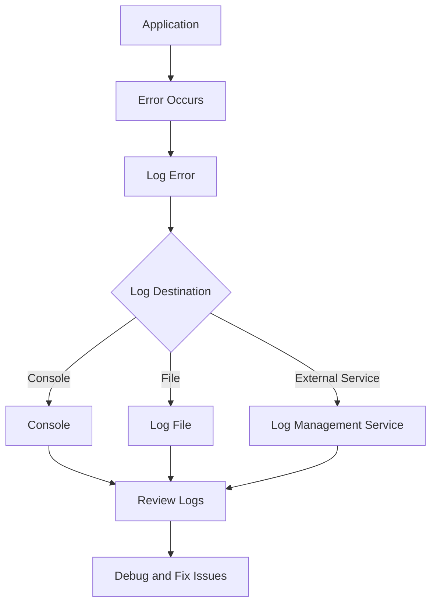

## 30.4 Logging Errors

In the world of software development, errors are inevitable. They can arise from various sources, such as user input, network issues, or unexpected conditions in your code. As developers, our goal is to anticipate and handle these errors gracefully. One of the most effective ways to manage errors is through logging. Logging provides a way to record information about your application's execution, which can be invaluable for monitoring, debugging, and improving your code.

### Why is Logging Important?

Logging serves several critical purposes in software development:

1. **Monitoring**: By logging errors, you can keep track of your application's health and performance. This is especially important in production environments where you might not have direct access to the running application.

2. **Debugging**: Logs provide a historical record of what happened leading up to an error. This can help you identify the root cause of issues and fix them more quickly.

3. **Auditing**: Logs can be used to audit user actions and system events, which is crucial for security and compliance.

4. **Performance Analysis**: By analyzing logs, you can identify performance bottlenecks and optimize your application.

### Basic Error Logging in JavaScript

Let's start with the basics of logging errors in JavaScript. The simplest way to log errors is by using the `console` object, which provides several methods for outputting messages to the browser's console.

```javascript
function divide(a, b) {
    if (b === 0) {
        console.error("Error: Division by zero is not allowed.");
        return null;
    }
    return a / b;
}

const result = divide(10, 0);
```

In the example above, we use `console.error()` to log an error message when an attempt is made to divide by zero. The `console.error()` method is specifically designed for logging error messages and will often display them in a different color or format in the console, making them easier to spot.

### Logging to Files

While logging to the console is useful during development, it is not suitable for production environments where you need to persist logs for later analysis. In Node.js, you can log errors to files using the built-in `fs` module.

```javascript
const fs = require('fs');

function logErrorToFile(error) {
    const logMessage = `${new Date().toISOString()} - Error: ${error}\n`;
    fs.appendFile('error.log', logMessage, (err) => {
        if (err) console.error("Failed to write to log file:", err);
    });
}

function divide(a, b) {
    if (b === 0) {
        const errorMessage = "Division by zero is not allowed.";
        logErrorToFile(errorMessage);
        return null;
    }
    return a / b;
}

const result = divide(10, 0);
```

In this example, we define a `logErrorToFile` function that appends error messages to a file named `error.log`. This allows you to maintain a persistent record of errors that can be reviewed later.

### Logging to External Services

For larger applications, especially those running in distributed environments, logging to external services can provide additional benefits such as centralized log management, real-time monitoring, and advanced analytics. Several third-party services offer robust logging solutions, including:

- **Loggly**: A cloud-based log management service that provides real-time log analysis and visualization.
- **Sentry**: An error tracking tool that helps developers monitor and fix crashes in real-time.
- **Papertrail**: A log management service that aggregates logs from various sources for easy searching and analysis.

Here's an example of how you might integrate Sentry into a JavaScript application:

```javascript
import * as Sentry from '@sentry/browser';

Sentry.init({ dsn: 'https://examplePublicKey@o0.ingest.sentry.io/0' });

function divide(a, b) {
    if (b === 0) {
        const error = new Error("Division by zero is not allowed.");
        Sentry.captureException(error);
        return null;
    }
    return a / b;
}

const result = divide(10, 0);
```

In this example, we initialize Sentry with a Data Source Name (DSN) and use `Sentry.captureException()` to send error information to Sentry's servers.

### Best Practices for Error Logging

1. **Avoid Logging Sensitive Data**: Logs should never contain sensitive information such as passwords, credit card numbers, or personal data. Always sanitize inputs and outputs before logging.

2. **Use Structured Logging**: Instead of logging plain text messages, use structured logging formats like JSON. This makes it easier to parse and analyze logs programmatically.

3. **Log at Appropriate Levels**: Use different logging levels (e.g., `info`, `warn`, `error`) to categorize log messages based on their severity. This helps in filtering and prioritizing logs.

4. **Integrate Logging into Your Architecture**: Design your application with logging in mind. Ensure that logging is consistent across different modules and components.

5. **Regularly Review Logs**: Make it a habit to review logs regularly. This helps in identifying patterns, detecting anomalies, and improving your application's reliability.

### Tools and Libraries for Error Logging

Several tools and libraries can help you implement effective error logging in your JavaScript applications:

- **Winston**: A popular logging library for Node.js that supports multiple transports (e.g., console, file, HTTP) and log levels.

  ```javascript
  const winston = require('winston');

  const logger = winston.createLogger({
      level: 'error',
      format: winston.format.json(),
      transports: [
          new winston.transports.File({ filename: 'error.log' })
      ]
  });

  function divide(a, b) {
      if (b === 0) {
          logger.error("Division by zero is not allowed.");
          return null;
      }
      return a / b;
  }

  const result = divide(10, 0);
  ```

- **Morgan**: A middleware for logging HTTP requests in Node.js applications. It is often used with Express.js.

  ```javascript
  const express = require('express');
  const morgan = require('morgan');

  const app = express();

  app.use(morgan('combined'));

  app.get('/', (req, res) => {
      res.send('Hello World!');
  });

  app.listen(3000, () => {
      console.log('Server is running on port 3000');
  });
  ```

### Avoiding Exposure of Sensitive Data

When logging errors, it's crucial to ensure that sensitive data is not exposed in the logs. Here are some strategies to achieve this:

- **Redact Sensitive Information**: Before logging, redact or mask sensitive data. For example, replace credit card numbers with asterisks except for the last four digits.

- **Use Environment Variables**: Store sensitive information in environment variables and avoid logging them directly.

- **Implement Access Controls**: Restrict access to logs to authorized personnel only. Use role-based access control (RBAC) to manage permissions.

### Integrating Logging into Application Architecture

To effectively integrate logging into your application's architecture, consider the following approaches:

- **Centralized Logging**: Use a centralized logging system to aggregate logs from different parts of your application. This makes it easier to search, analyze, and visualize logs.

- **Microservices Logging**: In a microservices architecture, ensure that each service logs its own errors and that these logs are aggregated in a central location.

- **Logging Middleware**: In web applications, use middleware to log incoming requests and outgoing responses. This provides a complete picture of the application's interactions.

### Visualizing Error Logging

To better understand how error logging fits into an application's architecture, let's visualize a typical logging workflow using a flowchart.



**Figure 1: Error Logging Workflow**  
This flowchart illustrates the process of logging errors in an application. When an error occurs, it is logged to one or more destinations (console, file, or external service). The logs are then reviewed to debug and fix issues.

### Try It Yourself

Now that we've covered the basics of error logging, let's put it into practice. Try modifying the code examples provided to log additional information, such as the function name or stack trace. Experiment with different logging levels and formats to see how they affect the readability and usefulness of your logs.

### Knowledge Check

Before we wrap up, let's reinforce what we've learned with a few practice questions.

1. What are the benefits of logging errors in an application?
2. How can you log errors to a file in Node.js?
3. Name three external services that can be used for error logging.
4. Why is it important to avoid logging sensitive data?
5. What is structured logging, and why is it beneficial?

### Summary

In this section, we've explored the importance of logging errors in JavaScript applications. We've learned how to log errors to the console, files, and external services, and discussed best practices for effective error logging. By integrating logging into your application's architecture, you can improve monitoring, debugging, and overall reliability. Remember, logging is not just about recording errors—it's about gaining insights into your application's behavior and making informed decisions to enhance its performance and security.

As you continue your journey in mastering JavaScript, keep experimenting with different logging techniques and tools. Stay curious, and don't hesitate to explore advanced logging features and integrations as your applications grow in complexity.

## Quiz Time!



### What is the primary purpose of logging errors in an application?

- [x] To monitor and debug the application
- [ ] To increase application performance
- [ ] To reduce code complexity
- [ ] To automatically fix errors

> **Explanation:** Logging errors helps in monitoring and debugging the application by providing insights into what went wrong.

### Which method is used to log error messages to the console in JavaScript?

- [ ] console.log()
- [x] console.error()
- [ ] console.warn()
- [ ] console.info()

> **Explanation:** `console.error()` is specifically used for logging error messages to the console.

### What is a common practice when logging errors to avoid exposing sensitive data?

- [x] Redact sensitive information
- [ ] Log everything in plain text
- [ ] Use only console logging
- [ ] Disable logging in production

> **Explanation:** Redacting sensitive information ensures that sensitive data is not exposed in logs.

### Which library is commonly used for logging in Node.js applications?

- [ ] Axios
- [x] Winston
- [ ] Lodash
- [ ] Express

> **Explanation:** Winston is a popular logging library for Node.js applications.

### What is structured logging?

- [x] Logging in formats like JSON for easy parsing
- [ ] Logging only error messages
- [ ] Logging in plain text format
- [ ] Logging without timestamps

> **Explanation:** Structured logging involves using formats like JSON, which makes it easier to parse and analyze logs programmatically.

### Why is it important to integrate logging into your application's architecture?

- [x] To ensure consistent logging across modules
- [ ] To reduce the number of errors
- [ ] To eliminate the need for debugging
- [ ] To make the application faster

> **Explanation:** Integrating logging into the architecture ensures consistent logging across different modules and components.

### Which of the following is NOT a benefit of using external logging services?

- [ ] Centralized log management
- [ ] Real-time monitoring
- [ ] Advanced analytics
- [x] Automatic error correction

> **Explanation:** External logging services provide centralized management, monitoring, and analytics, but they do not automatically correct errors.

### What should you do regularly to improve your application's reliability?

- [x] Review logs
- [ ] Disable logging
- [ ] Log only successful operations
- [ ] Ignore warning messages

> **Explanation:** Regularly reviewing logs helps identify patterns, detect anomalies, and improve application reliability.

### Which of the following is a middleware used for logging HTTP requests in Node.js?

- [ ] React
- [ ] Lodash
- [x] Morgan
- [ ] Axios

> **Explanation:** Morgan is a middleware used for logging HTTP requests in Node.js applications.

### True or False: Logging is only useful during the development phase of an application.

- [ ] True
- [x] False

> **Explanation:** Logging is useful in both development and production phases for monitoring, debugging, and auditing.



Remember, this is just the beginning. As you progress, you'll build more complex and interactive web pages. Keep experimenting, stay curious, and enjoy the journey!
