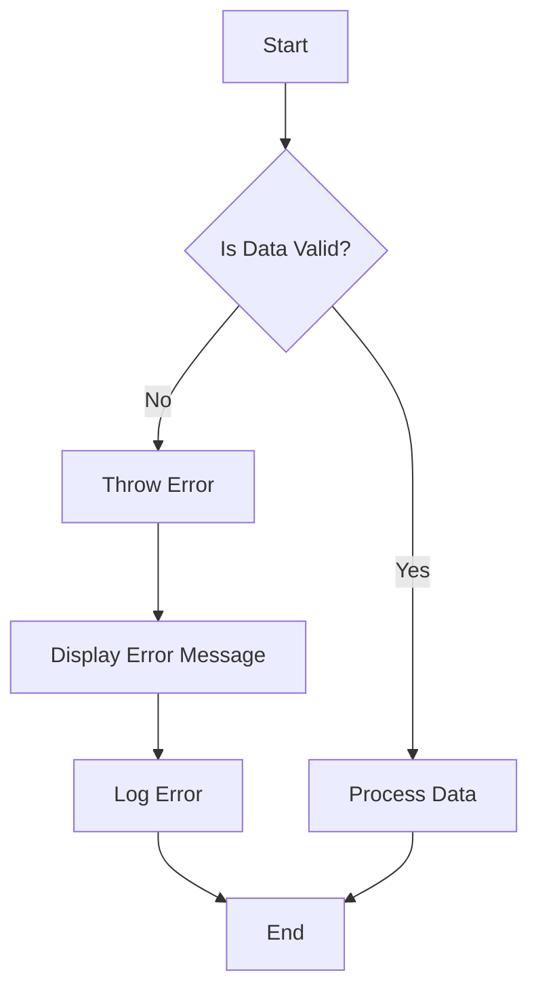

## 30.5 Best Practices in Error Design

In the world of software development, errors are inevitable. However, the way we design and handle these errors can significantly impact the user experience and the maintainability of our code. In this section, we will explore best practices in error design for JavaScript functions, focusing on creating informative and easy-to-handle errors. We'll cover principles for effective error design, user-friendly error messages for UI applications, guidelines for error codes and localization, and the importance of collaboration with teams for consistent error handling.

### Principles for Effective Error Design

Effective error design is about creating errors that are not only informative but also actionable. Here are some key principles to keep in mind:

1. **Clarity and Precision**: Ensure that error messages are clear and precise. Avoid technical jargon that may confuse users. Instead, use simple language that conveys the issue and suggests a possible solution.

2. **Actionable Information**: Provide users with actionable information. An error message should not only state what went wrong but also guide users on how to fix it.

3. **Consistency**: Maintain consistency in error messages across the application. This includes the format, tone, and structure of the messages. Consistency helps users understand and trust the application.

4. **Contextual Relevance**: Tailor error messages to the context in which they occur. This means considering the user's current action and the application's state when generating an error message.

5. **Avoid Blame**: Avoid language that blames the user for the error. Instead, focus on the issue and how it can be resolved.

6. **Log Errors for Developers**: While user-facing error messages should be simple, it's important to log detailed error information for developers. This can include stack traces, error codes, and any relevant data that can help diagnose the issue.

### User-Friendly Error Messages for UI Applications

User-friendly error messages are crucial for maintaining a positive user experience. Here are some guidelines for crafting such messages:

- **Use Plain Language**: Write error messages in plain language that is easy to understand. Avoid technical terms that may not be familiar to the average user.

- **Be Specific**: Specify what went wrong and where. For example, instead of saying "An error occurred," specify "Unable to save your changes due to a network issue."

- **Provide Solutions**: Whenever possible, offer solutions or next steps. For instance, "Please check your internet connection and try again."

- **Use a Friendly Tone**: Adopt a friendly and empathetic tone. This can help reduce user frustration and make the error feel less severe.

- **Visual Cues**: Use visual cues such as icons or colors to draw attention to the error message. This can help users quickly identify and address the issue.

### Guidelines for Error Codes and Localization

Error codes and localization play a significant role in error design, especially in applications that serve a global audience.

#### Error Codes

- **Unique Identifiers**: Assign unique identifiers to each error. This makes it easier to track and reference specific errors in logs and documentation.

- **Categorization**: Categorize errors based on their nature (e.g., network errors, validation errors, server errors). This helps in organizing and handling errors systematically.

- **Documentation**: Maintain comprehensive documentation for error codes. This should include the error code, description, possible causes, and suggested solutions.

#### Localization

- **Language Support**: Localize error messages to support multiple languages. This ensures that users can understand errors in their preferred language.

- **Cultural Sensitivity**: Be mindful of cultural differences when localizing error messages. Certain phrases or tones may not translate well across cultures.

- **Consistent Terminology**: Use consistent terminology across all localized versions of the application. This helps maintain clarity and coherence.

### Collaboration with Teams for Consistent Error Handling

Collaboration is key to achieving consistent error handling across an application. Here are some ways to foster collaboration:

- **Establish Guidelines**: Develop and document guidelines for error design and handling. This should cover everything from message format to logging practices.

- **Regular Reviews**: Conduct regular reviews of error messages and handling practices. This can help identify inconsistencies and areas for improvement.

- **Cross-Functional Teams**: Involve cross-functional teams, including developers, designers, and user experience experts, in the error design process. This ensures that all perspectives are considered.

- **Feedback Loops**: Establish feedback loops with users to gather insights on error messages and handling. This can help refine and improve the error design over time.

### Impact of Good Error Design on User Experience

Good error design can have a profound impact on the user experience. Here are some of the benefits:

- **Reduced Frustration**: Clear and actionable error messages can reduce user frustration and improve satisfaction.

- **Increased Trust**: Consistent and user-friendly error handling can increase user trust in the application.

- **Improved Retention**: Users are more likely to continue using an application that handles errors gracefully and provides helpful guidance.

- **Enhanced Debugging**: Well-designed errors with detailed logging can make it easier for developers to diagnose and fix issues, leading to faster resolution times.

### Code Examples

Let's take a look at some code examples to illustrate these concepts.

#### Example 1: Simple Error Handling

```javascript
function fetchData(url) {
    try {
        // Simulate fetching data from a URL
        if (!url) {
            throw new Error("URL is required to fetch data.");
        }
        // Simulate successful data fetch
        console.log("Data fetched successfully from " + url);
    } catch (error) {
        console.error("Error fetching data: " + error.message);
    }
}

fetchData(); // Error: URL is required to fetch data.
fetchData("https://example.com"); // Data fetched successfully from https://example.com
```

In this example, we handle a simple error by checking if a URL is provided. If not, we throw an error with a clear message.

#### Example 2: User-Friendly Error Message

```javascript
function saveUserData(userData) {
    try {
        if (!userData) {
            throw new Error("User data is missing.");
        }
        // Simulate saving user data
        console.log("User data saved successfully.");
    } catch (error) {
        alert("Oops! Something went wrong while saving your data. Please try again.");
        console.error("Error saving user data: " + error.message);
    }
}

saveUserData(); // Alert: Oops! Something went wrong while saving your data. Please try again.
```

Here, we provide a user-friendly error message using an alert, while logging the detailed error message for developers.

#### Example 3: Error Codes and Localization

```javascript
const ERROR_CODES = {
    MISSING_DATA: "E001",
    NETWORK_ERROR: "E002"
};

function handleError(code) {
    const messages = {
        E001: "Data is missing. Please provide the necessary information.",
        E002: "Network error. Please check your connection and try again."
    };

    alert(messages[code]);
}

handleError(ERROR_CODES.MISSING_DATA); // Alert: Data is missing. Please provide the necessary information.
```

In this example, we use error codes to manage error messages, making it easier to localize and maintain them.

### Visualizing Error Handling Flow

Below is a flowchart that visualizes the error handling process in a JavaScript function.



**Caption**: This flowchart illustrates the process of handling errors in a JavaScript function. If the data is valid, it is processed. If not, an error is thrown, an error message is displayed, and the error is logged.

### Knowledge Check

Before we wrap up, let's reinforce what we've learned with some questions and exercises.

1. **What are the key principles of effective error design?**
   - Clarity and precision
   - Actionable information
   - Consistency
   - Contextual relevance
   - Avoid blame
   - Log errors for developers

2. **How can user-friendly error messages improve user experience?**
   - Reduce frustration
   - Increase trust
   - Improve retention

3. **Why is collaboration important in error design?**
   - Ensures consistency
   - Incorporates diverse perspectives
   - Facilitates continuous improvement

### Exercises

1. **Exercise 1**: Modify the `fetchData` function to include an error code and a localized error message.

2. **Exercise 2**: Create a function that handles form validation errors and provides user-friendly messages.

3. **Exercise 3**: Collaborate with a peer to review and improve the error messages in a small project.

### Embrace the Journey

Remember, designing effective errors is an ongoing process. As you gain more experience, you'll develop a deeper understanding of what works best for your users and your application. Keep experimenting, stay curious, and enjoy the journey of mastering error design!

## Quiz Time!



### What is one of the key principles of effective error design?

- [x] Clarity and precision
- [ ] Use of technical jargon
- [ ] Blaming the user
- [ ] Ignoring context

> **Explanation:** Clarity and precision ensure that error messages are understandable and convey the issue effectively.

### Why is it important to provide actionable information in error messages?

- [x] To guide users on how to fix the issue
- [ ] To confuse users
- [ ] To make the application look complex
- [ ] To avoid responsibility

> **Explanation:** Actionable information helps users resolve the issue, enhancing their experience.

### How can consistency in error messages benefit users?

- [x] It helps users understand and trust the application
- [ ] It makes the application unpredictable
- [ ] It confuses users
- [ ] It increases frustration

> **Explanation:** Consistency in error messages builds user trust and understanding.

### What should be avoided in user-facing error messages?

- [x] Technical jargon
- [ ] Simple language
- [ ] Friendly tone
- [ ] Visual cues

> **Explanation:** Technical jargon can confuse users and should be avoided.

### What is the benefit of using error codes?

- [x] They make it easier to track and reference specific errors
- [ ] They complicate error handling
- [ ] They are unnecessary
- [ ] They confuse users

> **Explanation:** Error codes provide a systematic way to track and manage errors.

### Why is localization important in error messages?

- [x] To ensure users can understand errors in their preferred language
- [ ] To make errors more complex
- [ ] To ignore cultural differences
- [ ] To use inconsistent terminology

> **Explanation:** Localization ensures that users can comprehend errors in their language, enhancing usability.

### How can collaboration improve error design?

- [x] By ensuring consistency and incorporating diverse perspectives
- [ ] By creating confusion
- [ ] By ignoring feedback
- [ ] By isolating team members

> **Explanation:** Collaboration fosters consistency and incorporates valuable insights from different team members.

### What is a benefit of logging detailed error information for developers?

- [x] It aids in diagnosing and fixing issues
- [ ] It confuses developers
- [ ] It hides the problem
- [ ] It is unnecessary

> **Explanation:** Detailed logs help developers understand and resolve issues more efficiently.

### What impact does good error design have on user experience?

- [x] It reduces frustration and increases trust
- [ ] It increases frustration
- [ ] It decreases trust
- [ ] It makes the application less usable

> **Explanation:** Good error design enhances user satisfaction and trust in the application.

### True or False: Error messages should blame the user for the issue.

- [ ] True
- [x] False

> **Explanation:** Error messages should focus on the issue and resolution, not blame the user.


