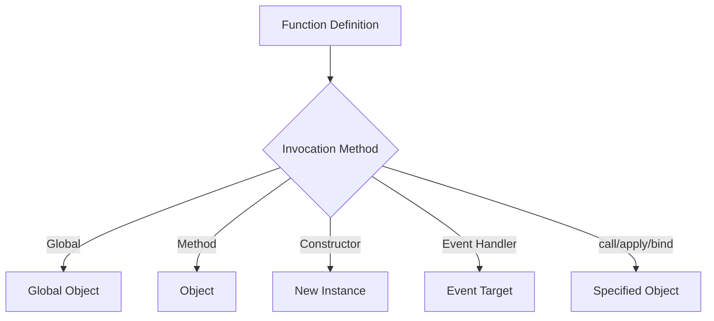

## 31.1 Context Binding

In JavaScript, understanding the `this` keyword and how to control its context is crucial for writing effective and bug-free code. The `this` keyword refers to the object it belongs to, but its value can change depending on how a function is called. This section will guide you through the concept of function context, the importance of context binding, and how to use methods like `call`, `apply`, and `bind` to explicitly set the context.

### Understanding the `this` Keyword

The `this` keyword in JavaScript is a reference to the object that is executing the current function. Its value is determined by the function's execution context, which can vary depending on how the function is invoked. Let's explore some common scenarios:

- **Global Context**: When a function is called in the global scope, `this` refers to the global object (window in browsers).
- **Object Method**: When a function is called as a method of an object, `this` refers to the object itself.
- **Constructor Function**: When a function is used as a constructor with the `new` keyword, `this` refers to the newly created instance.
- **Event Handler**: In event handlers, `this` refers to the element that received the event.

#### Example: `this` in Different Contexts

```javascript
// Global context
function showGlobalContext() {
  console.log(this); // Window object in browsers
}
showGlobalContext();

// Object method
const person = {
  name: 'Alice',
  greet: function() {
    console.log(this.name); // 'Alice'
  }
};
person.greet();

// Constructor function
function Car(model) {
  this.model = model;
}
const myCar = new Car('Toyota');
console.log(myCar.model); // 'Toyota'

// Event handler
document.getElementById('myButton').addEventListener('click', function() {
  console.log(this); // The button element
});
```

### Why Context Binding is Important

Context binding is essential because it ensures that the `this` keyword points to the correct object, especially when dealing with callbacks, event handlers, or when passing methods as arguments. Without proper context binding, functions may not behave as expected, leading to bugs and unexpected results.

### Methods to Explicitly Set the Context

JavaScript provides three methods to explicitly set the context of a function: `call`, `apply`, and `bind`. These methods allow you to control what `this` refers to when a function is executed.

#### The `call` Method

The `call` method invokes a function with a specified `this` value and arguments provided individually. It is useful when you want to borrow methods from other objects or when you need to set the context explicitly.

##### Example: Using `call`

```javascript
function introduce(greeting) {
  console.log(`${greeting}, my name is ${this.name}`);
}

const person1 = { name: 'Bob' };
const person2 = { name: 'Carol' };

// Using call to set the context
introduce.call(person1, 'Hello'); // 'Hello, my name is Bob'
introduce.call(person2, 'Hi');    // 'Hi, my name is Carol'
```

#### The `apply` Method

The `apply` method is similar to `call`, but it takes arguments as an array. This is particularly useful when you need to pass a list of arguments programmatically.

##### Example: Using `apply`

```javascript
function calculateSum(a, b, c) {
  return a + b + c;
}

const numbers = [1, 2, 3];

// Using apply to pass an array of arguments
const sum = calculateSum.apply(null, numbers);
console.log(sum); // 6
```

#### The `bind` Method

The `bind` method creates a new function with a specified `this` value and optional initial arguments. Unlike `call` and `apply`, `bind` does not immediately invoke the function. Instead, it returns a new function that can be called later.

##### Example: Using `bind`

```javascript
const module = {
  x: 42,
  getX: function() {
    return this.x;
  }
};

const unboundGetX = module.getX;
console.log(unboundGetX()); // undefined, because `this` is not bound

const boundGetX = unboundGetX.bind(module);
console.log(boundGetX()); // 42, because `this` is bound to `module`
```

### Comparing `call`, `apply`, and `bind`

While `call`, `apply`, and `bind` all serve the purpose of setting the `this` context, they have distinct use cases:

- **`call`**: Use when you want to invoke a function immediately with a specific `this` value and individual arguments.
- **`apply`**: Use when you want to invoke a function immediately with a specific `this` value and arguments as an array.
- **`bind`**: Use when you want to create a new function with a specific `this` value, which can be called later.

### Practical Scenarios for Context Binding

Context binding is particularly useful in the following scenarios:

1. **Event Handlers**: When passing object methods as event handlers, you may need to bind the context to ensure `this` refers to the correct object.

2. **Callbacks**: When passing methods as callbacks, binding ensures that `this` refers to the intended object.

3. **Function Borrowing**: You can borrow methods from one object and use them on another by setting the appropriate context.

4. **Partial Application**: Using `bind`, you can create partially applied functions by pre-setting some arguments.

#### Example: Binding in Event Handlers

```javascript
function Counter() {
  this.count = 0;
  this.increment = function() {
    this.count++;
    console.log(this.count);
  };
}

const counter = new Counter();
document.getElementById('incrementButton').addEventListener('click', counter.increment.bind(counter));
```

In this example, `bind` is used to ensure that `this` inside the `increment` method refers to the `counter` object, not the button element.

### Visualizing Context Binding

To better understand how context binding works, let's visualize the process using a flowchart.



**Diagram Description**: This flowchart illustrates how the `this` keyword is determined based on the method of function invocation. The `call`, `apply`, and `bind` methods allow you to specify the object that `this` should refer to.

### Try It Yourself

Experiment with the following code examples to deepen your understanding of context binding. Try modifying the `this` value using `call`, `apply`, and `bind` in different scenarios.

```javascript
// Experiment with call
function showDetails(age, country) {
  console.log(`Name: ${this.name}, Age: ${age}, Country: ${country}`);
}

const user = { name: 'Dave' };
showDetails.call(user, 30, 'USA');

// Experiment with apply
const details = [25, 'Canada'];
showDetails.apply(user, details);

// Experiment with bind
const boundShowDetails = showDetails.bind(user, 28, 'UK');
boundShowDetails();
```

### References and Further Reading

- [MDN Web Docs: `this`](https://developer.mozilla.org/en-US/docs/Web/JavaScript/Reference/Operators/this)
- [MDN Web Docs: `call`](https://developer.mozilla.org/en-US/docs/Web/JavaScript/Reference/Global_Objects/Function/call)
- [MDN Web Docs: `apply`](https://developer.mozilla.org/en-US/docs/Web/JavaScript/Reference/Global_Objects/Function/apply)
- [MDN Web Docs: `bind`](https://developer.mozilla.org/en-US/docs/Web/JavaScript/Reference/Global_Objects/Function/bind)

### Knowledge Check

- What is the `this` keyword, and how does it change based on the function's execution context?
- How do `call`, `apply`, and `bind` differ in terms of setting the `this` context?
- In what scenarios is explicit context binding necessary?

### Embrace the Journey

Remember, mastering context binding in JavaScript is a step towards writing more robust and maintainable code. As you continue to explore JavaScript, keep experimenting with different ways to control the `this` keyword. Stay curious, and enjoy the journey of learning!

## Quiz Time!



### What does the `this` keyword refer to in a global function?

- [x] The global object
- [ ] The function itself
- [ ] The window object
- [ ] The document object

> **Explanation:** In a global function, `this` refers to the global object, which is `window` in browsers.

### Which method would you use to immediately invoke a function with a specified `this` value and arguments as an array?

- [ ] call
- [x] apply
- [ ] bind
- [ ] invoke

> **Explanation:** The `apply` method is used to immediately invoke a function with a specified `this` value and arguments as an array.

### What does the `bind` method return?

- [ ] A new object
- [ ] The original function
- [x] A new function
- [ ] An array of arguments

> **Explanation:** The `bind` method returns a new function with a specified `this` value and optional initial arguments.

### When using `call`, how are arguments passed to the function?

- [x] Individually
- [ ] As an array
- [ ] As an object
- [ ] As a string

> **Explanation:** When using `call`, arguments are passed individually to the function.

### Which method is best for creating a partially applied function?

- [ ] call
- [ ] apply
- [x] bind
- [ ] invoke

> **Explanation:** The `bind` method is best for creating a partially applied function by pre-setting some arguments.

### In an event handler, what does `this` refer to by default?

- [ ] The global object
- [x] The event target
- [ ] The window object
- [ ] The document object

> **Explanation:** In an event handler, `this` refers to the element that received the event, known as the event target.

### How can you ensure that a method retains its original context when passed as a callback?

- [x] Use bind to bind the method to its original object
- [ ] Use call to invoke the method
- [ ] Use apply to invoke the method
- [ ] Use an arrow function

> **Explanation:** Using `bind` ensures that a method retains its original context when passed as a callback.

### What is a common use case for the `apply` method?

- [ ] Borrowing methods
- [x] Passing a list of arguments programmatically
- [ ] Creating new functions
- [ ] Event handling

> **Explanation:** The `apply` method is commonly used to pass a list of arguments programmatically as an array.

### Which method allows you to borrow methods from one object and use them on another?

- [x] call
- [ ] apply
- [ ] bind
- [ ] invoke

> **Explanation:** The `call` method allows you to borrow methods from one object and use them on another by setting the appropriate context.

### True or False: The `bind` method immediately invokes the function.

- [ ] True
- [x] False

> **Explanation:** False. The `bind` method does not immediately invoke the function; it returns a new function that can be called later.


