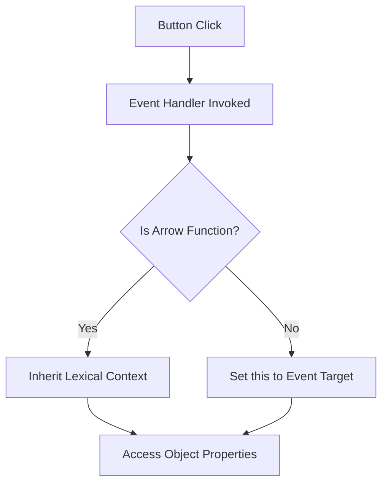

## 31.2 Event Handler Context

In this section, we will delve into the concept of event handler context in JavaScript, focusing on how the `this` keyword behaves within event handlers. Understanding this concept is crucial for writing effective and bug-free event-driven code. Let's explore how `this` is assigned in event handlers, the default behavior, and techniques to manage context effectively.

### Understanding `this` in JavaScript

Before we dive into event handlers, let's recap what `this` means in JavaScript. The `this` keyword refers to the object that is executing the current function. Its value is determined by how a function is called, not where it is defined. This can sometimes lead to confusion, especially in event-driven programming where functions are often passed around as callbacks.

### Default Behavior of `this` in Event Handlers

In the context of DOM event handlers, the `this` keyword behaves in a specific way. When an event handler is invoked, `this` is automatically set to the element that triggered the event. This default behavior allows you to easily access and manipulate the element that fired the event.

#### Example: Basic Event Handler

Let's look at a simple example to illustrate this behavior:

```html
<!DOCTYPE html>
<html lang="en">
<head>
    <meta charset="UTF-8">
    <meta name="viewport" content="width=device-width, initial-scale=1.0">
    <title>Event Handler Example</title>
</head>
<body>
    <button id="myButton">Click Me!</button>

    <script>
        const button = document.getElementById('myButton');

        button.addEventListener('click', function() {
            console.log(this); // Logs the button element
            this.style.backgroundColor = 'blue'; // Changes the button's background color
        });
    </script>
</body>
</html>
```

In this example, when the button is clicked, the event handler logs the button element itself to the console and changes its background color. The `this` keyword refers to the button element because it is the target of the event.

### `this` in Different Event Contexts

The value of `this` can vary depending on how the event handler is defined and invoked. Let's explore some scenarios:

#### Inline Event Handlers

When using inline event handlers in HTML, `this` refers to the DOM element on which the event is defined:

```html
<button onclick="alert(this.tagName)">Click Me!</button>
```

In this case, `this` will refer to the button element, and clicking the button will display an alert with the text "BUTTON".

#### Event Handlers in Object Methods

When event handlers are methods of an object, the context can become tricky:

```javascript
const myObject = {
    element: document.getElementById('myButton'),
    color: 'red',
    changeColor: function() {
        this.element.addEventListener('click', function() {
            this.style.backgroundColor = this.color; // Error: this.color is undefined
        });
    }
};

myObject.changeColor();
```

In this example, `this` inside the event handler refers to the button element, not `myObject`. As a result, `this.color` is undefined, leading to an error.

### Ensuring `this` Refers to the Desired Object

To ensure `this` refers to the desired object within an event handler, we can use several techniques:

#### Using `bind()`

The `bind()` method creates a new function that, when called, has its `this` keyword set to the provided value:

```javascript
const myObject = {
    element: document.getElementById('myButton'),
    color: 'red',
    changeColor: function() {
        this.element.addEventListener('click', function() {
            this.style.backgroundColor = this.color;
        }.bind(this)); // Bind the context to myObject
    }
};

myObject.changeColor();
```

By using `bind(this)`, we ensure that `this` inside the event handler refers to `myObject`.

#### Arrow Functions

Arrow functions do not have their own `this` context; they inherit `this` from the enclosing lexical context. This makes them particularly useful in event handlers:

```javascript
const myObject = {
    element: document.getElementById('myButton'),
    color: 'red',
    changeColor: function() {
        this.element.addEventListener('click', () => {
            this.style.backgroundColor = this.color; // Correctly refers to myObject
        });
    }
};

myObject.changeColor();
```

In this example, the arrow function ensures that `this` refers to `myObject`, allowing us to access `this.color` correctly.

### Best Practices for Managing Context in Event-Driven Code

Here are some best practices to manage context effectively in event-driven code:

- **Use Arrow Functions**: When possible, use arrow functions for event handlers to avoid issues with `this`.
- **Bind Context Explicitly**: Use `bind()` to explicitly set the context when using traditional functions.
- **Avoid Inline Event Handlers**: Inline event handlers can lead to maintenance issues and are less flexible.
- **Use Descriptive Function Names**: Name your event handler functions descriptively to make your code more readable and maintainable.
- **Keep Event Handlers Simple**: Aim to keep event handler functions focused on a single task to improve readability and maintainability.

### Visualizing Event Handler Context

To better understand how `this` works in event handlers, let's visualize the process using a diagram.



**Diagram Description**: This flowchart illustrates the process of determining the `this` context in an event handler. If the event handler is an arrow function, it inherits the lexical context. Otherwise, `this` is set to the event target.

### Try It Yourself

Experiment with the examples provided by modifying the code. Try changing the event handler to an arrow function or using `bind()` to see how it affects the `this` context. This hands-on practice will help reinforce your understanding of event handler context.

### Further Reading

For more information on event handlers and the `this` keyword, consider exploring the following resources:

- [MDN Web Docs: `this`](https://developer.mozilla.org/en-US/docs/Web/JavaScript/Reference/Operators/this)
- [W3Schools: JavaScript `this` Keyword](https://www.w3schools.com/js/js_this.asp)
- [JavaScript.info: Arrow Functions](https://javascript.info/arrow-functions)

### Knowledge Check

Let's summarize the key points we've covered:

- The `this` keyword in event handlers refers to the element that triggered the event.
- Inline event handlers and object methods can lead to unexpected `this` values.
- Techniques like `bind()` and arrow functions can help manage context effectively.
- Best practices include using arrow functions, binding context explicitly, and keeping event handlers simple.

### Embrace the Journey

Remember, mastering event handler context is just one step in your JavaScript journey. As you continue to learn and experiment, you'll gain confidence in writing more complex and interactive web applications. Keep exploring, stay curious, and enjoy the process!

## Quiz Time!



### What does `this` refer to in a DOM event handler by default?

- [x] The element that triggered the event
- [ ] The global window object
- [ ] The parent element of the event target
- [ ] The document object

> **Explanation:** In a DOM event handler, `this` refers to the element that triggered the event by default.

### How can you ensure `this` refers to the desired object in a traditional function event handler?

- [x] Use the `bind()` method
- [ ] Use the `call()` method
- [ ] Use the `apply()` method
- [ ] Use a global variable

> **Explanation:** The `bind()` method creates a new function with `this` set to the desired object, ensuring the correct context.

### What is a key advantage of using arrow functions in event handlers?

- [x] They inherit `this` from the enclosing lexical context
- [ ] They have their own `this` context
- [ ] They automatically bind `this` to the global object
- [ ] They execute faster than traditional functions

> **Explanation:** Arrow functions inherit `this` from the surrounding lexical context, making them useful for event handlers.

### What happens if you use an inline event handler in HTML?

- [x] `this` refers to the element on which the event is defined
- [ ] `this` refers to the global window object
- [ ] `this` refers to the parent element
- [ ] `this` is undefined

> **Explanation:** In inline event handlers, `this` refers to the element on which the event is defined.

### Which method allows you to explicitly set the `this` value for a function?

- [x] `bind()`
- [ ] `call()`
- [ ] `apply()`
- [ ] `setThis()`

> **Explanation:** The `bind()` method allows you to explicitly set the `this` value for a function.

### What is a common issue with using object methods as event handlers?

- [x] `this` may not refer to the object
- [ ] The method cannot be called
- [ ] The method runs twice
- [ ] The method is undefined

> **Explanation:** When using object methods as event handlers, `this` may not refer to the object, leading to errors.

### How can you avoid context issues in event handlers?

- [x] Use arrow functions
- [x] Use `bind()`
- [ ] Use global variables
- [ ] Use inline event handlers

> **Explanation:** Using arrow functions and `bind()` helps avoid context issues in event handlers.

### What is the purpose of the `bind()` method?

- [x] To set the `this` value for a function
- [ ] To execute a function immediately
- [ ] To create a new function with default parameters
- [ ] To clone a function

> **Explanation:** The `bind()` method sets the `this` value for a function, ensuring the correct context.

### Which of the following is a best practice for event handlers?

- [x] Keep them simple and focused
- [ ] Use inline event handlers
- [ ] Avoid using `this`
- [ ] Use global variables for context

> **Explanation:** Keeping event handlers simple and focused improves readability and maintainability.

### Arrow functions have their own `this` context.

- [ ] True
- [x] False

> **Explanation:** Arrow functions do not have their own `this` context; they inherit it from the enclosing lexical context.




