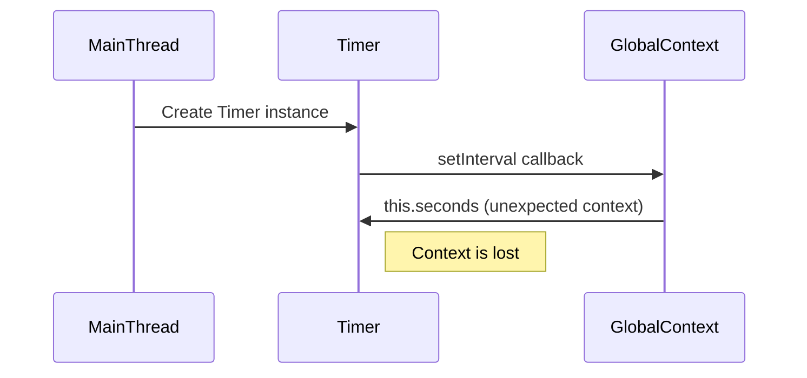

## 31.3 Context in Asynchronous Code

In JavaScript, understanding the `this` keyword and how it behaves in different contexts is crucial, especially when dealing with asynchronous code. Asynchronous programming is a powerful feature of JavaScript, allowing us to perform operations without blocking the main thread. However, it introduces complexities, particularly with the context (`this`) within asynchronous functions. In this section, we will explore how context can change in asynchronous callbacks, identify common pitfalls, and provide solutions to maintain context effectively.

### Understanding `this` in JavaScript

Before diving into asynchronous code, let's briefly recap how the `this` keyword works in JavaScript. The value of `this` is determined by how a function is called, not where it is defined. Here are some basic rules:

- **Global Context**: In the global execution context (outside any function), `this` refers to the global object (window in browsers).
- **Function Context**: In a regular function, `this` refers to the global object (in non-strict mode) or `undefined` (in strict mode).
- **Method Context**: When a function is called as a property of an object, `this` refers to the object.
- **Constructor Context**: In a constructor function, `this` refers to the newly created object.

### The Challenge with Asynchronous Code

In asynchronous programming, functions are often executed at a later time, which can lead to unexpected behavior of `this`. Let's explore some scenarios where context can change unexpectedly.

#### 1. `setTimeout` and `setInterval`

When using `setTimeout` or `setInterval`, the function is executed after a specified delay. However, the context (`this`) inside these functions is not preserved.

```javascript
function Timer() {
  this.seconds = 0;
  setInterval(function() {
    this.seconds++;
    console.log(this.seconds);
  }, 1000);
}

const myTimer = new Timer();
```

In the example above, you might expect `this.seconds` to increment every second. However, `this` inside the `setInterval` callback does not refer to the `Timer` instance. Instead, it refers to the global object, resulting in `NaN` being logged.

#### 2. Promises

Promises are a modern way to handle asynchronous operations. However, they can also lead to context issues.

```javascript
class User {
  constructor(name) {
    this.name = name;
  }

  greet() {
    Promise.resolve().then(function() {
      console.log(`Hello, ${this.name}`);
    });
  }
}

const user = new User('Alice');
user.greet();
```

In this example, `this.name` is `undefined` inside the `then` callback because `this` does not refer to the `User` instance.

#### 3. Async/Await

Async/await is syntactic sugar over promises, making asynchronous code look synchronous. However, context issues can still arise.

```javascript
class Fetcher {
  constructor(url) {
    this.url = url;
  }

  async fetchData() {
    const response = await fetch(this.url);
    console.log(`Fetched data from ${this.url}`);
  }
}

const fetcher = new Fetcher('https://api.example.com/data');
fetcher.fetchData();
```

In this example, `this.url` works as expected because async functions preserve the context. However, if you use regular functions inside async functions, you might face context issues.

### Common Pitfalls and Solutions

Now that we've seen some examples of context issues in asynchronous code, let's explore solutions to maintain context.

#### 1. Arrow Functions

Arrow functions do not have their own `this` context. Instead, they inherit `this` from the surrounding lexical context. This makes them a great tool for preserving context in asynchronous code.

```javascript
function Timer() {
  this.seconds = 0;
  setInterval(() => {
    this.seconds++;
    console.log(this.seconds);
  }, 1000);
}

const myTimer = new Timer();
```

In this example, using an arrow function inside `setInterval` preserves the context of `this`, allowing `this.seconds` to increment correctly.

#### 2. `bind` Method

The `bind` method creates a new function with a specified `this` value. This is useful when you need to pass a function as a callback but want to maintain its context.

```javascript
class User {
  constructor(name) {
    this.name = name;
  }

  greet() {
    Promise.resolve().then(function() {
      console.log(`Hello, ${this.name}`);
    }.bind(this));
  }
}

const user = new User('Alice');
user.greet();
```

By using `bind(this)`, we ensure that the `this` inside the `then` callback refers to the `User` instance.

#### 3. Storing Context in a Variable

Another approach is to store the context in a variable and use it inside the callback.

```javascript
function Timer() {
  this.seconds = 0;
  const self = this;
  setInterval(function() {
    self.seconds++;
    console.log(self.seconds);
  }, 1000);
}

const myTimer = new Timer();
```

In this example, we store `this` in a variable `self` and use it inside the `setInterval` callback to maintain context.

### Impact of Context Loss in Larger Applications

In larger applications, losing context can lead to bugs that are difficult to trace. For example, if a method relies on `this` to access instance properties or methods, losing context can result in unexpected behavior or errors. This can be particularly problematic in event-driven architectures or when using libraries that involve callbacks.

### Tips for Writing Context-Aware Asynchronous Code

1. **Use Arrow Functions**: Prefer arrow functions for callbacks to automatically bind the context.
2. **Leverage `bind`**: Use the `bind` method when passing functions as arguments to ensure they have the correct context.
3. **Store Context**: Store the context in a variable if you cannot use arrow functions or `bind`.
4. **Be Consistent**: Choose a strategy for managing context and apply it consistently across your codebase.
5. **Test Thoroughly**: Test asynchronous code thoroughly to catch context-related bugs early.

### Visualizing Context in Asynchronous Code

To better understand how context changes in asynchronous code, let's visualize the flow using a diagram.



In this diagram, we see how the `setInterval` callback is executed in the global context, leading to unexpected behavior.

### Try It Yourself

Experiment with the code examples provided. Try modifying them to use different methods for preserving context. For example, replace arrow functions with `bind` or vice versa, and observe the changes in behavior.

### References and Links

- [MDN Web Docs: `this`](https://developer.mozilla.org/en-US/docs/Web/JavaScript/Reference/Operators/this)
- [MDN Web Docs: Arrow Functions](https://developer.mozilla.org/en-US/docs/Web/JavaScript/Reference/Functions/Arrow_functions)
- [MDN Web Docs: `bind`](https://developer.mozilla.org/en-US/docs/Web/JavaScript/Reference/Global_objects/Function/bind)

### Knowledge Check

- What is the default value of `this` inside a regular function in non-strict mode?
- How can arrow functions help in preserving context?
- What is the purpose of the `bind` method?

### Embrace the Journey

Remember, mastering context in asynchronous code is a journey. As you progress, you'll become more adept at writing context-aware code, leading to more robust and maintainable applications. Keep experimenting, stay curious, and enjoy the journey!

## Quiz Time!



### What is the default value of `this` inside a regular function in non-strict mode?

- [x] The global object
- [ ] `undefined`
- [ ] The function itself
- [ ] The window object

> **Explanation:** In non-strict mode, `this` inside a regular function refers to the global object.

### How can arrow functions help in preserving context?

- [x] They inherit `this` from the surrounding lexical context.
- [ ] They create a new `this` context.
- [ ] They bind `this` to the global object.
- [ ] They do not affect `this`.

> **Explanation:** Arrow functions do not have their own `this` context; they inherit it from the surrounding lexical context.

### What is the purpose of the `bind` method?

- [x] To create a new function with a specified `this` value.
- [ ] To execute a function immediately.
- [ ] To delay function execution.
- [ ] To create an anonymous function.

> **Explanation:** The `bind` method creates a new function with a specified `this` value, allowing you to control the context.

### Which method can be used to store the context of `this` in a variable?

- [x] Storing `this` in a variable like `self`.
- [ ] Using `apply`.
- [ ] Using `call`.
- [ ] Using `setTimeout`.

> **Explanation:** Storing `this` in a variable like `self` allows you to maintain context in callbacks.

### What happens to `this` inside a `setTimeout` callback?

- [x] It refers to the global object.
- [ ] It refers to the enclosing function.
- [ ] It refers to the `setTimeout` function.
- [ ] It remains unchanged.

> **Explanation:** Inside a `setTimeout` callback, `this` refers to the global object unless otherwise specified.

### How can you ensure `this` inside a promise's `then` callback refers to the correct object?

- [x] Use `bind(this)` on the callback function.
- [ ] Use `apply(this)` on the callback function.
- [ ] Use `call(this)` on the callback function.
- [ ] Use `setTimeout` to delay execution.

> **Explanation:** Using `bind(this)` on the callback function ensures `this` refers to the correct object.

### What is a common pitfall when using `this` in asynchronous code?

- [x] Losing context and referring to the global object.
- [ ] Creating memory leaks.
- [ ] Blocking the main thread.
- [ ] Causing syntax errors.

> **Explanation:** A common pitfall is losing context, causing `this` to refer to the global object instead of the intended object.

### Why is it important to maintain context in larger applications?

- [x] To prevent bugs and ensure correct behavior.
- [ ] To improve performance.
- [ ] To reduce code size.
- [ ] To increase execution speed.

> **Explanation:** Maintaining context is crucial to prevent bugs and ensure that methods behave as expected.

### What is one way to test asynchronous code for context-related bugs?

- [x] Use thorough testing and debugging.
- [ ] Use only synchronous code.
- [ ] Avoid using `this`.
- [ ] Use global variables.

> **Explanation:** Thorough testing and debugging help catch context-related bugs early in the development process.

### True or False: Async functions automatically preserve the context of `this`.

- [x] True
- [ ] False

> **Explanation:** Async functions preserve the context of `this`, making them easier to work with in terms of context.


