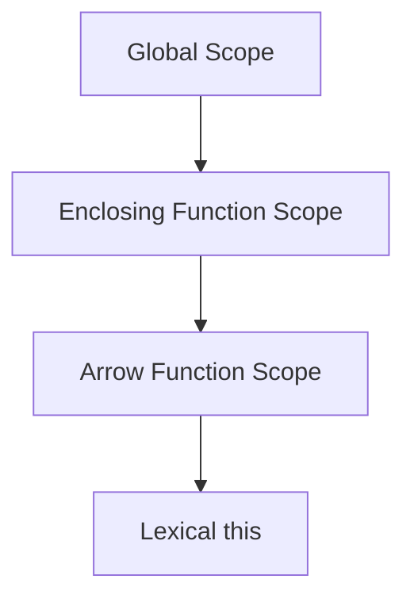

## 31.4 Arrow Functions and Context

In JavaScript, understanding the behavior of the `this` keyword is crucial for writing effective and bug-free code. Traditional functions and arrow functions handle `this` differently, and knowing when and how to use each can greatly enhance your coding skills. In this section, we will delve into how arrow functions lexically bind the `this` value from the enclosing scope, preserving context, and explore scenarios where arrow functions are appropriate or not. Let's embark on this journey to master the art of context management with arrow functions.

### Understanding Lexical Binding

Arrow functions, introduced in ECMAScript 6 (ES6), provide a more concise syntax for writing functions. One of their key features is lexical binding of the `this` value. Unlike traditional functions, which define their own `this` value, arrow functions inherit `this` from the surrounding lexical context.

#### Traditional Functions and `this`

Before diving into arrow functions, let's revisit how traditional functions handle `this`. In a traditional function, `this` is determined by how the function is called. For example:

```javascript
function traditionalFunction() {
    console.log(this);
}

const obj = {
    name: 'JavaScript',
    showThis: traditionalFunction
};

obj.showThis(); // Logs the obj object
```

In the example above, `this` refers to the `obj` object because the function is called as a method of `obj`.

#### Arrow Functions and Lexical `this`

Arrow functions, on the other hand, do not have their own `this`. Instead, they capture the `this` value from the surrounding context at the time they are defined. This is known as lexical scoping. Here's how it works:

```javascript
const arrowFunction = () => {
    console.log(this);
};

const obj = {
    name: 'JavaScript',
    showThis: arrowFunction
};

obj.showThis(); // Logs the global object (or undefined in strict mode)
```

In this case, `this` inside the arrow function refers to the global object (or `undefined` in strict mode) because the arrow function does not have its own `this` and instead uses the `this` from the lexical scope where it was defined.

### Using Arrow Functions to Preserve Context

One of the most common use cases for arrow functions is to preserve the `this` context in situations where traditional functions would lose it. This is particularly useful in scenarios involving callbacks, event handlers, and asynchronous code.

#### Example: Preserving `this` in Callbacks

Consider a scenario where you want to iterate over an array and perform an action using a method of an object. Using traditional functions, you might encounter issues with `this`:

```javascript
const obj = {
    name: 'JavaScript',
    languages: ['JavaScript', 'TypeScript', 'Python'],
    printLanguages: function() {
        this.languages.forEach(function(language) {
            console.log(`${this.name} loves ${language}`);
        });
    }
};

obj.printLanguages(); // Logs "undefined loves JavaScript", etc.
```

In the example above, `this` inside the `forEach` callback does not refer to `obj`, leading to unexpected results. By using an arrow function, we can preserve the `this` context:

```javascript
const obj = {
    name: 'JavaScript',
    languages: ['JavaScript', 'TypeScript', 'Python'],
    printLanguages: function() {
        this.languages.forEach((language) => {
            console.log(`${this.name} loves ${language}`);
        });
    }
};

obj.printLanguages(); // Logs "JavaScript loves JavaScript", etc.
```

The arrow function captures `this` from the `printLanguages` method, ensuring that `this.name` correctly refers to `obj.name`.

### When to Use Arrow Functions for Context Binding

Arrow functions are particularly useful in the following scenarios:

1. **Callbacks and Event Handlers**: When you need to pass a function as a callback or event handler and want to preserve the `this` context from the surrounding scope.

2. **Methods in Classes**: When defining methods in ES6 classes, arrow functions can be used to ensure `this` refers to the class instance.

3. **Asynchronous Code**: In asynchronous operations, arrow functions help maintain the correct `this` context without the need for additional binding.

#### Example: Arrow Functions in Event Handlers

Event handlers are a common place where arrow functions shine. Consider the following example:

```javascript
class Button {
    constructor(label) {
        this.label = label;
        this.handleClick = this.handleClick.bind(this);
    }

    handleClick() {
        console.log(`Button ${this.label} clicked`);
    }

    render() {
        const buttonElement = document.createElement('button');
        buttonElement.textContent = this.label;
        buttonElement.addEventListener('click', this.handleClick);
        document.body.appendChild(buttonElement);
    }
}

const myButton = new Button('Submit');
myButton.render();
```

In this example, `handleClick` is a method that needs to access the `this` context of the `Button` instance. By using `bind`, we ensure that `this` refers to the instance. However, with arrow functions, we can simplify this:

```javascript
class Button {
    constructor(label) {
        this.label = label;
    }

    handleClick = () => {
        console.log(`Button ${this.label} clicked`);
    }

    render() {
        const buttonElement = document.createElement('button');
        buttonElement.textContent = this.label;
        buttonElement.addEventListener('click', this.handleClick);
        document.body.appendChild(buttonElement);
    }
}

const myButton = new Button('Submit');
myButton.render();
```

The arrow function `handleClick` automatically captures `this` from the surrounding `Button` instance, eliminating the need for explicit binding.

### Scenarios Where Arrow Functions May Not Be Suitable

While arrow functions are powerful, there are situations where they may not be the best choice:

1. **Dynamic Context**: If you need to dynamically change the `this` context, traditional functions with `call`, `apply`, or `bind` are more appropriate.

2. **Methods in Object Literals**: When defining methods in object literals, arrow functions may not be suitable if you need to access the object itself via `this`.

3. **Prototype Methods**: Arrow functions are not ideal for prototype methods, as they do not have their own `this`.

#### Example: Dynamic Context with Traditional Functions

Consider a scenario where you need to dynamically change the `this` context:

```javascript
function greet() {
    console.log(`Hello, ${this.name}`);
}

const person1 = { name: 'Alice' };
const person2 = { name: 'Bob' };

greet.call(person1); // Logs "Hello, Alice"
greet.call(person2); // Logs "Hello, Bob"
```

In this case, using a traditional function allows us to dynamically set `this` using `call`.

### Comparing Arrow Functions with Traditional Functions

Let's summarize the key differences between arrow functions and traditional functions in terms of context behavior:

- **Arrow Functions**:
  - Lexically bind `this` from the surrounding scope.
  - Cannot be used as constructors (i.e., cannot use `new` with arrow functions).
  - Do not have their own `arguments` object.

- **Traditional Functions**:
  - Define their own `this` based on how they are called.
  - Can be used as constructors.
  - Have their own `arguments` object.

### Encouraging Mindful Use of Arrow Functions

Arrow functions are a powerful tool in JavaScript, but they should be used mindfully. Here are some tips for using arrow functions effectively:

- **Preserve Context**: Use arrow functions when you need to preserve the `this` context from the surrounding scope, especially in callbacks and asynchronous code.

- **Avoid Overuse**: Do not use arrow functions in situations where you need dynamic context or when defining prototype methods.

- **Understand Limitations**: Be aware of the limitations of arrow functions, such as the inability to use them as constructors or access the `arguments` object.

### Try It Yourself

To solidify your understanding of arrow functions and context, try modifying the code examples provided. Experiment with converting traditional functions to arrow functions and observe how the `this` context changes. Consider creating scenarios where arrow functions may not be suitable and explore alternative solutions.

### Visualizing Lexical Binding

To better understand how arrow functions capture `this`, let's visualize the concept using a scope chain diagram.



**Diagram Description**: This diagram illustrates how arrow functions capture `this` from the enclosing function scope, which in turn is determined by the global scope or the context in which the enclosing function is defined.

### Further Reading

For more information on arrow functions and context, consider exploring the following resources:

- [MDN Web Docs: Arrow Functions](https://developer.mozilla.org/en-US/docs/Web/JavaScript/Reference/Functions/Arrow_functions)
- [JavaScript.info: Arrow Functions](https://javascript.info/arrow-functions)
- [W3Schools: JavaScript Arrow Functions](https://www.w3schools.com/js/js_arrow_function.asp)

### Knowledge Check

Let's reinforce what we've learned with some questions and exercises.

1. What is lexical binding, and how do arrow functions use it to determine `this`?
2. Convert a traditional function to an arrow function and observe how the `this` context changes.
3. Identify a scenario where using an arrow function would not be appropriate and explain why.
4. Experiment with using `call` and `apply` on arrow functions. What do you observe?

### Embrace the Journey

Remember, mastering functions and context in JavaScript is a journey. As you continue to explore and experiment with arrow functions, you'll gain a deeper understanding of how to manage context effectively. Keep practicing, stay curious, and enjoy the process of becoming a JavaScript expert!

## Quiz Time!



### What is the primary feature of arrow functions regarding the `this` keyword?

- [x] Arrow functions lexically bind `this` from the enclosing scope.
- [ ] Arrow functions define their own `this` based on how they are called.
- [ ] Arrow functions do not have a `this` keyword.
- [ ] Arrow functions always bind `this` to the global object.

> **Explanation:** Arrow functions capture `this` from the surrounding lexical context, unlike traditional functions that define their own `this`.

### In which scenario is it most appropriate to use an arrow function?

- [x] When you need to preserve the `this` context in a callback function.
- [ ] When you need to dynamically change the `this` context.
- [ ] When defining prototype methods.
- [ ] When using `new` to create an instance.

> **Explanation:** Arrow functions are ideal for preserving `this` in callbacks, as they capture `this` from the surrounding scope.

### Can arrow functions be used as constructors?

- [ ] Yes, arrow functions can be used with `new`.
- [x] No, arrow functions cannot be used as constructors.
- [ ] Yes, but only in strict mode.
- [ ] No, unless they are defined inside a class.

> **Explanation:** Arrow functions cannot be used as constructors because they do not have their own `this`.

### What happens to the `this` value inside an arrow function when used as a method in an object?

- [ ] `this` refers to the object itself.
- [ ] `this` is undefined.
- [x] `this` is lexically bound from the surrounding scope.
- [ ] `this` refers to the global object.

> **Explanation:** In an arrow function, `this` is captured from the surrounding scope, not the object it is a method of.

### Which of the following is a limitation of arrow functions?

- [x] They do not have their own `arguments` object.
- [ ] They cannot be used in callbacks.
- [ ] They cannot be used in event handlers.
- [ ] They cannot access variables from the enclosing scope.

> **Explanation:** Arrow functions do not have their own `arguments` object, which is a limitation compared to traditional functions.

### When should you avoid using arrow functions?

- [ ] When preserving `this` context in callbacks.
- [x] When defining methods in object literals.
- [ ] When writing asynchronous code.
- [ ] When using them in event handlers.

> **Explanation:** Arrow functions should be avoided in object literals if you need to access the object itself via `this`.

### How do arrow functions handle the `this` keyword in ES6 classes?

- [x] They capture `this` from the class instance.
- [ ] They define their own `this` based on the method call.
- [ ] They bind `this` to the global object.
- [ ] They do not have access to `this`.

> **Explanation:** Arrow functions in ES6 classes capture `this` from the class instance, ensuring it refers to the instance.

### What is a common use case for arrow functions in asynchronous code?

- [x] Preserving `this` context without additional binding.
- [ ] Dynamically changing `this` context.
- [ ] Accessing the `arguments` object.
- [ ] Using them as constructors.

> **Explanation:** Arrow functions are commonly used in asynchronous code to preserve `this` context without needing to bind it.

### Why might you choose a traditional function over an arrow function?

- [x] When you need to dynamically change `this` using `call` or `apply`.
- [ ] When you want to preserve `this` context in a callback.
- [ ] When you want to write concise code.
- [ ] When you need to access variables from the enclosing scope.

> **Explanation:** Traditional functions allow dynamic changes to `this` using `call` or `apply`, which is not possible with arrow functions.

### True or False: Arrow functions always bind `this` to the global object.

- [ ] True
- [x] False

> **Explanation:** False. Arrow functions lexically bind `this` from the surrounding scope, not necessarily the global object.


