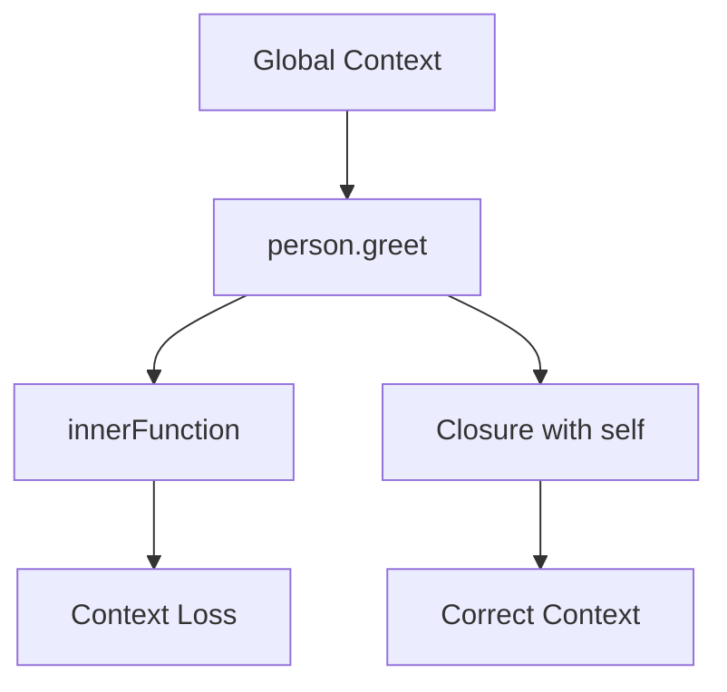

## 31.5 Advanced Context Manipulation

In JavaScript, the concept of context is crucial for understanding how functions behave, especially when dealing with complex applications. Context refers to the value of `this` within a function, which can change depending on how the function is called. In this section, we will explore advanced techniques for managing context, ensuring that your functions behave as expected in various scenarios.

### Understanding Context in JavaScript

Before diving into advanced manipulation, let's briefly revisit what context means in JavaScript. The value of `this` is determined by the function's calling pattern:

- **Global Context**: When not in any function, `this` refers to the global object (e.g., `window` in browsers).
- **Function Context**: Inside a regular function, `this` refers to the object that invoked the function.
- **Arrow Functions**: They do not have their own `this` and inherit it from the surrounding lexical context.
- **Method Context**: When a function is a method of an object, `this` refers to the object itself.

### Challenges with Context

Managing context becomes challenging in complex applications, particularly when dealing with nested functions, callbacks, or higher-order functions. Let's explore some common issues and how to address them.

#### Context Loss in Nested Functions

When a function is nested inside another, it may lose the intended context. Consider the following example:

```javascript
const person = {
  name: 'Alice',
  greet: function() {
    console.log(`Hello, my name is ${this.name}`);
    
    function innerFunction() {
      console.log(`Inner function: ${this.name}`);
    }
    
    innerFunction();
  }
};

person.greet();
```

In this example, `innerFunction` loses the context of `person`, and `this.name` becomes `undefined`. To solve this, we can use closures or bind the context explicitly.

### Using Closures to Retain Context

Closures allow functions to retain access to their lexical scope, making them a powerful tool for context management. By capturing `this` in a variable, we can preserve the desired context:

```javascript
const person = {
  name: 'Alice',
  greet: function() {
    const self = this; // Capture the context
    console.log(`Hello, my name is ${self.name}`);
    
    function innerFunction() {
      console.log(`Inner function: ${self.name}`);
    }
    
    innerFunction();
  }
};

person.greet();
```

Here, we store `this` in a variable `self`, which is then accessible within `innerFunction`, maintaining the correct context.

### Context Wrappers and Helper Functions

Another approach to managing context is using context wrappers or helper functions. These functions ensure that the desired context is preserved when calling other functions.

#### Using `bind` to Fix Context

The `bind` method creates a new function with a fixed `this` value. This is particularly useful for event handlers or callbacks:

```javascript
const person = {
  name: 'Alice',
  greet: function() {
    console.log(`Hello, my name is ${this.name}`);
  }
};

const greet = person.greet.bind(person);
setTimeout(greet, 1000); // Correctly logs "Hello, my name is Alice"
```

By binding `person` to `greet`, we ensure that `this` refers to `person` when the function is executed.

#### Creating Context Wrappers

We can create reusable context wrappers to simplify context management across multiple functions:

```javascript
function withContext(fn, context) {
  return function(...args) {
    return fn.apply(context, args);
  };
}

const person = {
  name: 'Alice',
  greet: function() {
    console.log(`Hello, my name is ${this.name}`);
  }
};

const greetWithContext = withContext(person.greet, person);
greetWithContext(); // Logs "Hello, my name is Alice"
```

The `withContext` function wraps another function, ensuring it is called with the specified context.

### Context Management in Class-Based vs. Function-Based Components

In modern JavaScript, especially with frameworks like React, we often deal with class-based and function-based components. Each has its own context management techniques.

#### Class-Based Components

In class-based components, context is typically managed using methods and the `bind` function:

```javascript
class Person {
  constructor(name) {
    this.name = name;
    this.greet = this.greet.bind(this);
  }

  greet() {
    console.log(`Hello, my name is ${this.name}`);
  }
}

const alice = new Person('Alice');
alice.greet(); // Logs "Hello, my name is Alice"
```

By binding `greet` in the constructor, we ensure it retains the correct context.

#### Function-Based Components

Function-based components, often using hooks, rely on closures and the lexical scope of arrow functions:

```javascript
function Person(name) {
  const greet = () => {
    console.log(`Hello, my name is ${name}`);
  };

  return { greet };
}

const alice = Person('Alice');
alice.greet(); // Logs "Hello, my name is Alice"
```

Here, `greet` is an arrow function, inheriting the lexical scope and maintaining the correct context.

### Consistency and Clarity in Context Handling

When managing context, consistency and clarity are paramount. Here are some best practices:

- **Use Arrow Functions**: When possible, use arrow functions to inherit context naturally.
- **Bind Methods in Constructors**: For class-based components, bind methods in the constructor to ensure consistent context.
- **Create Helper Functions**: Use helper functions like `withContext` to simplify context management.
- **Document Context Usage**: Clearly document how context is managed in your codebase to aid understanding and maintenance.

### Visualizing Context Management

To better understand context management, let's visualize the flow of context in a nested function scenario:



In this diagram, we see how context flows from the global context to `person.greet`, and how it can be lost in `innerFunction`. By using a closure, we retain the correct context.

### Try It Yourself

Experiment with the code examples provided. Try modifying the `person` object or adding additional nested functions to see how context is affected. Use `bind`, closures, or arrow functions to manage context effectively.

### Further Reading

For more information on JavaScript context and related topics, consider exploring the following resources:

- [MDN Web Docs: this](https://developer.mozilla.org/en-US/docs/Web/JavaScript/Reference/Operators/this)
- [JavaScript.info: Function Binding](https://javascript.info/bind)
- [W3Schools: JavaScript Function bind()](https://www.w3schools.com/js/js_function_bind.asp)

### Knowledge Check

To reinforce your understanding, let's summarize the key takeaways:

- Context refers to the value of `this` within a function.
- Context can be lost in nested functions or callbacks.
- Use closures, `bind`, or arrow functions to manage context.
- Consistency and clarity are crucial for effective context management.

Remember, mastering context manipulation is an ongoing journey. Keep experimenting, stay curious, and enjoy the process of learning JavaScript!

## Quiz Time!



### What is context in JavaScript?

- [x] The value of `this` within a function
- [ ] The global variables available in a script
- [ ] The parameters passed to a function
- [ ] The return value of a function

> **Explanation:** Context in JavaScript refers to the value of `this` within a function, which can change depending on how the function is called.

### How can you retain context in a nested function?

- [x] Use closures to capture `this` in a variable
- [ ] Use global variables to store context
- [ ] Use `setTimeout` to delay function execution
- [ ] Use `console.log` to print the context

> **Explanation:** Closures allow functions to retain access to their lexical scope, enabling them to capture and use the correct context.

### What does the `bind` method do?

- [x] Creates a new function with a fixed `this` value
- [ ] Executes a function immediately
- [ ] Delays function execution
- [ ] Changes the return value of a function

> **Explanation:** The `bind` method creates a new function with a fixed `this` value, ensuring the correct context is used when the function is called.

### How do arrow functions handle context?

- [x] They inherit context from the surrounding lexical scope
- [ ] They create a new context for each call
- [ ] They always use the global context
- [ ] They require manual context binding

> **Explanation:** Arrow functions do not have their own `this` and inherit context from the surrounding lexical scope, making them useful for retaining context.

### What is a context wrapper?

- [x] A function that ensures another function is called with a specific context
- [ ] A method for delaying function execution
- [ ] A way to store context in global variables
- [ ] A tool for debugging context issues

> **Explanation:** A context wrapper is a function that ensures another function is called with a specific context, often using `apply` or `bind`.

### In class-based components, how is context typically managed?

- [x] By binding methods in the constructor
- [ ] By using global variables
- [ ] By using `setTimeout` to delay execution
- [ ] By using arrow functions exclusively

> **Explanation:** In class-based components, context is typically managed by binding methods in the constructor to ensure they retain the correct context.

### What is the benefit of using arrow functions in function-based components?

- [x] They inherit context naturally from the lexical scope
- [ ] They create a new context for each call
- [ ] They always use the global context
- [ ] They require manual context binding

> **Explanation:** Arrow functions inherit context naturally from the lexical scope, making them useful for retaining context in function-based components.

### Why is consistency important in context management?

- [x] It ensures predictable behavior across the codebase
- [ ] It makes code execution faster
- [ ] It reduces the need for comments
- [ ] It eliminates the need for testing

> **Explanation:** Consistency in context management ensures predictable behavior across the codebase, making it easier to understand and maintain.

### What is a common issue with context in nested functions?

- [x] Context loss, leading to unexpected `this` values
- [ ] Increased execution time
- [ ] Reduced code readability
- [ ] Difficulty in debugging

> **Explanation:** A common issue with context in nested functions is context loss, where `this` may not refer to the expected object, leading to unexpected behavior.

### True or False: Closures can help retain the desired context in JavaScript functions.

- [x] True
- [ ] False

> **Explanation:** True. Closures allow functions to retain access to their lexical scope, helping to retain the desired context.




