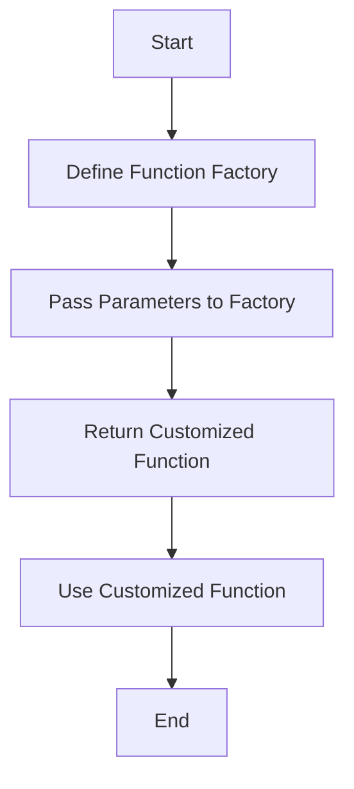

## 32.1 Creating Functions Dynamically

Welcome to the exciting world of dynamic function creation in JavaScript! In this section, we'll explore how to create functions on the fly, tailor them to specific needs, and leverage them for greater flexibility and reusability in your code. This concept is a cornerstone of JavaScript's functional programming capabilities and can significantly enhance the way you write and manage your code.

### What are Function Factories?

Function factories are a powerful programming pattern that allows you to create functions dynamically. Think of them as "factories" that produce customized functions based on the parameters you provide. This approach is particularly useful when you need to generate similar functions with slight variations, reducing redundancy and enhancing maintainability.

#### Purpose of Function Factories

- **Customization**: Create functions tailored to specific requirements without rewriting code.
- **Reusability**: Generate reusable code blocks that can be adapted to different contexts.
- **Configuration**: Easily configure functions based on input parameters, making your code more flexible.

### Functions Returning Other Functions

A key aspect of function factories is the ability to return functions from other functions. This concept is central to JavaScript's functional programming paradigm and allows you to build complex behaviors by composing simple functions.

#### Basic Example

Let's start with a simple example to illustrate how a function can return another function.

```javascript
function greetingFactory(greeting) {
    return function(name) {
        console.log(`${greeting}, ${name}!`);
    };
}

const sayHello = greetingFactory('Hello');
sayHello('Alice'); // Output: Hello, Alice!

const sayGoodbye = greetingFactory('Goodbye');
sayGoodbye('Bob'); // Output: Goodbye, Bob!
```

In this example, `greetingFactory` is a function that takes a `greeting` string as a parameter and returns a new function. The returned function takes a `name` parameter and logs a personalized greeting. By calling `greetingFactory` with different greetings, we can create customized greeting functions.

### Creating Customized Functions with Function Factories

Function factories shine when you need to create multiple functions that share a common structure but differ in specific details. Let's explore a more complex example involving mathematical operations.

#### Example: Math Operation Factory

Suppose we want to create functions that perform basic arithmetic operations. Instead of writing separate functions for addition, subtraction, multiplication, and division, we can use a function factory to generate them dynamically.

```javascript
function mathOperationFactory(operation) {
    return function(a, b) {
        switch (operation) {
            case 'add':
                return a + b;
            case 'subtract':
                return a - b;
            case 'multiply':
                return a * b;
            case 'divide':
                return a / b;
            default:
                throw new Error('Invalid operation');
        }
    };
}

const add = mathOperationFactory('add');
console.log(add(5, 3)); // Output: 8

const multiply = mathOperationFactory('multiply');
console.log(multiply(4, 7)); // Output: 28
```

In this example, `mathOperationFactory` takes an `operation` string and returns a function that performs the specified operation on two numbers. This approach reduces code duplication and makes it easy to add new operations.

### Scenarios Benefiting from Dynamic Function Creation

Dynamic function creation is beneficial in various scenarios, particularly when dealing with repetitive tasks or when flexibility is required. Here are some common use cases:

#### 1. Configuration-Based Functions

When building applications that require different configurations, function factories can generate functions tailored to specific settings. For example, you might create logging functions with different verbosity levels.

```javascript
function loggerFactory(level) {
    return function(message) {
        if (level === 'verbose') {
            console.log(`[VERBOSE] ${message}`);
        } else if (level === 'info') {
            console.log(`[INFO] ${message}`);
        } else if (level === 'error') {
            console.error(`[ERROR] ${message}`);
        }
    };
}

const verboseLogger = loggerFactory('verbose');
verboseLogger('This is a verbose message.');

const errorLogger = loggerFactory('error');
errorLogger('This is an error message.');
```

#### 2. Event Handlers

In web development, you often need to attach event handlers to elements. Function factories can generate handlers with specific behaviors based on the context.

```javascript
function eventHandlerFactory(eventType) {
    return function(event) {
        console.log(`Handling ${eventType} event for ${event.target.tagName}`);
    };
}

const clickHandler = eventHandlerFactory('click');
document.querySelector('button').addEventListener('click', clickHandler);
```

#### 3. API Client Functions

When interacting with APIs, you might need to create functions for different endpoints. Function factories can simplify this process by generating client functions based on endpoint configurations.

```javascript
function apiClientFactory(baseURL) {
    return function(endpoint) {
        return fetch(`${baseURL}/${endpoint}`)
            .then(response => response.json());
    };
}

const githubClient = apiClientFactory('https://api.github.com');
githubClient('users/octocat')
    .then(data => console.log(data));
```

### Higher-Order Functions in Dynamic Function Creation

Higher-order functions are functions that take other functions as arguments or return them as results. In the context of dynamic function creation, higher-order functions play a crucial role in building flexible and reusable code.

#### Example: Enhancing Functions with Higher-Order Functions

Let's enhance our previous math operation factory with logging capabilities using a higher-order function.

```javascript
function withLogging(fn) {
    return function(...args) {
        console.log(`Calling function with arguments: ${args}`);
        const result = fn(...args);
        console.log(`Function returned: ${result}`);
        return result;
    };
}

const loggedAdd = withLogging(add);
loggedAdd(10, 5); // Output: Calling function with arguments: 10,5
                  //         Function returned: 15
```

In this example, `withLogging` is a higher-order function that takes a function `fn` and returns a new function that logs the arguments and result of `fn`. By wrapping our `add` function with `withLogging`, we gain additional logging functionality without modifying the original function.

### Potential Use Cases in Configuration and Code Reusability

Dynamic function creation is particularly useful in scenarios where configuration and code reusability are priorities. Here are some potential use cases:

#### 1. Theming and Styling

In web applications, you might need to apply different themes or styles based on user preferences. Function factories can generate style functions that apply specific themes dynamically.

```javascript
function themeFactory(theme) {
    return function(element) {
        if (theme === 'dark') {
            element.style.backgroundColor = '#333';
            element.style.color = '#fff';
        } else if (theme === 'light') {
            element.style.backgroundColor = '#fff';
            element.style.color = '#000';
        }
    };
}

const applyDarkTheme = themeFactory('dark');
applyDarkTheme(document.body);
```

#### 2. Data Transformation

When processing data, you might need to apply different transformations based on the data type. Function factories can generate transformation functions that adapt to specific data structures.

```javascript
function transformerFactory(type) {
    return function(data) {
        if (type === 'uppercase') {
            return data.toUpperCase();
        } else if (type === 'reverse') {
            return data.split('').reverse().join('');
        }
    };
}

const toUppercase = transformerFactory('uppercase');
console.log(toUppercase('hello')); // Output: HELLO

const reverseString = transformerFactory('reverse');
console.log(reverseString('world')); // Output: dlrow
```

### Visualizing Function Factories

To better understand how function factories work, let's visualize the process using a flowchart. This diagram illustrates the steps involved in creating and using a function factory.



**Diagram Description**: This flowchart represents the process of creating functions dynamically using a function factory. It starts with defining the factory, passing parameters, returning a customized function, and using it in your code.

### Try It Yourself

Now that we've covered the basics of creating functions dynamically, it's time to experiment! Try modifying the examples above to create your own function factories. Here are some ideas to get you started:

- Create a function factory that generates functions for different mathematical operations (e.g., modulus, exponentiation).
- Build a factory that creates functions for formatting dates in various styles.
- Develop a function factory that generates event handlers with custom logging messages.

### Knowledge Check

Before we wrap up, let's reinforce what we've learned with a few questions:

1. What is the primary purpose of a function factory?
2. How does a function factory enhance code reusability?
3. What role do higher-order functions play in dynamic function creation?
4. Can you think of a scenario where dynamic function creation would be beneficial?

### Summary

In this section, we've explored the concept of creating functions dynamically using function factories. We've learned how to generate customized functions based on parameters, enhancing code reusability and flexibility. By leveraging higher-order functions, we've seen how to build complex behaviors from simple components. Remember, this is just the beginning. As you continue your journey in JavaScript, keep experimenting with dynamic function creation and discover new ways to optimize your code.

## Quiz Time!



### What is a function factory in JavaScript?

- [x] A pattern that creates functions dynamically based on parameters.
- [ ] A tool for debugging JavaScript code.
- [ ] A method for optimizing performance.
- [ ] A library for handling asynchronous operations.

> **Explanation:** A function factory is a pattern used to create functions dynamically based on input parameters, allowing for customization and reusability.

### How do function factories enhance code reusability?

- [x] By generating similar functions with slight variations.
- [ ] By reducing the need for comments.
- [ ] By increasing the number of lines of code.
- [ ] By making code harder to read.

> **Explanation:** Function factories enhance code reusability by generating similar functions with slight variations, reducing redundancy and improving maintainability.

### What is a higher-order function?

- [x] A function that takes other functions as arguments or returns them as results.
- [ ] A function that only performs mathematical operations.
- [ ] A function that is always asynchronous.
- [ ] A function that cannot be nested.

> **Explanation:** A higher-order function is one that takes other functions as arguments or returns them as results, enabling more flexible and reusable code.

### Which of the following is a use case for dynamic function creation?

- [x] Creating event handlers with specific behaviors.
- [ ] Writing HTML directly in JavaScript.
- [ ] Using CSS for styling.
- [ ] Storing data in local storage.

> **Explanation:** Dynamic function creation is useful for creating event handlers with specific behaviors, among other scenarios.

### What is an example of a configuration-based function?

- [x] A logging function with different verbosity levels.
- [ ] A function that always returns true.
- [ ] A function that prints "Hello, World!".
- [ ] A function that calculates the square root.

> **Explanation:** A configuration-based function, like a logging function with different verbosity levels, adapts its behavior based on input parameters.

### What does the `mathOperationFactory` function return?

- [x] A function that performs a specified mathematical operation.
- [ ] A number representing the result of an operation.
- [ ] A string describing the operation.
- [ ] An object with operation details.

> **Explanation:** The `mathOperationFactory` function returns a function that performs a specified mathematical operation on two numbers.

### How can higher-order functions enhance existing functions?

- [x] By adding additional functionality like logging.
- [ ] By removing parameters.
- [ ] By making them asynchronous.
- [ ] By converting them to strings.

> **Explanation:** Higher-order functions can enhance existing functions by adding additional functionality, such as logging, without modifying the original function.

### What is a potential use case for function factories in web development?

- [x] Generating API client functions for different endpoints.
- [ ] Writing inline CSS styles.
- [ ] Embedding videos directly in HTML.
- [ ] Using tables for layout.

> **Explanation:** Function factories can be used in web development to generate API client functions for different endpoints, streamlining the process of interacting with APIs.

### Which of the following is true about function factories?

- [x] They can create functions with specific configurations.
- [ ] They are only used for mathematical operations.
- [ ] They cannot return other functions.
- [ ] They are a built-in JavaScript feature.

> **Explanation:** Function factories can create functions with specific configurations, making them versatile tools for various programming tasks.

### True or False: Function factories can only be used for creating mathematical functions.

- [ ] True
- [x] False

> **Explanation:** False. Function factories can be used to create a wide range of functions, not just mathematical ones, including event handlers, API clients, and more.



Remember, this is just the beginning. As you progress, you'll build more complex and interactive web pages. Keep experimenting, stay curious, and enjoy the journey!
